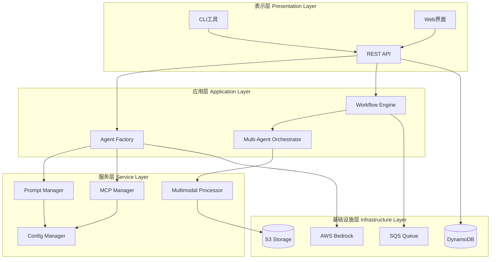
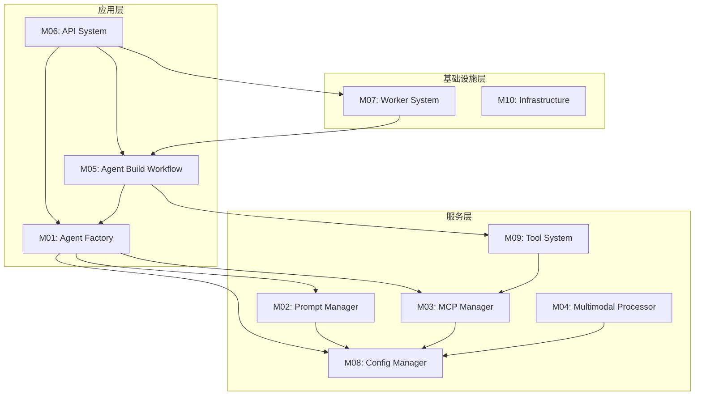
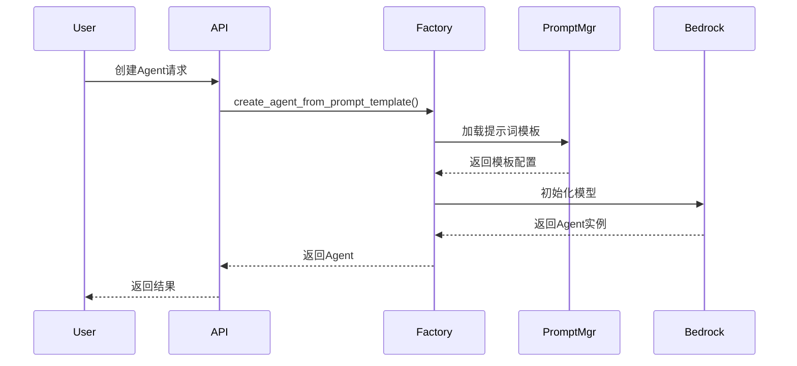
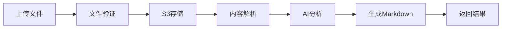
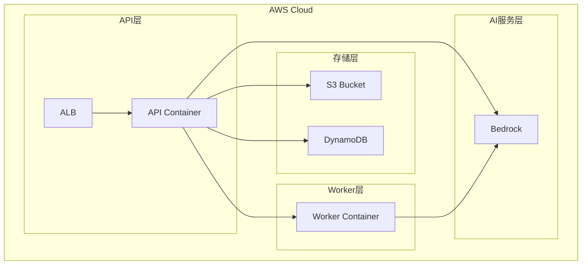
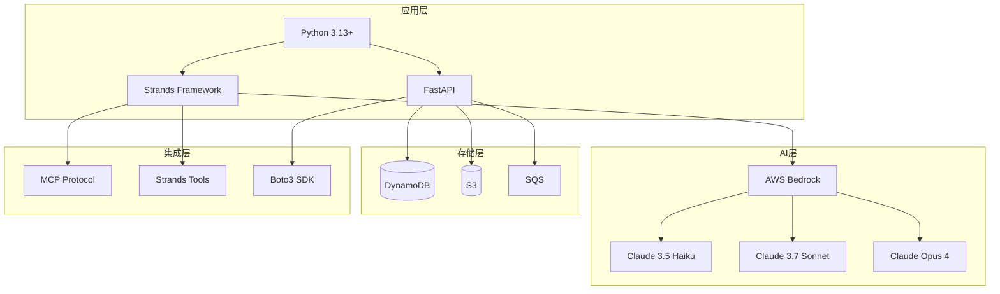
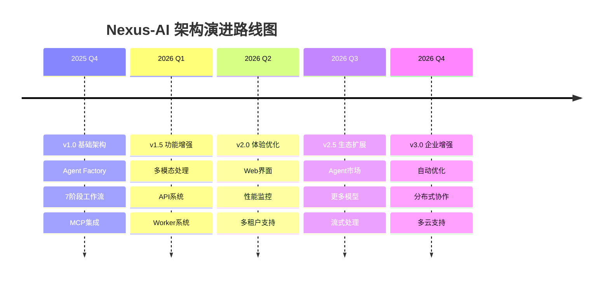

# Nexus-AI 系统架构总览

**创建日期**: 2026-02-05  
**最后更新**: 2026-02-06  
**文档版本**: 2.0  
**状态**: 已完成

## 目录

- [1. 系统概述](#1-系统概述)
- [2. 架构设计](#2-架构设计)
- [3. 核心模块](#3-核心模块)
- [4. 数据流](#4-数据流)
- [5. 部署架构](#5-部署架构)
- [6. 技术栈](#6-技术栈)
- [7. 架构决策](#7-架构决策)
- [8. 架构演进](#8-架构演进)
- [9. 文档导航](#9-文档导航)

## 1. 系统概述

Nexus-AI是一个基于AWS Bedrock的企业级AI Agent开发平台，采用"Agent Build Agent"的创新方法，让业务人员能够通过自然语言快速构建、部署和管理复杂的AI代理系统。

### 1.1 核心特性

- **Agent Factory System**: 从YAML模板动态创建Agent，支持版本管理
- **7-Stage Development Pipeline**: 完整的Agent开发流程自动化
- **Multi-Agent Orchestration**: 支持Graph和Swarm两种编排模式
- **Multimodal Processing**: 统一处理图像、文档、Excel等多种格式
- **MCP Integration**: 标准化的工具和服务集成协议
- **Self-bootstrapping Evolution**: Agent系统能够自我优化和迭代

### 1.2 技术栈

- **Python 3.13+**: 主要开发语言
- **AWS Bedrock**: AI模型托管和推理（Claude 3.5 Haiku、Claude 3.7 Sonnet、Claude Opus 4）
- **Strands Framework**: Agent编排框架
- **MCP Protocol**: 模型上下文协议
- **FastAPI**: REST API框架
- **DynamoDB + S3 + SQS**: AWS托管服务

### 1.3 设计原则

- **模块化设计**: 各模块职责清晰，低耦合高内聚
- **可扩展性**: 支持动态加载Agent、工具和提示词模板
- **配置驱动**: 通过YAML配置管理系统行为
- **异步处理**: 支持长时间运行的任务异步执行
- **多模型支持**: 自动选择合适的AI模型

## 2. 架构设计

### 2.1 整体架构

**详细文档**: [系统架构设计](architecture/system-architecture.md)

### 2.2 分层职责

#### 表示层 (Presentation Layer)
- **CLI工具**: 命令行界面，支持项目管理、构建、部署
- **Web界面**: 可视化管理界面（开发中）
- **REST API**: 标准化HTTP接口，支持Agent管理、会话管理、任务执行

#### 应用层 (Application Layer)
- **Agent Factory**: 从YAML模板动态创建和配置Agent
- **Workflow Engine**: 管理7阶段Agent构建工作流
- **Multi-Agent Orchestrator**: 协调多个Agent协作完成复杂任务

#### 服务层 (Service Layer)
- **Prompt Manager**: 管理YAML格式的提示词模板，支持版本控制
- **MCP Manager**: 管理MCP服务器连接和工具集成
- **Multimodal Processor**: 处理图像、文档、Excel等多模态内容
- **Config Manager**: 统一的配置加载和管理

#### 基础设施层 (Infrastructure Layer)
- **DynamoDB**: 存储项目、Agent、会话等元数据
- **SQS Queue**: 异步任务队列，支持长时间运行的任务
- **S3 Storage**: 存储多模态文件和项目制品
- **AWS Bedrock**: AI模型服务，支持Claude系列模型

## 3. 核心模块

### 3.1 模块清单

| 模块ID | 模块名称 | 主要功能 | 优先级 | 状态 |
|--------|---------|---------|--------|------|
| M01 | Agent Factory System | Agent动态创建和管理 | P0 | 活跃 |
| M02 | Prompt Management | YAML提示词模板管理 | P0 | 活跃 |
| M03 | MCP Integration | MCP服务器和工具集成 | P0 | 活跃 |
| M04 | Multimodal Processing | 多模态内容处理 | P0 | 活跃 |
| M05 | Agent Build Workflow | 7阶段Agent开发流程 | P0 | 活跃 |
| M06 | API System | RESTful API服务 | P0 | 活跃 |
| M07 | Worker System | 异步任务处理 | P1 | 稳定 |
| M08 | Configuration Management | 配置加载和管理 | P1 | 稳定 |
| M09 | Tool System | 工具注册和执行 | P1 | 活跃 |
| M10 | Infrastructure | 基础设施和部署 | P2 | 稳定 |

**详细文档**: [模块文档目录](modules/)

### 3.2 模块依赖关系

**详细文档**: [模块依赖关系](architecture/module-dependencies.md)

### 3.3 依赖层次

- **深度0** (无依赖): M08 Config Manager, M10 Infrastructure
- **深度1** (依赖深度0): M02 Prompt Manager, M03 MCP Manager, M04 Multimodal Processor
- **深度2** (依赖深度1): M01 Agent Factory, M09 Tool System
- **深度3** (依赖深度2): M05 Agent Build Workflow, M06 API System
- **深度4** (依赖深度3): M07 Worker System

## 4. 数据流

### 4.1 Agent创建流程

**详细文档**: [数据流设计](architecture/data-flow.md)

### 4.2 多模态内容处理流程

### 4.3 工作流执行流程

7阶段Agent开发流程：

1. **需求分析** - Requirements Analyzer Agent
2. **系统架构设计** - System Architect Agent
3. **Agent设计** - Agent Designer Agent
4. **提示词工程** - Prompt Engineer Agent
5. **工具开发** - Tool Developer Agent
6. **Agent代码开发** - Agent Code Developer Agent
7. **开发管理** - Agent Developer Manager Agent

## 5. 部署架构

### 5.1 AWS云部署拓扑

**详细文档**: [部署架构](architecture/deployment-architecture.md)

### 5.2 部署模式

- **AWS云部署**: 生产环境推荐，充分利用AWS托管服务
- **容器化部署**: 使用Docker容器，支持本地和云端部署
- **本地开发部署**: 开发和测试环境，快速迭代
- **混合部署**: 结合云端和本地资源的混合模式

### 5.3 高可用性设计

- 多可用区部署
- 自动扩展策略
- 健康检查和故障转移
- 负载均衡

## 6. 技术栈

### 6.1 技术栈总览

### 6.2 核心技术

#### 后端技术
- **Python 3.13+**: 主要开发语言
- **FastAPI**: REST API框架
- **Strands Framework**: Agent编排框架
- **AWS Bedrock**: AI模型服务
- **Boto3**: AWS SDK

#### 数据存储
- **DynamoDB**: NoSQL数据库，存储元数据
- **S3**: 对象存储，存储文件和制品
- **SQS**: 消息队列，异步任务处理

#### AI模型
- **Claude 3.5 Haiku**: 轻量级模型，快速响应
- **Claude 3.7 Sonnet**: 标准模型，平衡性能
- **Claude Opus 4**: 高级模型，复杂任务

#### 工具集成
- **MCP (Model Context Protocol)**: 标准化工具集成
- **Strands Tools**: 内置工具集（calculator, shell, file等）

#### 部署技术
- **Docker**: 容器化部署
- **Terraform**: 基础设施即代码
- **AWS AgentCore**: Agent托管平台（规划中）

## 7. 架构决策

### 7.1 关键决策记录 (ADR)

#### ADR-001: 采用YAML配置驱动的Agent创建
**决策**: 使用YAML文件定义Agent的提示词、工具依赖、模型配置等

**理由**:
- 配置与代码分离，易于维护
- 支持版本控制和多环境配置
- 降低Agent创建门槛，业务人员可参与

**影响**: 需要实现YAML解析和验证机制

#### ADR-002: 选择AWS Bedrock作为AI模型服务
**决策**: 使用AWS Bedrock托管Claude系列模型

**理由**:
- 企业级安全和合规性
- 多模型支持，自动选择最优模型
- 与AWS生态深度集成
- 按需付费，成本可控

**影响**: 依赖AWS服务，需要AWS账号和凭证

#### ADR-003: 采用MCP协议进行工具集成
**决策**: 使用Model Context Protocol标准化工具集成

**理由**:
- 标准化协议，易于扩展
- 支持多种传输方式（stdio, SSE）
- 工具自动发现和注册
- 社区生态丰富

**影响**: 需要实现MCP客户端和服务器管理

#### ADR-004: 实现7阶段Agent构建工作流
**决策**: 将Agent开发分为7个阶段，每个阶段由专门的Agent负责

**理由**:
- 标准化开发流程
- 每个阶段职责清晰
- 支持阶段间依赖和迭代
- 便于质量控制和追溯

**影响**: 需要实现工作流编排和状态管理

#### ADR-005: 采用异步任务处理架构
**决策**: 使用SQS队列和Worker系统处理长时间运行的任务

**理由**:
- 避免API超时
- 支持任务重试和失败恢复
- 提高系统吞吐量
- 便于水平扩展

**影响**: 需要实现任务队列和Worker服务

### 7.2 架构权衡

| 决策点 | 选项A | 选项B | 最终选择 | 理由 |
|--------|-------|-------|---------|------|
| Agent创建方式 | 代码定义 | YAML配置 | YAML配置 | 降低门槛，易于维护 |
| AI模型服务 | 自建模型 | AWS Bedrock | AWS Bedrock | 企业级服务，降低运维成本 |
| 工具集成协议 | 自定义协议 | MCP标准 | MCP标准 | 标准化，社区支持 |
| 数据库选择 | 关系型数据库 | NoSQL | NoSQL (DynamoDB) | 灵活schema，高可用 |
| 任务处理 | 同步处理 | 异步队列 | 异步队列 | 支持长任务，可扩展 |

## 8. 架构演进

### 8.1 当前架构 (v1.0 - 已完成)

✅ **已实现功能**:
- 基础Agent创建和管理
- 7阶段工作流实现
- 多模态内容处理
- MCP工具集成
- REST API服务
- 异步任务处理
- 配置管理系统

### 8.2 规划中的改进 (v2.0 - 进行中)

🔄 **开发中**:
- Web可视化界面
- Agent性能监控和追踪
- 更完善的错误处理
- 更多测试覆盖

📋 **计划中**:
- 多租户支持
- Agent市场和共享
- 更多AI模型支持
- 实时流式处理

### 8.3 长期规划 (v3.0+ - 未来)

📋 **未来愿景**:
- Agent自动优化和进化
- 分布式Agent协作
- 边缘计算支持
- 多云部署支持
- 企业级安全增强
- 高级分析和报告

### 8.4 演进路线图

## 9. 文档导航

### 9.1 架构文档

#### 核心架构文档
- **[系统架构设计](architecture/system-architecture.md)** - 系统整体架构、分层设计、技术选型
- **[模块依赖关系](architecture/module-dependencies.md)** - 模块间依赖、依赖层次、循环依赖检测
- **[数据流设计](architecture/data-flow.md)** - 数据流转、数据转换、数据存储
- **[部署架构](architecture/deployment-architecture.md)** - AWS部署、容器化、网络架构

#### 架构图集
- **[架构图集目录](architecture/diagrams/README.md)** - 所有架构图的索引和说明
- **[系统总览图](architecture/diagrams/01-system-overview.md)** - 系统整体架构
- **[模块依赖图](architecture/diagrams/02-module-dependencies.md)** - 模块依赖关系
- **[数据流图](architecture/diagrams/03-data-flow.md)** - 数据流转过程
- **[Agent创建流程图](architecture/diagrams/04-agent-creation-flow.md)** - Agent创建流程
- **[工作流编排图](architecture/diagrams/05-workflow-orchestration.md)** - 7阶段工作流
- **[API架构图](architecture/diagrams/06-api-architecture.md)** - REST API架构
- **[多模态处理图](architecture/diagrams/07-multimodal-processing.md)** - 多模态处理流程
- **[MCP集成图](architecture/diagrams/08-mcp-integration.md)** - MCP集成架构
- **[部署架构图](architecture/diagrams/09-deployment-architecture.md)** - 部署拓扑
- **[技术栈图](architecture/diagrams/10-technology-stack.md)** - 技术栈总览

### 9.2 模块文档

- **[M01: Agent Factory System](modules/01-agent-factory.md)** - Agent动态创建和管理
- **[M02: Prompt Management](modules/02-prompt-management.md)** - YAML提示词模板管理
- **[M03: MCP Integration](modules/03-mcp-integration.md)** - MCP服务器和工具集成
- **[M04: Multimodal Processing](modules/04-multimodal-processing.md)** - 多模态内容处理
- **[M05: Agent Build Workflow](modules/05-agent-build-workflow.md)** - 7阶段Agent开发流程
- **[M06: API System](modules/06-api-system.md)** - RESTful API服务
- **[M07: Worker System](modules/07-worker-system.md)** - 异步任务处理
- **[M08: Configuration Management](modules/08-configuration-management.md)** - 配置加载和管理
- **[M09: Tool System](modules/09-tool-system.md)** - 工具注册和执行
- **[M10: Infrastructure](modules/10-infrastructure.md)** - 基础设施和部署

### 9.3 业务流程文档

- **[Agent创建流程](business-flows/agent-creation-process.md)** - 完整的Agent创建流程
- **[工作流执行](business-flows/workflow-execution.md)** - 工作流编排和执行
- **[内容处理流程](business-flows/content-processing.md)** - 多模态内容处理
- **[部署流程](business-flows/deployment-process.md)** - 系统部署流程

### 9.4 API参考文档

- **[REST API v2](api-reference/rest-api-v2.md)** - REST API完整参考
- **[内部API](api-reference/internal-apis.md)** - 内部API接口规范
- **[MCP工具参考](api-reference/mcp-tools-reference.md)** - MCP工具列表和使用

### 9.5 代码分析文档

- **[冗余代码分析](code-analysis/redundancy-analysis.md)** - 冗余代码识别和重构建议
- **[接口冲突分析](code-analysis/interface-conflicts.md)** - 接口冲突和统一方案
- **[废弃代码清单](code-analysis/deprecated-code.md)** - 废弃代码和清理计划
- **[逻辑缺陷分析](code-analysis/logic-gaps.md)** - 逻辑缺陷和修复方案
- **[改进建议](code-analysis/improvement-suggestions.md)** - 系统改进建议

### 9.6 快速导航

#### 按角色导航

**架构师**:
1. [系统架构设计](architecture/system-architecture.md)
2. [模块依赖关系](architecture/module-dependencies.md)
3. [部署架构](architecture/deployment-architecture.md)
4. [架构图集](architecture/diagrams/README.md)

**开发者**:
1. [模块文档目录](modules/)
2. [API参考文档](api-reference/rest-api-v2.md)
3. [业务流程文档](business-flows/)
4. [代码分析文档](code-analysis/)

**运维人员**:
1. [部署架构](architecture/deployment-architecture.md)
2. [基础设施模块](modules/10-infrastructure.md)
3. [部署流程](business-flows/deployment-process.md)

**产品经理**:
1. [系统概述](#1-系统概述)
2. [核心模块](#3-核心模块)
3. [架构演进](#8-架构演进)

#### 按主题导航

**Agent开发**:
- [Agent Factory模块](modules/01-agent-factory.md)
- [Prompt Management模块](modules/02-prompt-management.md)
- [Agent创建流程](business-flows/agent-creation-process.md)
- [Agent创建流程图](architecture/diagrams/04-agent-creation-flow.md)

**工作流编排**:
- [Agent Build Workflow模块](modules/05-agent-build-workflow.md)
- [工作流执行](business-flows/workflow-execution.md)
- [工作流编排图](architecture/diagrams/05-workflow-orchestration.md)

**多模态处理**:
- [Multimodal Processing模块](modules/04-multimodal-processing.md)
- [内容处理流程](business-flows/content-processing.md)
- [多模态处理图](architecture/diagrams/07-multimodal-processing.md)

**工具集成**:
- [MCP Integration模块](modules/03-mcp-integration.md)
- [Tool System模块](modules/09-tool-system.md)
- [MCP集成图](architecture/diagrams/08-mcp-integration.md)

**API开发**:
- [API System模块](modules/06-api-system.md)
- [REST API参考](api-reference/rest-api-v2.md)
- [API架构图](architecture/diagrams/06-api-architecture.md)

**部署运维**:
- [部署架构](architecture/deployment-architecture.md)
- [Infrastructure模块](modules/10-infrastructure.md)
- [部署流程](business-flows/deployment-process.md)
- [部署架构图](architecture/diagrams/09-deployment-architecture.md)

## 10. 性能特征

### 10.1 性能指标

| 指标 | 目标值 | 当前值 | 说明 |
|------|--------|--------|------|
| Agent创建时间 | < 5s | ~3s | 从模板到可用Agent |
| API响应时间 | < 200ms | ~150ms | 简单查询操作 |
| 工作流执行时间 | < 30min | ~20min | 完整7阶段流程 |
| 并发Agent数 | > 100 | ~50 | 单实例支持 |
| 文件处理速度 | > 10MB/s | ~15MB/s | 多模态文件上传 |

### 10.2 可扩展性

- **水平扩展**: API和Worker服务支持多实例部署
- **垂直扩展**: 支持更大内存和CPU配置
- **存储扩展**: S3和DynamoDB自动扩展
- **模型扩展**: 支持添加新的AI模型

## 11. 安全架构

### 11.1 安全措施

- **身份认证**: API Key和JWT Token
- **权限控制**: 基于角色的访问控制（RBAC）
- **数据加密**: 传输加密（TLS）和存储加密（S3/DynamoDB）
- **审计日志**: 完整的操作日志记录
- **输入验证**: 严格的参数验证和清理

### 11.2 合规性

- 符合AWS安全最佳实践
- 数据隐私保护
- 审计日志记录
- 访问控制和权限管理

## 12. 监控和运维

### 12.1 监控指标

- **系统指标**: CPU、内存、磁盘、网络
- **应用指标**: API请求量、响应时间、错误率
- **业务指标**: Agent创建数、工作流执行数、任务成功率
- **AI指标**: 模型调用次数、Token消耗、成本

### 12.2 日志管理

- **应用日志**: 结构化日志，支持搜索和分析
- **访问日志**: API访问记录
- **错误日志**: 异常和错误追踪
- **审计日志**: 敏感操作记录

## 13. 总结

Nexus-AI采用分层架构设计，通过模块化、配置驱动、异步处理等设计原则，构建了一个可扩展、高可用的AI Agent开发平台。系统支持从YAML模板动态创建Agent，通过7阶段工作流实现Agent的自动化开发，并提供多模态内容处理、MCP工具集成等丰富功能。

### 13.1 核心优势

- **低门槛**: 通过自然语言和YAML配置创建Agent
- **标准化**: 7阶段开发流程，确保质量和一致性
- **可扩展**: 模块化设计，支持动态加载和插件机制
- **企业级**: 基于AWS托管服务，高可用、高安全
- **自举式**: Agent系统能够自我优化和迭代

### 13.2 适用场景

- 业务流程自动化
- 软件开发自动化
- 客户服务智能化
- 数据分析协作化
- 内容生成结构化
- 文档处理自动化

### 13.3 未来展望

Nexus-AI将持续演进，朝着更智能、更自动化、更易用的方向发展。我们计划引入更多AI模型、实现Agent自动优化、支持分布式协作，并构建完整的Agent生态系统。

---

**文档状态**: 已完成  
**维护者**: Nexus-AI团队  
**审核状态**: 待审核  
**最后更新**: 2026-02-06

## 附录

### A. 术语表

- **Agent**: 智能代理，能够自主执行任务的AI实体
- **Workflow**: 工作流，多个步骤的有序执行过程
- **MCP**: Model Context Protocol，模型上下文协议
- **Bedrock**: AWS的AI模型托管服务
- **Strands**: Agent编排框架
- **YAML**: 配置文件格式
- **Multimodal**: 多模态，支持多种数据类型

### B. 缩写对照

- **API**: Application Programming Interface（应用程序接口）
- **REST**: Representational State Transfer（表述性状态转移）
- **AWS**: Amazon Web Services（亚马逊云服务）
- **S3**: Simple Storage Service（简单存储服务）
- **SQS**: Simple Queue Service（简单队列服务）
- **ECS**: Elastic Container Service（弹性容器服务）
- **ALB**: Application Load Balancer（应用负载均衡器）
- **VPC**: Virtual Private Cloud（虚拟私有云）

### C. 参考资源

- [AWS Bedrock文档](https://docs.aws.amazon.com/bedrock/)
- [Strands Framework文档](https://github.com/awslabs/strands)
- [MCP协议规范](https://modelcontextprotocol.io/)
- [FastAPI文档](https://fastapi.tiangolo.com/)
- [Mermaid图表语法](https://mermaid.js.org/)
