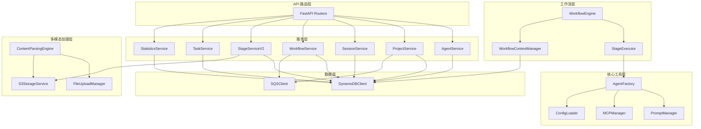

# Nexus-AI 内部 API 参考文档

**创建日期**: 2026-02-05  
**最后更新**: 2026-02-05  
**文档类型**: API 参考  
**文档说明**: 本文档记录 Nexus-AI 项目中各 Python 模块之间的内部 API 接口，包括函数签名、参数说明、返回值类型和使用示例。

---

## 目录

- [1. Agent Factory 模块](#1-agent-factory-模块)
- [2. Prompt Management 模块](#2-prompt-management-模块)
- [3. MCP Manager 模块](#3-mcp-manager-模块)
- [4. Configuration Loader 模块](#4-configuration-loader-模块)
- [5. Workflow Engine 模块](#5-workflow-engine-模块)
- [6. Workflow Executor 模块](#6-workflow-executor-模块)
- [7. Workflow Context 模块](#7-workflow-context-模块)
- [8. Multimodal Processing 模块](#8-multimodal-processing-模块)
- [9. Service Layer 服务层](#9-service-layer-服务层)
- [10. Database Layer 数据库层](#10-database-layer-数据库层)

---

## 1. Agent Factory 模块

**模块路径**: `nexus_utils/agent_factory.py`  
**模块说明**: Agent 工厂模块，提供从提示词模板动态创建 Agent、导入工具、管理模型等核心功能。是 Nexus-AI 系统中最重要的基础设施模块之一。

### 1.1 Agent 创建 API

#### `create_agent_from_prompt_template()`

从 YAML 提示词模板创建 Agent 实例，支持多级相对路径、自动工具依赖解析和 MCP 客户端加载。

```python
def create_agent_from_prompt_template(
    agent_name: str,
    env: str = "production",
    version: str = "latest",
    model_id: str = "default",
    enable_logging: bool = False,
    state: Optional[Dict] = None,
    session_manager: Optional[Any] = None,
    nocallback: bool = False,
    **agent_params
) -> Optional[Agent]
```

**参数说明**:

| 参数 | 类型 | 默认值 | 说明 |
|------|------|--------|------|
| `agent_name` | `str` | 必填 | Agent 名称或相对路径，支持多种格式（见下方示例） |
| `env` | `str` | `"production"` | 环境配置：`development` / `production` / `testing` |
| `version` | `str` | `"latest"` | 提示词模板版本号 |
| `model_id` | `str` | `"default"` | 模型 ID，`"default"` 时自动从模板的 `supported_models` 中选择第一个 |
| `enable_logging` | `bool` | `False` | 是否启用日志跟踪（OpenTelemetry） |
| `state` | `Optional[Dict]` | `None` | 传递给 Agent 的状态数据（JSON 格式） |
| `session_manager` | `Optional[Any]` | `None` | 会话管理器实例 |
| `nocallback` | `bool` | `False` | 是否禁用回调处理器 |
| `**agent_params` | `Any` | - | 额外的 Agent 构造参数，直接传递给 `Agent()` |

**返回值**: `Optional[Agent]` — 成功返回 `strands.Agent` 实例，失败返回 `None`

**`agent_name` 支持的路径格式**:
- `"requirements_analyzer"` — Agent 名称（直接匹配）
- `"system_agents_prompts/requirements_analyzer"` — 系统 Agent 相对路径
- `"system_agents_prompts/agent_build_workflow/requirements_analyzer"` — 多级路径
- `"template_prompts/template"` — 模板路径
- `"generated_agents_prompts/price_agent/price_matcher"` — 生成的 Agent 路径
- `"generated_agents_prompts/price_agent/price_matcher.yaml"` — 带 `.yaml` 后缀（自动移除）

**使用示例**:

```python
from nexus_utils.agent_factory import create_agent_from_prompt_template

# 基本用法：通过名称创建 Agent
agent = create_agent_from_prompt_template("requirements_analyzer")

# 通过相对路径创建系统 Agent
agent = create_agent_from_prompt_template(
    "system_agents_prompts/agent_build_workflow/orchestrator"
)

# 指定环境和版本
agent = create_agent_from_prompt_template(
    "template_prompts/template",
    env="development",
    version="v1.0"
)

# 传递状态数据和额外参数
agent = create_agent_from_prompt_template(
    "requirements_analyzer",
    state={"project_id": "proj-123", "context": "..."},
    enable_logging=True
)

# 调用 Agent
if agent:
    result = agent("请分析以下需求...")
```

**内部流程**:
1. 通过 `PromptManager` 获取 Agent 模板（支持缓存和动态加载）
2. 解析模板中的 `tools_dependencies`，调用 `import_tools_by_strings()` 导入工具
3. 解析模板中的 `mcp_dependencies`，通过 `MCPManager` 创建 MCP 客户端
4. 根据模板的 `supported_models` 或 `model_id` 参数创建 `BedrockModel`
5. 合并所有工具（MCP 客户端 + 普通工具），构造并返回 `Agent` 实例

---

#### `get_bedrock_model()`

获取配置好的 Bedrock 模型实例。

```python
def get_bedrock_model(
    model_id: str = "model_id",
    agent_name: str = "template",
    env: str = "production"
) -> BedrockModel
```

**参数说明**:

| 参数 | 类型 | 默认值 | 说明 |
|------|------|--------|------|
| `model_id` | `str` | `"model_id"` | 配置文件中的模型 ID 键名（如 `"model_id"`, `"lite_model_id"`, `"pro_model_id"`） |
| `agent_name` | `str` | `"template"` | Agent 名称，用于获取环境配置（max_tokens, temperature 等） |
| `env` | `str` | `"production"` | 环境名称 |

**返回值**: `BedrockModel` — 配置好的 Bedrock 模型实例

**使用示例**:

```python
from nexus_utils.agent_factory import get_bedrock_model

# 获取默认模型
model = get_bedrock_model()

# 获取轻量级模型
model = get_bedrock_model(model_id="lite_model_id")

# 获取专业模型，指定 Agent 配置
model = get_bedrock_model(
    model_id="pro_model_id",
    agent_name="orchestrator",
    env="production"
)
```

---

### 1.2 工具导入 API

#### `get_tool_by_path()`

通过路径字符串导入工具函数，支持多种工具类型路径格式。

```python
def get_tool_by_path(tool_path: str) -> Optional[Any]
```

**参数说明**:

| 参数 | 类型 | 说明 |
|------|------|------|
| `tool_path` | `str` | 工具路径字符串 |

**返回值**: `Optional[Any]` — 工具函数/模块对象，失败返回 `None`

**支持的路径格式**:
- `"strands_tools/calculator"` — Strands 内置工具
- `"system_tools/agent_build_workflow/project_manager/project_init"` — 系统工具
- `"template_tools/common/demo/weather_forecast"` — 模板工具
- `"generated_tools/aws/security/aws_compliance_checker/check_aws_compliance"` — 生成的工具

**使用示例**:

```python
from nexus_utils.agent_factory import get_tool_by_path

# 导入 Strands 内置工具
calculator = get_tool_by_path("strands_tools/calculator")

# 导入系统工具
project_init = get_tool_by_path(
    "system_tools/agent_build_workflow/project_manager/project_init"
)

# 导入模板工具
weather = get_tool_by_path("template_tools/common/demo/weather_forecast")
```

---

#### `get_tool_by_name()`

通过工具名称动态查找并导入工具，依次搜索内置工具、系统工具和工具模板提供器。

```python
def get_tool_by_name(tool_name: str) -> Optional[Any]
```

**参数说明**:

| 参数 | 类型 | 说明 |
|------|------|------|
| `tool_name` | `str` | 工具名称（如 `"calculator"`, `"project_init"`） |

**返回值**: `Optional[Any]` — 工具函数/模块对象，失败返回 `None`

**查找顺序**:
1. 内置工具映射（`strands_tools`）
2. 系统工具映射（`system_tools` / `template_tools` / `generated_tools`）
3. 工具模板提供器搜索（`tool_template_provider.search_tools_by_name`）

**使用示例**:

```python
from nexus_utils.agent_factory import get_tool_by_name

# 通过名称获取工具
tool = get_tool_by_name("calculator")
```

---

#### `import_tools_by_strings()`

批量导入工具，根据字符串列表动态导入多个工具。优先通过路径导入，失败后尝试通过名称导入。

```python
def import_tools_by_strings(tool_paths: list) -> list
```

**参数说明**:

| 参数 | 类型 | 说明 |
|------|------|------|
| `tool_paths` | `list` | 工具路径/名称字符串列表，也可包含已实例化的工具对象 |

**返回值**: `list` — 成功导入的工具对象列表

**使用示例**:

```python
from nexus_utils.agent_factory import import_tools_by_strings

tools = import_tools_by_strings([
    "strands_tools/calculator",
    "system_tools/agent_build_workflow/project_manager/project_init",
    "template_tools/common/demo/weather_forecast"
])
# tools 包含所有成功导入的工具对象
```

---

### 1.3 模块导入 API

#### `import_module_by_string()`

根据模块路径字符串动态导入 Python 模块。

```python
def import_module_by_string(module_name: str) -> Optional[module]
```

| 参数 | 类型 | 说明 |
|------|------|------|
| `module_name` | `str` | Python 模块路径（如 `"nexus_utils.config_loader"`） |

**返回值**: `Optional[module]` — 模块对象，导入失败返回 `None`

---

#### `import_class_by_string()`

根据模块路径和类名导入特定的类。

```python
def import_class_by_string(module_name: str, class_name: str) -> Optional[type]
```

| 参数 | 类型 | 说明 |
|------|------|------|
| `module_name` | `str` | Python 模块路径 |
| `class_name` | `str` | 类名 |

**返回值**: `Optional[type]` — 类对象，导入失败返回 `None`

---

#### `import_from_path()`

从完整路径导入对象，格式为 `module.submodule.ClassName`。

```python
def import_from_path(full_path: str) -> Optional[Any]
```

| 参数 | 类型 | 说明 |
|------|------|------|
| `full_path` | `str` | 完整路径（如 `"nexus_utils.config_loader.ConfigLoader"`） |

**返回值**: `Optional[Any]` — 导入的对象，失败返回 `None`

---

### 1.4 工具映射 API

#### `get_builtin_tools_mapping()`

通过工具模板提供器获取 Strands 内置工具的名称到模块路径映射。

```python
def get_builtin_tools_mapping() -> Dict[str, str]
```

**返回值**: `Dict[str, str]` — 工具名称到模块路径的映射字典（如 `{"calculator": "strands_tools.calculator"}`）

---

#### `get_system_tools_mapping()`

通过工具模板提供器获取系统工具、模板工具和生成工具的名称到模块路径映射。

```python
def get_system_tools_mapping() -> Dict[str, str]
```

**返回值**: `Dict[str, str]` — 工具名称到模块路径的映射字典

---

### 1.5 Agent 查询 API

#### `list_available_agents()`

列出所有可用的 Agent 模板，按类型分组返回。

```python
def list_available_agents() -> Dict[str, list]
```

**返回值**: `Dict[str, list]` — 按类型分组的 Agent 列表

```python
# 返回格式示例
{
    "system_agents": [
        {"name": "orchestrator", "path": "system_agents_prompts/agent_build_workflow/orchestrator"}
    ],
    "template_agents": [
        {"name": "template", "path": "template_prompts/template"}
    ],
    "generated_agents": [
        {"name": "price_matcher", "path": "generated_agents_prompts/price_agent/price_matcher"}
    ]
}
```

---

#### `list_available_agent_paths()`

列出所有可用 Agent 的相对路径（去重排序）。

```python
def list_available_agent_paths() -> List[str]
```

**返回值**: `List[str]` — 所有 Agent 的相对路径列表

---

#### `get_agent_class_by_type()`

根据 Agent 类型字符串获取对应的 Agent 模块。

```python
def get_agent_class_by_type(agent_type: str) -> Optional[Type]
```

| 参数 | 类型 | 说明 |
|------|------|------|
| `agent_type` | `str` | Agent 类型：`"system"` / `"template"` / `"generated"` |

**返回值**: `Optional[Type]` — 对应的模块对象

---

### 1.6 日志增强 API

#### `add_logging_hook_to_agent()`

为 Agent 添加日志跟踪 Hook，记录 Agent 的调用输入、输出和执行时间。

```python
def add_logging_hook_to_agent(agent: Agent, agent_name: str) -> Agent
```

| 参数 | 类型 | 说明 |
|------|------|------|
| `agent` | `Agent` | 原始 Agent 实例 |
| `agent_name` | `str` | Agent 名称（用于日志标识） |

**返回值**: `Agent` — 带有日志 Hook 的 Agent 实例

---

## 2. Prompt Management 模块

**模块路径**: `nexus_utils/prompts_manager.py`  
**模块说明**: YAML 提示词模板管理模块，负责加载、解析、缓存和查询提示词模板，支持版本控制和元数据管理。

### 2.1 全局访问函数

#### `get_prompt_manager()`

获取 PromptManager 实例（支持自定义路径）。

```python
def get_prompt_manager(prompt_paths: List[str] = None) -> PromptManager
```

| 参数 | 类型 | 默认值 | 说明 |
|------|------|--------|------|
| `prompt_paths` | `List[str]` | `None` | 提示词模板搜索路径列表，`None` 时使用默认路径 |

**返回值**: `PromptManager` — 提示词管理器实例（单例模式）

---

#### `get_default_prompt_manager()`

获取默认的 PromptManager 实例（使用默认配置路径）。

```python
def get_default_prompt_manager() -> PromptManager
```

**返回值**: `PromptManager` — 默认提示词管理器实例

**使用示例**:

```python
from nexus_utils.prompts_manager import get_default_prompt_manager

manager = get_default_prompt_manager()
agent_template = manager.get_agent("orchestrator")
```

---

### 2.2 PromptManager 类

#### 构造函数

```python
class PromptManager:
    def __init__(self, prompt_paths: List[str] = None)
```

> **注意**: `PromptManager` 使用 `__new__` 实现单例模式，相同 `prompt_paths` 参数只会创建一个实例。

---

#### `load_prompts()`

加载所有提示词模板文件到内存缓存。

```python
def load_prompts(self) -> None
```

**说明**: 遍历所有配置的提示词路径，解析 YAML 文件，构建 `PromptAgent` 对象并缓存。

---

#### `get_agent()`

通过 Agent 名称或相对路径获取 Agent 模板。

```python
def get_agent(self, agent_name: str) -> Optional[PromptAgent]
```

| 参数 | 类型 | 说明 |
|------|------|------|
| `agent_name` | `str` | Agent 名称或相对路径 |

**返回值**: `Optional[PromptAgent]` — Agent 模板对象，未找到返回 `None`

**使用示例**:

```python
manager = get_default_prompt_manager()

# 通过名称获取
agent = manager.get_agent("orchestrator")

# 通过相对路径获取
agent = manager.get_agent("system_agents_prompts/agent_build_workflow/orchestrator")
```

---

#### `get_agent_by_path()`

通过相对路径获取 Agent 模板。

```python
def get_agent_by_path(self, relative_path: str) -> Optional[PromptAgent]
```

| 参数 | 类型 | 说明 |
|------|------|------|
| `relative_path` | `str` | Agent 模板的相对路径 |

**返回值**: `Optional[PromptAgent]` — Agent 模板对象

---

#### `load_single_prompt()`

动态加载单个提示词文件（用于运行时新增模板）。

```python
def load_single_prompt(self, prompt_file_path: str) -> bool
```

| 参数 | 类型 | 说明 |
|------|------|------|
| `prompt_file_path` | `str` | 提示词文件路径（相对路径或绝对路径） |

**返回值**: `bool` — 加载成功返回 `True`，失败返回 `False`

---

#### `reload()`

重新加载所有提示词模板（清除缓存后重新加载）。

```python
def reload(self) -> None
```

---

#### `get_agent_version()`

获取指定 Agent 的特定版本。

```python
def get_agent_version(
    self, agent_name: str, version: str = "latest"
) -> Optional[PromptVersion]
```

| 参数 | 类型 | 默认值 | 说明 |
|------|------|--------|------|
| `agent_name` | `str` | 必填 | Agent 名称 |
| `version` | `str` | `"latest"` | 版本号 |

**返回值**: `Optional[PromptVersion]` — 版本对象，包含 `system_prompt`、`metadata` 等

---

#### `get_all_agents()`

获取所有已加载的 Agent 名称列表。

```python
def get_all_agents(self) -> List[str]
```

**返回值**: `List[str]` — Agent 名称列表

---

#### `get_agent_versions()`

获取指定 Agent 的所有版本。

```python
def get_agent_versions(self, agent_name: str) -> Dict[str, PromptVersion]
```

**返回值**: `Dict[str, PromptVersion]` — 版本号到版本对象的映射

---

#### `get_agent_environment_config()`

获取 Agent 的环境配置（max_tokens, temperature 等）。

```python
def get_agent_environment_config(
    self, agent_name: str, environment: str = "production"
) -> Optional[EnvironmentConfig]
```

| 参数 | 类型 | 默认值 | 说明 |
|------|------|--------|------|
| `agent_name` | `str` | 必填 | Agent 名称 |
| `environment` | `str` | `"production"` | 环境名称 |

**返回值**: `Optional[EnvironmentConfig]` — 环境配置对象

**EnvironmentConfig 属性**:
- `max_tokens: int` — 最大令牌数
- `temperature: float` — 温度参数
- `streaming: bool` — 是否启用流式输出

---

#### 查询辅助方法

```python
# 按分类查询 Agent
def get_agents_by_category(self, category: str) -> List[str]

# 按标签查询 Agent
def get_agents_by_tag(self, tag: str) -> List[str]

# 获取 Agent 路径
def get_agent_path(self, agent_name: str) -> Optional[str]

# 列出所有 Agent 路径映射
def list_all_agent_paths(self) -> Dict[str, str]

# 获取 Agent 支持的模型列表
def get_agent_supported_models(
    self, agent_name: str, version: str = "latest"
) -> Optional[List[str]]

# 获取 Agent 的额外请求字段
def get_agent_additional_request_fields(
    self, agent_name: str, version: str = "latest"
) -> Optional[Dict[str, Any]]

# 获取 Agent 的库依赖
def get_agent_lib_dependencies(
    self, agent_name: str, version: str = "latest"
) -> Optional[List[str]]

# 获取 Agent 的工具依赖
def get_agent_tools_dependencies(
    self, agent_name: str, version: str = "latest"
) -> Optional[List[str]]

# 获取 Agent 的 MCP 依赖
def get_agent_mcp_dependencies(
    self, agent_name: str, version: str = "latest"
) -> Optional[List[str]]
```

---

### 2.3 PromptManagerRegistry 类

提示词管理器注册表，管理多个 PromptManager 实例。

```python
class PromptManagerRegistry:
    @classmethod
    def get_instance(cls, prompt_paths: List[str] = None) -> PromptManager

    @classmethod
    def get_default_instance(cls) -> PromptManager

    @classmethod
    def clear_instances(cls) -> None
```

---

### 2.4 数据模型

#### PromptAgent

```python
class PromptAgent:
    name: str                    # Agent 名称
    description: str             # Agent 描述
    category: str                # Agent 分类
    environments: Dict[str, EnvironmentConfig]  # 环境配置
    versions: List[PromptVersion]               # 版本列表
    metadata: Optional[Metadata]                # 元数据
```

#### PromptVersion

```python
class PromptVersion:
    version: str                 # 版本号
    status: str                  # 状态（stable/beta/deprecated）
    system_prompt: str           # 系统提示词内容
    metadata: Optional[Metadata] # 版本元数据
    examples: List[Example]      # 使用示例
```

#### Metadata

```python
class Metadata:
    tags: List[str]                          # 标签列表
    tools_dependencies: Optional[List[str]]  # 工具依赖
    mcp_dependencies: Optional[List[str]]    # MCP 依赖
    lib_dependencies: Optional[List[str]]    # 库依赖
    supported_models: Optional[List[str]]    # 支持的模型
    additional_request_fields: Optional[Dict] # 额外请求字段
```

---

## 3. MCP Manager 模块

**模块路径**: `nexus_utils/mcp_manager.py`  
**模块说明**: MCP（Model Context Protocol）管理模块，负责 MCP 服务器配置的加载、解析和客户端创建。

### 3.1 全局访问函数

#### `get_mcp_manager()`

获取 MCPManager 实例。

```python
def get_mcp_manager(config_path: str = default_mcp_path) -> MCPManager
```

| 参数 | 类型 | 默认值 | 说明 |
|------|------|--------|------|
| `config_path` | `str` | `default_mcp_path` | MCP 配置文件目录路径 |

**返回值**: `MCPManager` — MCP 管理器实例

---

#### `get_default_mcp_manager()`

获取默认的 MCPManager 实例。

```python
def get_default_mcp_manager() -> MCPManager
```

**返回值**: `MCPManager` — 默认 MCP 管理器实例

**使用示例**:

```python
from nexus_utils.mcp_manager import get_default_mcp_manager

manager = get_default_mcp_manager()
servers = manager.get_enabled_servers()
```

---

### 3.2 MCPManager 类

#### `load_configs()`

加载所有 MCP 配置文件。

```python
def load_configs(self) -> None
```

**说明**: 扫描配置目录下的所有 JSON 文件，解析 MCP 服务器配置。

---

#### `get_server_config()`

获取指定 MCP 服务器的配置。

```python
def get_server_config(self, server_name: str) -> Optional[MCPServerConfig]
```

| 参数 | 类型 | 说明 |
|------|------|------|
| `server_name` | `str` | MCP 服务器名称 |

**返回值**: `Optional[MCPServerConfig]` — 服务器配置对象

---

#### `get_all_servers()`

获取所有 MCP 服务器配置。

```python
def get_all_servers(self) -> Dict[str, MCPServerConfig]
```

**返回值**: `Dict[str, MCPServerConfig]` — 服务器名称到配置的映射

---

#### `get_enabled_servers()`

获取所有已启用的 MCP 服务器配置。

```python
def get_enabled_servers(self) -> Dict[str, MCPServerConfig]
```

**返回值**: `Dict[str, MCPServerConfig]` — 已启用的服务器配置映射

---

#### `create_client()` (异步)

为指定服务器创建 MCP 客户端（异步版本）。

```python
async def create_client(self, server_name: str) -> Optional[MCPClient]
```

| 参数 | 类型 | 说明 |
|------|------|------|
| `server_name` | `str` | MCP 服务器名称 |

**返回值**: `Optional[MCPClient]` — MCP 客户端实例

---

#### `create_client_sync()`

为指定服务器创建 MCP 客户端（同步版本）。

```python
def create_client_sync(self, server_name: str) -> Optional[MCPClient]
```

| 参数 | 类型 | 说明 |
|------|------|------|
| `server_name` | `str` | MCP 服务器名称 |

**返回值**: `Optional[MCPClient]` — MCP 客户端实例

---

#### `reload_configs()`

重新加载所有 MCP 配置。

```python
def reload_configs(self) -> None
```

---

### 3.3 MCPClientFactory 类

MCP 客户端工厂，负责验证配置和创建客户端实例。

```python
class MCPClientFactory:
    @staticmethod
    def _validate_config(config: MCPServerConfig) -> bool

    @staticmethod
    async def create_client(config: MCPServerConfig) -> MCPClient

    @staticmethod
    def create_client_sync(config: MCPServerConfig) -> MCPClient
```

---

### 3.4 MCPServerConfig 数据模型

```python
class MCPServerConfig:
    name: str           # 服务器名称
    command: str         # 启动命令
    args: List[str]      # 命令参数
    env: Dict[str, str]  # 环境变量
    enabled: bool        # 是否启用

    def is_enabled(self) -> bool
```

---

## 4. Configuration Loader 模块

**模块路径**: `nexus_utils/config_loader.py`  
**模块说明**: 集中配置管理模块，从 YAML 配置文件加载系统配置，支持环境变量覆盖和分层配置访问。

### 4.1 全局访问函数

#### `get_config()`

获取全局配置加载器实例（单例模式）。

```python
def get_config() -> ConfigLoader
```

**返回值**: `ConfigLoader` — 配置加载器实例

**使用示例**:

```python
from nexus_utils.config_loader import get_config

config = get_config()
aws_config = config.get_aws_config()
bedrock_config = config.get_bedrock_config()
```

---

### 4.2 ConfigLoader 类

#### 构造函数

```python
class ConfigLoader:
    def __init__(self, config_path: Optional[str] = None)
```

| 参数 | 类型 | 默认值 | 说明 |
|------|------|--------|------|
| `config_path` | `Optional[str]` | `None` | 配置文件路径，`None` 时使用默认路径 `config/default_config.yaml` |

---

#### 通用配置访问方法

```python
# 获取顶层配置值
def get(self, key: str, default: Any = None) -> Any

# 获取配置段
def get_section(self, section_name: str, default: Any = None) -> Any

# 获取嵌套配置值（支持多级键）
def get_nested(self, *keys: str, default: Any = None) -> Any

# 获取配置值（支持环境变量覆盖）
def get_with_env_override(
    self, env_var_name: str, *config_keys: str, default: Any = None
) -> Any

# 检查配置段是否存在
def has_section(self, section_name: str) -> bool

# 列出所有配置段
def list_sections(self) -> list

# 重新加载配置
def reload_config(self) -> None
```

**`get_nested()` 使用示例**:

```python
config = get_config()

# 获取嵌套配置
model_id = config.get_nested("bedrock", "model_id", default="default-model")
region = config.get_nested("aws", "bedrock_region_name", default="us-west-2")
```

**`get_with_env_override()` 使用示例**:

```python
# 优先使用环境变量 BEDROCK_REGION，否则从配置文件获取
region = config.get_with_env_override(
    "BEDROCK_REGION", "aws", "bedrock_region_name", default="us-west-2"
)
```

---

#### 专用配置获取方法

```python
# AWS 配置
def get_aws_config(self) -> Dict[str, Any]
# 返回: {"bedrock_region_name": "us-west-2", "aws_region_name": "us-west-2", ...}

# Bedrock 模型配置
def get_bedrock_config(self) -> Dict[str, Any]
# 返回: {"model_id": "...", "lite_model_id": "...", "pro_model_id": "..."}

# Strands 框架配置
def get_strands_config(self) -> Dict[str, Any]
# 返回: {"template": {...}, "generated": {...}}

# AgentCore 配置
def get_agentcore_config(self) -> Dict[str, Any]

# Nexus-AI 核心配置
def get_nexus_ai_config(self) -> Dict[str, Any]

# MCP 配置
def get_mcp_config(self) -> Dict[str, Any]

# 多模态解析器配置
def get_multimodal_parser_config(self) -> Dict[str, Any]

# 日志配置
def get_logging_config(self) -> Dict[str, Any]

# 工作流版本配置
def get_workflow_version_config(self) -> Dict[str, Any]

# 工作流配置（含阶段定义）
def get_workflow_config(self) -> Dict[str, Any]

# 获取工作流阶段列表
def get_workflow_stages(self) -> list

# DynamoDB 配置
def get_dynamodb_config(self) -> Dict[str, Any]
# 返回: {"table_prefix": "nexus_", "tables": {...}, "region": "..."}

# SQS 配置
def get_sqs_config(self) -> Dict[str, Any]
# 返回: {"queue_prefix": "nexus-", "queues": {...}, "region": "..."}
```

---

## 5. Workflow Engine 模块

**模块路径**: `nexus_utils/workflow/engine.py`  
**模块说明**: 工作流引擎模块，负责管理和执行 Agent 构建工作流，支持从任意阶段开始执行、暂停/恢复/停止控制。

### 5.1 工厂函数

#### `create_workflow_engine()`

创建工作流引擎实例。

```python
def create_workflow_engine(
    project_id: str,
    config: Optional[Dict[str, Any]] = None
) -> WorkflowEngine
```

| 参数 | 类型 | 默认值 | 说明 |
|------|------|--------|------|
| `project_id` | `str` | 必填 | 项目唯一标识 |
| `config` | `Optional[Dict[str, Any]]` | `None` | 配置覆盖，支持 `workflow_type` 等字段 |

**返回值**: `WorkflowEngine` — 工作流引擎实例

**使用示例**:

```python
from nexus_utils.workflow.engine import create_workflow_engine

engine = create_workflow_engine("proj-123", config={
    "workflow_type": "agent_build"
})
```

---

#### `run_workflow()`

运行工作流（向后兼容接口）。

```python
def run_workflow(
    project_id: str,
    from_stage: Optional[str] = None,
    to_completion: bool = True,
    state: Optional[Dict[str, Any]] = None
) -> ExecutionResult
```

| 参数 | 类型 | 默认值 | 说明 |
|------|------|--------|------|
| `project_id` | `str` | 必填 | 项目 ID |
| `from_stage` | `Optional[str]` | `None` | 起始阶段名称，`None` 时从头开始 |
| `to_completion` | `bool` | `True` | 是否执行到完成 |
| `state` | `Optional[Dict[str, Any]]` | `None` | Agent 状态数据 |

**返回值**: `ExecutionResult` — 执行结果对象

**使用示例**:

```python
from nexus_utils.workflow.engine import run_workflow

# 从头执行到完成
result = run_workflow("proj-123")

# 从指定阶段开始执行
result = run_workflow("proj-123", from_stage="prompt_engineer")
```

---

#### `run_workflow_legacy()`

运行工作流（传统接口，兼容 `agent_build_workflow.py`）。

```python
def run_workflow_legacy(
    user_input: str,
    session_id: Optional[str] = None,
    project_id: Optional[str] = None
) -> Dict[str, Any]
```

| 参数 | 类型 | 默认值 | 说明 |
|------|------|--------|------|
| `user_input` | `str` | 必填 | 用户输入内容（需求描述） |
| `session_id` | `Optional[str]` | `None` | 会话 ID，`None` 时自动生成 |
| `project_id` | `Optional[str]` | `None` | 项目 ID，`None` 时自动生成 |

**返回值**: `Dict[str, Any]` — 执行结果字典

```python
# 返回格式
{
    "status": "completed",        # 或 "failed"
    "session_id": "...",
    "project_id": "...",
    "execution_time": 120.5,      # 秒
    "execution_order": ["requirements_analyzer", "system_architect", ...],
    "failed_stage": None,         # 或失败的阶段名
    "error_message": None,        # 或错误信息
    "metrics": {...}
}
```

---

### 5.2 WorkflowEngine 类

#### 构造函数

```python
class WorkflowEngine:
    def __init__(
        self,
        project_id: str,
        config: Optional[Dict[str, Any]] = None,
        db_client=None
    )
```

| 参数 | 类型 | 默认值 | 说明 |
|------|------|--------|------|
| `project_id` | `str` | 必填 | 项目唯一标识 |
| `config` | `Optional[Dict[str, Any]]` | `None` | 配置覆盖，支持 `workflow_type`（`agent_build` / `agent_update` / `tool_build`） |
| `db_client` | `Any` | `None` | DynamoDB 客户端（可选，用于依赖注入） |

---

#### 属性

```python
@property
def context(self) -> WorkflowContext    # 获取工作流上下文（延迟加载）

@property
def executor(self) -> StageExecutor     # 获取阶段执行器（延迟创建）
```

---

#### `set_callbacks()`

设置工作流执行回调函数。

```python
def set_callbacks(
    self,
    on_stage_start: Optional[Callable[[str], None]] = None,
    on_stage_complete: Optional[Callable[[str, StageOutput], None]] = None,
    on_stage_error: Optional[Callable[[str, Exception], None]] = None
) -> None
```

| 参数 | 类型 | 说明 |
|------|------|------|
| `on_stage_start` | `Callable[[str], None]` | 阶段开始回调，参数为阶段名称 |
| `on_stage_complete` | `Callable[[str, StageOutput], None]` | 阶段完成回调 |
| `on_stage_error` | `Callable[[str, Exception], None]` | 阶段错误回调 |

---

#### `validate_prerequisites()`

验证指定阶段的前置条件是否满足。

```python
def validate_prerequisites(self, stage_name: str) -> bool
```

| 参数 | 类型 | 说明 |
|------|------|------|
| `stage_name` | `str` | 阶段名称 |

**返回值**: `bool` — 前置条件是否满足

**异常**: 前置条件不满足时抛出 `PrerequisiteError`

---

#### `execute_single_stage()`

执行单个工作流阶段。

```python
def execute_single_stage(
    self,
    stage_name: str,
    state: Optional[Dict[str, Any]] = None
) -> ExecutionResult
```

| 参数 | 类型 | 默认值 | 说明 |
|------|------|--------|------|
| `stage_name` | `str` | 必填 | 要执行的阶段名称 |
| `state` | `Optional[Dict[str, Any]]` | `None` | Agent 状态数据 |

**返回值**: `ExecutionResult` — 执行结果

---

#### `execute_from_stage()`

从指定阶段开始执行工作流。

```python
def execute_from_stage(
    self,
    stage_name: str,
    to_completion: bool = True,
    state: Optional[Dict[str, Any]] = None
) -> ExecutionResult
```

| 参数 | 类型 | 默认值 | 说明 |
|------|------|--------|------|
| `stage_name` | `str` | 必填 | 起始阶段名称 |
| `to_completion` | `bool` | `True` | 是否执行到最后一个阶段 |
| `state` | `Optional[Dict[str, Any]]` | `None` | Agent 状态数据 |

**返回值**: `ExecutionResult` — 执行结果

---

#### `execute_to_completion()`

从第一个阶段执行到最后一个阶段。

```python
def execute_to_completion(
    self,
    state: Optional[Dict[str, Any]] = None
) -> ExecutionResult
```

**返回值**: `ExecutionResult` — 执行结果

---

#### 控制方法

```python
# 暂停工作流
def pause(self) -> bool

# 恢复工作流执行
def resume(self, from_stage: Optional[str] = None) -> bool

# 停止工作流
def stop(self) -> bool

# 获取工作流状态
def get_status(self) -> Dict[str, Any]
```

---

### 5.3 ExecutionResult 数据模型

```python
@dataclass
class ExecutionResult:
    success: bool                    # 是否成功
    completed_stages: List[str]      # 已完成的阶段列表
    failed_stage: Optional[str]      # 失败的阶段名称
    error_message: Optional[str]     # 错误信息
    metrics: Dict[str, Any]          # 执行指标
```

---

## 6. Workflow Executor 模块

**模块路径**: `nexus_utils/workflow/executor.py`  
**模块说明**: 阶段执行器模块，负责创建阶段 Agent、格式化上下文、执行单个阶段并收集指标。

### 6.1 工厂函数

#### `execute_stage()`

模块级便捷函数，直接执行指定阶段。

```python
def execute_stage(
    stage_name: str,
    context: WorkflowContext,
    config: Optional[Dict[str, Any]] = None,
    state: Optional[Dict[str, Any]] = None
) -> StageOutput
```

| 参数 | 类型 | 默认值 | 说明 |
|------|------|--------|------|
| `stage_name` | `str` | 必填 | 阶段名称 |
| `context` | `WorkflowContext` | 必填 | 工作流上下文 |
| `config` | `Optional[Dict[str, Any]]` | `None` | 配置覆盖 |
| `state` | `Optional[Dict[str, Any]]` | `None` | Agent 状态数据 |

**返回值**: `StageOutput` — 阶段输出结果

---

### 6.2 StageExecutor 类

#### 构造函数

```python
class StageExecutor:
    def __init__(
        self,
        context: WorkflowContext,
        config: Optional[Dict[str, Any]] = None
    )
```

| 参数 | 类型 | 默认值 | 说明 |
|------|------|--------|------|
| `context` | `WorkflowContext` | 必填 | 工作流上下文对象 |
| `config` | `Optional[Dict[str, Any]]` | `None` | 配置覆盖 |

---

#### `create_agent()`

为指定阶段创建 Agent 实例。

```python
def create_agent(
    self,
    stage_name: str,
    state: Optional[Dict[str, Any]] = None
) -> Agent
```

| 参数 | 类型 | 默认值 | 说明 |
|------|------|--------|------|
| `stage_name` | `str` | 必填 | 阶段名称（如 `"requirements_analyzer"`） |
| `state` | `Optional[Dict[str, Any]]` | `None` | Agent 状态数据 |

**返回值**: `Agent` — 配置好的 Agent 实例

**说明**: 内部通过阶段名称到提示词模板的映射，调用 `create_agent_from_prompt_template()` 创建 Agent。

---

#### `format_context()`

格式化指定阶段的上下文信息，用于构建 Agent 输入。

```python
def format_context(self, stage_name: str) -> str
```

| 参数 | 类型 | 说明 |
|------|------|------|
| `stage_name` | `str` | 阶段名称 |

**返回值**: `str` — 格式化后的上下文字符串

---

#### `execute_stage()`

执行指定阶段，包括 Agent 创建、上下文格式化、Agent 调用和结果收集。

```python
def execute_stage(
    self,
    stage_name: str,
    state: Optional[Dict[str, Any]] = None
) -> StageOutput
```

| 参数 | 类型 | 默认值 | 说明 |
|------|------|--------|------|
| `stage_name` | `str` | 必填 | 阶段名称 |
| `state` | `Optional[Dict[str, Any]]` | `None` | Agent 状态数据 |

**返回值**: `StageOutput` — 阶段输出，包含内容、指标和生成的文件列表

---

#### `should_iterate()`

判断指定阶段是否需要迭代执行（多轮对话模式）。

```python
def should_iterate(self, stage_name: str) -> bool
```

**返回值**: `bool` — 是否需要迭代执行

---

### 6.3 StageExecutionError 异常

```python
class StageExecutionError(Exception):
    def __init__(self, stage_name: str, message: str, recoverable: bool = True)
```

| 属性 | 类型 | 说明 |
|------|------|------|
| `stage_name` | `str` | 失败的阶段名称 |
| `message` | `str` | 错误信息 |
| `recoverable` | `bool` | 是否可恢复 |

---

## 7. Workflow Context 模块

**模块路径**: `nexus_utils/workflow/context.py`  
**模块说明**: 工作流上下文管理模块，负责上下文的加载、保存、阶段间数据传递和 Token 管理。

### 7.1 便捷函数

#### `load_workflow_context()`

加载工作流上下文。

```python
def load_workflow_context(project_id: str) -> WorkflowContext
```

| 参数 | 类型 | 说明 |
|------|------|------|
| `project_id` | `str` | 项目 ID |

**返回值**: `WorkflowContext` — 工作流上下文对象

---

#### `save_workflow_context()`

保存工作流上下文。

```python
def save_workflow_context(context: WorkflowContext) -> None
```

| 参数 | 类型 | 说明 |
|------|------|------|
| `context` | `WorkflowContext` | 工作流上下文对象 |

---

#### `get_stage_context()`

获取指定阶段的上下文信息。

```python
def get_stage_context(
    project_id: str,
    stage_name: str,
    max_tokens: int = 8000
) -> str
```

| 参数 | 类型 | 默认值 | 说明 |
|------|------|--------|------|
| `project_id` | `str` | 必填 | 项目 ID |
| `stage_name` | `str` | 必填 | 阶段名称 |
| `max_tokens` | `int` | `8000` | 最大 Token 数限制 |

**返回值**: `str` — 格式化的上下文字符串

---

### 7.2 Token 管理工具函数

```python
# 估算文本的 Token 数量（近似值，1 Token ≈ 4 字符）
def estimate_tokens(text: str) -> int

# 将文本截断到指定 Token 数
def truncate_to_tokens(text: str, max_tokens: int) -> str

# 摘要化阶段输出（截断到指定 Token 数）
def summarize_stage_output(content: str, max_tokens: int = 2000) -> str
```

---

### 7.3 WorkflowContextManager 类

#### 构造函数

```python
class WorkflowContextManager:
    def __init__(self, db_client=None)
```

| 参数 | 类型 | 默认值 | 说明 |
|------|------|--------|------|
| `db_client` | `Any` | `None` | DynamoDB 客户端（可选） |

---

#### `load_from_db()`

从数据库加载工作流上下文。

```python
def load_from_db(self, project_id: str) -> WorkflowContext
```

| 参数 | 类型 | 说明 |
|------|------|------|
| `project_id` | `str` | 项目 ID |

**返回值**: `WorkflowContext` — 工作流上下文对象

---

#### `save_to_db()`

将工作流上下文保存到数据库。

```python
def save_to_db(self, context: WorkflowContext) -> None
```

| 参数 | 类型 | 说明 |
|------|------|------|
| `context` | `WorkflowContext` | 工作流上下文对象 |

---

#### `get_stage_context()`

获取指定阶段的上下文，包含前置阶段输出和本地文档。

```python
def get_stage_context(
    self,
    context: WorkflowContext,
    stage_name: str,
    max_tokens: int = 8000
) -> str
```

| 参数 | 类型 | 默认值 | 说明 |
|------|------|--------|------|
| `context` | `WorkflowContext` | 必填 | 工作流上下文 |
| `stage_name` | `str` | 必填 | 阶段名称 |
| `max_tokens` | `int` | `8000` | 最大 Token 数 |

**返回值**: `str` — 格式化的上下文字符串

---

#### `update_stage_output()`

更新阶段输出到上下文中。

```python
def update_stage_output(
    self,
    context: WorkflowContext,
    stage_name: str,
    output: StageOutput
) -> None
```

| 参数 | 类型 | 说明 |
|------|------|------|
| `context` | `WorkflowContext` | 工作流上下文 |
| `stage_name` | `str` | 阶段名称 |
| `output` | `StageOutput` | 阶段输出对象 |

---

## 8. Multimodal Processing 模块

**模块路径**: `nexus_utils/multimodal_processing/`  
**模块说明**: 多模态内容处理模块，提供统一的文件上传、内容解析和 S3 存储服务。

### 8.1 ContentParsingEngine 类

**文件路径**: `nexus_utils/multimodal_processing/content_parsing_engine.py`  
**说明**: 统一内容解析引擎，协调各类文件处理器完成多模态内容的解析和结构化输出。

#### 构造函数

```python
class ContentParsingEngine:
    def __init__(
        self,
        multimodal_service: Optional[MultimodalModelService] = None,
        config: Optional[Dict[str, Any]] = None
    )
```

| 参数 | 类型 | 默认值 | 说明 |
|------|------|--------|------|
| `multimodal_service` | `Optional[MultimodalModelService]` | `None` | 多模态模型服务实例 |
| `config` | `Optional[Dict[str, Any]]` | `None` | 解析器配置 |

---

#### `parse_files()`

批量解析文件列表，返回结构化的解析结果。

```python
def parse_files(self, file_metadata_list: List[FileMetadata]) -> ParsedContent
```

| 参数 | 类型 | 说明 |
|------|------|------|
| `file_metadata_list` | `List[FileMetadata]` | 文件元数据列表 |

**返回值**: `ParsedContent` — 解析结果，包含处理后的内容和摘要

**使用示例**:

```python
from nexus_utils.multimodal_processing.content_parsing_engine import ContentParsingEngine

engine = ContentParsingEngine()
result = engine.parse_files([
    FileMetadata(file_id="f1", filename="report.xlsx", file_type="xlsx", ...),
    FileMetadata(file_id="f2", filename="photo.png", file_type="image", ...)
])
# result.content — 结构化的 Markdown 内容
# result.summary — 处理摘要
```

---

#### `get_processor()`

获取指定文件类型的处理器。

```python
def get_processor(self, file_type: str) -> Optional[FileProcessor]
```

| 参数 | 类型 | 说明 |
|------|------|------|
| `file_type` | `str` | 文件类型（如 `"xlsx"`, `"image"`, `"docx"`, `"pdf"`） |

**返回值**: `Optional[FileProcessor]` — 文件处理器实例

---

#### `get_supported_file_types()`

获取所有支持的文件类型列表。

```python
def get_supported_file_types(self) -> List[str]
```

**返回值**: `List[str]` — 支持的文件类型列表（如 `["xlsx", "csv", "image", "docx", "pdf"]`）

---

### 8.2 FileUploadManager 类

**文件路径**: `nexus_utils/multimodal_processing/file_upload_manager.py`  
**说明**: 文件上传管理器，负责文件验证、处理和元数据生成。

#### 构造函数

```python
class FileUploadManager:
    def __init__(self, config: Optional[Dict[str, Any]] = None)
```

| 参数 | 类型 | 默认值 | 说明 |
|------|------|--------|------|
| `config` | `Optional[Dict[str, Any]]` | `None` | 上传配置（最大文件大小、允许的类型等） |

---

#### `upload_files()`

批量上传文件，返回文件元数据列表。

```python
def upload_files(self, files: List[Dict[str, Any]]) -> List[FileMetadata]
```

| 参数 | 类型 | 说明 |
|------|------|------|
| `files` | `List[Dict[str, Any]]` | 文件数据列表，每个元素包含 `filename`, `content`, `size` 等 |

**返回值**: `List[FileMetadata]` — 处理后的文件元数据列表

---

#### `validate_file()`

验证文件是否符合上传要求。

```python
def validate_file(self, filename: str, content: bytes, file_size: int) -> bool
```

| 参数 | 类型 | 说明 |
|------|------|------|
| `filename` | `str` | 文件名 |
| `content` | `bytes` | 文件内容 |
| `file_size` | `int` | 文件大小（字节） |

**返回值**: `bool` — 验证通过返回 `True`

**异常**: 验证失败时抛出 `ValueError`

---

#### `generate_file_id()`

生成唯一的文件 ID。

```python
def generate_file_id(self) -> str
```

**返回值**: `str` — UUID 格式的文件 ID

---

#### `get_file_info()`

获取文件的详细信息（类型、MIME 类型、大小等）。

```python
def get_file_info(self, file_data: Dict[str, Any]) -> Dict[str, Any]
```

| 参数 | 类型 | 说明 |
|------|------|------|
| `file_data` | `Dict[str, Any]` | 文件数据字典 |

**返回值**: `Dict[str, Any]` — 文件信息字典

---

### 8.3 S3StorageService 类

**文件路径**: `nexus_utils/multimodal_processing/s3_storage_service.py`  
**说明**: AWS S3 文件存储服务，提供文件的上传、下载、删除和元数据管理。

#### 构造函数

```python
class S3StorageService:
    def __init__(
        self,
        bucket_name: Optional[str] = None,
        region: Optional[str] = None,
        config: Optional[Dict[str, Any]] = None
    )
```

| 参数 | 类型 | 默认值 | 说明 |
|------|------|--------|------|
| `bucket_name` | `Optional[str]` | `None` | S3 存储桶名称，`None` 时从配置获取 |
| `region` | `Optional[str]` | `None` | AWS 区域，`None` 时从配置获取 |
| `config` | `Optional[Dict[str, Any]]` | `None` | 额外配置 |

---

#### `store_file()`

将文件存储到 S3。

```python
def store_file(
    self,
    file_id: str,
    file_name: str,
    content: bytes,
    content_type: str = "application/octet-stream",
    metadata: Optional[Dict[str, str]] = None
) -> Dict[str, Any]
```

| 参数 | 类型 | 默认值 | 说明 |
|------|------|--------|------|
| `file_id` | `str` | 必填 | 文件唯一标识 |
| `file_name` | `str` | 必填 | 文件名 |
| `content` | `bytes` | 必填 | 文件内容 |
| `content_type` | `str` | `"application/octet-stream"` | MIME 类型 |
| `metadata` | `Optional[Dict[str, str]]` | `None` | 自定义元数据 |

**返回值**: `Dict[str, Any]` — 存储结果，包含 `s3_key`, `url` 等

---

#### `get_file_url()`

获取文件的预签名 URL。

```python
def get_file_url(
    self,
    file_id: str,
    file_name: str,
    expires_in: int = 3600
) -> str
```

| 参数 | 类型 | 默认值 | 说明 |
|------|------|--------|------|
| `file_id` | `str` | 必填 | 文件 ID |
| `file_name` | `str` | 必填 | 文件名 |
| `expires_in` | `int` | `3600` | URL 有效期（秒） |

**返回值**: `str` — 预签名 URL

---

#### `download_file()`

从 S3 下载文件。

```python
def download_file(self, file_id: str, file_name: str) -> bytes
```

| 参数 | 类型 | 说明 |
|------|------|------|
| `file_id` | `str` | 文件 ID |
| `file_name` | `str` | 文件名 |

**返回值**: `bytes` — 文件内容

---

#### `download_file_by_key()`

通过 S3 Key 直接下载文件。

```python
def download_file_by_key(self, s3_key: str) -> bytes
```

| 参数 | 类型 | 说明 |
|------|------|------|
| `s3_key` | `str` | S3 对象键 |

**返回值**: `bytes` — 文件内容

---

#### `delete_file()`

从 S3 删除文件。

```python
def delete_file(self, file_id: str, file_name: str) -> bool
```

**返回值**: `bool` — 删除成功返回 `True`

---

#### `check_file_exists()`

检查文件是否存在于 S3。

```python
def check_file_exists(self, file_id: str, file_name: str) -> bool
```

**返回值**: `bool` — 文件存在返回 `True`

---

#### `get_file_metadata()`

获取 S3 文件的元数据。

```python
def get_file_metadata(self, file_id: str, file_name: str) -> Dict[str, Any]
```

**返回值**: `Dict[str, Any]` — 文件元数据（大小、类型、修改时间等）

---

#### `cleanup_expired_files()`

清理过期文件。

```python
def cleanup_expired_files(self, days_old: int = 30) -> int
```

| 参数 | 类型 | 默认值 | 说明 |
|------|------|--------|------|
| `days_old` | `int` | `30` | 文件过期天数 |

**返回值**: `int` — 删除的文件数量

---

## 9. Service Layer 服务层

**模块路径**: `api/v2/services/`  
**模块说明**: API 服务层，封装业务逻辑，被 FastAPI 路由层调用。每个服务类通常以全局单例方式使用。

### 9.1 AgentService 类

**文件路径**: `api/v2/services/agent_service.py`  
**说明**: Agent 管理服务，负责 Agent 的注册、查询、更新、删除和调用统计。

```python
class AgentService:
    def __init__(self)
```

#### 核心方法

```python
# 注册新 Agent
def register_agent(
    self,
    agent_data: Dict[str, Any]
) -> Dict[str, Any]

# 获取 Agent 详情（合并本地文件和数据库信息）
def get_agent(self, agent_id: str) -> Optional[Dict[str, Any]]

# 列出 Agent（支持分页、过滤、排序）
def list_agents(
    self,
    page: int = 1,
    page_size: int = 20,
    status: Optional[str] = None,
    category: Optional[str] = None,
    search: Optional[str] = None,
    sort_by: str = "updated_at",
    sort_order: str = "desc"
) -> Dict[str, Any]

# 更新 Agent 信息
def update_agent(self, agent_id: str, updates: Dict[str, Any]) -> Dict[str, Any]

# 更新 Agent 状态
def update_agent_status(
    self,
    agent_id: str,
    status: AgentStatus,
    error_message: Optional[str] = None
) -> Dict[str, Any]

# 记录 Agent 调用
def record_invocation(
    self,
    agent_id: str,
    input_data: str,
    output_data: str,
    duration: float,
    status: str = "success",
    metadata: Optional[Dict[str, Any]] = None
) -> Dict[str, Any]

# 删除 Agent
def delete_agent(self, agent_id: str, delete_related: bool = True) -> bool

# 完整删除 Agent（包括会话、SQS 消息等）
def delete_agent_complete(
    self,
    agent_id: str,
    delete_local_files: bool = True,
    delete_sessions: bool = True
) -> Dict[str, Any]
```

**使用示例**:

```python
from api.v2.services.agent_service import AgentService

service = AgentService()

# 列出所有 Agent
result = service.list_agents(page=1, page_size=10, status="active")

# 获取 Agent 详情
agent = service.get_agent("agent-123")

# 删除 Agent 及关联数据
service.delete_agent_complete("agent-123", delete_sessions=True)
```

---

### 9.2 ProjectService 类

**文件路径**: `api/v2/services/project_service.py`  
**说明**: 项目管理服务，负责项目的创建、查询、构建仪表板和项目控制（暂停/恢复/停止）。

```python
class ProjectService:
    def __init__(self)
```

#### 核心方法

```python
# 创建项目
def create_project(self, request: CreateProjectRequest) -> Dict[str, Any]

# 获取项目详情
def get_project(self, project_id: str) -> Optional[Dict[str, Any]]

# 列出项目（支持分页、过滤、排序）
def list_projects(
    self,
    page: int = 1,
    page_size: int = 20,
    status: Optional[str] = None,
    workflow_type: Optional[str] = None,
    search: Optional[str] = None,
    sort_by: str = "updated_at",
    sort_order: str = "desc"
) -> Dict[str, Any]

# 获取构建仪表板数据
def get_build_dashboard(self, project_id: str) -> Optional[Dict[str, Any]]

# 控制项目（暂停/恢复/停止）
def control_project(
    self,
    project_id: str,
    action: str,              # "pause" / "resume" / "stop"
    reason: Optional[str] = None
) -> Dict[str, Any]

# 从指定阶段重新开始
def restart_from_stage(
    self,
    project_id: str,
    stage_name: str,
    reason: Optional[str] = None
) -> Dict[str, Any]

# 获取控制状态
def get_control_status(self, project_id: str) -> Dict[str, Any]

# 获取聚合指标
def get_aggregated_metrics(self, project_id: str) -> Optional[Dict[str, Any]]

# 删除项目
def delete_project(self, project_id: str, delete_local_files: bool = True) -> bool
```

**使用示例**:

```python
from api.v2.services.project_service import ProjectService

service = ProjectService()

# 创建项目
project = service.create_project(CreateProjectRequest(
    requirement="创建一个 AWS 定价分析 Agent",
    workflow_type="agent_build"
))

# 暂停项目
service.control_project("proj-123", action="pause", reason="需要审查")

# 获取构建仪表板
dashboard = service.get_build_dashboard("proj-123")
```

---

### 9.3 SessionService 类

**文件路径**: `api/v2/services/session_service.py`  
**说明**: 会话管理服务，负责 Agent 对话会话的创建、消息管理和会话生命周期。

```python
class SessionService:
    def __init__(self)
```

#### 核心方法

```python
# 创建会话
def create_session(
    self,
    agent_id: str,
    user_id: Optional[str] = None,
    display_name: Optional[str] = None,
    metadata: Optional[Dict[str, Any]] = None
) -> Dict[str, Any]

# 获取会话详情
def get_session(self, session_id: str) -> Optional[Dict[str, Any]]

# 列出 Agent 的会话
def list_sessions(self, agent_id: str, limit: int = 20) -> List[Dict[str, Any]]

# 添加消息到会话
def add_message(
    self,
    session_id: str,
    role: str,                # "user" / "assistant"
    content: str,
    metadata: Optional[Dict[str, Any]] = None
) -> Dict[str, Any]

# 列出会话消息
def list_messages(self, session_id: str, limit: int = 100) -> List[Dict[str, Any]]

# 关闭会话
def close_session(self, session_id: str) -> Dict[str, Any]

# 删除会话及其所有消息
def delete_session(self, session_id: str) -> Dict[str, Any]

# 更新会话信息
def update_session(self, session_id: str, updates: Dict[str, Any]) -> Dict[str, Any]
```

**全局单例**: `session_service = SessionService()`

**使用示例**:

```python
from api.v2.services.session_service import session_service

# 创建会话
session = session_service.create_session(
    agent_id="agent-123",
    user_id="user-456",
    display_name="测试会话"
)

# 添加消息
message = session_service.add_message(
    session_id=session["session_id"],
    role="user",
    content="你好，请帮我分析需求"
)

# 列出消息
messages = session_service.list_messages(session["session_id"])
```

---

### 9.4 WorkflowService 类

**文件路径**: `api/v2/services/workflow_service.py`  
**说明**: 工作流服务，负责创建和管理 Agent 更新工作流和工具构建工作流。

```python
class WorkflowService:
    def __init__(self)
```

#### 核心方法

```python
# 创建 Agent 更新工作流项目
def create_agent_update_project(
    self,
    agent_id: str,
    update_request: Dict[str, Any]
) -> Dict[str, Any]

# 创建工具构建工作流项目
def create_tool_build_project(
    self,
    tool_request: Dict[str, Any]
) -> Dict[str, Any]

# 获取工作流状态
def get_workflow_status(self, project_id: str) -> Optional[Dict[str, Any]]
```

---

### 9.5 StageServiceV2 类

**文件路径**: `api/v2/services/stage_service.py`  
**说明**: 阶段状态管理服务，负责工作流阶段的状态更新、输出存储和进度计算。

```python
class StageServiceV2:
    def __init__(self)
```

#### 核心方法

```python
# 标记阶段为运行中
def mark_stage_running(self, project_id: str, stage_name: str) -> bool

# 标记阶段为已完成（含输出内容和指标）
def mark_stage_completed(
    self,
    project_id: str,
    stage_name: str,
    output_content: str,
    metrics: Optional[Dict[str, Any]] = None,
    generated_files: Optional[List[Dict[str, Any]]] = None
) -> bool

# 标记阶段为失败
def mark_stage_failed(
    self,
    project_id: str,
    stage_name: str,
    error_message: str
) -> bool

# 获取阶段信息
def get_stage(self, project_id: str, stage_name: str) -> Optional[Dict[str, Any]]

# 获取阶段输出内容
def get_stage_output(
    self,
    project_id: str,
    stage_name: str,
    max_length: Optional[int] = None
) -> Optional[str]

# 列出项目的所有阶段
def list_stages(self, project_id: str) -> List[Dict[str, Any]]

# 计算项目进度
def calculate_progress(self, project_id: str) -> float

# 获取阶段设计文档
def get_stage_design_document(
    self,
    project_id: str,
    stage_name: str
) -> Optional[str]

# 列出阶段生成的文件
def list_generated_files(
    self,
    project_id: str,
    stage_name: str
) -> List[Dict[str, Any]]
```

#### 模块级便捷函数

```python
# 标记阶段运行中
def mark_stage_running(project_id: str, stage_name: str) -> None

# 标记阶段完成
def mark_stage_completed(
    project_id: str, stage_name: str,
    output_content: str, metrics: Optional[Dict] = None
) -> None

# 标记阶段失败
def mark_stage_failed(project_id: str, stage_name: str, error_message: str) -> None
```

---

### 9.6 TaskService 类

**文件路径**: `api/v2/services/task_service.py`  
**说明**: 异步任务管理服务，负责任务状态的查询和更新。

```python
class TaskService:
    def __init__(self)
```

#### 核心方法

```python
# 获取任务详情
def get_task(self, task_id: str) -> Optional[Dict[str, Any]]

# 更新任务状态
def update_task_status(
    self,
    task_id: str,
    status: TaskStatus,           # PENDING / RUNNING / COMPLETED / FAILED
    result: Optional[Dict[str, Any]] = None,
    error_message: Optional[str] = None,
    worker_id: Optional[str] = None
) -> Dict[str, Any]

# 增加重试计数
def increment_retry_count(self, task_id: str) -> Dict[str, Any]
```

**全局单例**: `task_service = TaskService()`

---

### 9.7 StatisticsService 类

**文件路径**: `api/v2/services/statistics_service.py`  
**说明**: 统计数据聚合服务，提供系统概览、构建统计、调用统计等数据。

```python
class StatisticsService:
    def __init__(self)
```

#### 核心方法

```python
# 获取系统概览统计
def get_overview(self) -> Dict[str, Any]
# 返回: {"total_agents": N, "total_projects": N, "active_sessions": N, ...}

# 获取构建统计（按天）
def get_build_statistics(self, days: int = 7) -> List[Dict[str, Any]]

# 获取调用统计（按天）
def get_invocation_statistics(self, days: int = 7) -> List[Dict[str, Any]]

# 获取 Agent 分类分布
def get_agent_category_distribution(self) -> List[Dict[str, Any]]

# 获取热门 Agent 排行
def get_top_agents(self, limit: int = 10) -> List[Dict[str, Any]]

# 获取最近活动
def get_recent_activities(self, limit: int = 10) -> List[Dict[str, Any]]

# 获取系统健康状态
def get_system_health(self) -> Dict[str, Any]
```

---

## 10. Database Layer 数据库层

**模块路径**: `api/v2/database/`  
**模块说明**: 数据库操作层，封装 DynamoDB 和 SQS 的底层操作，提供统一的数据访问接口。

### 10.1 DynamoDBClient 类

**文件路径**: `api/v2/database/dynamodb.py`  
**说明**: DynamoDB 客户端（单例模式），封装所有数据表的 CRUD 操作。

```python
class DynamoDBClient:
    def __new__(cls)    # 单例模式
    def __init__(self)
```

#### 项目操作

```python
# 创建项目
def create_project(self, project_data: Dict[str, Any]) -> Dict[str, Any]

# 获取项目
def get_project(self, project_id: str) -> Optional[Dict[str, Any]]

# 更新项目
def update_project(self, project_id: str, updates: Dict[str, Any]) -> Dict[str, Any]

# 列出项目（支持分页和过滤）
def list_projects(
    self,
    limit: int = 20,
    last_evaluated_key: Optional[Dict] = None,
    status_filter: Optional[str] = None
) -> Dict[str, Any]

# 删除项目
def delete_project(self, project_id: str) -> bool
```

#### 阶段操作

```python
# 创建阶段
def create_stage(self, stage_data: Dict[str, Any]) -> Dict[str, Any]

# 获取阶段
def get_stage(self, project_id: str, stage_name: str) -> Optional[Dict[str, Any]]

# 更新阶段
def update_stage(
    self, project_id: str, stage_name: str, updates: Dict[str, Any]
) -> Dict[str, Any]

# 列出项目的所有阶段
def list_stages(self, project_id: str) -> List[Dict[str, Any]]

# 删除阶段
def delete_stage(self, project_id: str, stage_name: str) -> bool
```

#### Agent 操作

```python
# 创建 Agent
def create_agent(self, agent_data: Dict[str, Any]) -> Dict[str, Any]

# 获取 Agent
def get_agent(self, agent_id: str) -> Optional[Dict[str, Any]]

# 更新 Agent
def update_agent(self, agent_id: str, updates: Dict[str, Any]) -> Dict[str, Any]

# 列出 Agent（支持分页和过滤）
def list_agents(
    self,
    limit: int = 20,
    last_evaluated_key: Optional[Dict] = None,
    status_filter: Optional[str] = None,
    category_filter: Optional[str] = None
) -> Dict[str, Any]

# 删除 Agent
def delete_agent(self, agent_id: str) -> bool

# 创建调用记录
def create_invocation(self, invocation_data: Dict[str, Any]) -> Dict[str, Any]

# 更新 Agent 统计信息
def update_agent_statistics(
    self,
    agent_id: str,
    duration: float,
    status: str = "success"
) -> None

# 获取 Agent 统计信息
def get_agent_statistics(self, agent_id: str) -> Optional[Dict[str, Any]]
```

#### 任务操作

```python
# 创建任务
def create_task(self, task_data: Dict[str, Any]) -> Dict[str, Any]

# 获取任务
def get_task(self, task_id: str) -> Optional[Dict[str, Any]]

# 更新任务
def update_task(self, task_id: str, updates: Dict[str, Any]) -> Dict[str, Any]
```

#### 会话操作

```python
# 创建会话
def create_session(self, session_data: Dict[str, Any]) -> Dict[str, Any]

# 获取会话
def get_session(self, session_id: str) -> Optional[Dict[str, Any]]

# 更新会话
def update_session(self, session_id: str, updates: Dict[str, Any]) -> Dict[str, Any]

# 列出 Agent 的会话
def list_sessions(self, agent_id: str, limit: int = 20) -> List[Dict[str, Any]]

# 删除会话
def delete_session(self, session_id: str) -> bool

# 删除会话的所有消息
def delete_session_messages(self, session_id: str) -> int
```

#### 消息操作

```python
# 创建消息
def create_message(self, message_data: Dict[str, Any]) -> Dict[str, Any]

# 列出会话消息
def list_messages(self, session_id: str, limit: int = 100) -> List[Dict[str, Any]]
```

#### 工具操作

```python
# 列出工具
def list_tools(
    self,
    category: Optional[str] = None,
    limit: int = 50
) -> List[Dict[str, Any]]
```

#### 健康检查

```python
# 数据库健康检查
def health_check(self) -> bool
```

#### 重试装饰器

```python
# 自动重试装饰器（用于 DynamoDB 操作）
def retry_on_error(
    max_retries: int = 3,
    delay: float = 1.0,
    backoff: float = 2.0
) -> Callable
```

**使用示例**:

```python
from api.v2.database import db_client

# 创建项目
project = db_client.create_project({
    "project_id": "proj-123",
    "name": "测试项目",
    "status": "pending"
})

# 查询项目
project = db_client.get_project("proj-123")

# 更新项目
db_client.update_project("proj-123", {"status": "running"})

# 健康检查
is_healthy = db_client.health_check()
```

---

### 10.2 SQSClient 类

**文件路径**: `api/v2/database/sqs.py`  
**说明**: SQS 消息队列客户端（单例模式），封装消息的发送、接收和管理操作。

```python
class SQSClient:
    def __new__(cls)    # 单例模式
    def __init__(self)
```

#### 核心方法

```python
# 发送通用消息
def send_message(
    self,
    queue_name: str,
    message_body: Dict[str, Any],
    message_attributes: Optional[Dict[str, Any]] = None,
    delay_seconds: int = 0
) -> Dict[str, Any]

# 发送构建任务消息
def send_build_task(
    self,
    project_id: str,
    task_data: Dict[str, Any],
    priority: str = "normal"
) -> Dict[str, Any]

# 发送部署任务消息
def send_deploy_task(
    self,
    agent_id: str,
    deploy_data: Dict[str, Any]
) -> Dict[str, Any]

# 接收消息
def receive_messages(
    self,
    queue_name: str,
    max_messages: int = 1,
    wait_time: int = 20,
    visibility_timeout: int = 300
) -> List[Dict[str, Any]]

# 删除消息
def delete_message(self, queue_name: str, receipt_handle: str) -> bool

# 修改消息可见性超时
def change_message_visibility(
    self,
    queue_name: str,
    receipt_handle: str,
    visibility_timeout: int
) -> bool

# 获取队列属性
def get_queue_attributes(self, queue_name: str) -> Dict[str, Any]

# 健康检查
def health_check(self) -> bool
```

**使用示例**:

```python
from api.v2.database.sqs import SQSClient

sqs = SQSClient()

# 发送构建任务
sqs.send_build_task(
    project_id="proj-123",
    task_data={"requirement": "创建定价 Agent", "workflow_type": "agent_build"}
)

# 接收消息
messages = sqs.receive_messages("nexus-build-queue", max_messages=5)

# 处理后删除消息
for msg in messages:
    sqs.delete_message("nexus-build-queue", msg["receipt_handle"])
```

---

## 附录：模块间调用关系



---

**文档版本**: 1.0  
**创建日期**: 2026-02-05  
**审核状态**: 待审核
