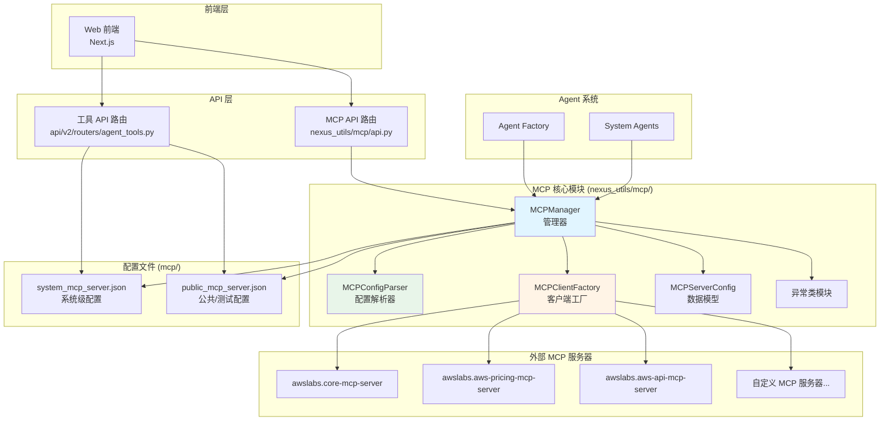
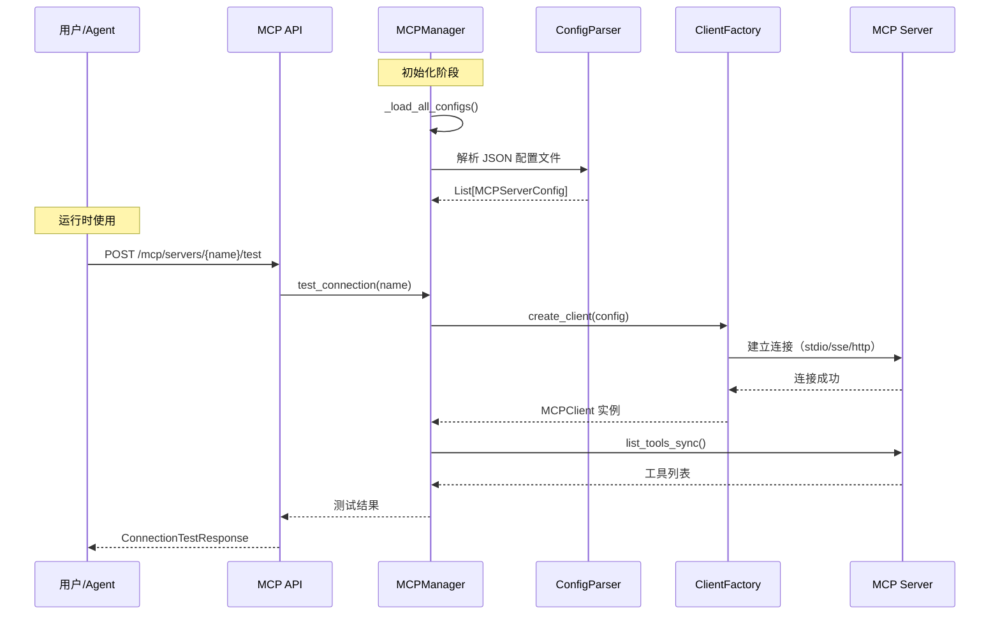

# MCP 工具参考文档

**创建日期**: 2026-02-05  
**最后更新**: 2026-02-05  
**文档类型**: API 参考  
**模块路径**: `nexus_utils/mcp/`, `nexus_utils/mcp_manager.py`, `mcp/`  
**文档说明**: MCP (Model Context Protocol) 工具集成完整参考，包含所有 MCP 服务器配置、API 接口、数据模型和使用示例

---

## 目录

1. [概述](#1-概述)
2. [MCP 协议集成架构](#2-mcp-协议集成架构)
3. [已配置的 MCP 服务器](#3-已配置的-mcp-服务器)
4. [MCP 数据模型](#4-mcp-数据模型)
5. [MCP 管理器 API](#5-mcp-管理器-api)
6. [MCP REST API 接口](#6-mcp-rest-api-接口)
7. [MCP 配置解析器](#7-mcp-配置解析器)
8. [MCP 客户端工厂](#8-mcp-客户端工厂)
9. [异常处理](#9-异常处理)
10. [配置文件格式](#10-配置文件格式)
11. [使用示例](#11-使用示例)
12. [最佳实践](#12-最佳实践)
13. [相关文档](#13-相关文档)

---

## 1. 概述

### 1.1 什么是 MCP

MCP (Model Context Protocol) 是一种标准化协议，用于 AI 模型与外部工具和服务之间的通信。Nexus-AI 通过 MCP 协议集成外部工具能力，使 Agent 能够调用 AWS 定价查询、API 调用等外部服务。

### 1.2 系统中的 MCP 模块

Nexus-AI 的 MCP 集成由两套实现组成：

| 模块 | 路径 | 说明 | 状态 |
|------|------|------|------|
| **新版 MCP 模块** | `nexus_utils/mcp/` | 模块化重构版本，支持多传输类型、RESTful API | 活跃（推荐） |
| **旧版 MCP 管理器** | `nexus_utils/mcp_manager.py` | 单文件实现，仅支持 stdio 传输 | 维护中（兼容） |

**推荐使用新版 MCP 模块**（`nexus_utils/mcp/`），它提供了更完善的功能和更好的模块化设计。

### 1.3 支持的传输类型

| 传输类型 | 枚举值 | 说明 | 适用场景 |
|----------|--------|------|----------|
| **STDIO** | `stdio` | 标准输入输出传输，通过子进程通信 | 本地 MCP 服务器（uvx/npx 启动） |
| **SSE** | `sse` | Server-Sent Events 传输，服务器推送事件 | 远程 MCP 服务器（事件流） |
| **HTTP** | `http` | Streamable HTTP 传输，HTTP 流式通信 | 远程 MCP 服务器（HTTP 接口） |

---

## 2. MCP 协议集成架构

### 2.1 整体架构图



### 2.2 模块文件结构

```
nexus_utils/mcp/
├── __init__.py          # 模块入口，导出所有公共接口
├── models.py            # 数据模型（TransportType, MCPServerConfig）
├── parser.py            # 配置解析器（支持 JSON/URL/命令行格式）
├── client_factory.py    # 客户端工厂（创建 stdio/sse/http 客户端）
├── manager.py           # 管理器核心（配置管理、客户端创建、连接测试）
├── api.py               # RESTful API 路由（FastAPI 端点）
└── exceptions.py        # 异常类定义

mcp/
├── system_mcp_server.json   # 系统级 MCP 服务器配置（主配置文件）
└── public_mcp_server.json   # 公共/测试 MCP 服务器配置
```

### 2.3 数据流



---

## 3. 已配置的 MCP 服务器

### 3.1 系统级服务器（system_mcp_server.json）

系统级 MCP 服务器是 Nexus-AI 核心功能依赖的服务器，默认启用。

#### 3.1.1 awslabs.core-mcp-server

| 属性 | 值 |
|------|-----|
| **名称** | `awslabs.core-mcp-server` |
| **传输类型** | stdio |
| **启动命令** | `uvx awslabs.core-mcp-server@latest` |
| **状态** | 启用 |
| **功能描述** | AWS Labs 核心 MCP 服务器，提供基础 AWS 服务交互能力 |

**环境变量配置**:

```json
{
  "FASTMCP_LOG_LEVEL": "ERROR"
}
```

#### 3.1.2 awslabs.aws-pricing-mcp-server

| 属性 | 值 |
|------|-----|
| **名称** | `awslabs.aws-pricing-mcp-server` |
| **传输类型** | stdio |
| **启动命令** | `uvx awslabs.aws-pricing-mcp-server@latest` |
| **状态** | 启用 |
| **功能描述** | AWS 定价查询服务器，支持查询 EC2、S3、RDS 等服务的定价信息 |

**环境变量配置**:

```json
{
  "FASTMCP_LOG_LEVEL": "ERROR",
  "AWS_PROFILE": "default",
  "AWS_REGION": "us-east-1"
}
```

**典型使用场景**:
- 查询 AWS 服务定价
- 生成云迁移成本估算
- 比较不同区域和实例类型的价格

#### 3.1.3 awslabs.aws-api-mcp-server

| 属性 | 值 |
|------|-----|
| **名称** | `awslabs.aws-api-mcp-server` |
| **传输类型** | stdio |
| **启动命令** | `uvx awslabs.aws-api-mcp-server@latest` |
| **状态** | 启用 |
| **功能描述** | AWS API 调用服务器，提供对 AWS 服务 API 的直接调用能力 |

**环境变量配置**:

```json
{
  "FASTMCP_LOG_LEVEL": "ERROR",
  "AWS_PROFILE": "default",
  "AWS_REGION": "us-west-2"
}
```

**典型使用场景**:
- 调用 AWS 服务 API
- 管理 AWS 资源
- 获取 AWS 服务状态信息

### 3.2 公共/测试服务器（public_mcp_server.json）

公共配置文件用于存放用户自定义添加的 MCP 服务器和测试用服务器。

#### 3.2.1 test-server

| 属性 | 值 |
|------|-----|
| **名称** | `test-server` |
| **传输类型** | stdio |
| **启动命令** | `uvx test-package@latest` |
| **状态** | 禁用 |
| **功能描述** | 测试用 MCP 服务器 |

**环境变量配置**:

```json
{
  "TEST_ENV": "test_value"
}
```

**自动批准工具**: `test-tool`

#### 3.2.2 disabled-server

| 属性 | 值 |
|------|-----|
| **名称** | `disabled-server` |
| **传输类型** | stdio |
| **启动命令** | `uvx disabled-package@latest` |
| **状态** | 禁用 |
| **功能描述** | 已禁用的测试服务器 |

### 3.3 服务器状态总览

| 服务器名称 | 配置文件 | 传输类型 | 状态 | AWS 区域 |
|-----------|----------|----------|------|----------|
| awslabs.core-mcp-server | system_mcp_server.json | stdio | ✅ 启用 | - |
| awslabs.aws-pricing-mcp-server | system_mcp_server.json | stdio | ✅ 启用 | us-east-1 |
| awslabs.aws-api-mcp-server | system_mcp_server.json | stdio | ✅ 启用 | us-west-2 |
| test-server | public_mcp_server.json | stdio | ❌ 禁用 | - |
| disabled-server | public_mcp_server.json | stdio | ❌ 禁用 | - |

---

## 4. MCP 数据模型

### 4.1 TransportType 枚举

**文件位置**: `nexus_utils/mcp/models.py`

```python
class TransportType(Enum):
    """MCP 传输类型枚举"""
    STDIO = "stdio"   # 标准输入输出传输
    SSE = "sse"       # Server-Sent Events 传输
    HTTP = "http"     # Streamable HTTP 传输
```

### 4.2 MCPServerConfig 数据类

**文件位置**: `nexus_utils/mcp/models.py`

MCP 服务器配置的核心数据结构，支持三种传输类型。

#### 字段说明

| 字段 | 类型 | 必需 | 默认值 | 说明 |
|------|------|------|--------|------|
| `name` | `str` | ✅ | - | 服务器名称（唯一标识符） |
| `transport` | `TransportType` | ✅ | - | 传输类型 |
| `command` | `Optional[str]` | stdio 必需 | `None` | 执行命令 |
| `args` | `List[str]` | ❌ | `[]` | 命令参数列表 |
| `env` | `Dict[str, str]` | ❌ | `{}` | 环境变量字典 |
| `url` | `Optional[str]` | sse/http 必需 | `None` | 服务器 URL |
| `headers` | `Dict[str, str]` | ❌ | `{}` | HTTP 请求头 |
| `auto_approve` | `List[str]` | ❌ | `[]` | 自动批准的工具列表 |
| `disabled` | `bool` | ❌ | `False` | 是否禁用 |
| `description` | `Optional[str]` | ❌ | `None` | 服务器描述 |

#### 方法说明

| 方法 | 返回类型 | 说明 |
|------|----------|------|
| `is_enabled()` | `bool` | 检查服务器是否启用（`not self.disabled`） |
| `validate()` | `bool` | 验证配置完整性（根据传输类型检查必需字段） |
| `to_dict()` | `Dict[str, Any]` | 序列化为字典格式（用于 JSON 持久化） |
| `from_dict(data)` | `MCPServerConfig` | 从字典反序列化（类方法，用于从 JSON 加载） |

#### 验证规则

```
stdio 传输: name（必需）+ command（必需）
sse 传输:   name（必需）+ url（必需）
http 传输:  name（必需）+ url（必需）
```

---

## 5. MCP 管理器 API

### 5.1 MCPManager 类

**文件位置**: `nexus_utils/mcp/manager.py`

MCP 管理器是 MCP 模块的核心类，负责配置管理、客户端创建和连接测试。

#### 构造函数

```python
MCPManager(
    config_dir: Optional[str] = None,    # 配置目录，默认 "mcp"
    config_files: Optional[List[str]] = None  # 配置文件列表
)
```

**默认配置**:
- 配置目录: `mcp/`
- 配置文件: `["system_mcp_server.json", "public_mcp_server.json"]`
- 主配置文件（新增服务器保存位置）: `system_mcp_server.json`

### 5.2 配置管理方法

#### add_server()

添加新的 MCP 服务器配置。

```python
def add_server(
    self, 
    config: MCPServerConfig, 
    source_file: Optional[str] = None
) -> bool
```

| 参数 | 类型 | 说明 |
|------|------|------|
| `config` | `MCPServerConfig` | 服务器配置对象 |
| `source_file` | `Optional[str]` | 配置来源文件名，默认为主配置文件 |

**异常**: `DuplicateServerError`（名称已存在）、`ConfigurationError`（配置无效）

#### update_server()

更新现有服务器配置。

```python
def update_server(self, name: str, config: MCPServerConfig) -> bool
```

**异常**: `ServerNotFoundError`（服务器不存在）、`ConfigurationError`（配置无效）

#### delete_server()

删除服务器配置。

```python
def delete_server(self, name: str) -> bool
```

**异常**: `ServerNotFoundError`（服务器不存在）

#### get_server()

获取服务器配置。

```python
def get_server(self, name: str) -> Optional[MCPServerConfig]
```

#### list_servers()

列出所有服务器配置。

```python
def list_servers(self) -> List[MCPServerConfig]
```

#### enable_server() / disable_server()

启用或禁用服务器。

```python
def enable_server(self, name: str) -> bool
def disable_server(self, name: str) -> bool
```

**异常**: `ServerNotFoundError`（服务器不存在）

### 5.3 持久化方法

#### save_configs()

将配置持久化到 JSON 文件。

```python
def save_configs(self, server_name: Optional[str] = None) -> None
```

- 指定 `server_name`: 仅保存该服务器到其源文件
- 不指定: 按源文件分组保存所有服务器

#### reload_configs()

重新加载所有配置文件。

```python
def reload_configs(self) -> None
```

### 5.4 客户端管理方法

#### create_client()

为指定服务器创建 MCP 客户端。

```python
def create_client(self, name: str) -> Optional[MCPClient]
```

- 服务器不存在或已禁用时返回 `None`
- 创建失败时记录错误日志并返回 `None`

#### create_clients_for_dependencies()

为依赖列表批量创建客户端。

```python
def create_clients_for_dependencies(
    self, 
    mcp_dependencies: List[str]
) -> List[MCPClient]
```

- 跳过不存在或已禁用的服务器
- 返回成功创建的客户端列表

### 5.5 连接测试方法

#### test_connection()

测试服务器连接并返回可用工具列表。

```python
async def test_connection(
    self, 
    name: str, 
    timeout: float = 30.0
) -> Dict[str, Any]
```

**返回值结构**:

```python
{
    "success": bool,          # 连接是否成功
    "server_name": str,       # 服务器名称
    "tools": List[Dict],      # 工具列表
    "error": Optional[str],   # 错误信息
    "tool_count": int          # 工具数量
}
```

#### list_tools()

列出指定服务器的所有工具。

```python
async def list_tools(self, name: str) -> List[Dict[str, Any]]
```

**返回值中每个工具的结构**:

```python
{
    "name": str,              # 工具名称
    "description": str,       # 工具描述
    "input_schema": Dict      # 输入参数 JSON Schema
}
```

### 5.6 导入方法

#### import_config()

导入配置（支持多种格式自动检测）。

```python
def import_config(self, config_data: str) -> List[MCPServerConfig]
```

支持的格式：JSON 配置、URL、命令字符串（npx/uvx）。

### 5.7 全局实例函数

```python
# 获取默认管理器实例（单例模式）
def get_default_mcp_manager() -> MCPManager

# 重置默认管理器实例
def reset_default_mcp_manager() -> None
```

---

## 6. MCP REST API 接口

### 6.1 API 路由概览

MCP 提供两套 REST API 路由：

| 路由前缀 | 文件位置 | 说明 |
|----------|----------|------|
| `/api/v2/mcp/*` | `nexus_utils/mcp/api.py` | 新版 MCP 管理 API（推荐） |
| `/api/v2/tools/mcp/*` | `api/v2/routers/agent_tools.py` | 工具管理中的 MCP 端点 |

### 6.2 新版 MCP API（/api/v2/mcp/）

#### GET /mcp/servers — 列出所有服务器

**响应模型**: `ServerListResponse`

```json
{
  "success": true,
  "data": {
    "servers": [
      {
        "name": "awslabs.aws-pricing-mcp-server",
        "transport": "stdio",
        "disabled": false,
        "description": null,
        "command": "uvx",
        "args": ["awslabs.aws-pricing-mcp-server@latest"],
        "url": null,
        "auto_approve": null
      }
    ],
    "total": 5,
    "enabled": 3,
    "disabled": 2
  }
}
```

#### GET /mcp/servers/{name} — 获取服务器详情

**路径参数**: `name` — 服务器名称

**响应模型**: `ServerConfigResponse`

**错误码**: `404` — 服务器不存在

#### POST /mcp/servers — 创建服务器

**请求体**: `ServerConfigRequest`

```json
{
  "name": "my-custom-server",
  "transport": "stdio",
  "command": "uvx",
  "args": ["my-package@latest"],
  "env": {"API_KEY": "xxx"},
  "disabled": false,
  "description": "自定义 MCP 服务器"
}
```

**错误码**: `409` — 服务器已存在，`400` — 配置无效

#### PUT /mcp/servers/{name} — 更新服务器

**路径参数**: `name` — 服务器名称  
**请求体**: `ServerConfigRequest`

**错误码**: `404` — 服务器不存在，`400` — 配置无效

#### DELETE /mcp/servers/{name} — 删除服务器

**路径参数**: `name` — 服务器名称

**错误码**: `404` — 服务器不存在

#### POST /mcp/servers/import — 导入配置

**请求体**: `ImportConfigRequest`

```json
{
  "config_data": "{\"mcpServers\": {\"new-server\": {\"command\": \"uvx\", \"args\": [\"pkg@latest\"]}}}",
  "format": "auto"
}
```

支持的格式：`auto`（自动检测）、`json`、`command`、`url`

#### POST /mcp/servers/{name}/test — 测试连接

**路径参数**: `name` — 服务器名称

**响应模型**: `ConnectionTestResponse`

```json
{
  "success": true,
  "server_name": "awslabs.aws-pricing-mcp-server",
  "tool_count": 5,
  "tools": [
    {
      "name": "get_pricing",
      "description": "获取 AWS 服务定价信息",
      "input_schema": { "type": "object", "properties": { ... } }
    }
  ],
  "error": null
}
```

#### GET /mcp/servers/{name}/tools — 列出服务器工具

**路径参数**: `name` — 服务器名称

**响应模型**: `ToolListResponse`

**错误码**: `404` — 服务器不存在

#### POST /mcp/servers/{name}/enable — 启用服务器

**路径参数**: `name` — 服务器名称

**错误码**: `404` — 服务器不存在

#### POST /mcp/servers/{name}/disable — 禁用服务器

**路径参数**: `name` — 服务器名称

**错误码**: `404` — 服务器不存在

### 6.3 工具管理 MCP API（/api/v2/tools/mcp/）

此套 API 位于 `api/v2/routers/agent_tools.py`，直接读取 JSON 配置文件，不依赖 MCPManager。

#### GET /tools/mcp/servers — 列出 MCP 服务器

```json
{
  "success": true,
  "data": {
    "servers": [...],
    "total": 5,
    "enabled": 3,
    "disabled": 2
  }
}
```

#### GET /tools/mcp/servers/{server_name} — 获取服务器详情

#### PUT /tools/mcp/servers/{server_name} — 更新服务器配置

**请求体参数**:
- `disabled` (Optional[bool]): 是否禁用
- `auto_approve` (Optional[List[str]]): 自动批准的工具列表

#### POST /tools/mcp/servers — 创建 MCP 服务器

**请求体**: `MCPServerCreateRequest`

```json
{
  "name": "my-server",
  "transport": "stdio",
  "command": "uvx",
  "args": ["my-package@latest"],
  "env": {},
  "description": "描述",
  "auto_approve": []
}
```

### 6.4 API 请求/响应模型汇总

| 模型名称 | 用途 | 文件位置 |
|----------|------|----------|
| `ServerConfigRequest` | 创建/更新服务器请求 | `nexus_utils/mcp/api.py` |
| `ServerConfigResponse` | 服务器配置响应 | `nexus_utils/mcp/api.py` |
| `ImportConfigRequest` | 导入配置请求 | `nexus_utils/mcp/api.py` |
| `ConnectionTestResponse` | 连接测试响应 | `nexus_utils/mcp/api.py` |
| `ToolInfo` | 工具信息 | `nexus_utils/mcp/api.py` |
| `ToolListResponse` | 工具列表响应 | `nexus_utils/mcp/api.py` |
| `OperationResponse` | 通用操作响应 | `nexus_utils/mcp/api.py` |
| `ServerListResponse` | 服务器列表响应 | `nexus_utils/mcp/api.py` |
| `MCPServerCreateRequest` | 创建服务器请求（工具路由） | `api/v2/routers/agent_tools.py` |
| `MCPServerInfo` | MCP 服务器信息（工具路由） | `api/v2/routers/agent_tools.py` |

---

## 7. MCP 配置解析器

### 7.1 MCPConfigParser 类

**文件位置**: `nexus_utils/mcp/parser.py`

配置解析器支持多种输入格式的自动检测和解析。

### 7.2 支持的输入格式

#### 格式一：标准 JSON 配置（Kiro/Cursor 格式）

```json
{
  "mcpServers": {
    "server-name": {
      "command": "uvx",
      "args": ["package@latest"],
      "env": { "KEY": "value" },
      "autoApprove": ["tool1"],
      "disabled": false
    }
  }
}
```

#### 格式二：单服务器 JSON

```json
{
  "name": "my-server",
  "transport": "stdio",
  "command": "uvx",
  "args": ["my-package@latest"]
}
```

#### 格式三：服务器数组 JSON

```json
[
  { "name": "server1", "command": "uvx", "args": ["pkg1@latest"] },
  { "name": "server2", "url": "https://example.com/mcp" }
]
```

#### 格式四：NPX/UVX 命令字符串

```
uvx awslabs.aws-pricing-mcp-server@latest
npx -y @modelcontextprotocol/server-filesystem /path/to/dir
python -m mcp_server
```

- 自动从包名生成服务器名称
- 自动设置传输类型为 `stdio`
- 支持 `npx`、`uvx`、`node`、`python`、`python3` 命令

#### 格式五：SSE/HTTP URL

```
https://example.com/mcp/sse
sse://example.com/mcp/events
http://example.com/mcp/stream
```

- `sse://` 协议自动转换为 `https://`
- URL 路径包含 `/sse` 时自动识别为 SSE 传输
- 其他 URL 默认为 HTTP 传输

### 7.3 解析方法

#### parse() — 自动检测格式

```python
@staticmethod
def parse(input_data: str) -> List[MCPServerConfig]
```

自动检测输入格式并解析，检测顺序：
1. JSON 格式（以 `{` 或 `[` 开头）
2. URL 格式（以 `http://`、`https://`、`sse://` 开头）
3. 命令字符串格式（以 `npx`、`uvx`、`node`、`python` 等开头）

#### parse_json_config() — 解析 JSON

```python
@staticmethod
def parse_json_config(json_str: str) -> List[MCPServerConfig]
```

#### parse_command_string() — 解析命令字符串

```python
@staticmethod
def parse_command_string(cmd: str) -> MCPServerConfig
```

#### parse_url() — 解析 URL

```python
@staticmethod
def parse_url(url: str) -> MCPServerConfig
```

---

## 8. MCP 客户端工厂

### 8.1 MCPClientFactory 类

**文件位置**: `nexus_utils/mcp/client_factory.py`

根据传输类型创建对应的 Strands MCPClient 实例。

### 8.2 创建方法

```python
@staticmethod
def create_client(config: MCPServerConfig) -> Optional[MCPClient]
```

根据 `config.transport` 自动选择创建方式：

| 传输类型 | 底层库 | 连接参数 | 超时设置 |
|----------|--------|----------|----------|
| `stdio` | `mcp.StdioServerParameters` + `mcp.client.stdio.stdio_client` | command, args, env | 120 秒启动超时 |
| `sse` | `mcp.client.sse.sse_client` | url, headers | 默认 |
| `http` | `mcp.client.streamable_http.streamablehttp_client` | url, headers | 默认 |

### 8.3 依赖库

| 库 | 用途 |
|----|------|
| `mcp` | MCP 协议标准库，提供传输层实现 |
| `strands.tools.mcp.MCPClient` | Strands 框架的 MCP 客户端封装 |

### 8.4 stdio 客户端创建示例

```python
from mcp import StdioServerParameters
from mcp.client.stdio import stdio_client
from strands.tools.mcp import MCPClient

# 创建连接参数
server_params = StdioServerParameters(
    command="uvx",
    args=["awslabs.aws-pricing-mcp-server@latest"],
    env={"FASTMCP_LOG_LEVEL": "ERROR"}
)

# 创建客户端（120 秒启动超时，支持首次下载包）
client = MCPClient(
    lambda: stdio_client(server_params), 
    startup_timeout=120
)
```

---

## 9. 异常处理

### 9.1 异常类层次

**文件位置**: `nexus_utils/mcp/exceptions.py`

```
MCPManagerError (基础异常)
├── ConfigurationError      # 配置错误
├── MCPConnectionError      # 连接错误
├── ParseError              # 解析错误
├── ServerNotFoundError     # 服务器未找到
└── DuplicateServerError    # 重复服务器
```

### 9.2 异常详细说明

| 异常类 | 触发场景 | HTTP 状态码 |
|--------|----------|-------------|
| `ConfigurationError` | 配置文件格式错误、必需字段缺失、传输类型不支持 | 400 |
| `MCPConnectionError` | MCP 服务器未运行、网络问题、认证失败、连接超时 | 500 |
| `ParseError` | JSON 格式无效、命令字符串无效、URL 格式无效 | 400 |
| `ServerNotFoundError` | 请求的服务器名称不存在 | 404 |
| `DuplicateServerError` | 尝试添加已存在的服务器名称 | 409 |

---

## 10. 配置文件格式

### 10.1 标准配置文件结构

```json
{
  "mcpServers": {
    "<服务器名称>": {
      "transport": "stdio | sse | http",
      "disabled": false,
      "command": "uvx",
      "args": ["package@latest"],
      "env": {
        "ENV_VAR": "value"
      },
      "url": "https://example.com/mcp",
      "headers": {
        "Authorization": "Bearer token"
      },
      "autoApprove": ["tool1", "tool2"],
      "description": "服务器描述"
    }
  }
}
```

### 10.2 字段说明

| 字段 | 类型 | 适用传输 | 说明 |
|------|------|----------|------|
| `transport` | string | 全部 | 传输类型，可省略（自动检测） |
| `disabled` | boolean | 全部 | 是否禁用，默认 `false` |
| `command` | string | stdio | 启动命令（如 `uvx`、`npx`） |
| `args` | string[] | stdio | 命令参数列表 |
| `env` | object | stdio | 环境变量键值对 |
| `url` | string | sse/http | 服务器 URL |
| `headers` | object | sse/http | HTTP 请求头 |
| `autoApprove` | string[] | 全部 | 自动批准的工具名称列表 |
| `description` | string | 全部 | 服务器描述信息 |

### 10.3 传输类型自动检测规则

当配置中未显式指定 `transport` 字段时，系统按以下规则自动检测：

1. 存在 `command` 字段 → `stdio`
2. 存在 `url` 字段且 URL 包含 `/sse` → `sse`
3. 存在 `url` 字段且 URL 不包含 `/sse` → `http`

### 10.4 配置文件加载优先级

1. 首先加载 `system_mcp_server.json`（系统级配置）
2. 然后加载 `public_mcp_server.json`（公共配置）
3. 最后扫描 `mcp/` 目录中的其他 `.json` 文件
4. **同名服务器不覆盖**：先加载的配置优先

---

## 11. 使用示例

### 11.1 获取管理器并列出服务器

```python
from nexus_utils.mcp import get_default_mcp_manager

# 获取默认管理器实例（单例模式）
manager = get_default_mcp_manager()

# 列出所有服务器
servers = manager.list_servers()
for server in servers:
    status = "启用" if server.is_enabled() else "禁用"
    print(f"  {server.name} [{server.transport.value}] - {status}")
```

### 11.2 添加新的 stdio 服务器

```python
from nexus_utils.mcp import (
    get_default_mcp_manager,
    MCPServerConfig,
    TransportType,
)

manager = get_default_mcp_manager()

# 创建配置
config = MCPServerConfig(
    name="my-custom-server",
    transport=TransportType.STDIO,
    command="uvx",
    args=["my-mcp-package@latest"],
    env={"API_KEY": "your-api-key"},
    description="自定义 MCP 服务器"
)

# 添加并保存
manager.add_server(config)
manager.save_configs()
```

### 11.3 添加 SSE 远程服务器

```python
from nexus_utils.mcp import (
    get_default_mcp_manager,
    MCPServerConfig,
    TransportType,
)

manager = get_default_mcp_manager()

config = MCPServerConfig(
    name="remote-sse-server",
    transport=TransportType.SSE,
    url="https://mcp.example.com/sse",
    headers={"Authorization": "Bearer your-token"},
    description="远程 SSE MCP 服务器"
)

manager.add_server(config)
manager.save_configs()
```

### 11.4 通过命令字符串快速导入

```python
from nexus_utils.mcp import get_default_mcp_manager

manager = get_default_mcp_manager()

# 直接从命令字符串导入
imported = manager.import_config(
    "uvx awslabs.nova-canvas-mcp-server@latest"
)
manager.save_configs()

print(f"导入了 {len(imported)} 个服务器")
```

### 11.5 通过 JSON 配置导入

```python
import json
from nexus_utils.mcp import get_default_mcp_manager

manager = get_default_mcp_manager()

# 从 Kiro/Cursor 格式导入
config_json = json.dumps({
    "mcpServers": {
        "filesystem-server": {
            "command": "npx",
            "args": ["-y", "@modelcontextprotocol/server-filesystem", "/tmp"],
            "autoApprove": ["read_file", "list_directory"]
        }
    }
})

imported = manager.import_config(config_json)
manager.save_configs()
```

### 11.6 测试服务器连接

```python
import asyncio
from nexus_utils.mcp import get_default_mcp_manager

async def test_server():
    manager = get_default_mcp_manager()
    
    # 测试连接（30 秒超时）
    result = await manager.test_connection(
        "awslabs.aws-pricing-mcp-server",
        timeout=30.0
    )
    
    if result["success"]:
        print(f"连接成功！发现 {result['tool_count']} 个工具：")
        for tool in result["tools"]:
            print(f"  - {tool['name']}: {tool['description']}")
    else:
        print(f"连接失败: {result['error']}")

asyncio.run(test_server())
```

### 11.7 在 Agent 中集成 MCP 工具

```python
from nexus_utils.mcp import get_default_mcp_manager

manager = get_default_mcp_manager()

# 为 Agent 的 MCP 依赖创建客户端
mcp_dependencies = [
    "awslabs.aws-pricing-mcp-server",
    "awslabs.aws-api-mcp-server"
]

clients = manager.create_clients_for_dependencies(mcp_dependencies)
print(f"成功创建 {len(clients)} 个 MCP 客户端")

# 将客户端传递给 Agent
# agent = Agent(tools=clients + other_tools)
```

### 11.8 使用配置解析器

```python
from nexus_utils.mcp import MCPConfigParser

# 自动检测格式并解析
configs = MCPConfigParser.parse(
    "uvx awslabs.aws-pricing-mcp-server@latest"
)
print(f"解析结果: {configs[0].name}, 传输: {configs[0].transport.value}")

# 解析 URL
config = MCPConfigParser.parse_url("https://mcp.example.com/sse")
print(f"URL 服务器: {config.name}, 传输: {config.transport.value}")

# 解析命令字符串
config = MCPConfigParser.parse_command_string(
    "npx -y @modelcontextprotocol/server-filesystem /tmp"
)
print(f"命令服务器: {config.name}, 命令: {config.command}")
```

---

## 12. 最佳实践

### 12.1 配置管理

1. **系统级服务器**放在 `system_mcp_server.json`，用户自定义服务器放在 `public_mcp_server.json`
2. **使用单例模式**：通过 `get_default_mcp_manager()` 获取管理器实例，避免重复加载配置
3. **环境变量隔离**：为每个 MCP 服务器配置独立的环境变量，避免冲突
4. **禁用未使用的服务器**：将不需要的服务器设置 `disabled: true`，减少资源消耗

### 12.2 安全建议

1. **敏感信息**：不要在配置文件中硬编码 API 密钥，使用环境变量引用
2. **自动批准**：谨慎配置 `autoApprove` 列表，仅批准安全的只读工具
3. **网络安全**：SSE/HTTP 传输使用 HTTPS 协议，配置适当的认证头

### 12.3 性能优化

1. **延迟创建客户端**：仅在需要时创建 MCP 客户端，而非预先创建所有客户端
2. **超时设置**：stdio 客户端首次启动可能需要下载包，默认 120 秒超时
3. **连接复用**：对于频繁使用的服务器，考虑缓存客户端实例
4. **异步操作**：在异步环境中使用 `test_connection()` 和 `list_tools()` 方法

### 12.4 添加新 MCP 服务器的步骤

1. **确定传输类型**：本地服务器用 `stdio`，远程服务器用 `sse` 或 `http`
2. **编写配置**：在对应的 JSON 文件中添加服务器配置
3. **测试连接**：通过 API 或代码测试服务器连接
4. **集成到 Agent**：在 Agent 的提示词模板中声明 MCP 依赖

**配置示例 — 添加新的 stdio 服务器**:

```json
{
  "mcpServers": {
    "my-new-server": {
      "transport": "stdio",
      "disabled": false,
      "command": "uvx",
      "args": ["my-mcp-package@latest"],
      "env": {
        "FASTMCP_LOG_LEVEL": "ERROR",
        "MY_API_KEY": "your-key-here"
      },
      "autoApprove": [],
      "description": "我的自定义 MCP 服务器"
    }
  }
}
```

**配置示例 — 添加远程 SSE 服务器**:

```json
{
  "mcpServers": {
    "remote-analytics": {
      "transport": "sse",
      "disabled": false,
      "url": "https://analytics.example.com/mcp/sse",
      "headers": {
        "Authorization": "Bearer your-token"
      },
      "description": "远程分析 MCP 服务器"
    }
  }
}
```

---

## 13. 相关文档

- [MCP Integration 模块文档](../modules/03-mcp-integration.md) — MCP 模块的详细架构和实现文档
- [REST API v2 参考文档](rest-api-v2.md) — 完整的 REST API 端点参考
- [内部 API 参考文档](internal-apis.md) — 内部 Python API 参考
- [Agent Factory 模块文档](../modules/01-agent-factory.md) — Agent 工厂如何集成 MCP 工具
- [系统架构文档](../architecture/system-architecture.md) — 系统整体架构
- [MCP 协议官方文档](https://modelcontextprotocol.io/) — MCP 协议规范
- [Strands MCP 集成](https://github.com/awslabs/strands) — Strands 框架 MCP 客户端
- [AWS MCP 服务器](https://github.com/awslabs/aws-mcp-servers) — AWS 官方 MCP 服务器

---

**文档版本**: 1.0  
**最后更新**: 2026-02-05  
**维护者**: Nexus-AI Team
