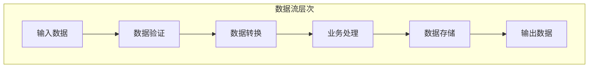
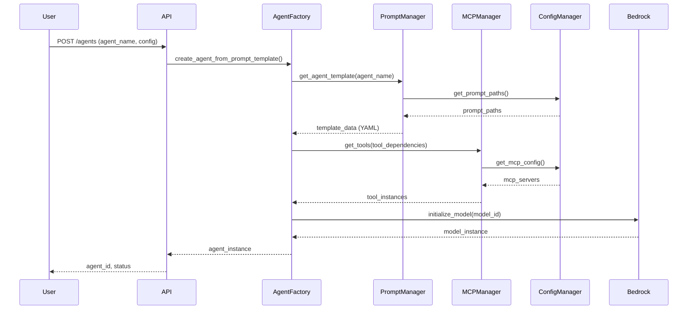
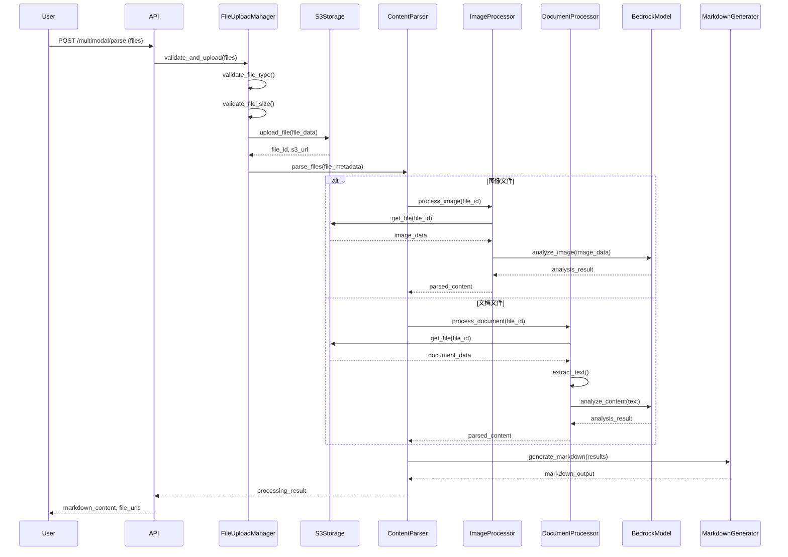
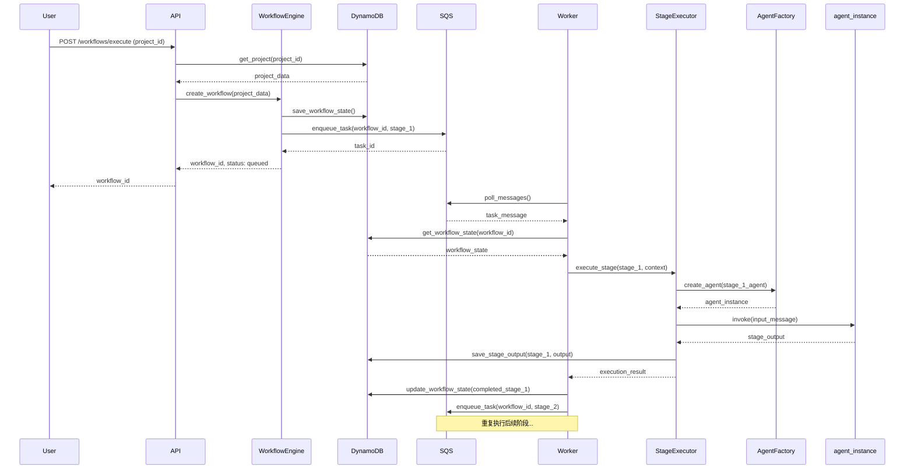
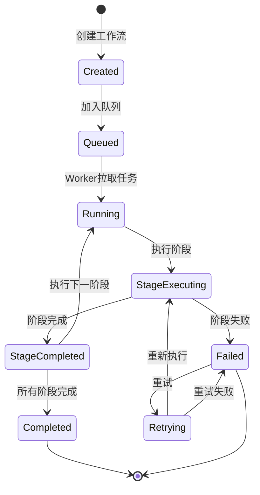

# 数据流设计

**创建日期**: 2026-02-05  
**最后更新**: 2026-02-06  
**文档版本**: 2.0  
**状态**: 已完成

## 1. 数据流概述

本文档详细描述Nexus-AI系统中数据的流转过程、转换逻辑和存储策略。理解数据流对于系统调试、性能优化和功能扩展至关重要。

### 1.1 数据流类型

- **同步数据流**: API请求-响应模式，实时返回结果
- **异步数据流**: 通过消息队列处理，支持长时间任务
- **流式数据流**: 实时流式输出，支持大模型响应
- **批处理数据流**: 批量处理多个数据项

### 1.2 数据流层次



## 2. 主要数据流

### 2.1 Agent创建数据流

#### 2.1.1 流程图



#### 2.1.2 数据结构

**输入数据**:
```json
{
  "agent_name": "system_agents_prompts/orchestrator",
  "config": {
    "model_id": "claude-3-5-sonnet",
    "temperature": 0.3,
    "max_tokens": 60000
  }
}
```

**中间数据 (YAML模板)**:
```yaml
agent:
  name: "orchestrator"
  description: "工作流编排Agent"
  metadata:
    tools_dependencies:
      - "strands_tools/calculator"
      - "system_tools/project_manager"
  versions:
    - version: "latest"
      system_prompt: "你是一个工作流编排专家..."
```

**输出数据**:
```json
{
  "agent_id": "agent_123456",
  "status": "created",
  "model_id": "claude-3-5-sonnet",
  "tools": ["calculator", "project_manager"],
  "created_at": "2026-02-06T10:00:00Z"
}
```

### 2.2 多模态处理数据流

#### 2.2.1 流程图



#### 2.2.2 数据转换

**输入**: 原始文件（图像/文档）
```
Binary File Data
├── image/jpeg (5MB)
├── application/vnd.openxmlformats-officedocument.spreadsheetml.sheet (2MB)
└── application/vnd.openxmlformats-officedocument.wordprocessingml.document (1MB)
```

**中间数据**: 文件元数据
```json
{
  "file_id": "file_abc123",
  "file_name": "report.xlsx",
  "file_type": "application/vnd.openxmlformats-officedocument.spreadsheetml.sheet",
  "file_size": 2097152,
  "s3_url": "s3://bucket/multimodal-content/file_abc123.xlsx",
  "upload_time": "2026-02-06T10:00:00Z"
}
```

**处理结果**: 解析内容
```json
{
  "file_id": "file_abc123",
  "content_type": "spreadsheet",
  "extracted_data": {
    "sheets": [
      {
        "name": "Sheet1",
        "rows": 100,
        "columns": 10,
        "summary": "销售数据统计表"
      }
    ]
  },
  "ai_analysis": {
    "summary": "这是一份2025年度销售数据统计表...",
    "key_insights": ["销售额同比增长15%", "Q4表现最佳"]
  }
}
```

**输出**: Markdown格式
```markdown
# 文件分析报告

## 文件信息
- 文件名: report.xlsx
- 文件类型: Excel表格
- 文件大小: 2.00 MB

## 内容摘要
这是一份2025年度销售数据统计表...

## 关键洞察
- 销售额同比增长15%
- Q4表现最佳
```

### 2.3 工作流执行数据流

#### 2.3.1 流程图



#### 2.3.2 状态转换



#### 2.3.3 数据演进

**初始状态**:
```json
{
  "workflow_id": "wf_123456",
  "project_id": "proj_abc",
  "status": "created",
  "current_stage": null,
  "completed_stages": [],
  "stage_outputs": {},
  "created_at": "2026-02-06T10:00:00Z"
}
```

**执行中状态**:
```json
{
  "workflow_id": "wf_123456",
  "project_id": "proj_abc",
  "status": "running",
  "current_stage": "requirements_analysis",
  "completed_stages": [],
  "stage_outputs": {},
  "updated_at": "2026-02-06T10:05:00Z"
}
```

**阶段完成状态**:
```json
{
  "workflow_id": "wf_123456",
  "project_id": "proj_abc",
  "status": "running",
  "current_stage": "system_architecture",
  "completed_stages": ["requirements_analysis"],
  "stage_outputs": {
    "requirements_analysis": {
      "document_path": "projects/proj_abc/docs/requirements.md",
      "summary": "需求分析完成，识别出5个核心功能...",
      "completed_at": "2026-02-06T10:10:00Z"
    }
  },
  "updated_at": "2026-02-06T10:10:00Z"
}
```

**最终状态**:
```json
{
  "workflow_id": "wf_123456",
  "project_id": "proj_abc",
  "status": "completed",
  "current_stage": null,
  "completed_stages": [
    "requirements_analysis",
    "system_architecture",
    "agent_design",
    "prompt_engineering",
    "tool_development",
    "agent_code_development",
    "agent_developer_manager"
  ],
  "stage_outputs": { /* 所有阶段输出 */ },
  "completed_at": "2026-02-06T10:30:00Z"
}
```

## 3. 数据转换

### 3.1 数据格式转换

#### YAML → Python对象
```python
# YAML配置
agent:
  name: "orchestrator"
  temperature: 0.3

# 转换为Python对象
agent_config = {
    "name": "orchestrator",
    "temperature": 0.3
}
```

#### JSON → DynamoDB格式
```python
# JSON数据
{
    "project_id": "proj_123",
    "name": "My Project",
    "created_at": "2026-02-06T10:00:00Z"
}

# DynamoDB格式
{
    "PK": {"S": "PROJECT#proj_123"},
    "SK": {"S": "METADATA"},
    "name": {"S": "My Project"},
    "created_at": {"S": "2026-02-06T10:00:00Z"}
}
```

#### 二进制文件 → Base64
```python
# 图像文件
image_bytes = open("image.jpg", "rb").read()

# Base64编码（用于API传输）
import base64
image_base64 = base64.b64encode(image_bytes).decode()
```

### 3.2 数据验证

#### 输入验证
```python
from pydantic import BaseModel, validator

class AgentCreateRequest(BaseModel):
    agent_name: str
    model_id: str = "claude-3-5-sonnet"
    temperature: float = 0.3
    
    @validator('temperature')
    def validate_temperature(cls, v):
        if not 0 <= v <= 1:
            raise ValueError('temperature must be between 0 and 1')
        return v
```

#### 文件验证
```python
ALLOWED_EXTENSIONS = {'.jpg', '.jpeg', '.png', '.xlsx', '.docx', '.txt'}
MAX_FILE_SIZE = 50 * 1024 * 1024  # 50MB

def validate_file(file):
    # 检查文件扩展名
    ext = Path(file.filename).suffix.lower()
    if ext not in ALLOWED_EXTENSIONS:
        raise ValueError(f"不支持的文件类型: {ext}")
    
    # 检查文件大小
    if file.size > MAX_FILE_SIZE:
        raise ValueError(f"文件过大: {file.size} bytes")
```

### 3.3 数据清洗

#### 文本清洗
```python
def clean_text(text: str) -> str:
    # 移除多余空白
    text = re.sub(r'\s+', ' ', text)
    # 移除特殊字符
    text = re.sub(r'[^\w\s\u4e00-\u9fff]', '', text)
    # 去除首尾空格
    return text.strip()
```

#### 数据标准化
```python
def normalize_agent_name(name: str) -> str:
    # 转换为小写
    name = name.lower()
    # 替换空格为下划线
    name = name.replace(' ', '_')
    # 移除特殊字符
    name = re.sub(r'[^a-z0-9_/]', '', name)
    return name
```

## 4. 数据存储

### 4.1 持久化存储

#### DynamoDB表设计

**Projects表**:
```
PK: PROJECT#<project_id>
SK: METADATA
Attributes:
  - name: 项目名称
  - description: 项目描述
  - status: 项目状态
  - created_at: 创建时间
  - updated_at: 更新时间
```

**Agents表**:
```
PK: AGENT#<agent_id>
SK: METADATA
Attributes:
  - name: Agent名称
  - model_id: 模型ID
  - tools: 工具列表
  - created_at: 创建时间
GSI: status-index (按状态查询)
```

**Workflows表**:
```
PK: WORKFLOW#<workflow_id>
SK: METADATA
Attributes:
  - project_id: 项目ID
  - status: 工作流状态
  - current_stage: 当前阶段
  - stage_outputs: 阶段输出
GSI: project-index (按项目查询)
```

#### S3存储结构

```
nexus-ai-bucket/
├── multimodal-content/
│   ├── <file_id>.jpg
│   ├── <file_id>.xlsx
│   └── <file_id>.docx
├── projects/
│   └── <project_id>/
│       ├── agents/
│       ├── tools/
│       ├── prompts/
│       └── docs/
└── artifacts/
    └── <project_id>/
        └── <artifact_id>.tar.gz
```

### 4.2 缓存策略

#### 内存缓存
```python
from functools import lru_cache

@lru_cache(maxsize=100)
def get_agent_template(agent_name: str):
    # 缓存Agent模板
    return load_template(agent_name)
```

#### Redis缓存（规划中）
```python
# 会话缓存
redis.setex(f"session:{session_id}", 3600, session_data)

# Agent实例缓存
redis.setex(f"agent:{agent_id}", 1800, agent_instance)
```

### 4.3 数据生命周期

#### 临时数据
- **生命周期**: 1小时
- **存储位置**: 内存/临时文件
- **示例**: API请求上下文、临时文件

#### 短期数据
- **生命周期**: 7天
- **存储位置**: S3 (Standard)
- **示例**: 多模态处理的临时文件

#### 中期数据
- **生命周期**: 90天
- **存储位置**: S3 (Standard-IA)
- **示例**: 项目制品、日志文件

#### 长期数据
- **生命周期**: 永久
- **存储位置**: DynamoDB + S3 (Glacier)
- **示例**: 项目元数据、Agent配置

## 5. 数据安全

### 5.1 传输加密

- **HTTPS/TLS**: 所有API通信使用TLS 1.2+
- **S3传输加密**: 使用SSL/TLS上传下载文件
- **内部通信**: VPC内部通信加密

### 5.2 存储加密

- **DynamoDB**: 启用静态加密（KMS）
- **S3**: 服务端加密（SSE-S3或SSE-KMS）
- **敏感数据**: 应用层加密

### 5.3 数据脱敏

```python
def mask_sensitive_data(data: dict) -> dict:
    # 脱敏API Key
    if 'api_key' in data:
        data['api_key'] = data['api_key'][:8] + '****'
    
    # 脱敏邮箱
    if 'email' in data:
        email = data['email']
        data['email'] = email[:3] + '***@' + email.split('@')[1]
    
    return data
```

### 5.4 访问控制

- **IAM角色**: 基于角色的访问控制
- **资源策略**: S3 bucket策略、DynamoDB表策略
- **API认证**: JWT Token + API Key

## 6. 数据监控

### 6.1 数据流监控

- **吞吐量**: 每秒处理的请求数
- **延迟**: 数据处理的平均延迟
- **错误率**: 数据处理失败的比例
- **数据量**: 存储和传输的数据量

### 6.2 数据质量监控

- **完整性**: 数据是否完整
- **准确性**: 数据是否准确
- **一致性**: 数据是否一致
- **时效性**: 数据是否及时

### 6.3 告警规则

- 数据处理延迟 > 5秒
- 数据处理错误率 > 5%
- 存储空间使用率 > 80%
- 异常数据模式检测

## 7. 相关文档

- [系统架构设计](./system-architecture.md)
- [模块依赖关系](./module-dependencies.md)
- [部署架构](./deployment-architecture.md)
- [API参考文档](../api-reference/rest-api-v2.md)

---

**文档状态**: 已完成  
**维护者**: Nexus-AI团队  
**审核状态**: 待审核
