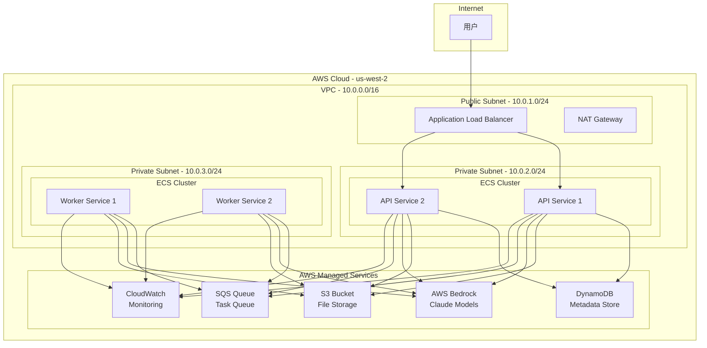
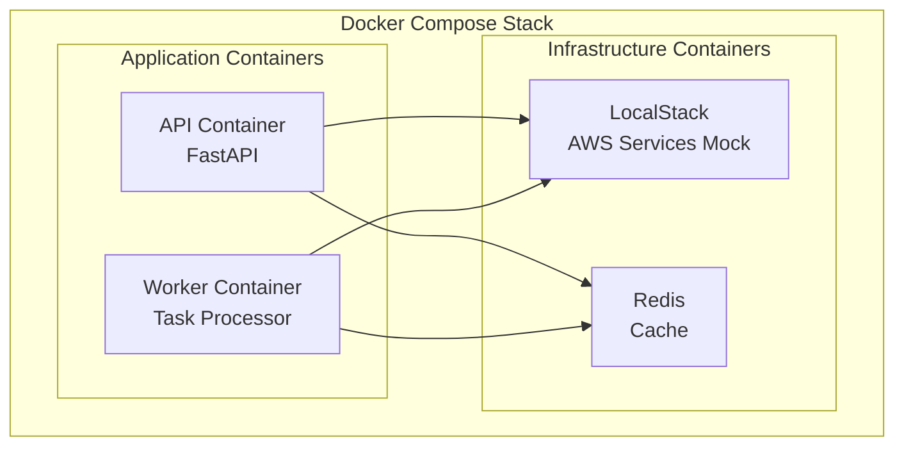
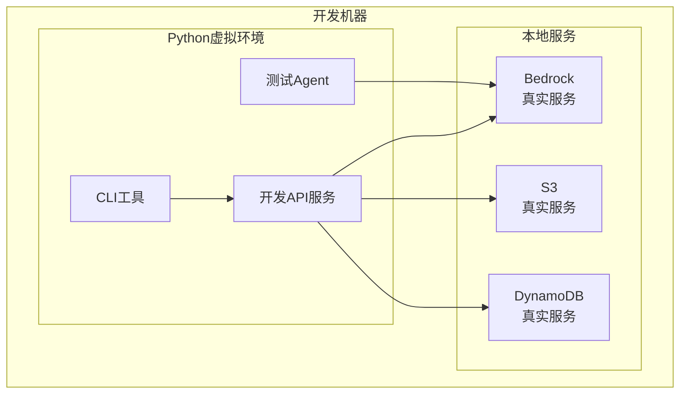
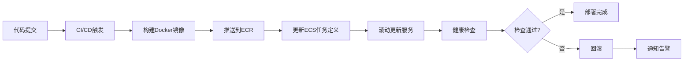

# 部署架构

**创建日期**: 2026-02-05  
**最后更新**: 2026-02-06  
**文档版本**: 2.0  
**状态**: 已完成

## 1. 部署架构概述

本文档详细描述Nexus-AI系统的部署架构，包括AWS云部署、容器化部署、本地开发部署等多种部署模式，以及网络拓扑、服务配置、资源规划等内容。

### 1.1 部署模式

Nexus-AI支持多种部署模式，满足不同场景的需求：

- **AWS云部署**: 生产环境推荐，充分利用AWS托管服务
- **容器化部署**: 使用Docker容器，支持本地和云端部署
- **本地开发部署**: 开发和测试环境，快速迭代
- **混合部署**: 结合云端和本地资源的混合模式

### 1.2 部署原则

- **高可用性**: 多可用区部署，自动故障转移
- **可扩展性**: 支持水平和垂直扩展
- **安全性**: 网络隔离、访问控制、数据加密
- **可观测性**: 完善的监控、日志和追踪
- **成本优化**: 合理使用资源，按需付费

## 2. AWS云部署架构

### 2.1 整体部署拓扑



### 2.2 服务分布

#### API服务层
- **部署位置**: ECS Fargate容器，私有子网
- **实例数量**: 2-10个（根据负载自动扩展）
- **负载均衡**: Application Load Balancer
- **健康检查**: /health端点，30秒间隔

#### Worker服务层
- **部署位置**: ECS Fargate容器，私有子网
- **实例数量**: 1-5个（根据队列长度自动扩展）
- **任务来源**: SQS队列
- **执行模式**: 长轮询，批量处理

#### 存储服务
- **S3存储**: 多模态文件、项目制品、日志归档
- **DynamoDB**: 项目元数据、Agent配置、会话状态
- **SQS队列**: 异步任务队列，支持重试和死信队列

#### AI服务
- **AWS Bedrock**: Claude 3.5 Haiku、Claude 3.7 Sonnet、Claude Opus 4
- **区域**: us-west-2（主区域）
- **调用方式**: Boto3 SDK，支持流式响应

### 2.3 网络架构

#### VPC配置
```yaml
VPC:
  CIDR: 10.0.0.0/16
  Region: us-west-2
  Availability Zones: 
    - us-west-2a
    - us-west-2b
  
Subnets:
  Public:
    - CIDR: 10.0.1.0/24
      AZ: us-west-2a
      Resources: [ALB, NAT Gateway]
    - CIDR: 10.0.11.0/24
      AZ: us-west-2b
      Resources: [ALB, NAT Gateway]
  
  Private:
    - CIDR: 10.0.2.0/24
      AZ: us-west-2a
      Resources: [API Services]
    - CIDR: 10.0.3.0/24
      AZ: us-west-2b
      Resources: [Worker Services]
```

#### 安全组配置

**ALB安全组**:
```yaml
Ingress:
  - Port: 443
    Protocol: HTTPS
    Source: 0.0.0.0/0
    Description: "允许公网HTTPS访问"
  - Port: 80
    Protocol: HTTP
    Source: 0.0.0.0/0
    Description: "HTTP重定向到HTTPS"

Egress:
  - Port: 8000
    Protocol: TCP
    Destination: API-SG
    Description: "转发到API服务"
```

**API服务安全组**:
```yaml
Ingress:
  - Port: 8000
    Protocol: TCP
    Source: ALB-SG
    Description: "接收ALB流量"

Egress:
  - Port: 443
    Protocol: HTTPS
    Destination: 0.0.0.0/0
    Description: "访问AWS服务"
```

**Worker服务安全组**:
```yaml
Ingress:
  - None (无入站流量)

Egress:
  - Port: 443
    Protocol: HTTPS
    Destination: 0.0.0.0/0
    Description: "访问AWS服务"
```

### 2.4 高可用性设计

#### 多可用区部署
- API服务部署在2个可用区
- Worker服务部署在2个可用区
- ALB跨可用区分发流量
- 自动故障转移和恢复

#### 自动扩展策略

**API服务扩展**:
```yaml
AutoScaling:
  MinCapacity: 2
  MaxCapacity: 10
  TargetCPUUtilization: 70%
  TargetMemoryUtilization: 80%
  ScaleOutCooldown: 60s
  ScaleInCooldown: 300s
```

**Worker服务扩展**:
```yaml
AutoScaling:
  MinCapacity: 1
  MaxCapacity: 5
  TargetMetric: SQS_ApproximateNumberOfMessages
  TargetValue: 100
  ScaleOutCooldown: 60s
  ScaleInCooldown: 300s
```

#### 容错机制
- **健康检查**: 自动检测和替换不健康实例
- **重试策略**: SQS消息重试，最多3次
- **死信队列**: 失败任务进入DLQ，人工介入
- **熔断机制**: API限流和熔断保护

## 3. 容器化部署

### 3.1 Docker容器架构



### 3.2 Docker镜像

#### API服务镜像
```dockerfile
FROM python:3.13-slim

WORKDIR /app

# 安装系统依赖
RUN apt-get update && apt-get install -y \
    gcc \
    && rm -rf /var/lib/apt/lists/*

# 安装Python依赖
COPY requirements.txt .
RUN pip install --no-cache-dir -r requirements.txt

# 复制应用代码
COPY . .

# 暴露端口
EXPOSE 8000

# 启动命令
CMD ["uvicorn", "api.main:app", "--host", "0.0.0.0", "--port", "8000"]
```

#### Worker服务镜像
```dockerfile
FROM python:3.13-slim

WORKDIR /app

# 安装系统依赖
RUN apt-get update && apt-get install -y \
    gcc \
    && rm -rf /var/lib/apt/lists/*

# 安装Python依赖
COPY requirements.txt .
RUN pip install --no-cache-dir -r requirements.txt

# 复制应用代码
COPY . .

# 启动命令
CMD ["python", "-m", "worker.main"]
```

### 3.3 Docker Compose配置

```yaml
version: '3.8'

services:
  api:
    build:
      context: .
      dockerfile: Dockerfile.api
    ports:
      - "8000:8000"
    environment:
      - AWS_ACCESS_KEY_ID=${AWS_ACCESS_KEY_ID}
      - AWS_SECRET_ACCESS_KEY=${AWS_SECRET_ACCESS_KEY}
      - AWS_DEFAULT_REGION=us-west-2
      - BEDROCK_REGION=us-west-2
    volumes:
      - ./config:/app/config
      - ./prompts:/app/prompts
    depends_on:
      - localstack
      - redis
    networks:
      - nexus-network

  worker:
    build:
      context: .
      dockerfile: Dockerfile.worker
    environment:
      - AWS_ACCESS_KEY_ID=${AWS_ACCESS_KEY_ID}
      - AWS_SECRET_ACCESS_KEY=${AWS_SECRET_ACCESS_KEY}
      - AWS_DEFAULT_REGION=us-west-2
    volumes:
      - ./config:/app/config
      - ./prompts:/app/prompts
    depends_on:
      - localstack
      - redis
    networks:
      - nexus-network

  localstack:
    image: localstack/localstack:latest
    ports:
      - "4566:4566"
    environment:
      - SERVICES=s3,dynamodb,sqs
      - DEBUG=1
    volumes:
      - localstack-data:/tmp/localstack
    networks:
      - nexus-network

  redis:
    image: redis:7-alpine
    ports:
      - "6379:6379"
    volumes:
      - redis-data:/data
    networks:
      - nexus-network

volumes:
  localstack-data:
  redis-data:

networks:
  nexus-network:
    driver: bridge
```

## 4. 本地开发部署

### 4.1 开发环境架构



### 4.2 开发环境配置

#### 虚拟环境设置
```bash
# 创建虚拟环境
python3.13 -m venv venv

# 激活虚拟环境
source venv/bin/activate

# 安装依赖
pip install -r requirements.txt

# 配置AWS凭证
aws configure
```

#### 环境变量配置
```bash
# .env文件
AWS_ACCESS_KEY_ID=your_access_key
AWS_SECRET_ACCESS_KEY=your_secret_key
AWS_DEFAULT_REGION=us-west-2
BEDROCK_REGION=us-west-2

# 开发模式
ENVIRONMENT=development
DEBUG=true
LOG_LEVEL=DEBUG

# 本地服务端口
API_PORT=8000
WORKER_ENABLED=false
```

### 4.3 快速启动命令

```bash
# 启动API服务（开发模式）
source venv/bin/activate && uvicorn api.main:app --reload --port 8000

# 运行Worker服务
source venv/bin/activate && python -m worker.main

# 运行Agent Build Workflow
source venv/bin/activate && python agents/system_agents/agent_build_workflow/agent_build_workflow.py

# 运行测试
source venv/bin/activate && pytest tests/
```

## 5. 服务配置详解

### 5.1 API服务配置

#### 服务参数
```yaml
api_service:
  host: "0.0.0.0"
  port: 8000
  workers: 4
  timeout: 300
  max_request_size: 52428800  # 50MB
  
  cors:
    allow_origins: ["*"]
    allow_methods: ["GET", "POST", "PUT", "DELETE"]
    allow_headers: ["*"]
  
  rate_limit:
    enabled: true
    requests_per_minute: 60
    burst: 10
```

#### 资源配置
```yaml
resources:
  cpu: 2048  # 2 vCPU
  memory: 4096  # 4 GB
  
  limits:
    max_connections: 1000
    max_concurrent_requests: 100
```

### 5.2 Worker服务配置

#### 服务参数
```yaml
worker_service:
  queue_url: "https://sqs.us-west-2.amazonaws.com/account-id/nexus-tasks"
  max_messages: 10
  wait_time: 20
  visibility_timeout: 300
  
  processing:
    max_concurrent_tasks: 5
    task_timeout: 1800  # 30分钟
    retry_attempts: 3
    retry_delay: 60
```

#### 资源配置
```yaml
resources:
  cpu: 4096  # 4 vCPU
  memory: 8192  # 8 GB
  
  limits:
    max_task_duration: 3600  # 1小时
    max_memory_per_task: 2048  # 2 GB
```

### 5.3 存储服务配置

#### S3配置
```yaml
s3_storage:
  bucket_name: "nexus-ai-storage"
  region: "us-west-2"
  
  lifecycle_rules:
    - id: "multimodal-temp-files"
      prefix: "multimodal-content/"
      expiration_days: 7
      transition_to_ia_days: 30
    
    - id: "project-artifacts"
      prefix: "projects/"
      expiration_days: 90
      transition_to_glacier_days: 30
  
  cors:
    allowed_origins: ["*"]
    allowed_methods: ["GET", "PUT", "POST"]
    max_age: 3600
```

#### DynamoDB配置
```yaml
dynamodb:
  tables:
    - name: "nexus-projects"
      billing_mode: "PAY_PER_REQUEST"
      point_in_time_recovery: true
      
      attributes:
        - name: "PK"
          type: "S"
        - name: "SK"
          type: "S"
      
      key_schema:
        - attribute_name: "PK"
          key_type: "HASH"
        - attribute_name: "SK"
          key_type: "RANGE"
      
      global_secondary_indexes:
        - index_name: "status-index"
          key_schema:
            - attribute_name: "status"
              key_type: "HASH"
          projection_type: "ALL"
```

#### SQS配置
```yaml
sqs_queue:
  queue_name: "nexus-tasks"
  visibility_timeout: 300
  message_retention_period: 345600  # 4天
  receive_message_wait_time: 20
  
  dead_letter_queue:
    queue_name: "nexus-tasks-dlq"
    max_receive_count: 3
```

## 6. 资源规划

### 6.1 计算资源

#### 生产环境
| 服务 | 实例类型 | vCPU | 内存 | 数量 | 总成本/月 |
|------|---------|------|------|------|----------|
| API服务 | Fargate | 2 | 4GB | 2-10 | $150-750 |
| Worker服务 | Fargate | 4 | 8GB | 1-5 | $150-750 |
| **总计** | - | - | - | - | **$300-1500** |

#### 开发环境
| 服务 | 实例类型 | vCPU | 内存 | 数量 | 总成本/月 |
|------|---------|------|------|------|----------|
| API服务 | Fargate | 1 | 2GB | 1 | $30 |
| Worker服务 | Fargate | 2 | 4GB | 1 | $60 |
| **总计** | - | - | - | - | **$90** |

### 6.2 存储资源

#### S3存储
| 存储类型 | 预估容量 | 成本/月 |
|---------|---------|---------|
| Standard | 100GB | $2.30 |
| Standard-IA | 500GB | $6.25 |
| Glacier | 1TB | $4.10 |
| **总计** | ~1.6TB | **$12.65** |

#### DynamoDB
| 表名 | 读取单位 | 写入单位 | 存储 | 成本/月 |
|------|---------|---------|------|---------|
| nexus-projects | 按需 | 按需 | 10GB | $2.50 |
| nexus-agents | 按需 | 按需 | 5GB | $1.25 |
| nexus-workflows | 按需 | 按需 | 20GB | $5.00 |
| **总计** | - | - | 35GB | **$8.75** |

### 6.3 AI服务成本

#### Bedrock模型成本
| 模型 | 输入成本 | 输出成本 | 月使用量 | 预估成本/月 |
|------|---------|---------|---------|-----------|
| Claude 3.5 Haiku | $0.25/MTok | $1.25/MTok | 50M Tok | $37.50 |
| Claude 3.7 Sonnet | $3.00/MTok | $15.00/MTok | 20M Tok | $360.00 |
| Claude Opus 4 | $15.00/MTok | $75.00/MTok | 5M Tok | $450.00 |
| **总计** | - | - | 75M Tok | **$847.50** |

### 6.4 总成本估算

#### 生产环境月度成本
| 类别 | 成本范围 |
|------|---------|
| 计算资源 | $300-1500 |
| 存储资源 | $21.40 |
| AI服务 | $847.50 |
| 网络传输 | $50-100 |
| 其他服务 | $50 |
| **总计** | **$1268.90-2518.90** |

#### 开发环境月度成本
| 类别 | 成本 |
|------|------|
| 计算资源 | $90 |
| 存储资源 | $10 |
| AI服务 | $100 |
| **总计** | **$200** |

## 7. 部署流程

### 7.1 AWS云部署流程



#### 部署步骤
```bash
# 1. 构建Docker镜像
docker build -t nexus-ai-api:latest -f Dockerfile.api .
docker build -t nexus-ai-worker:latest -f Dockerfile.worker .

# 2. 推送到ECR
aws ecr get-login-password --region us-west-2 | docker login --username AWS --password-stdin <account-id>.dkr.ecr.us-west-2.amazonaws.com
docker tag nexus-ai-api:latest <account-id>.dkr.ecr.us-west-2.amazonaws.com/nexus-ai-api:latest
docker push <account-id>.dkr.ecr.us-west-2.amazonaws.com/nexus-ai-api:latest

# 3. 更新ECS服务
aws ecs update-service --cluster nexus-cluster --service nexus-api --force-new-deployment

# 4. 等待部署完成
aws ecs wait services-stable --cluster nexus-cluster --services nexus-api
```

### 7.2 容器化部署流程

```bash
# 1. 构建镜像
docker-compose build

# 2. 启动服务
docker-compose up -d

# 3. 查看日志
docker-compose logs -f

# 4. 健康检查
curl http://localhost:8000/health

# 5. 停止服务
docker-compose down
```

### 7.3 本地开发部署流程

```bash
# 1. 克隆代码
git clone https://github.com/your-org/nexus-ai.git
cd nexus-ai

# 2. 创建虚拟环境
python3.13 -m venv venv
source venv/bin/activate

# 3. 安装依赖
pip install -r requirements.txt

# 4. 配置环境变量
cp .env.example .env
# 编辑.env文件，填入AWS凭证

# 5. 启动服务
uvicorn api.main:app --reload --port 8000
```

## 8. 监控和运维

### 8.1 监控指标

#### 系统指标
- CPU使用率
- 内存使用率
- 网络流量
- 磁盘IO

#### 应用指标
- API请求量
- API响应时间
- 错误率
- 并发连接数

#### 业务指标
- Agent创建数
- 工作流执行数
- 任务成功率
- AI模型调用次数

### 8.2 日志管理

#### 日志收集
```yaml
logging:
  level: INFO
  format: json
  
  handlers:
    - type: console
      level: INFO
    
    - type: cloudwatch
      level: INFO
      log_group: /aws/ecs/nexus-ai
      stream_name: api-service
```

#### 日志查询
```bash
# 查看API服务日志
aws logs tail /aws/ecs/nexus-ai/api-service --follow

# 查询错误日志
aws logs filter-pattern /aws/ecs/nexus-ai/api-service --filter-pattern "ERROR"
```

### 8.3 告警配置

#### CloudWatch告警
```yaml
alarms:
  - name: "HighCPUUtilization"
    metric: "CPUUtilization"
    threshold: 80
    evaluation_periods: 2
    actions:
      - sns_topic: "nexus-alerts"
  
  - name: "HighErrorRate"
    metric: "5XXError"
    threshold: 10
    evaluation_periods: 1
    actions:
      - sns_topic: "nexus-alerts"
```

## 9. 安全配置

### 9.1 IAM角色

#### ECS任务角色
```json
{
  "Version": "2012-10-17",
  "Statement": [
    {
      "Effect": "Allow",
      "Action": [
        "bedrock:InvokeModel",
        "bedrock:InvokeModelWithResponseStream"
      ],
      "Resource": "*"
    },
    {
      "Effect": "Allow",
      "Action": [
        "s3:GetObject",
        "s3:PutObject",
        "s3:DeleteObject"
      ],
      "Resource": "arn:aws:s3:::nexus-ai-storage/*"
    },
    {
      "Effect": "Allow",
      "Action": [
        "dynamodb:GetItem",
        "dynamodb:PutItem",
        "dynamodb:UpdateItem",
        "dynamodb:Query"
      ],
      "Resource": "arn:aws:dynamodb:us-west-2:*:table/nexus-*"
    }
  ]
}
```

### 9.2 网络安全

- VPC隔离
- 安全组限制
- HTTPS加密传输
- WAF防护（可选）

### 9.3 数据安全

- S3服务端加密
- DynamoDB静态加密
- 传输层TLS加密
- 敏感数据脱敏

## 10. 相关文档

- [系统架构设计](./system-architecture.md)
- [模块依赖关系](./module-dependencies.md)
- [数据流设计](./data-flow.md)
- [基础设施模块文档](../modules/10-infrastructure.md)

---

**文档状态**: 已完成  
**维护者**: Nexus-AI团队  
**审核状态**: 待审核
