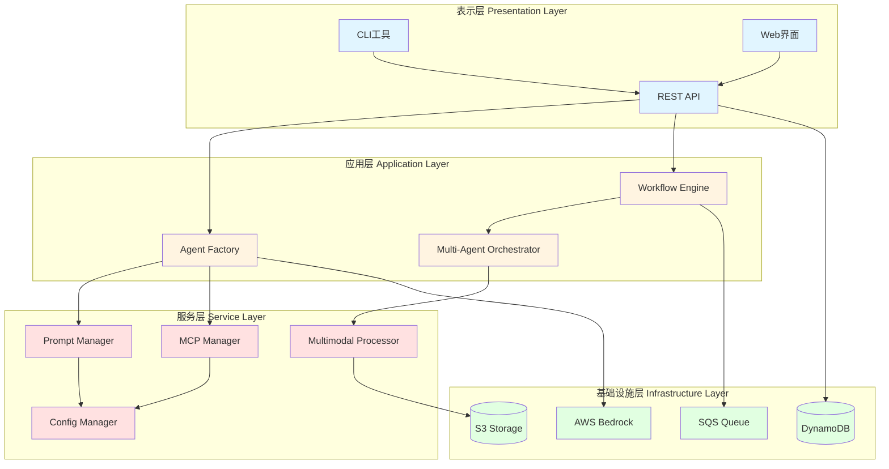

# 系统总览图

**图表名称**: 系统总览图  
**创建日期**: 2026-02-06  
**用途**: 展示Nexus-AI系统的整体架构和主要组件

## 系统总览

## 说明

- **表示层**: 用户交互界面，包括CLI、Web界面和REST API
- **应用层**: 核心业务逻辑，包括Agent创建、工作流编排和多Agent协作
- **服务层**: 支撑服务，包括提示词管理、MCP集成、多模态处理和配置管理
- **基础设施层**: AWS托管服务，包括数据库、队列、存储和AI模型服务
