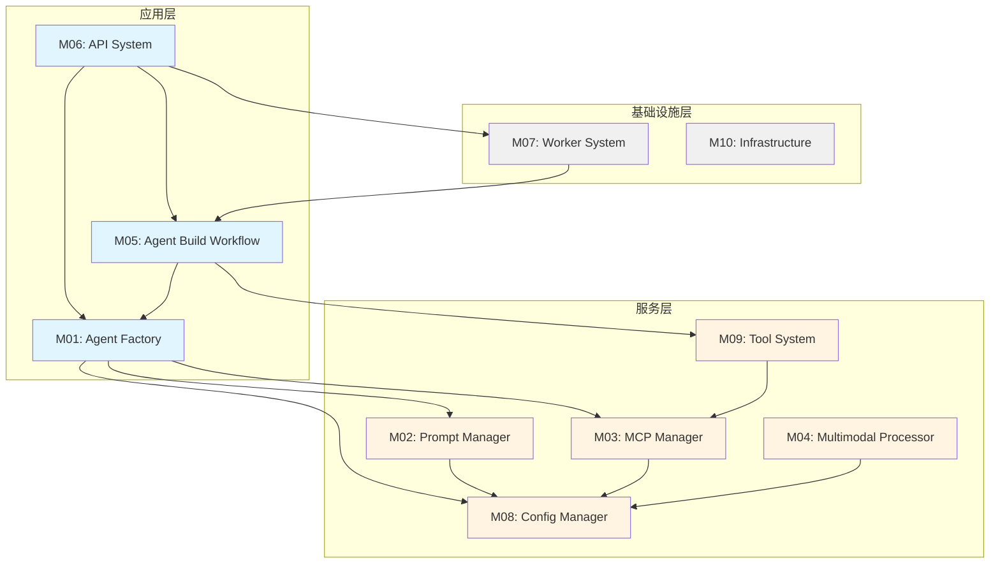

# 模块依赖图

**图表名称**: 模块依赖关系图  
**创建日期**: 2026-02-06  
**用途**: 展示各模块之间的依赖关系

## 模块依赖关系

## 依赖层次

### 深度0 (无依赖)
- M08 Config Manager
- M10 Infrastructure

### 深度1 (依赖深度0)
- M02 Prompt Manager → M08
- M03 MCP Manager → M08
- M04 Multimodal Processor → M08

### 深度2 (依赖深度1)
- M01 Agent Factory → M02, M03, M08
- M09 Tool System → M03

### 深度3 (依赖深度2)
- M05 Agent Build Workflow → M01, M09
- M06 API System → M01, M05, M07

### 深度4 (依赖深度3)
- M07 Worker System → M05
