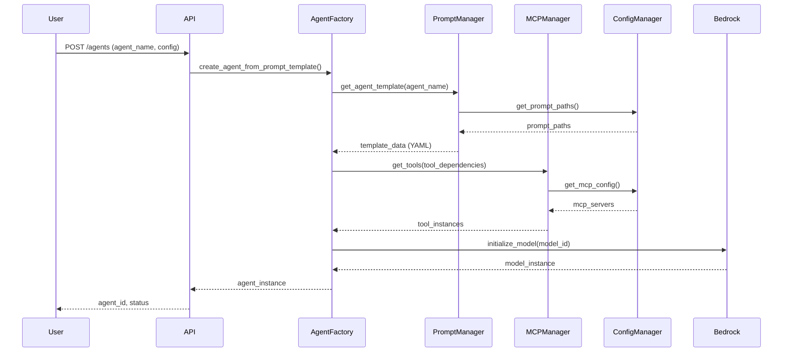
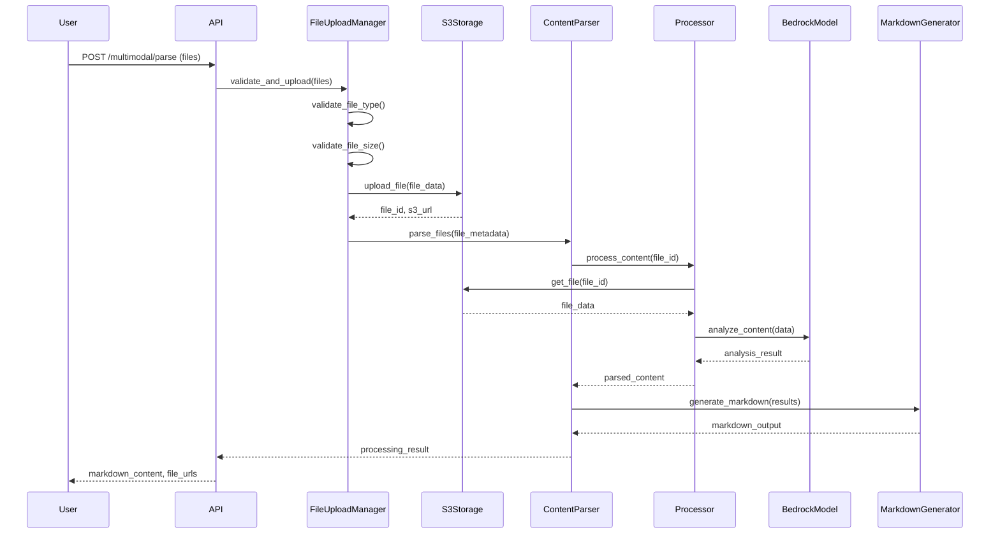
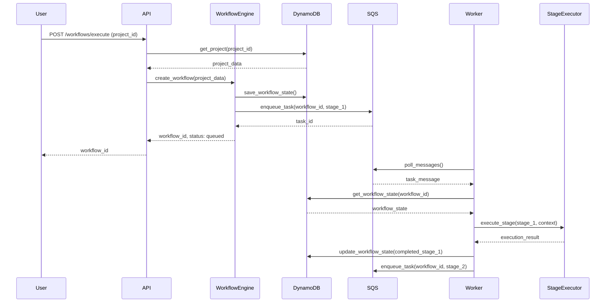

# 数据流图

**图表名称**: 数据流图  
**创建日期**: 2026-02-06  
**用途**: 展示系统中数据的流转过程

## Agent创建数据流

```mermaid
sequenceDiagram
    participant User
    participant API
    participant AgentFactory
    participant PromptManager
    participant MCPManager
    participant ConfigManager
    participant Bedrock
    
    User->>API: POST /agents (agent_name, config)
    API->>AgentFactory: create_agent_from_prompt_template()
    AgentFactory->>PromptManager: get_agent_template(agent_name)
    PromptManager->>ConfigManager: get_prompt_paths()
    ConfigManager-->>PromptManager: prompt_paths
    PromptManager-->>AgentFactory: template_data (YAML)
    
    AgentFactory->>MCPManager: get_tools(tool_dependencies)
    MCPManager->>ConfigManager: get_mcp_config()
    ConfigManager-->>MCPManager: mcp_servers
    MCPManager-->>AgentFactory: tool_instances
    
    AgentFactory->>Bedrock: initialize_model(model_id)
    Bedrock-->>AgentFactory: model_instance
    
    AgentFactory-->>API: agent_instance
    API-->>User: agent_id, status
```

## 多模态处理数据流

```mermaid
sequenceDiagram
    participant User
    participant API
    participant FileUploadManager
    participant S3Storage
    participant ContentParser
    participant Processor
    participant BedrockModel
    participant MarkdownGenerator
    
    User->>API: POST /multimodal/parse (files)
    API->>FileUploadManager: validate_and_upload(files)
    FileUploadManager->>FileUploadManager: validate_file_type()
    FileUploadManager->>FileUploadManager: validate_file_size()
    FileUploadManager->>S3Storage: upload_file(file_data)
    S3Storage-->>FileUploadManager: file_id, s3_url
    
    FileUploadManager->>ContentParser: parse_files(file_metadata)
    ContentParser->>Processor: process_content(file_id)
    Processor->>S3Storage: get_file(file_id)
    S3Storage-->>Processor: file_data
    Processor->>BedrockModel: analyze_content(data)
    BedrockModel-->>Processor: analysis_result
    Processor-->>ContentParser: parsed_content
    
    ContentParser->>MarkdownGenerator: generate_markdown(results)
    MarkdownGenerator-->>ContentParser: markdown_output
    ContentParser-->>API: processing_result
    API-->>User: markdown_content, file_urls
```

## 工作流执行数据流

```mermaid
sequenceDiagram
    participant User
    participant API
    participant WorkflowEngine
    participant DynamoDB
    participant SQS
    participant Worker
    participant StageExecutor
    
    User->>API: POST /workflows/execute (project_id)
    API->>DynamoDB: get_project(project_id)
    DynamoDB-->>API: project_data
    
    API->>WorkflowEngine: create_workflow(project_data)
    WorkflowEngine->>DynamoDB: save_workflow_state()
    
    WorkflowEngine->>SQS: enqueue_task(workflow_id, stage_1)
    SQS-->>WorkflowEngine: task_id
    WorkflowEngine-->>API: workflow_id, status: queued
    API-->>User: workflow_id
    
    Worker->>SQS: poll_messages()
    SQS-->>Worker: task_message
    Worker->>DynamoDB: get_workflow_state(workflow_id)
    DynamoDB-->>Worker: workflow_state
    
    Worker->>StageExecutor: execute_stage(stage_1, context)
    StageExecutor-->>Worker: execution_result
    
    Worker->>DynamoDB: update_workflow_state(completed_stage_1)
    Worker->>SQS: enqueue_task(workflow_id, stage_2)
```
