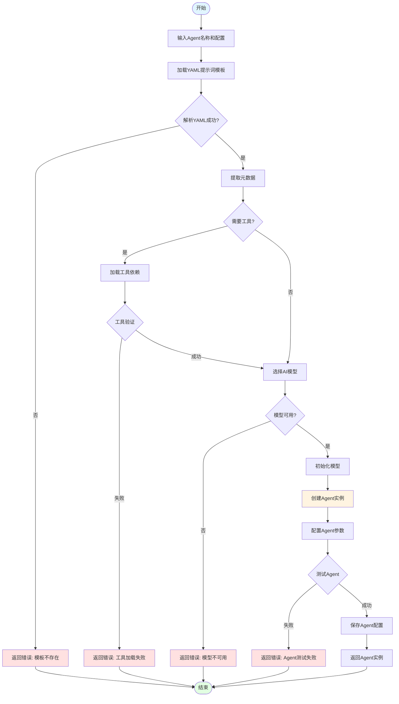
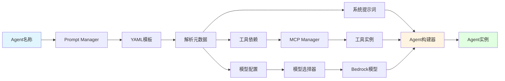
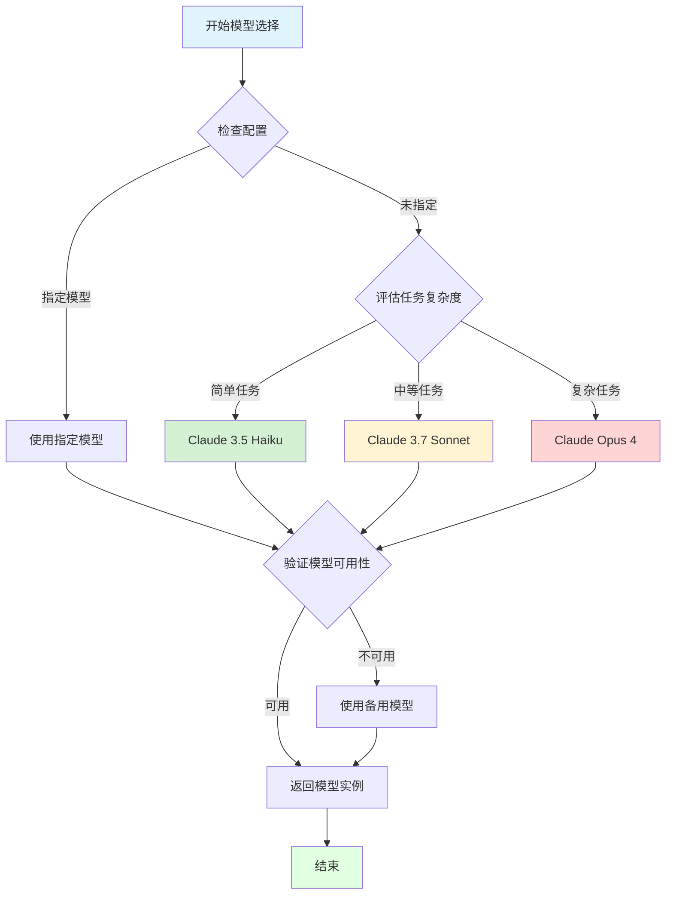

# Agent创建流程图

**图表名称**: Agent创建流程图  
**创建日期**: 2026-02-06  
**用途**: 展示从YAML模板创建Agent的完整流程

## Agent创建流程

```mermaid
flowchart TD
    Start([开始]) --> Input[输入Agent名称和配置]
    Input --> LoadTemplate[加载YAML提示词模板]
    LoadTemplate --> ParseYAML{解析YAML成功?}
    
    ParseYAML -->|否| Error1[返回错误: 模板不存在]
    ParseYAML -->|是| ExtractMeta[提取元数据]
    
    ExtractMeta --> CheckTools{需要工具?}
    CheckTools -->|是| LoadTools[加载工具依赖]
    CheckTools -->|否| SelectModel
    
    LoadTools --> ValidateTools{工具验证}
    ValidateTools -->|失败| Error2[返回错误: 工具加载失败]
    ValidateTools -->|成功| SelectModel[选择AI模型]
    
    SelectModel --> CheckModel{模型可用?}
    CheckModel -->|否| Error3[返回错误: 模型不可用]
    CheckModel -->|是| InitModel[初始化模型]
    
    InitModel --> CreateAgent[创建Agent实例]
    CreateAgent --> ConfigAgent[配置Agent参数]
    ConfigAgent --> TestAgent{测试Agent}
    
    TestAgent -->|失败| Error4[返回错误: Agent测试失败]
    TestAgent -->|成功| SaveAgent[保存Agent配置]
    
    SaveAgent --> ReturnAgent[返回Agent实例]
    ReturnAgent --> End([结束])
    
    Error1 --> End
    Error2 --> End
    Error3 --> End
    Error4 --> End
    
    style Start fill:#e1f5ff
    style End fill:#e1ffe1
    style Error1 fill:#ffe1e1
    style Error2 fill:#ffe1e1
    style Error3 fill:#ffe1e1
    style Error4 fill:#ffe1e1
    style CreateAgent fill:#fff4e1
```

## Agent工厂核心逻辑

```mermaid
graph LR
    A[Agent名称] --> B[Prompt Manager]
    B --> C[YAML模板]
    C --> D[解析元数据]
    D --> E[工具依赖]
    D --> F[模型配置]
    D --> G[系统提示词]
    
    E --> H[MCP Manager]
    H --> I[工具实例]
    
    F --> J[模型选择器]
    J --> K[Bedrock模型]
    
    G --> L[Agent构建器]
    I --> L
    K --> L
    
    L --> M[Agent实例]
    
    style A fill:#e1f5ff
    style M fill:#e1ffe1
    style L fill:#fff4e1
```

## 模型选择策略

```mermaid
graph TD
    Start[开始模型选择] --> CheckConfig{检查配置}
    CheckConfig -->|指定模型| UseSpecified[使用指定模型]
    CheckConfig -->|未指定| CheckComplexity{评估任务复杂度}
    
    CheckComplexity -->|简单任务| Haiku[Claude 3.5 Haiku]
    CheckComplexity -->|中等任务| Sonnet[Claude 3.7 Sonnet]
    CheckComplexity -->|复杂任务| Opus[Claude Opus 4]
    
    UseSpecified --> Validate{验证模型可用性}
    Haiku --> Validate
    Sonnet --> Validate
    Opus --> Validate
    
    Validate -->|可用| Return[返回模型实例]
    Validate -->|不可用| Fallback[使用备用模型]
    Fallback --> Return
    
    Return --> End[结束]
    
    style Start fill:#e1f5ff
    style End fill:#e1ffe1
    style Haiku fill:#d4f1d4
    style Sonnet fill:#fff4d4
    style Opus fill:#ffd4d4
```
