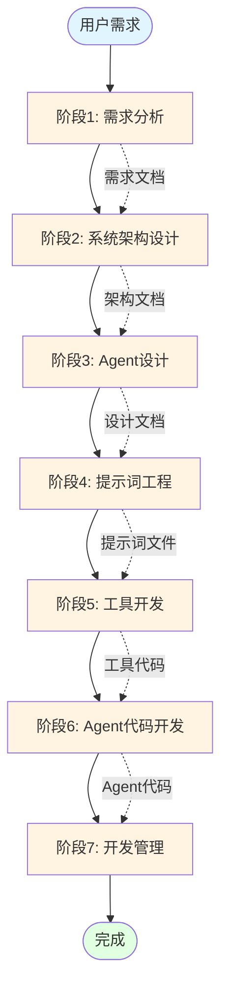
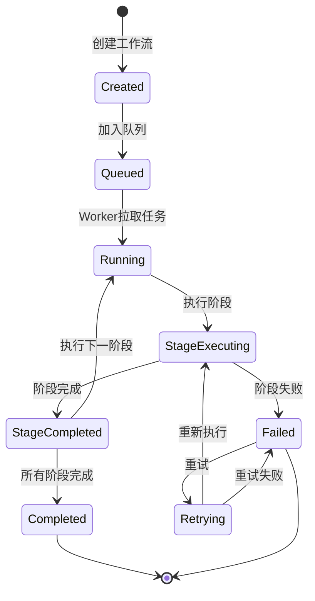
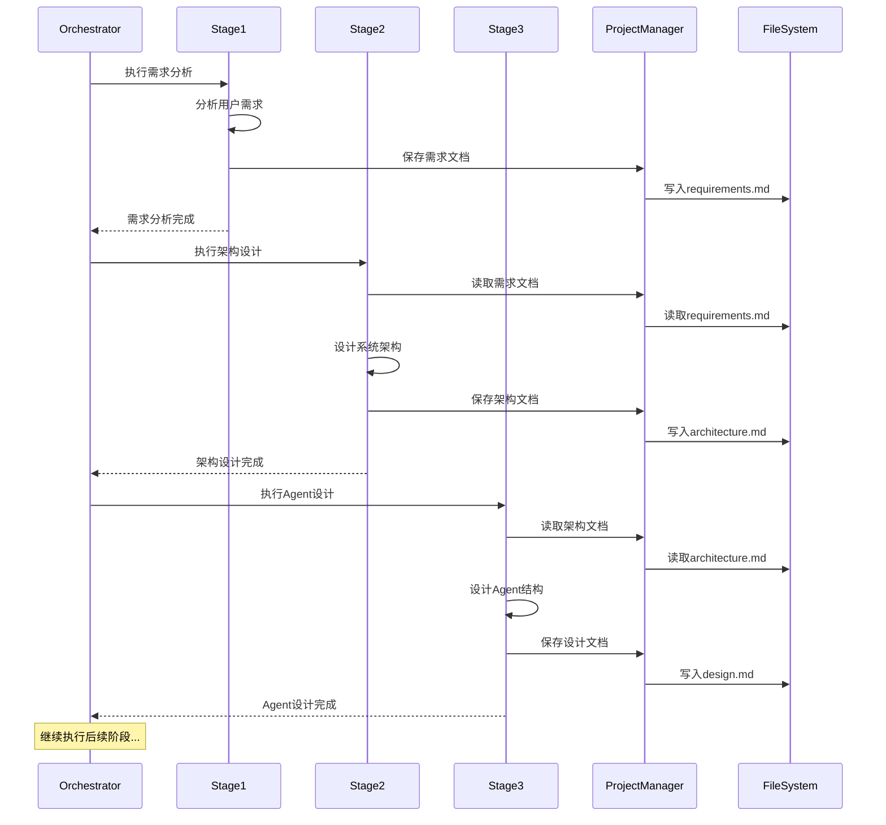
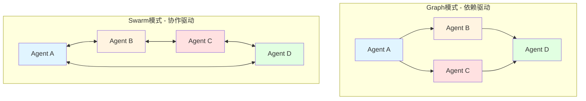

# 工作流编排图

**图表名称**: 工作流编排图  
**创建日期**: 2026-02-06  
**用途**: 展示7阶段Agent构建工作流的编排逻辑

## 7阶段工作流

```mermaid
graph TB
    Start([用户需求]) --> Stage1[阶段1: 需求分析]
    Stage1 --> Stage2[阶段2: 系统架构设计]
    Stage2 --> Stage3[阶段3: Agent设计]
    Stage3 --> Stage4[阶段4: 提示词工程]
    Stage4 --> Stage5[阶段5: 工具开发]
    Stage5 --> Stage6[阶段6: Agent代码开发]
    Stage6 --> Stage7[阶段7: 开发管理]
    Stage7 --> End([完成])
    
    Stage1 -.->|需求文档| Stage2
    Stage2 -.->|架构文档| Stage3
    Stage3 -.->|设计文档| Stage4
    Stage4 -.->|提示词文件| Stage5
    Stage5 -.->|工具代码| Stage6
    Stage6 -.->|Agent代码| Stage7
    
    style Start fill:#e1f5ff
    style End fill:#e1ffe1
    style Stage1 fill:#fff4e1
    style Stage2 fill:#fff4e1
    style Stage3 fill:#fff4e1
    style Stage4 fill:#fff4e1
    style Stage5 fill:#fff4e1
    style Stage6 fill:#fff4e1
    style Stage7 fill:#fff4e1
```

## 工作流状态机

```mermaid
stateDiagram-v2
    [*] --> Created: 创建工作流
    Created --> Queued: 加入队列
    Queued --> Running: Worker拉取任务
    Running --> StageExecuting: 执行阶段
    StageExecuting --> StageCompleted: 阶段完成
    StageCompleted --> Running: 执行下一阶段
    StageCompleted --> Completed: 所有阶段完成
    StageExecuting --> Failed: 阶段失败
    Failed --> Retrying: 重试
    Retrying --> StageExecuting: 重新执行
    Retrying --> Failed: 重试失败
    Completed --> [*]
    Failed --> [*]
```

## 阶段执行详细流程

```mermaid
sequenceDiagram
    participant Orchestrator
    participant Stage1
    participant Stage2
    participant Stage3
    participant ProjectManager
    participant FileSystem
    
    Orchestrator->>Stage1: 执行需求分析
    Stage1->>Stage1: 分析用户需求
    Stage1->>ProjectManager: 保存需求文档
    ProjectManager->>FileSystem: 写入requirements.md
    Stage1-->>Orchestrator: 需求分析完成
    
    Orchestrator->>Stage2: 执行架构设计
    Stage2->>ProjectManager: 读取需求文档
    ProjectManager->>FileSystem: 读取requirements.md
    Stage2->>Stage2: 设计系统架构
    Stage2->>ProjectManager: 保存架构文档
    ProjectManager->>FileSystem: 写入architecture.md
    Stage2-->>Orchestrator: 架构设计完成
    
    Orchestrator->>Stage3: 执行Agent设计
    Stage3->>ProjectManager: 读取架构文档
    ProjectManager->>FileSystem: 读取architecture.md
    Stage3->>Stage3: 设计Agent结构
    Stage3->>ProjectManager: 保存设计文档
    ProjectManager->>FileSystem: 写入design.md
    Stage3-->>Orchestrator: Agent设计完成
    
    Note over Orchestrator: 继续执行后续阶段...
```

## Multi-Agent协作模式

```mermaid
graph TB
    subgraph "Graph模式 - 依赖驱动"
        A1[Agent A] --> B1[Agent B]
        A1 --> C1[Agent C]
        B1 --> D1[Agent D]
        C1 --> D1
    end
    
    subgraph "Swarm模式 - 协作驱动"
        A2[Agent A] <--> B2[Agent B]
        B2 <--> C2[Agent C]
        C2 <--> D2[Agent D]
        D2 <--> A2
    end
    
    style A1 fill:#e1f5ff
    style B1 fill:#fff4e1
    style C1 fill:#ffe1e1
    style D1 fill:#e1ffe1
    style A2 fill:#e1f5ff
    style B2 fill:#fff4e1
    style C2 fill:#ffe1e1
    style D2 fill:#e1ffe1
```
