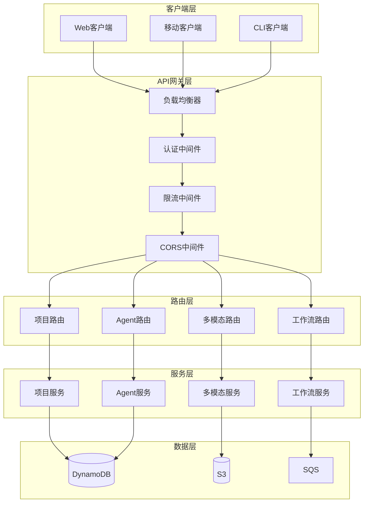
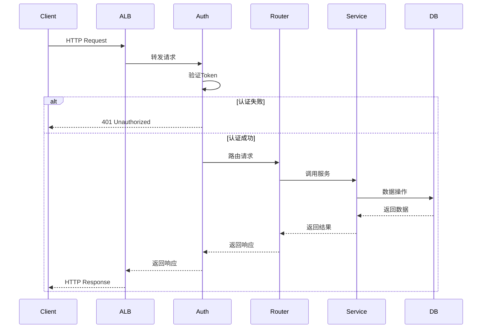
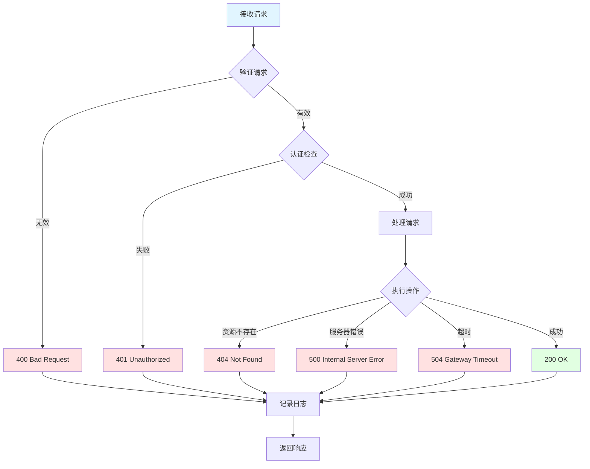

# API架构图

**图表名称**: API架构图  
**创建日期**: 2026-02-06  
**用途**: 展示REST API的架构设计

## API分层架构



## API端点结构

```mermaid
graph LR
    API[/api/v2] --> Projects[/projects]
    API --> Agents[/agents]
    API --> Workflows[/workflows]
    API --> Multimodal[/multimodal]
    API --> Health[/health]
    
    Projects --> P1[GET /projects]
    Projects --> P2[POST /projects]
    Projects --> P3[GET /projects/:id]
    Projects --> P4[PUT /projects/:id]
    Projects --> P5[DELETE /projects/:id]
    
    Agents --> A1[GET /agents]
    Agents --> A2[POST /agents]
    Agents --> A3[GET /agents/:id]
    Agents --> A4[DELETE /agents/:id]
    
    Workflows --> W1[POST /workflows/execute]
    Workflows --> W2[GET /workflows/:id]
    Workflows --> W3[GET /workflows/:id/status]
    
    Multimodal --> M1[POST /multimodal/parse]
    Multimodal --> M2[GET /multimodal/files/:id]
    
    style API fill:#e1f5ff
    style Projects fill:#fff4e1
    style Agents fill:#ffe1e1
    style Workflows fill:#e1ffe1
    style Multimodal fill:#f4e1ff
```

## 请求处理流程



## 错误处理流程


