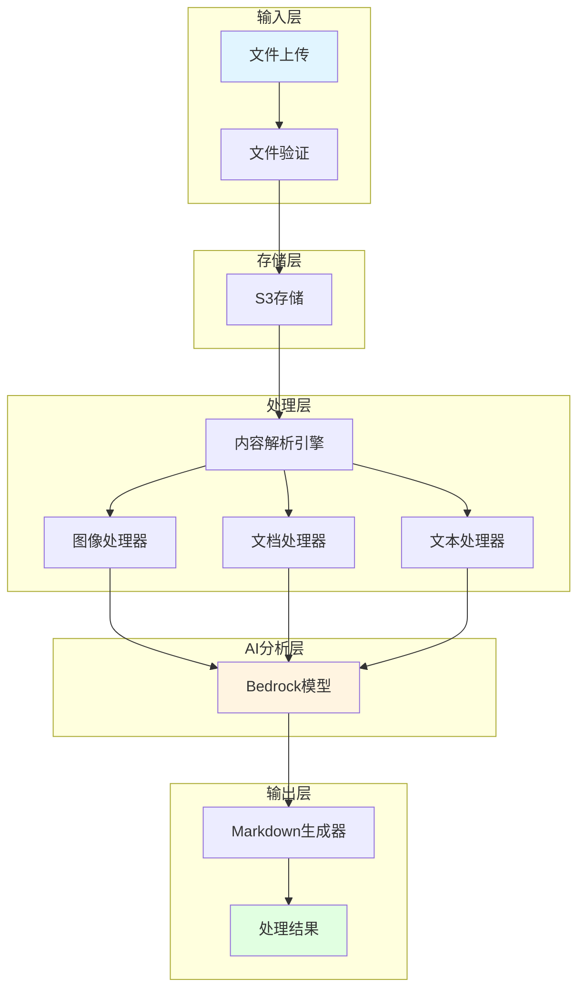
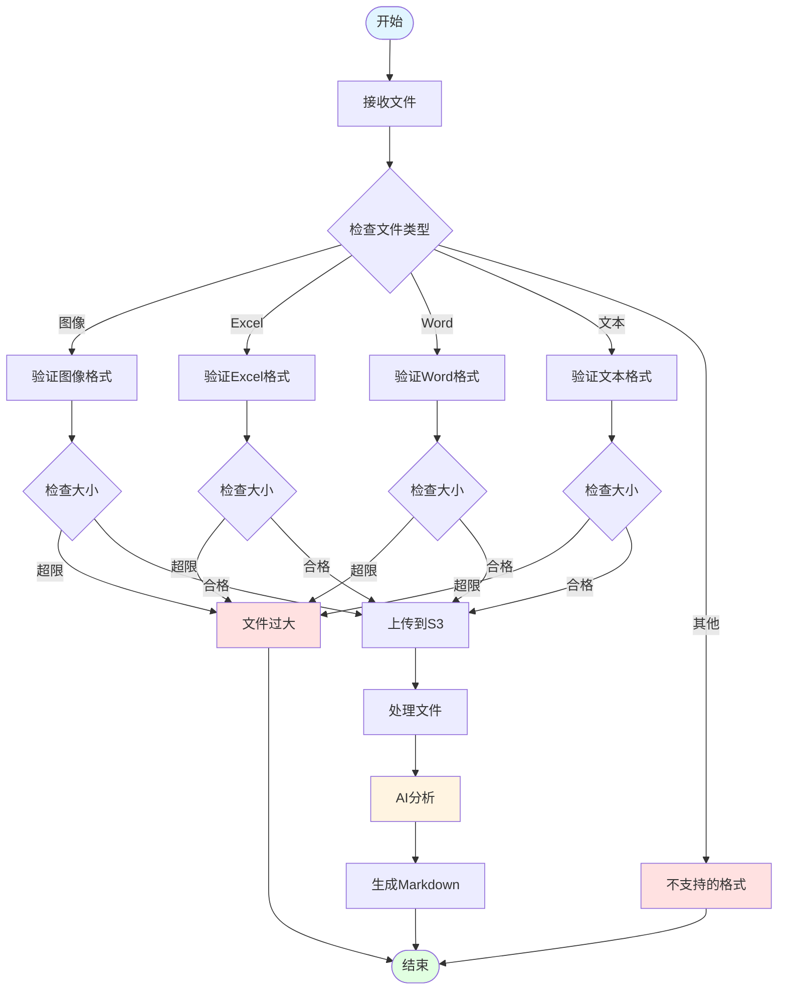
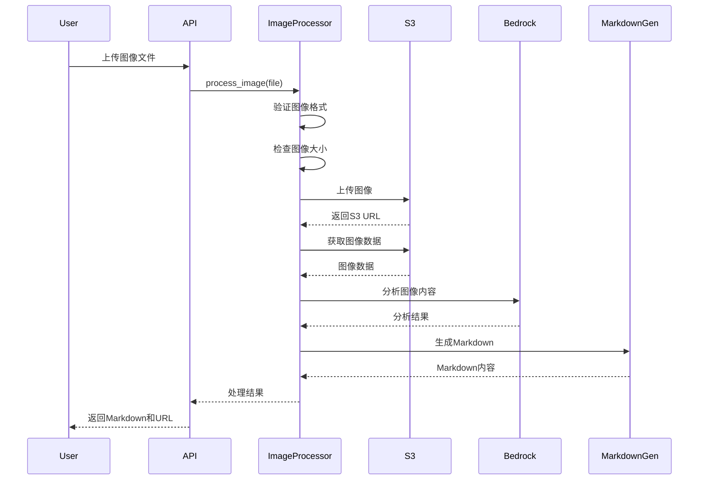
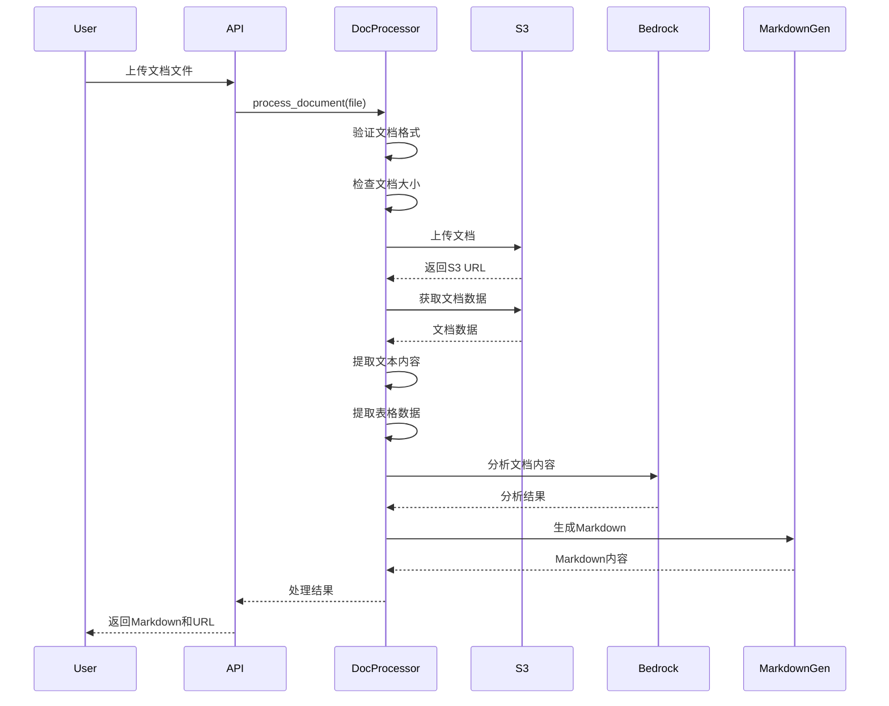
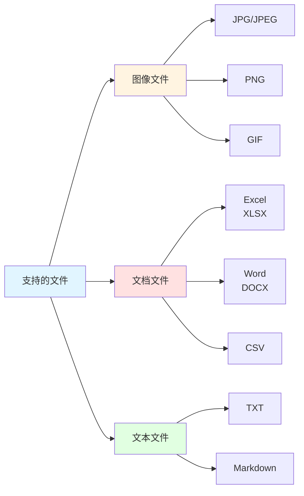

# 多模态处理流程图

**图表名称**: 多模态处理流程图  
**创建日期**: 2026-02-06  
**用途**: 展示多模态内容处理的完整流程

## 多模态处理架构

```mermaid
graph TB
    subgraph "输入层"
        Upload[文件上传]
        Validate[文件验证]
    end
    
    subgraph "存储层"
        S3[S3存储]
    end
    
    subgraph "处理层"
        Parser[内容解析引擎]
        ImageProc[图像处理器]
        DocProc[文档处理器]
        TextProc[文本处理器]
    end
    
    subgraph "AI分析层"
        BedrockModel[Bedrock模型]
    end
    
    subgraph "输出层"
        MarkdownGen[Markdown生成器]
        Result[处理结果]
    end
    
    Upload --> Validate
    Validate --> S3
    S3 --> Parser
    
    Parser --> ImageProc
    Parser --> DocProc
    Parser --> TextProc
    
    ImageProc --> BedrockModel
    DocProc --> BedrockModel
    TextProc --> BedrockModel
    
    BedrockModel --> MarkdownGen
    MarkdownGen --> Result
    
    style Upload fill:#e1f5ff
    style Result fill:#e1ffe1
    style BedrockModel fill:#fff4e1
```

## 文件处理流程

```mermaid
flowchart TD
    Start([开始]) --> Receive[接收文件]
    Receive --> CheckType{检查文件类型}
    
    CheckType -->|图像| ValidateImage[验证图像格式]
    CheckType -->|Excel| ValidateExcel[验证Excel格式]
    CheckType -->|Word| ValidateWord[验证Word格式]
    CheckType -->|文本| ValidateText[验证文本格式]
    CheckType -->|其他| Error1[不支持的格式]
    
    ValidateImage --> CheckSize1{检查大小}
    ValidateExcel --> CheckSize2{检查大小}
    ValidateWord --> CheckSize3{检查大小}
    ValidateText --> CheckSize4{检查大小}
    
    CheckSize1 -->|超限| Error2[文件过大]
    CheckSize2 -->|超限| Error2
    CheckSize3 -->|超限| Error2
    CheckSize4 -->|超限| Error2
    
    CheckSize1 -->|合格| UploadS3[上传到S3]
    CheckSize2 -->|合格| UploadS3
    CheckSize3 -->|合格| UploadS3
    CheckSize4 -->|合格| UploadS3
    
    UploadS3 --> Process[处理文件]
    Process --> AIAnalysis[AI分析]
    AIAnalysis --> Generate[生成Markdown]
    Generate --> End([结束])
    
    Error1 --> End
    Error2 --> End
    
    style Start fill:#e1f5ff
    style End fill:#e1ffe1
    style Error1 fill:#ffe1e1
    style Error2 fill:#ffe1e1
    style AIAnalysis fill:#fff4e1
```

## 图像处理流程

```mermaid
sequenceDiagram
    participant User
    participant API
    participant ImageProcessor
    participant S3
    participant Bedrock
    participant MarkdownGen
    
    User->>API: 上传图像文件
    API->>ImageProcessor: process_image(file)
    ImageProcessor->>ImageProcessor: 验证图像格式
    ImageProcessor->>ImageProcessor: 检查图像大小
    ImageProcessor->>S3: 上传图像
    S3-->>ImageProcessor: 返回S3 URL
    
    ImageProcessor->>S3: 获取图像数据
    S3-->>ImageProcessor: 图像数据
    ImageProcessor->>Bedrock: 分析图像内容
    Bedrock-->>ImageProcessor: 分析结果
    
    ImageProcessor->>MarkdownGen: 生成Markdown
    MarkdownGen-->>ImageProcessor: Markdown内容
    ImageProcessor-->>API: 处理结果
    API-->>User: 返回Markdown和URL
```

## 文档处理流程

```mermaid
sequenceDiagram
    participant User
    participant API
    participant DocProcessor
    participant S3
    participant Bedrock
    participant MarkdownGen
    
    User->>API: 上传文档文件
    API->>DocProcessor: process_document(file)
    DocProcessor->>DocProcessor: 验证文档格式
    DocProcessor->>DocProcessor: 检查文档大小
    DocProcessor->>S3: 上传文档
    S3-->>DocProcessor: 返回S3 URL
    
    DocProcessor->>S3: 获取文档数据
    S3-->>DocProcessor: 文档数据
    DocProcessor->>DocProcessor: 提取文本内容
    DocProcessor->>DocProcessor: 提取表格数据
    DocProcessor->>Bedrock: 分析文档内容
    Bedrock-->>DocProcessor: 分析结果
    
    DocProcessor->>MarkdownGen: 生成Markdown
    MarkdownGen-->>DocProcessor: Markdown内容
    DocProcessor-->>API: 处理结果
    API-->>User: 返回Markdown和URL
```

## 支持的文件类型

```mermaid
graph LR
    Files[支持的文件] --> Images[图像文件]
    Files --> Docs[文档文件]
    Files --> Text[文本文件]
    
    Images --> JPG[JPG/JPEG]
    Images --> PNG[PNG]
    Images --> GIF[GIF]
    
    Docs --> Excel[Excel<br/>XLSX]
    Docs --> Word[Word<br/>DOCX]
    Docs --> CSV[CSV]
    
    Text --> TXT[TXT]
    Text --> MD[Markdown]
    
    style Files fill:#e1f5ff
    style Images fill:#fff4e1
    style Docs fill:#ffe1e1
    style Text fill:#e1ffe1
```
