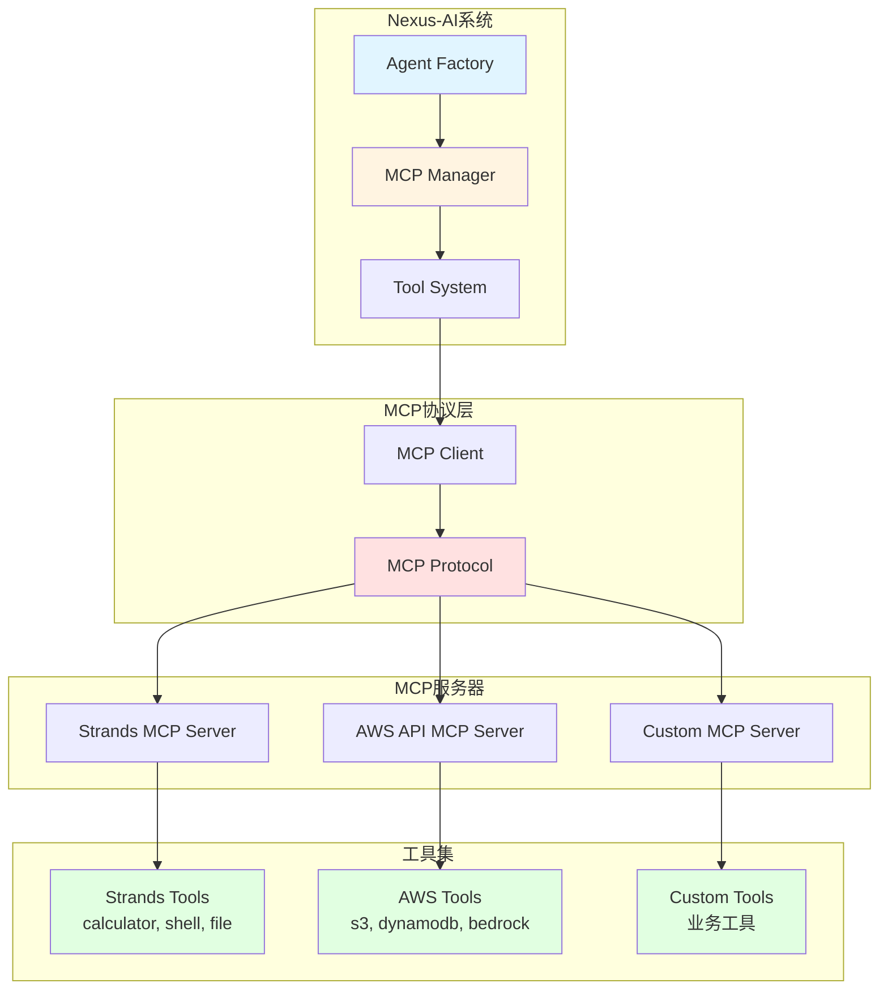
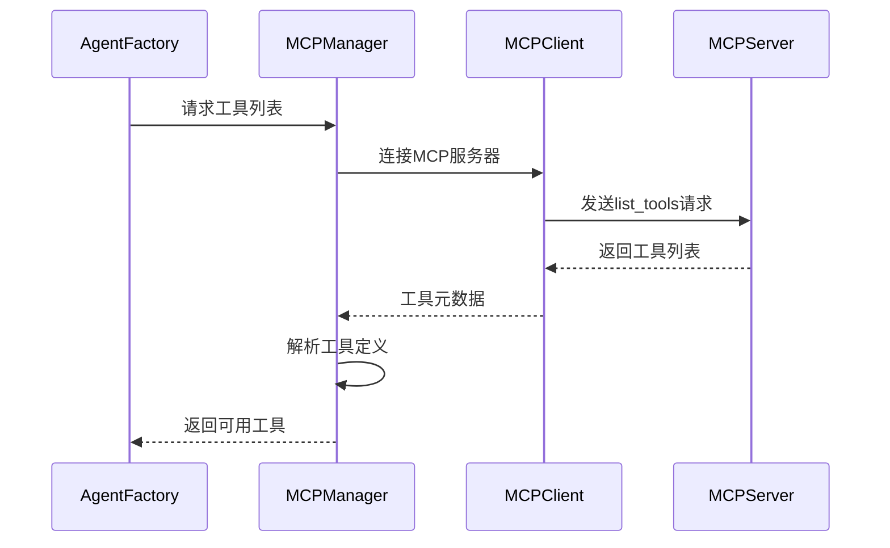
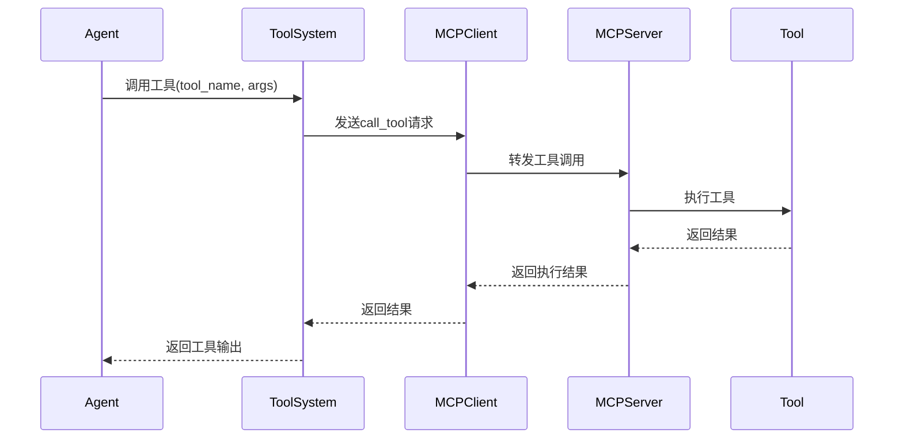
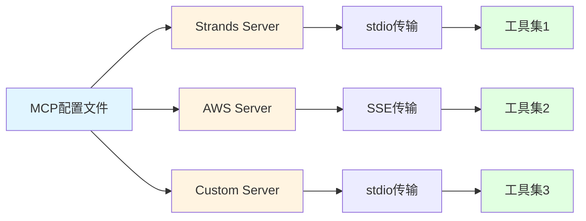
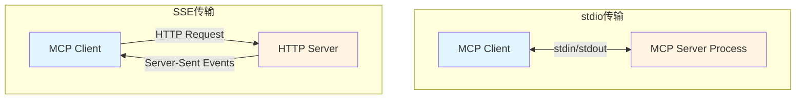
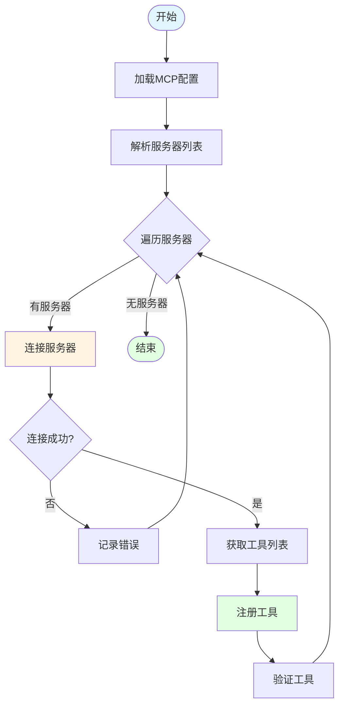

# MCP集成图

**图表名称**: MCP集成架构图  
**创建日期**: 2026-02-06  
**用途**: 展示MCP (Model Context Protocol) 集成架构

## MCP集成架构

```mermaid
graph TB
    subgraph "Nexus-AI系统"
        AgentFactory[Agent Factory]
        MCPManager[MCP Manager]
        ToolSystem[Tool System]
    end
    
    subgraph "MCP协议层"
        MCPClient[MCP Client]
        MCPProtocol[MCP Protocol]
    end
    
    subgraph "MCP服务器"
        StrandsServer[Strands MCP Server]
        AWSServer[AWS API MCP Server]
        CustomServer[Custom MCP Server]
    end
    
    subgraph "工具集"
        StrandsTools[Strands Tools<br/>calculator, shell, file]
        AWSTools[AWS Tools<br/>s3, dynamodb, bedrock]
        CustomTools[Custom Tools<br/>业务工具]
    end
    
    AgentFactory --> MCPManager
    MCPManager --> ToolSystem
    ToolSystem --> MCPClient
    MCPClient --> MCPProtocol
    
    MCPProtocol --> StrandsServer
    MCPProtocol --> AWSServer
    MCPProtocol --> CustomServer
    
    StrandsServer --> StrandsTools
    AWSServer --> AWSTools
    CustomServer --> CustomTools
    
    style AgentFactory fill:#e1f5ff
    style MCPManager fill:#fff4e1
    style MCPProtocol fill:#ffe1e1
    style StrandsTools fill:#e1ffe1
    style AWSTools fill:#e1ffe1
    style CustomTools fill:#e1ffe1
```

## MCP工具发现流程

```mermaid
sequenceDiagram
    participant AgentFactory
    participant MCPManager
    participant MCPClient
    participant MCPServer
    
    AgentFactory->>MCPManager: 请求工具列表
    MCPManager->>MCPClient: 连接MCP服务器
    MCPClient->>MCPServer: 发送list_tools请求
    MCPServer-->>MCPClient: 返回工具列表
    MCPClient-->>MCPManager: 工具元数据
    MCPManager->>MCPManager: 解析工具定义
    MCPManager-->>AgentFactory: 返回可用工具
```

## MCP工具调用流程

```mermaid
sequenceDiagram
    participant Agent
    participant ToolSystem
    participant MCPClient
    participant MCPServer
    participant Tool
    
    Agent->>ToolSystem: 调用工具(tool_name, args)
    ToolSystem->>MCPClient: 发送call_tool请求
    MCPClient->>MCPServer: 转发工具调用
    MCPServer->>Tool: 执行工具
    Tool-->>MCPServer: 返回结果
    MCPServer-->>MCPClient: 返回执行结果
    MCPClient-->>ToolSystem: 返回结果
    ToolSystem-->>Agent: 返回工具输出
```

## MCP服务器配置

```mermaid
graph LR
    Config[MCP配置文件] --> Server1[Strands Server]
    Config --> Server2[AWS Server]
    Config --> Server3[Custom Server]
    
    Server1 --> Transport1[stdio传输]
    Server2 --> Transport2[SSE传输]
    Server3 --> Transport3[stdio传输]
    
    Transport1 --> Tools1[工具集1]
    Transport2 --> Tools2[工具集2]
    Transport3 --> Tools3[工具集3]
    
    style Config fill:#e1f5ff
    style Server1 fill:#fff4e1
    style Server2 fill:#fff4e1
    style Server3 fill:#fff4e1
    style Tools1 fill:#e1ffe1
    style Tools2 fill:#e1ffe1
    style Tools3 fill:#e1ffe1
```

## MCP传输方式

```mermaid
graph TB
    subgraph "stdio传输"
        StdioClient[MCP Client]
        StdioServer[MCP Server Process]
        StdioClient <-->|stdin/stdout| StdioServer
    end
    
    subgraph "SSE传输"
        SSEClient[MCP Client]
        SSEServer[HTTP Server]
        SSEClient -->|HTTP Request| SSEServer
        SSEServer -->|Server-Sent Events| SSEClient
    end
    
    style StdioClient fill:#e1f5ff
    style StdioServer fill:#fff4e1
    style SSEClient fill:#e1f5ff
    style SSEServer fill:#fff4e1
```

## 工具注册流程

```mermaid
flowchart TD
    Start([开始]) --> LoadConfig[加载MCP配置]
    LoadConfig --> ParseServers[解析服务器列表]
    ParseServers --> ConnectLoop{遍历服务器}
    
    ConnectLoop -->|有服务器| Connect[连接服务器]
    ConnectLoop -->|无服务器| End([结束])
    
    Connect --> CheckConnection{连接成功?}
    CheckConnection -->|否| LogError[记录错误]
    CheckConnection -->|是| ListTools[获取工具列表]
    
    ListTools --> RegisterTools[注册工具]
    RegisterTools --> ValidateTools[验证工具]
    ValidateTools --> ConnectLoop
    
    LogError --> ConnectLoop
    
    style Start fill:#e1f5ff
    style End fill:#e1ffe1
    style Connect fill:#fff4e1
    style RegisterTools fill:#e1ffe1
```
