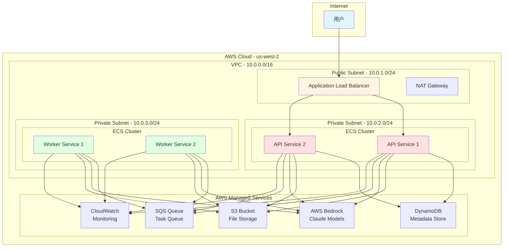
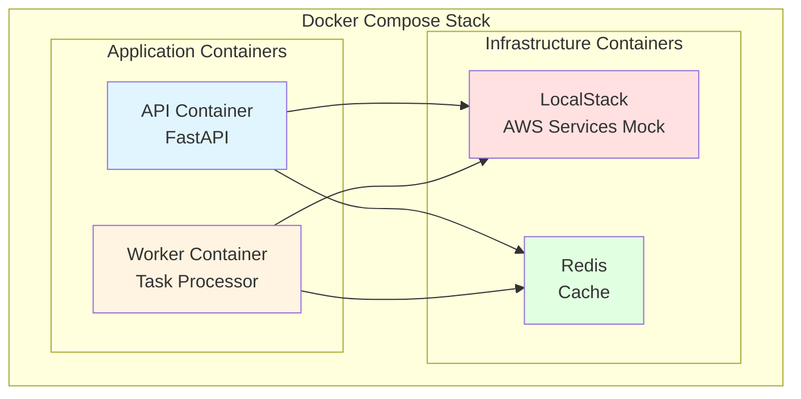
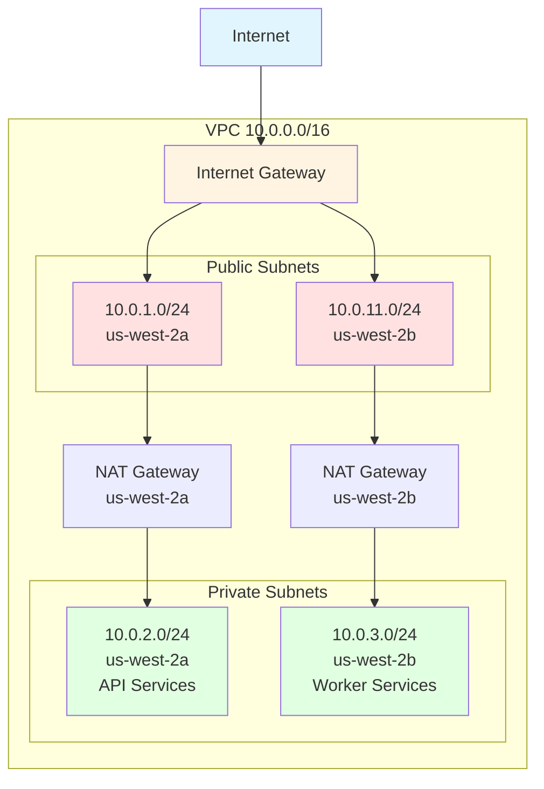
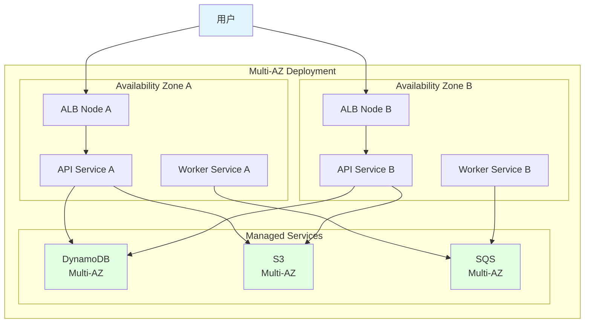
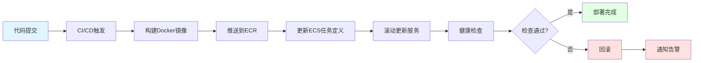

# 部署架构图

**图表名称**: 部署架构图  
**创建日期**: 2026-02-06  
**用途**: 展示AWS云部署架构

## AWS云部署拓扑

```mermaid
graph TB
    subgraph "Internet"
        Users[用户]
    end
    
    subgraph "AWS Cloud - us-west-2"
        subgraph "VPC - 10.0.0.0/16"
            subgraph "Public Subnet - 10.0.1.0/24"
                ALB[Application Load Balancer]
                NAT[NAT Gateway]
            end
            
            subgraph "Private Subnet - 10.0.2.0/24"
                subgraph "ECS Cluster"
                    API1[API Service 1]
                    API2[API Service 2]
                end
            end
            
            subgraph "Private Subnet - 10.0.3.0/24"
                subgraph "ECS Cluster"
                    Worker1[Worker Service 1]
                    Worker2[Worker Service 2]
                end
            end
        end
        
        subgraph "AWS Managed Services"
            Bedrock[AWS Bedrock<br/>Claude Models]
            S3[S3 Bucket<br/>File Storage]
            DynamoDB[DynamoDB<br/>Metadata Store]
            SQS[SQS Queue<br/>Task Queue]
            CloudWatch[CloudWatch<br/>Monitoring]
        end
    end
    
    Users --> ALB
    ALB --> API1
    ALB --> API2
    API1 --> DynamoDB
    API2 --> DynamoDB
    API1 --> S3
    API2 --> S3
    API1 --> Bedrock
    API2 --> Bedrock
    API1 --> SQS
    API2 --> SQS
    Worker1 --> SQS
    Worker2 --> SQS
    Worker1 --> Bedrock
    Worker2 --> Bedrock
    Worker1 --> S3
    Worker2 --> S3
    API1 --> CloudWatch
    API2 --> CloudWatch
    Worker1 --> CloudWatch
    Worker2 --> CloudWatch
    
    style Users fill:#e1f5ff
    style ALB fill:#fff4e1
    style API1 fill:#ffe1e1
    style API2 fill:#ffe1e1
    style Worker1 fill:#e1ffe1
    style Worker2 fill:#e1ffe1
```

## 容器化部署架构

```mermaid
graph TB
    subgraph "Docker Compose Stack"
        subgraph "Application Containers"
            API[API Container<br/>FastAPI]
            Worker[Worker Container<br/>Task Processor]
        end
        
        subgraph "Infrastructure Containers"
            LocalStack[LocalStack<br/>AWS Services Mock]
            Redis[Redis<br/>Cache]
        end
    end
    
    API --> LocalStack
    Worker --> LocalStack
    API --> Redis
    Worker --> Redis
    
    style API fill:#e1f5ff
    style Worker fill:#fff4e1
    style LocalStack fill:#ffe1e1
    style Redis fill:#e1ffe1
```

## 网络架构

```mermaid
graph TB
    subgraph "VPC 10.0.0.0/16"
        subgraph "Public Subnets"
            PubSub1[10.0.1.0/24<br/>us-west-2a]
            PubSub2[10.0.11.0/24<br/>us-west-2b]
        end
        
        subgraph "Private Subnets"
            PrivSub1[10.0.2.0/24<br/>us-west-2a<br/>API Services]
            PrivSub2[10.0.3.0/24<br/>us-west-2b<br/>Worker Services]
        end
        
        IGW[Internet Gateway]
        NAT1[NAT Gateway<br/>us-west-2a]
        NAT2[NAT Gateway<br/>us-west-2b]
    end
    
    Internet[Internet] --> IGW
    IGW --> PubSub1
    IGW --> PubSub2
    PubSub1 --> NAT1
    PubSub2 --> NAT2
    NAT1 --> PrivSub1
    NAT2 --> PrivSub2
    
    style Internet fill:#e1f5ff
    style IGW fill:#fff4e1
    style PubSub1 fill:#ffe1e1
    style PubSub2 fill:#ffe1e1
    style PrivSub1 fill:#e1ffe1
    style PrivSub2 fill:#e1ffe1
```

## 高可用性架构

```mermaid
graph TB
    subgraph "Multi-AZ Deployment"
        subgraph "Availability Zone A"
            ALB_A[ALB Node A]
            API_A[API Service A]
            Worker_A[Worker Service A]
        end
        
        subgraph "Availability Zone B"
            ALB_B[ALB Node B]
            API_B[API Service B]
            Worker_B[Worker Service B]
        end
        
        subgraph "Managed Services"
            DDB[DynamoDB<br/>Multi-AZ]
            S3_Service[S3<br/>Multi-AZ]
            SQS_Service[SQS<br/>Multi-AZ]
        end
    end
    
    Users[用户] --> ALB_A
    Users --> ALB_B
    ALB_A --> API_A
    ALB_B --> API_B
    API_A --> DDB
    API_B --> DDB
    API_A --> S3_Service
    API_B --> S3_Service
    Worker_A --> SQS_Service
    Worker_B --> SQS_Service
    
    style Users fill:#e1f5ff
    style DDB fill:#e1ffe1
    style S3_Service fill:#e1ffe1
    style SQS_Service fill:#e1ffe1
```

## CI/CD部署流程

```mermaid
graph LR
    A[代码提交] --> B[CI/CD触发]
    B --> C[构建Docker镜像]
    C --> D[推送到ECR]
    D --> E[更新ECS任务定义]
    E --> F[滚动更新服务]
    F --> G[健康检查]
    G --> H{检查通过?}
    H -->|是| I[部署完成]
    H -->|否| J[回滚]
    J --> K[通知告警]
    
    style A fill:#e1f5ff
    style I fill:#e1ffe1
    style J fill:#ffe1e1
    style K fill:#ffe1e1
```
