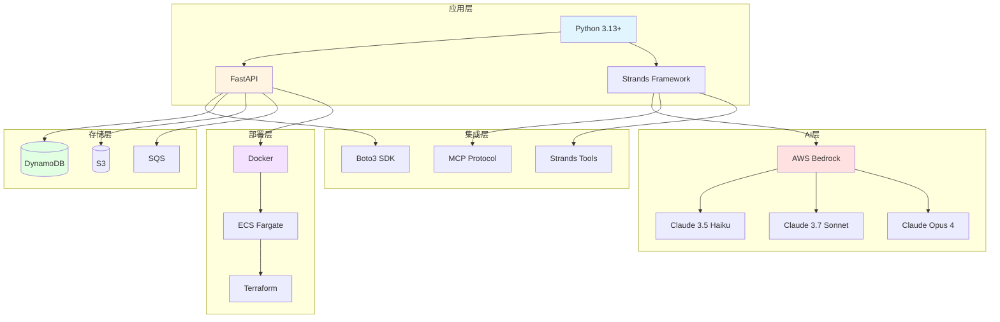
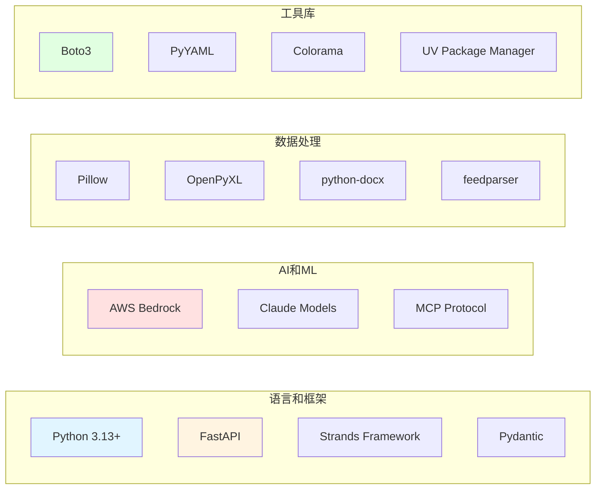
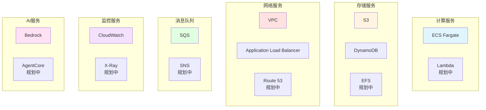
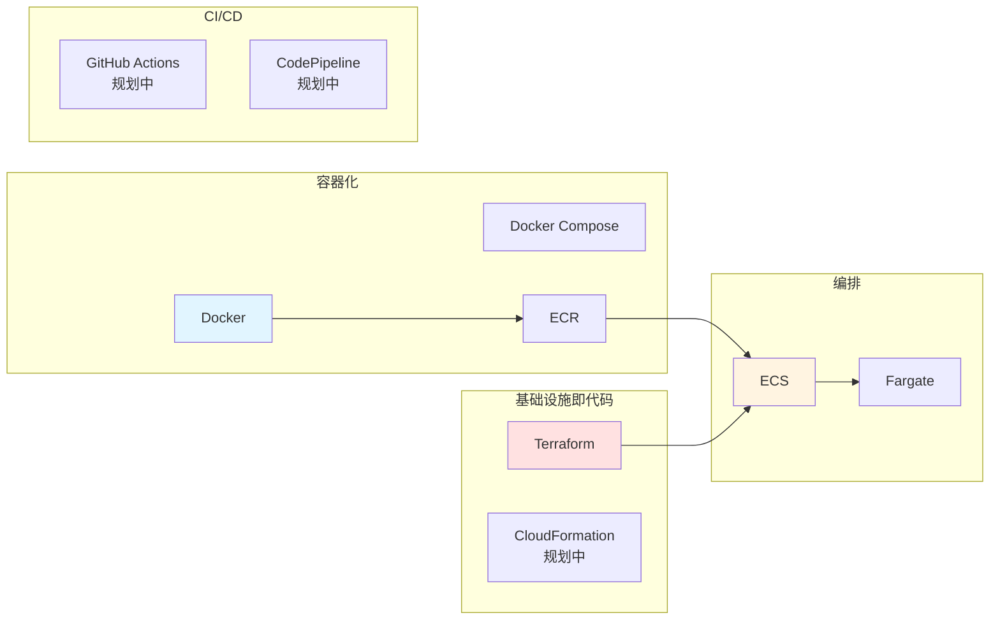
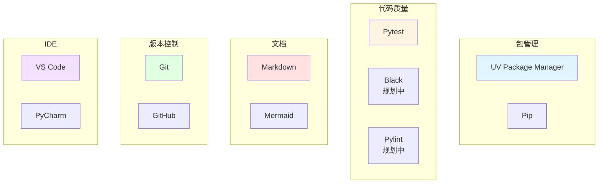

# 技术栈图

**图表名称**: 技术栈图  
**创建日期**: 2026-02-06  
**用途**: 展示系统使用的技术栈

## 技术栈总览

```mermaid
graph TB
    subgraph "应用层"
        FastAPI[FastAPI]
        Strands[Strands Framework]
        Python[Python 3.13+]
    end
    
    subgraph "AI层"
        Bedrock[AWS Bedrock]
        Haiku[Claude 3.5 Haiku]
        Sonnet[Claude 3.7 Sonnet]
        Opus[Claude Opus 4]
    end
    
    subgraph "存储层"
        DynamoDB[(DynamoDB)]
        S3[(S3)]
        SQS[SQS]
    end
    
    subgraph "集成层"
        MCP[MCP Protocol]
        StrandsTools[Strands Tools]
        Boto3[Boto3 SDK]
    end
    
    subgraph "部署层"
        Docker[Docker]
        ECS[ECS Fargate]
        Terraform[Terraform]
    end
    
    Python --> FastAPI
    Python --> Strands
    FastAPI --> Boto3
    Strands --> Bedrock
    Bedrock --> Haiku
    Bedrock --> Sonnet
    Bedrock --> Opus
    FastAPI --> DynamoDB
    FastAPI --> S3
    FastAPI --> SQS
    Strands --> MCP
    Strands --> StrandsTools
    FastAPI --> Docker
    Docker --> ECS
    ECS --> Terraform
    
    style Python fill:#e1f5ff
    style FastAPI fill:#fff4e1
    style Bedrock fill:#ffe1e1
    style DynamoDB fill:#e1ffe1
    style Docker fill:#f4e1ff
```

## 开发技术栈

```mermaid
graph LR
    subgraph "语言和框架"
        Python[Python 3.13+]
        FastAPI[FastAPI]
        Strands[Strands Framework]
        Pydantic[Pydantic]
    end
    
    subgraph "AI和ML"
        Bedrock[AWS Bedrock]
        Claude[Claude Models]
        MCP[MCP Protocol]
    end
    
    subgraph "数据处理"
        PIL[Pillow]
        OpenPyXL[OpenPyXL]
        DocX[python-docx]
        Feedparser[feedparser]
    end
    
    subgraph "工具库"
        Boto3[Boto3]
        PyYAML[PyYAML]
        Colorama[Colorama]
        UV[UV Package Manager]
    end
    
    style Python fill:#e1f5ff
    style FastAPI fill:#fff4e1
    style Bedrock fill:#ffe1e1
    style Boto3 fill:#e1ffe1
```

## 基础设施技术栈

```mermaid
graph TB
    subgraph "计算服务"
        ECS[ECS Fargate]
        Lambda[Lambda<br/>规划中]
    end
    
    subgraph "存储服务"
        S3[S3]
        DynamoDB[DynamoDB]
        EFS[EFS<br/>规划中]
    end
    
    subgraph "网络服务"
        VPC[VPC]
        ALB[Application Load Balancer]
        Route53[Route 53<br/>规划中]
    end
    
    subgraph "消息队列"
        SQS[SQS]
        SNS[SNS<br/>规划中]
    end
    
    subgraph "监控服务"
        CloudWatch[CloudWatch]
        XRay[X-Ray<br/>规划中]
    end
    
    subgraph "AI服务"
        Bedrock[Bedrock]
        AgentCore[AgentCore<br/>规划中]
    end
    
    style ECS fill:#e1f5ff
    style S3 fill:#fff4e1
    style VPC fill:#ffe1e1
    style SQS fill:#e1ffe1
    style CloudWatch fill:#f4e1ff
    style Bedrock fill:#ffe1f4
```

## 部署技术栈

```mermaid
graph LR
    subgraph "容器化"
        Docker[Docker]
        DockerCompose[Docker Compose]
        ECR[ECR]
    end
    
    subgraph "编排"
        ECS[ECS]
        Fargate[Fargate]
    end
    
    subgraph "基础设施即代码"
        Terraform[Terraform]
        CloudFormation[CloudFormation<br/>规划中]
    end
    
    subgraph "CI/CD"
        GitHub[GitHub Actions<br/>规划中]
        CodePipeline[CodePipeline<br/>规划中]
    end
    
    Docker --> ECR
    ECR --> ECS
    ECS --> Fargate
    Terraform --> ECS
    
    style Docker fill:#e1f5ff
    style ECS fill:#fff4e1
    style Terraform fill:#ffe1e1
```

## 开发工具栈

```mermaid
graph TB
    subgraph "包管理"
        UV[UV Package Manager]
        Pip[Pip]
    end
    
    subgraph "代码质量"
        Pytest[Pytest]
        Black[Black<br/>规划中]
        Pylint[Pylint<br/>规划中]
    end
    
    subgraph "文档"
        Markdown[Markdown]
        Mermaid[Mermaid]
    end
    
    subgraph "版本控制"
        Git[Git]
        GitHub[GitHub]
    end
    
    subgraph "IDE"
        VSCode[VS Code]
        PyCharm[PyCharm]
    end
    
    style UV fill:#e1f5ff
    style Pytest fill:#fff4e1
    style Markdown fill:#ffe1e1
    style Git fill:#e1ffe1
    style VSCode fill:#f4e1ff
```
