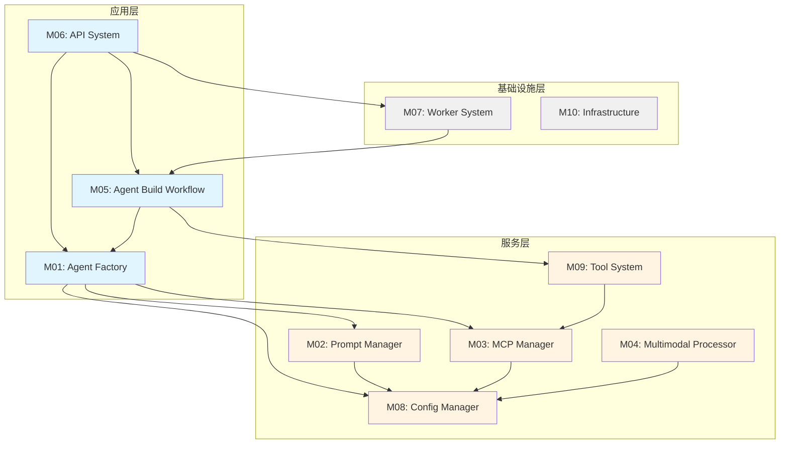

# 模块依赖关系

**创建日期**: 2026-02-05  
**最后更新**: 2026-02-06  
**文档版本**: 2.0  
**状态**: 已完成

## 1. 依赖关系概述

本文档详细描述Nexus-AI系统各模块之间的依赖关系，包括直接依赖、间接依赖、循环依赖检测等内容。理解模块依赖关系对于系统维护、重构和扩展至关重要。

### 1.1 依赖类型

- **直接依赖**: 模块A直接导入和使用模块B的功能
- **间接依赖**: 模块A通过模块B间接使用模块C的功能
- **可选依赖**: 模块在特定场景下才需要的依赖
- **循环依赖**: 两个或多个模块相互依赖（需要避免）

### 1.2 依赖层次

系统采用分层架构，依赖关系遵循以下原则：
- 上层可以依赖下层，下层不能依赖上层
- 同层模块之间尽量减少依赖
- 核心模块应该被依赖，而不是依赖其他模块

## 2. 模块依赖图

### 2.1 整体依赖关系



### 2.2 核心依赖链

#### 依赖链1: API → Agent Factory → Config Manager
```
API System (M06)
  ↓ 调用Agent创建接口
Agent Factory (M01)
  ↓ 加载配置
Config Manager (M08)
```

#### 依赖链2: Agent Factory → Prompt Manager → Config Manager
```
Agent Factory (M01)
  ↓ 获取提示词模板
Prompt Manager (M02)
  ↓ 读取配置路径
Config Manager (M08)
```

#### 依赖链3: Agent Factory → MCP Manager → Config Manager
```
Agent Factory (M01)
  ↓ 集成MCP工具
MCP Manager (M03)
  ↓ 读取MCP配置
Config Manager (M08)
```

#### 依赖链4: Workflow → Multi-Agent → Multimodal Processor
```
Agent Build Workflow (M05)
  ↓ 执行多Agent协作
Multi-Agent Orchestrator
  ↓ 处理多模态内容
Multimodal Processor (M04)
```

### 2.3 模块依赖矩阵

| 模块 | M01 | M02 | M03 | M04 | M05 | M06 | M07 | M08 | M09 | M10 |
|------|-----|-----|-----|-----|-----|-----|-----|-----|-----|-----|
| M01 Agent Factory | - | ✓ | ✓ | - | - | - | - | ✓ | - | - |
| M02 Prompt Manager | - | - | - | - | - | - | - | ✓ | - | - |
| M03 MCP Manager | - | - | - | - | - | - | - | ✓ | - | - |
| M04 Multimodal Processor | - | - | - | - | - | - | - | ✓ | - | - |
| M05 Agent Build Workflow | ✓ | - | - | - | - | - | - | - | ✓ | - |
| M06 API System | ✓ | - | - | - | ✓ | - | ✓ | - | - | - |
| M07 Worker System | - | - | - | - | ✓ | - | - | - | - | - |
| M08 Config Manager | - | - | - | - | - | - | - | - | - | - |
| M09 Tool System | - | - | ✓ | - | - | - | - | - | - | - |
| M10 Infrastructure | - | - | - | - | - | - | - | - | - | - |

**说明**: ✓ 表示行模块依赖列模块

## 3. 依赖分析

### 3.1 核心依赖

#### M08 Config Manager (被依赖最多)
**被依赖次数**: 5次  
**被依赖模块**: M01, M02, M03, M04, M05

**分析**: Config Manager是系统的基础模块，提供统一的配置管理服务。几乎所有核心模块都依赖它来加载配置。

**影响**: 
- Config Manager的变更会影响多个模块
- 必须保持高度稳定性
- 需要完善的测试覆盖

#### M01 Agent Factory (依赖最多)
**依赖次数**: 4次  
**依赖模块**: M02, M03, M08, 以及间接依赖M09

**分析**: Agent Factory是系统的核心功能模块，需要整合多个服务层模块的能力。

**影响**:
- 任何依赖模块的变更都可能影响Agent Factory
- 需要良好的接口抽象和依赖注入
- 建议使用依赖倒置原则

### 3.2 依赖深度分析

#### 深度0 (无依赖)
- **M08 Config Manager**: 基础配置模块
- **M10 Infrastructure**: 基础设施模块

#### 深度1 (依赖深度0模块)
- **M02 Prompt Manager**: 依赖M08
- **M03 MCP Manager**: 依赖M08
- **M04 Multimodal Processor**: 依赖M08

#### 深度2 (依赖深度1模块)
- **M01 Agent Factory**: 依赖M02, M03, M08
- **M09 Tool System**: 依赖M03

#### 深度3 (依赖深度2模块)
- **M05 Agent Build Workflow**: 依赖M01, M09
- **M06 API System**: 依赖M01, M05, M07

#### 深度4 (依赖深度3模块)
- **M07 Worker System**: 依赖M05

### 3.3 循环依赖检测

✅ **未发现循环依赖**

系统设计遵循分层架构原则，依赖关系是单向的，从上层到下层，不存在循环依赖。

**检测方法**:
1. 静态代码分析
2. 依赖图遍历
3. 模块导入检查

**预防措施**:
- 严格遵循分层架构
- 使用依赖注入
- 定期进行依赖审查

### 3.4 可选依赖

某些模块在特定场景下才需要的依赖：

| 模块 | 可选依赖 | 使用场景 |
|------|---------|---------|
| M01 Agent Factory | Strands Tools | 使用内置工具时 |
| M03 MCP Manager | MCP Servers | 使用外部MCP工具时 |
| M04 Multimodal Processor | PIL, openpyxl | 处理图像和Excel时 |
| M05 Agent Build Workflow | Multi-Agent | 多Agent协作场景 |

## 4. 模块详细依赖

### 4.1 M01 Agent Factory

**直接依赖**:
- `M02 Prompt Manager`: 加载Agent提示词模板
- `M03 MCP Manager`: 集成MCP工具
- `M08 Config Manager`: 读取Agent配置

**间接依赖**:
- `M09 Tool System`: 通过MCP Manager间接依赖

**外部依赖**:
- `strands-agents`: Strands框架核心
- `boto3`: AWS SDK
- `pyyaml`: YAML解析

**依赖原因**:
- 需要从YAML模板创建Agent
- 需要动态加载工具
- 需要配置模型参数

### 4.2 M02 Prompt Manager

**直接依赖**:
- `M08 Config Manager`: 读取提示词路径配置

**外部依赖**:
- `pyyaml`: YAML解析
- `pathlib`: 路径处理

**依赖原因**:
- 需要解析YAML格式的提示词模板
- 需要配置化的模板路径

### 4.3 M03 MCP Manager

**直接依赖**:
- `M08 Config Manager`: 读取MCP服务器配置

**外部依赖**:
- `mcp`: MCP协议库
- `asyncio`: 异步IO

**依赖原因**:
- 需要管理MCP服务器连接
- 需要配置化的服务器列表

### 4.4 M04 Multimodal Processor

**直接依赖**:
- `M08 Config Manager`: 读取处理器配置

**外部依赖**:
- `PIL`: 图像处理
- `openpyxl`: Excel处理
- `python-docx`: Word处理
- `boto3`: S3存储

**依赖原因**:
- 需要处理多种文件格式
- 需要S3存储集成
- 需要配置化的处理参数

### 4.5 M05 Agent Build Workflow

**直接依赖**:
- `M01 Agent Factory`: 创建各阶段Agent
- `M09 Tool System`: 使用工作流工具

**间接依赖**:
- `M02, M03, M08`: 通过Agent Factory间接依赖

**外部依赖**:
- `strands-agents`: 工作流编排

**依赖原因**:
- 需要创建7个阶段的Agent
- 需要工作流编排能力
- 需要项目管理工具

### 4.6 M06 API System

**直接依赖**:
- `M01 Agent Factory`: 提供Agent创建API
- `M05 Agent Build Workflow`: 提供工作流执行API
- `M07 Worker System`: 异步任务处理

**外部依赖**:
- `fastapi`: Web框架
- `boto3`: DynamoDB访问

**依赖原因**:
- 需要暴露核心功能为REST API
- 需要异步任务支持
- 需要数据持久化

### 4.7 M07 Worker System

**直接依赖**:
- `M05 Agent Build Workflow`: 执行工作流任务

**外部依赖**:
- `boto3`: SQS队列

**依赖原因**:
- 需要处理长时间运行的工作流
- 需要消息队列支持

### 4.8 M08 Config Manager

**直接依赖**: 无

**外部依赖**:
- `pyyaml`: YAML解析
- `pathlib`: 路径处理

**依赖原因**:
- 作为基础模块，不依赖其他业务模块
- 仅依赖标准库和配置解析库

### 4.9 M09 Tool System

**直接依赖**:
- `M03 MCP Manager`: 集成MCP工具

**外部依赖**:
- `strands-agents`: 工具装饰器

**依赖原因**:
- 需要MCP工具集成
- 需要工具注册机制

### 4.10 M10 Infrastructure

**直接依赖**: 无

**外部依赖**:
- `terraform`: 基础设施即代码
- `docker`: 容器化

**依赖原因**:
- 作为基础设施模块，独立于业务逻辑
- 仅依赖部署工具

## 5. 依赖优化建议

### 5.1 减少依赖深度

**问题**: M07 Worker System的依赖深度为4，过深

**建议**:
- 考虑将Worker System直接依赖Agent Factory
- 减少通过Workflow的间接依赖
- 使用消息传递而非直接调用

**预期效果**:
- 降低依赖深度到2-3层
- 提高模块独立性
- 便于单独测试

### 5.2 解耦核心模块

**问题**: Agent Factory依赖过多模块

**建议**:
- 引入依赖注入容器
- 使用接口抽象依赖
- 考虑使用插件机制

**示例**:
```python
# 当前方式（紧耦合）
class AgentFactory:
    def __init__(self):
        self.prompt_manager = PromptsManager()
        self.mcp_manager = MCPManager()
        self.config = ConfigLoader()

# 改进方式（依赖注入）
class AgentFactory:
    def __init__(self, prompt_manager, mcp_manager, config):
        self.prompt_manager = prompt_manager
        self.mcp_manager = mcp_manager
        self.config = config
```

### 5.3 提取公共依赖

**问题**: 多个模块都依赖Config Manager

**建议**:
- 保持现状，这是合理的设计
- 确保Config Manager的稳定性
- 提供清晰的配置接口文档

### 5.4 避免未来的循环依赖

**预防措施**:
1. **代码审查**: 每次PR都检查依赖关系
2. **自动化检测**: 在CI中运行依赖检测工具
3. **架构守护**: 定期审查架构设计
4. **文档更新**: 及时更新依赖关系文档

**工具推荐**:
- `pydeps`: Python依赖可视化
- `import-linter`: 导入规则检查
- `modulegraph`: 模块依赖分析

### 5.5 优化外部依赖

**问题**: 某些模块的外部依赖过多

**建议**:
- 审查是否所有依赖都必需
- 考虑使用更轻量的替代库
- 延迟加载非核心依赖

**示例**:
```python
# 延迟导入
def process_image(image_path):
    # 只在需要时导入PIL
    from PIL import Image
    return Image.open(image_path)
```

## 6. 依赖管理最佳实践

### 6.1 依赖声明

- 在模块文档中明确声明依赖
- 使用`requirements.txt`管理外部依赖
- 在代码中使用类型注解标注依赖

### 6.2 依赖版本

- 锁定关键依赖的版本
- 定期更新依赖库
- 测试依赖升级的影响

### 6.3 依赖隔离

- 使用虚拟环境隔离依赖
- 避免全局安装依赖
- 使用Docker容器化部署

### 6.4 依赖监控

- 监控依赖库的安全漏洞
- 跟踪依赖库的更新
- 评估依赖库的维护状态

## 7. 相关文档

- [系统架构设计](./system-architecture.md)
- [数据流设计](./data-flow.md)
- [模块文档目录](../modules/)
- [代码分析 - 依赖关系](../code-analysis/dependency-analysis.md)

---

**文档状态**: 已完成  
**维护者**: Nexus-AI团队  
**审核状态**: 待审核
