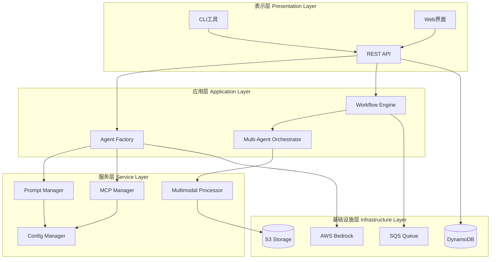
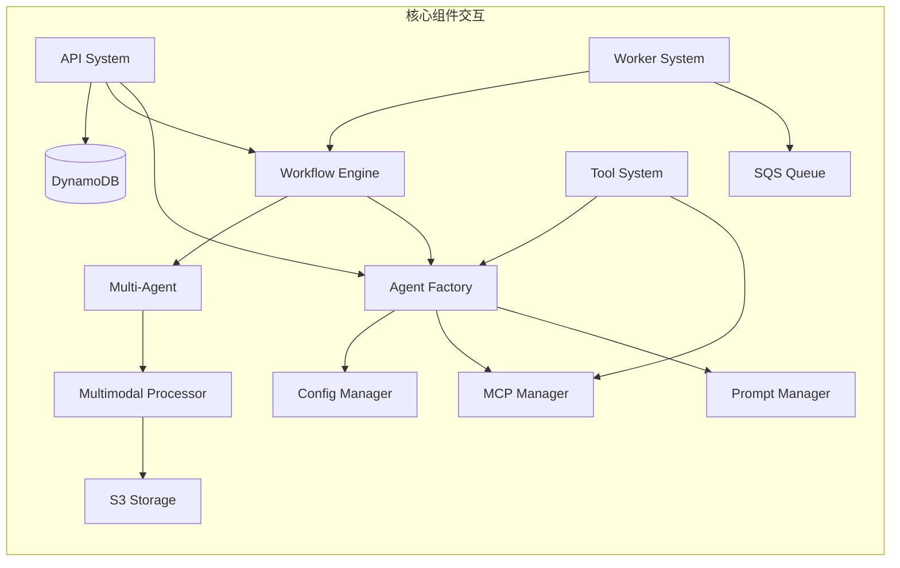
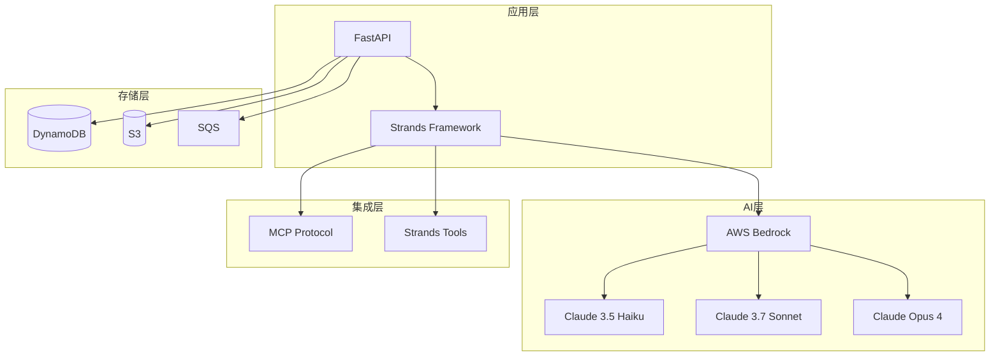
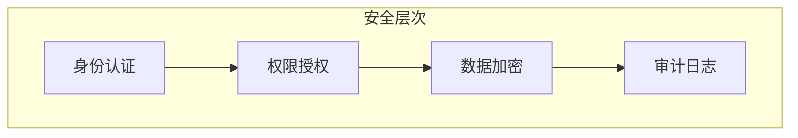

# 系统架构设计

**创建日期**: 2026-02-05  
**最后更新**: 2026-02-06  
**文档版本**: 2.0  
**状态**: 已完成

## 1. 架构概述

Nexus-AI是一个企业级AI Agent开发平台，采用分层架构设计，支持动态Agent创建、多模态内容处理、工作流编排等核心功能。系统基于AWS Bedrock和Strands框架构建，提供完整的Agent开发生命周期管理。

### 1.1 设计原则

- **模块化设计**: 各模块职责清晰，低耦合高内聚
- **可扩展性**: 支持动态加载Agent、工具和提示词模板
- **配置驱动**: 通过YAML配置管理系统行为
- **异步处理**: 支持长时间运行的任务异步执行
- **多模型支持**: 自动选择合适的AI模型（Haiku/Sonnet/Opus）

### 1.2 核心特性

- **Agent Factory**: 从YAML模板动态创建Agent
- **7阶段工作流**: 完整的Agent开发流程自动化
- **多模态处理**: 统一处理图像、文档、Excel等多种格式
- **MCP集成**: 标准化的工具和服务集成协议
- **工作流编排**: 支持Graph和Swarm两种编排模式

## 2. 系统分层

### 2.1 分层架构图



### 2.2 各层职责

#### 表示层 (Presentation Layer)
- **CLI工具**: 命令行界面，支持项目管理、构建、部署等操作
- **Web界面**: 可视化管理界面（开发中）
- **REST API**: 提供标准化的HTTP接口，支持Agent管理、会话管理、任务执行等

#### 应用层 (Application Layer)
- **Agent Factory**: 负责从YAML模板动态创建和配置Agent
- **Workflow Engine**: 管理7阶段Agent构建工作流的执行
- **Multi-Agent Orchestrator**: 协调多个Agent协作完成复杂任务

#### 服务层 (Service Layer)
- **Prompt Manager**: 管理YAML格式的提示词模板，支持版本控制
- **MCP Manager**: 管理MCP服务器连接和工具集成
- **Multimodal Processor**: 处理图像、文档、Excel等多模态内容
- **Config Manager**: 统一的配置加载和管理

#### 基础设施层 (Infrastructure Layer)
- **DynamoDB**: 存储项目、Agent、会话等元数据
- **SQS Queue**: 异步任务队列，支持长时间运行的任务
- **S3 Storage**: 存储多模态文件和项目制品
- **AWS Bedrock**: AI模型服务，支持Claude系列模型

## 3. 核心组件

### 3.1 组件清单

| 组件ID | 组件名称 | 主要功能 | 优先级 |
|--------|---------|---------|--------|
| M01 | Agent Factory System | Agent动态创建和管理 | P0 |
| M02 | Prompt Management | YAML提示词模板管理 | P0 |
| M03 | MCP Integration | MCP服务器和工具集成 | P0 |
| M04 | Multimodal Processing | 多模态内容处理 | P0 |
| M05 | Agent Build Workflow | 7阶段Agent开发流程 | P0 |
| M06 | API System | RESTful API服务 | P0 |
| M07 | Worker System | 异步任务处理 | P1 |
| M08 | Configuration Management | 配置加载和管理 | P1 |
| M09 | Tool System | 工具注册和执行 | P1 |
| M10 | Infrastructure | 基础设施和部署 | P2 |

### 3.2 组件交互图



### 3.3 组件依赖关系

**核心依赖链**:
```
API System → Agent Factory → Prompt Manager → Config Manager
                          ↓
                     MCP Manager → Config Manager
                          ↓
                     Tool System
```

**工作流依赖链**:
```
Workflow Engine → Multi-Agent → Multimodal Processor → S3 Storage
                              ↓
                         Agent Factory → Bedrock
```

**异步处理链**:
```
API System → SQS Queue → Worker System → Workflow Engine
```

## 4. 技术选型

### 4.1 技术栈

#### 后端技术
- **Python 3.13+**: 主要开发语言
- **FastAPI**: REST API框架
- **Strands Framework**: Agent编排框架
- **AWS Bedrock**: AI模型服务
- **Boto3**: AWS SDK

#### 数据存储
- **DynamoDB**: NoSQL数据库，存储元数据
- **S3**: 对象存储，存储文件和制品
- **SQS**: 消息队列，异步任务处理

#### AI模型
- **Claude 3.5 Haiku**: 轻量级模型，快速响应
- **Claude 3.7 Sonnet**: 标准模型，平衡性能
- **Claude Opus 4**: 高级模型，复杂任务

#### 工具集成
- **MCP (Model Context Protocol)**: 标准化工具集成
- **Strands Tools**: 内置工具集（calculator, shell, file等）

#### 部署技术
- **Docker**: 容器化部署
- **Terraform**: 基础设施即代码
- **AWS AgentCore**: Agent托管平台

### 4.2 技术架构图



## 5. 架构决策

### 5.1 关键决策

#### ADR-001: 采用YAML配置驱动的Agent创建
**决策**: 使用YAML文件定义Agent的提示词、工具依赖、模型配置等
**理由**:
- 配置与代码分离，易于维护
- 支持版本控制和多环境配置
- 降低Agent创建门槛，业务人员可参与

#### ADR-002: 选择AWS Bedrock作为AI模型服务
**决策**: 使用AWS Bedrock托管Claude系列模型
**理由**:
- 企业级安全和合规性
- 多模型支持，自动选择最优模型
- 与AWS生态深度集成
- 按需付费，成本可控

#### ADR-003: 采用MCP协议进行工具集成
**决策**: 使用Model Context Protocol标准化工具集成
**理由**:
- 标准化协议，易于扩展
- 支持多种传输方式（stdio, SSE）
- 工具自动发现和注册
- 社区生态丰富

#### ADR-004: 实现7阶段Agent构建工作流
**决策**: 将Agent开发分为需求分析、架构设计、Agent设计、提示词工程、工具开发、代码开发、管理7个阶段
**理由**:
- 标准化开发流程
- 每个阶段职责清晰
- 支持阶段间依赖和迭代
- 便于质量控制和追溯

#### ADR-005: 采用异步任务处理架构
**决策**: 使用SQS队列和Worker系统处理长时间运行的任务
**理由**:
- 避免API超时
- 支持任务重试和失败恢复
- 提高系统吞吐量
- 便于水平扩展

### 5.2 架构权衡

| 决策点 | 选项A | 选项B | 最终选择 | 理由 |
|--------|-------|-------|---------|------|
| Agent创建方式 | 代码定义 | YAML配置 | YAML配置 | 降低门槛，易于维护 |
| AI模型服务 | 自建模型 | AWS Bedrock | AWS Bedrock | 企业级服务，降低运维成本 |
| 工具集成协议 | 自定义协议 | MCP标准 | MCP标准 | 标准化，社区支持 |
| 数据库选择 | 关系型数据库 | NoSQL | NoSQL (DynamoDB) | 灵活schema，高可用 |
| 任务处理 | 同步处理 | 异步队列 | 异步队列 | 支持长任务，可扩展 |

## 6. 架构演进

### 6.1 当前架构 (v1.0)

- ✅ 基础Agent创建和管理
- ✅ 7阶段工作流实现
- ✅ 多模态内容处理
- ✅ MCP工具集成
- ✅ REST API服务

### 6.2 规划中的改进 (v2.0)

- 🔄 Web可视化界面
- 🔄 Agent性能监控和追踪
- 🔄 多租户支持
- 🔄 Agent市场和共享
- 🔄 更多AI模型支持

### 6.3 长期规划 (v3.0+)

- 📋 Agent自动优化和进化
- 📋 分布式Agent协作
- 📋 实时流式处理
- 📋 边缘计算支持
- 📋 多云部署支持

## 7. 性能特征

### 7.1 性能指标

| 指标 | 目标值 | 当前值 | 说明 |
|------|--------|--------|------|
| Agent创建时间 | < 5s | ~3s | 从模板到可用Agent |
| API响应时间 | < 200ms | ~150ms | 简单查询操作 |
| 工作流执行时间 | < 30min | ~20min | 完整7阶段流程 |
| 并发Agent数 | > 100 | ~50 | 单实例支持 |
| 文件处理速度 | > 10MB/s | ~15MB/s | 多模态文件上传 |

### 7.2 可扩展性

- **水平扩展**: API和Worker服务支持多实例部署
- **垂直扩展**: 支持更大内存和CPU配置
- **存储扩展**: S3和DynamoDB自动扩展
- **模型扩展**: 支持添加新的AI模型

## 8. 安全架构

### 8.1 安全层次



### 8.2 安全措施

- **身份认证**: API Key和JWT Token
- **权限控制**: 基于角色的访问控制（RBAC）
- **数据加密**: 传输加密（TLS）和存储加密（S3/DynamoDB）
- **审计日志**: 完整的操作日志记录
- **输入验证**: 严格的参数验证和清理

## 9. 监控和运维

### 9.1 监控指标

- **系统指标**: CPU、内存、磁盘、网络
- **应用指标**: API请求量、响应时间、错误率
- **业务指标**: Agent创建数、工作流执行数、任务成功率
- **AI指标**: 模型调用次数、Token消耗、成本

### 9.2 日志系统

- **应用日志**: 结构化日志，支持搜索和分析
- **访问日志**: API访问记录
- **错误日志**: 异常和错误追踪
- **审计日志**: 敏感操作记录

### 9.3 告警机制

- **系统告警**: 资源使用超限
- **应用告警**: 错误率超阈值
- **业务告警**: 关键流程失败
- **成本告警**: 费用超预算

## 10. 相关文档

- [模块依赖关系](./module-dependencies.md)
- [数据流设计](./data-flow.md)
- [部署架构](./deployment-architecture.md)
- [API参考文档](../api-reference/rest-api-v2.md)
- [模块文档目录](../modules/)

---

**文档状态**: 已完成  
**维护者**: Nexus-AI团队  
**审核状态**: 待审核
