# Agent创建流程文档

**创建日期**: 2026-02-06  
**最后更新**: 2026-02-06  
**文档版本**: 1.0  
**状态**: 已完成

## 1. 流程概述

本文档详细描述Nexus-AI系统中Agent的完整创建流程，包括从用户需求到Agent部署的所有阶段。Nexus-AI提供两种Agent创建方式：

1. **模板驱动创建**: 从现有YAML模板快速创建Agent（适合标准场景）
2. **自动化构建流程**: 通过7阶段工作流从需求自动生成Agent（适合定制场景）

### 1.1 核心概念

**Agent Factory System (M01)**:
- 负责从YAML模板动态创建Agent实例
- 处理工具依赖、模型配置和日志跟踪
- 提供统一的Agent创建接口

**Agent Build Workflow (M05)**:
- 实现"Agent Build Agent"的创新理念
- 7个专业化Agent协同完成开发流程
- 从需求分析到代码生成的全自动化

**Prompt Management (M02)**:
- 管理YAML格式的提示词模板
- 支持版本控制和环境配置
- 提供元数据管理（工具依赖、性能指标等）

### 1.2 创建方式对比

| 特性 | 模板驱动创建 | 自动化构建流程 |
|------|-------------|---------------|
| 适用场景 | 标准Agent、快速原型 | 定制Agent、复杂需求 |
| 创建时间 | 秒级（~3-5秒） | 分钟级（~5-15分钟） |
| 技术要求 | 低（了解YAML即可） | 极低（自然语言描述） |
| 定制程度 | 中等（基于模板修改） | 高（完全定制） |
| 输出内容 | Agent实例 | 完整项目（代码+文档） |
| 维护成本 | 低 | 中等 |


## 2. 模板驱动创建流程

### 2.1 流程总览

模板驱动创建是最快速的Agent创建方式，适合使用现有模板或基于模板进行小幅修改的场景。

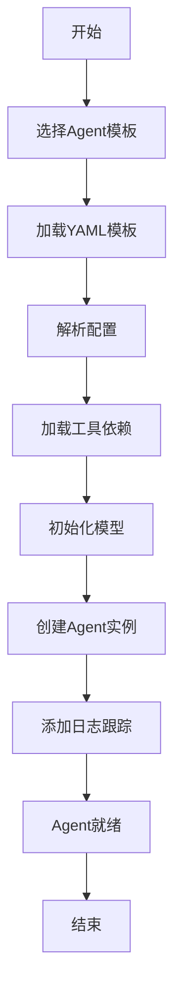

### 2.2 详细步骤

#### 步骤1: 选择Agent模板

**可用模板类型**:
- **系统Agent** (`prompts/system_agents_prompts/`): 内置的专业Agent
- **模板Agent** (`prompts/template_prompts/`): 可复用的Agent模板
- **生成Agent** (`prompts/generated_agents_prompts/`): 自动生成的Agent

**查看可用模板**:
```python
from nexus_utils.agent_factory import list_available_agents

# 获取所有可用Agent
agents = list_available_agents()
print("系统Agent:", agents["system_agents"])
print("模板Agent:", agents["template_agents"])
print("生成Agent:", agents["generated_agents"])
```

#### 步骤2: 加载YAML模板

**模板路径格式**:
- 简单名称: `"requirements_analyzer"`
- 相对路径: `"system_agents_prompts/agent_build_workflow/orchestrator"`

**模板结构示例**:
```yaml
agent:
  name: "requirements_analyzer"
  description: "需求分析Agent"
  category: "analysis"
  
  environments:
    production:
      max_tokens: 60000
      temperature: 0.3
      streaming: true
  
  versions:
    - version: "latest"
      status: "stable"
      system_prompt: |
        你是一个专业的需求分析师...
      
      metadata:
        tools_dependencies:
          - "strands_tools/calculator"
          - "system_tools/project_manager/project_init"
        mcp_dependencies:
          - "awslabs.aws-pricing-mcp-server"
        supported_models:
          - "claude-3-5-sonnet"
          - "claude-opus-4"
```


#### 步骤3: 解析配置和依赖

**Prompt Manager处理流程**:
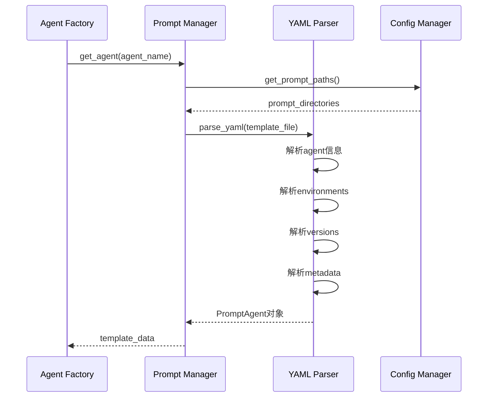

**解析的配置项**:
- **基本信息**: name, description, category
- **环境配置**: max_tokens, temperature, streaming
- **版本信息**: version, status, system_prompt
- **工具依赖**: tools_dependencies, mcp_dependencies
- **模型支持**: supported_models
- **性能指标**: accuracy, response_time

#### 步骤4: 加载工具依赖

**工具类型和加载策略**:

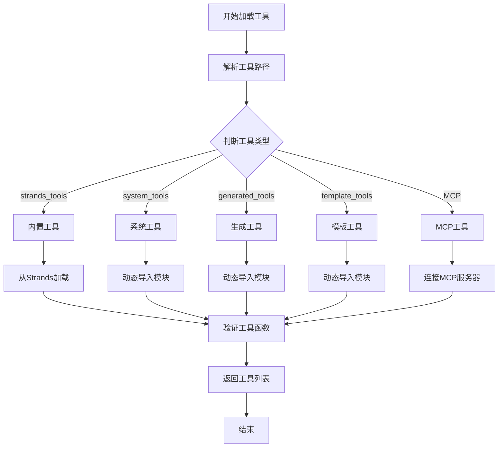

**工具路径示例**:
```python
tools_dependencies = [
    "strands_tools/calculator",                    # 内置工具
    "system_tools/project_manager/project_init",   # 系统工具
    "generated_tools/aws_pricing_agent/get_pricing", # 生成工具
    "template_tools/common/weather_forecast"       # 模板工具
]

mcp_dependencies = [
    "awslabs.aws-pricing-mcp-server",  # AWS定价MCP服务器
    "strands-agents-mcp-server"        # Strands MCP服务器
]
```


#### 步骤5: 初始化Bedrock模型

**模型选择策略**:
```python
def get_bedrock_model(model_id: str, agent_label: str):
    """
    根据模型ID获取Bedrock模型实例
    
    支持的模型:
    - claude-3-5-haiku: 轻量级，快速响应
    - claude-3-5-sonnet: 标准模型，平衡性能
    - claude-opus-4: 高级模型，复杂任务
    """
    # 从配置获取完整模型ID
    config = get_config()
    
    if "haiku" in model_id.lower():
        full_model_id = config.get_bedrock_lite_model_id()
    elif "opus" in model_id.lower():
        full_model_id = config.get_bedrock_pro_model_id()
    else:
        full_model_id = config.get_bedrock_model_id()
    
    # 创建Bedrock模型实例
    return BedrockModel(
        model_id=full_model_id,
        region_name=config.get_bedrock_region_name()
    )
```

**模型配置**:
```yaml
bedrock:
  model_id: "us.anthropic.claude-sonnet-4-5-20250929-v1:0"
  lite_model_id: "us.anthropic.claude-3-5-haiku-20241022-v1:0"
  pro_model_id: "us.anthropic.claude-opus-4-20250514-v1:0"
  
aws:
  bedrock_region_name: "us-west-2"
```

#### 步骤6: 创建Agent实例

**Agent创建核心代码**:
```python
from strands import Agent
from nexus_utils.agent_factory import (
    create_agent_from_prompt_template,
    get_bedrock_model,
    import_tools_by_strings
)

# 方式1: 使用工厂方法（推荐）
agent = create_agent_from_prompt_template(
    agent_name="requirements_analyzer",
    env="production",
    version="latest",
    enable_logging=True
)

# 方式2: 手动创建（高级用法）
model = get_bedrock_model("claude-sonnet", "my_agent")
tools = import_tools_by_strings([
    "strands_tools/calculator",
    "system_tools/project_manager/project_init"
])

agent = Agent(
    model=model,
    tools=tools,
    system_prompt="你是一个专业的需求分析师...",
    max_tokens=60000,
    temperature=0.3
)
```

#### 步骤7: 添加日志跟踪

**日志Hook功能**:
```python
def add_logging_hook_to_agent(agent, agent_label: str):
    """
    为Agent添加日志跟踪功能
    
    记录内容:
    - 用户输入
    - Agent处理过程
    - 模型调用详情
    - 工具使用情况
    - 输出结果
    """
    # 包装Agent调用
    original_call = agent.__call__
    agent.__call__ = _wrap_agent_call_for_stage_logging(
        original_call, agent_label
    )
    
    # 包装模型流式输出
    if hasattr(agent.model, 'stream'):
        original_stream = agent.model.stream
        agent.model.stream = _wrap_model_stream_for_stage_logging(
            original_stream, agent_label
        )
```

**日志输出示例**:
```json
{
  "timestamp": "2026-02-06T10:00:00Z",
  "agent_label": "requirements_analyzer",
  "event_type": "agent_call",
  "input": "请分析这个需求：创建一个AWS定价查询工具",
  "tools_used": ["project_init", "calculator"],
  "model_calls": 3,
  "tokens_used": 1250,
  "response_time": 2.5,
  "output": "需求分析完成..."
}
```


### 2.3 完整示例

#### 示例1: 创建需求分析Agent

```python
from nexus_utils.agent_factory import create_agent_from_prompt_template

# 创建Agent
agent = create_agent_from_prompt_template(
    agent_name="requirements_analyzer",
    env="production",
    version="latest"
)

# 使用Agent
user_input = """
请分析以下需求：
我需要创建一个Agent来帮助我完成AWS产品报价工作。
主要功能包括：
1. 支持EC2、S3、RDS等核心产品
2. 根据用户需求推测合理配置
3. 使用真实AWS API获取价格
4. 生成清晰的报价方案
"""

result = agent(user_input)
print(result)
```

#### 示例2: 创建带会话管理的Agent

```python
from nexus_utils.agent_factory import create_agent_from_prompt_template
from strands.session import S3SessionManager

# 创建会话管理器
session_manager = S3SessionManager(
    session_id="user-12345",
    bucket_name="nexus-ai-sessions"
)

# 创建带会话的Agent
agent = create_agent_from_prompt_template(
    agent_name="chat_assistant",
    session_manager=session_manager
)

# 多轮对话
response1 = agent("你好，我想了解AWS定价")
print(response1)

response2 = agent("刚才我问了什么？")  # Agent能记住上下文
print(response2)
```

#### 示例3: 使用特定模型创建Agent

```python
# 使用轻量级模型（快速响应）
agent_haiku = create_agent_from_prompt_template(
    agent_name="quick_assistant",
    model_id="us.anthropic.claude-3-5-haiku-20241022-v1:0"
)

# 使用高级模型（复杂任务）
agent_opus = create_agent_from_prompt_template(
    agent_name="complex_analyst",
    model_id="us.anthropic.claude-opus-4-20250514-v1:0"
)
```

### 2.4 性能指标

| 指标 | 数值 | 说明 |
|------|------|------|
| 创建时间 | 3-5秒 | 包含模板加载、工具导入、模型初始化 |
| 内存占用 | 50-100MB | 单个Agent实例 |
| 首次调用 | 2-5秒 | 包含模型预热 |
| 后续调用 | 1-3秒 | 模型已预热 |
| 并发支持 | 50+ | 单实例支持的并发Agent数 |


## 3. 自动化构建流程（7阶段）

### 3.1 流程总览

自动化构建流程是Nexus-AI的核心创新，通过"Agent Build Agent"的理念，实现从自然语言需求到完整Agent项目的全自动生成。

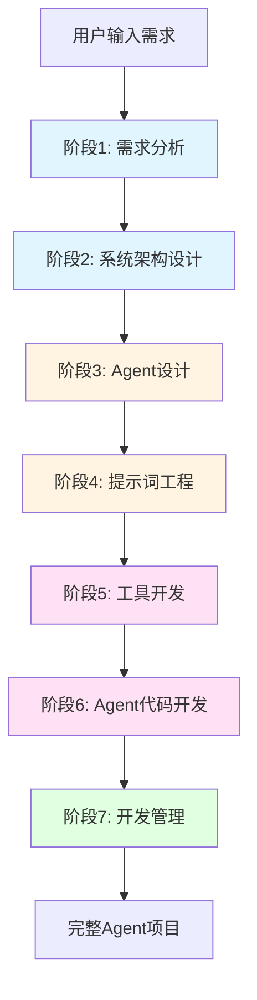

### 3.2 工作流架构

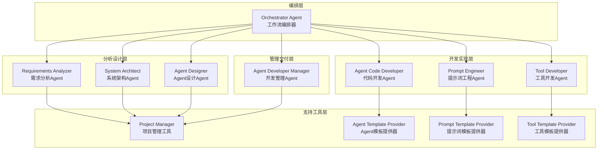


### 3.3 详细阶段说明

#### 阶段1: 需求分析 (Requirements Analysis)

**负责Agent**: Requirements Analyzer  
**输入**: 用户的自然语言需求描述  
**输出**: 结构化需求文档

**主要任务**:
1. 解析用户需求，提取核心功能点
2. 识别技术约束和业务规则
3. 确定Agent的目标用户和使用场景
4. 生成需求文档（Markdown格式）

**数据流**:
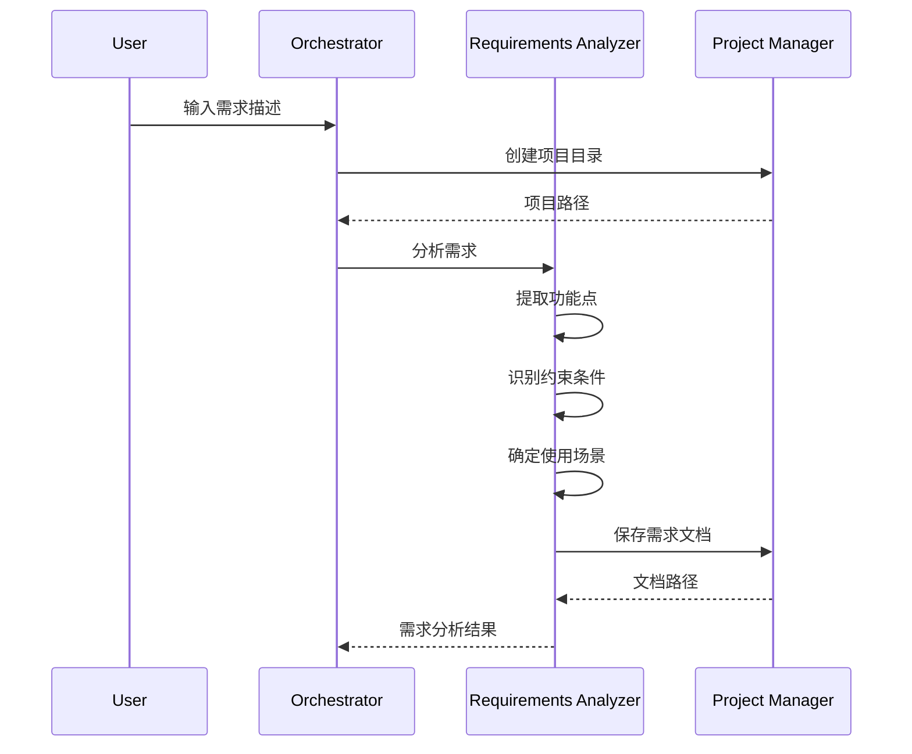

**输出示例**:
```markdown
# 需求分析文档

## 1. 项目概述
创建一个AWS产品报价Agent，帮助用户快速获取AWS服务的价格信息。

## 2. 核心功能
- 支持EC2、S3、RDS、Lambda等核心产品
- 根据用户需求推测合理配置
- 调用AWS Pricing API获取实时价格
- 生成清晰的中文报价方案

## 3. 技术约束
- 必须使用AWS官方API
- 支持多区域价格查询
- 响应时间 < 5秒

## 4. 目标用户
- 云架构师
- 成本优化团队
- 技术销售人员
```

#### 阶段2: 系统架构设计 (System Architecture)

**负责Agent**: System Architect  
**输入**: 需求分析文档  
**输出**: 系统架构文档

**主要任务**:
1. 设计Agent的整体架构
2. 定义工具和服务的集成方式
3. 规划数据流和处理流程
4. 生成架构图（Mermaid格式）

**架构设计要点**:
- **模块划分**: 将功能分解为独立模块
- **接口设计**: 定义模块间的接口规范
- **数据流**: 设计数据在系统中的流转
- **技术选型**: 选择合适的工具和框架

**输出示例**:
```markdown
# 系统架构文档

## 1. 架构概述
采用模块化设计，分为价格查询、配置推荐、报告生成三个核心模块。

## 2. 模块设计

### 2.1 价格查询模块
- 功能: 调用AWS Pricing API获取价格
- 工具: aws_pricing_tool
- 输入: 产品类型、区域、配置参数
- 输出: 价格数据

### 2.2 配置推荐模块
- 功能: 根据需求推荐合理配置
- 工具: configuration_advisor
- 输入: 用户需求描述
- 输出: 推荐配置方案

## 3. 架构图
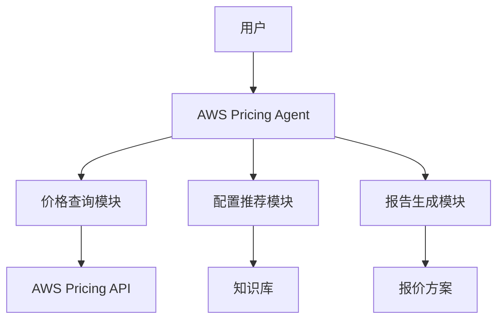
```


#### 阶段3: Agent设计 (Agent Design)

**负责Agent**: Agent Designer  
**输入**: 系统架构文档  
**输出**: Agent设计文档

**主要任务**:
1. 设计Agent的能力和行为
2. 定义Agent的提示词策略
3. 规划工具使用方式
4. 设计交互流程

**设计要点**:
- **角色定位**: 明确Agent的角色和专业领域
- **能力边界**: 定义Agent能做什么、不能做什么
- **交互模式**: 设计与用户的交互方式
- **错误处理**: 规划异常情况的处理策略

#### 阶段4: 提示词工程 (Prompt Engineering)

**负责Agent**: Prompt Engineer  
**输入**: Agent设计文档  
**输出**: YAML提示词模板文件

**主要任务**:
1. 编写系统提示词（System Prompt）
2. 设计用户提示词模板
3. 添加示例对话（Few-shot Examples）
4. 配置约束条件和元数据

**提示词模板结构**:
```yaml
agent:
  name: "aws_pricing_agent"
  description: "AWS产品报价Agent"
  category: "business_analysis"
  
  environments:
    production:
      max_tokens: 60000
      temperature: 0.3
      streaming: true
  
  versions:
    - version: "latest"
      status: "stable"
      system_prompt: |
        你是一个专业的AWS产品报价专家。你的职责是：
        1. 理解用户的云计算需求
        2. 推荐合适的AWS产品配置
        3. 使用AWS Pricing API获取准确价格
        4. 生成清晰的中文报价方案
        
        工作原则：
        - 始终使用真实的AWS API数据
        - 考虑成本优化建议
        - 提供多个配置方案供选择
        - 解释价格构成和计费方式
      
      examples:
        - user: "我需要部署一个Web应用，预计日访问量10万"
          assistant: "根据您的需求，我推荐以下配置..."
      
      metadata:
        tools_dependencies:
          - "generated_tools/aws_pricing_agent/get_ec2_pricing"
          - "generated_tools/aws_pricing_agent/get_s3_pricing"
        mcp_dependencies:
          - "awslabs.aws-pricing-mcp-server"
```

#### 阶段5: 工具开发 (Tool Development)

**负责Agent**: Tool Developer  
**输入**: Agent设计文档、提示词模板  
**输出**: Python工具代码文件

**主要任务**:
1. 开发Agent所需的工具函数
2. 实现与外部API的集成
3. 添加错误处理和日志
4. 编写工具文档和测试

**工具开发示例**:
```python
# tools/generated_tools/aws_pricing_agent/aws_pricing_tool.py

from strands import tool
import boto3
from typing import Dict, Optional

@tool
def get_ec2_pricing(
    instance_type: str,
    region: str = "us-west-2",
    operating_system: str = "Linux"
) -> Dict:
    """
    获取EC2实例的价格信息
    
    参数:
        instance_type: 实例类型，如 "t3.medium"
        region: AWS区域，默认 "us-west-2"
        operating_system: 操作系统，默认 "Linux"
    
    返回:
        包含价格信息的字典
    """
    try:
        # 创建Pricing客户端
        pricing_client = boto3.client('pricing', region_name='us-east-1')
        
        # 查询价格
        response = pricing_client.get_products(
            ServiceCode='AmazonEC2',
            Filters=[
                {'Type': 'TERM_MATCH', 'Field': 'instanceType', 'Value': instance_type},
                {'Type': 'TERM_MATCH', 'Field': 'location', 'Value': region},
                {'Type': 'TERM_MATCH', 'Field': 'operatingSystem', 'Value': operating_system}
            ]
        )
        
        # 解析价格数据
        if response['PriceList']:
            price_data = json.loads(response['PriceList'][0])
            # 提取按需价格
            on_demand_price = extract_on_demand_price(price_data)
            
            return {
                "instance_type": instance_type,
                "region": region,
                "operating_system": operating_system,
                "hourly_price": on_demand_price,
                "monthly_price": on_demand_price * 730,
                "currency": "USD"
            }
        else:
            return {"error": "未找到价格信息"}
            
    except Exception as e:
        return {"error": f"查询失败: {str(e)}"}
```


#### 阶段6: Agent代码开发 (Agent Code Development)

**负责Agent**: Agent Code Developer  
**输入**: 提示词模板、工具代码  
**输出**: Agent主程序代码

**主要任务**:
1. 生成Agent主程序代码
2. 集成提示词模板和工具
3. 实现命令行接口
4. 添加使用示例和文档

**Agent代码示例**:
```python
# agents/generated_agents/aws_pricing_agent/aws_pricing_agent.py

from nexus_utils.agent_factory import create_agent_from_prompt_template
from typing import Optional

class AWSPricingAgent:
    """AWS产品报价Agent"""
    
    def __init__(self, model_id: Optional[str] = None):
        """
        初始化Agent
        
        参数:
            model_id: 模型ID，默认使用配置中的模型
        """
        self.agent = create_agent_from_prompt_template(
            agent_name="generated_agents_prompts/aws_pricing_agent",
            model_id=model_id,
            enable_logging=True
        )
    
    def get_pricing(self, user_requirement: str) -> str:
        """
        获取AWS产品报价
        
        参数:
            user_requirement: 用户需求描述
        
        返回:
            报价方案（Markdown格式）
        """
        return self.agent(user_requirement)
    
    def __call__(self, user_requirement: str) -> str:
        """支持直接调用"""
        return self.get_pricing(user_requirement)


def main():
    """命令行入口"""
    import sys
    
    # 创建Agent
    agent = AWSPricingAgent()
    
    # 获取用户输入
    if len(sys.argv) > 1:
        requirement = " ".join(sys.argv[1:])
    else:
        print("请输入您的需求：")
        requirement = input("> ")
    
    # 获取报价
    print("\n正在分析需求并获取报价...\n")
    result = agent(requirement)
    print(result)


if __name__ == "__main__":
    main()
```

#### 阶段7: 开发管理 (Development Management)

**负责Agent**: Agent Developer Manager  
**输入**: 所有阶段的输出  
**输出**: 项目总结文档、部署指南

**主要任务**:
1. 整合所有阶段的产出
2. 生成项目README文档
3. 编写部署和使用指南
4. 创建测试用例和示例
5. 生成项目总结报告

**项目结构**:
```
projects/aws_pricing_agent/
├── README.md                    # 项目说明
├── docs/                        # 文档目录
│   ├── requirements.md          # 需求文档
│   ├── architecture.md          # 架构文档
│   ├── design.md               # 设计文档
│   └── deployment.md           # 部署指南
├── agents/                      # Agent代码
│   └── generated_agents/
│       └── aws_pricing_agent/
│           └── aws_pricing_agent.py
├── tools/                       # 工具代码
│   └── generated_tools/
│       └── aws_pricing_agent/
│           └── aws_pricing_tool.py
├── prompts/                     # 提示词模板
│   └── generated_agents_prompts/
│       └── aws_pricing_agent.yaml
├── tests/                       # 测试文件
│   └── test_aws_pricing_agent.py
└── examples/                    # 使用示例
    └── example_usage.py
```

**README示例**:
```markdown
# AWS Pricing Agent

AWS产品报价Agent，帮助用户快速获取AWS服务的价格信息。

## 功能特性

- 支持EC2、S3、RDS、Lambda等核心产品
- 根据用户需求推荐合理配置
- 调用AWS Pricing API获取实时价格
- 生成清晰的中文报价方案

## 快速开始

### 安装依赖
```bash
pip install -r requirements.txt
```

### 使用示例
```python
from agents.generated_agents.aws_pricing_agent import AWSPricingAgent

# 创建Agent
agent = AWSPricingAgent()

# 获取报价
result = agent("我需要部署一个Web应用，预计日访问量10万")
print(result)
```

## 文档

- [需求文档](docs/requirements.md)
- [架构文档](docs/architecture.md)
- [部署指南](docs/deployment.md)
```


### 3.4 工作流执行

#### 交互式模式

```bash
# 激活虚拟环境并运行工作流
source venv/bin/activate && python agents/system_agents/agent_build_workflow/agent_build_workflow.py
```

**执行流程**:
1. 系统提示输入需求
2. 用户输入自然语言需求描述
3. 工作流自动执行7个阶段
4. 每个阶段完成后显示进度
5. 最终生成完整项目

**交互示例**:
```
=== Nexus-AI Agent Build Workflow ===

请描述您想要创建的Agent需求：
> 我需要创建一个Agent来帮助我完成AWS产品报价工作

[阶段1/7] 需求分析中...
✓ 需求分析完成
  - 识别核心功能: 4个
  - 技术约束: 3个
  - 文档已保存: projects/aws_pricing_agent/docs/requirements.md

[阶段2/7] 系统架构设计中...
✓ 架构设计完成
  - 模块数量: 3个
  - 架构图已生成
  - 文档已保存: projects/aws_pricing_agent/docs/architecture.md

[阶段3/7] Agent设计中...
✓ Agent设计完成

[阶段4/7] 提示词工程中...
✓ 提示词模板已生成
  - 文件: prompts/generated_agents_prompts/aws_pricing_agent.yaml

[阶段5/7] 工具开发中...
✓ 工具代码已生成
  - 工具数量: 4个
  - 文件: tools/generated_tools/aws_pricing_agent/

[阶段6/7] Agent代码开发中...
✓ Agent代码已生成
  - 文件: agents/generated_agents/aws_pricing_agent/aws_pricing_agent.py

[阶段7/7] 开发管理中...
✓ 项目整合完成
  - README已生成
  - 测试用例已创建
  - 项目路径: projects/aws_pricing_agent/

=== 工作流完成 ===
总耗时: 12分35秒
生成文件: 15个
项目路径: projects/aws_pricing_agent/
```

#### 批处理模式

```bash
# 直接提供需求描述
source venv/bin/activate && python agents/system_agents/agent_build_workflow/agent_build_workflow.py \
  -i "请创建一个Agent帮我完成AWS产品报价工作，支持EC2、S3、RDS等核心产品"
```

**优势**:
- 无需交互，适合自动化脚本
- 可以通过管道传递需求
- 支持批量创建多个Agent

### 3.5 数据流转

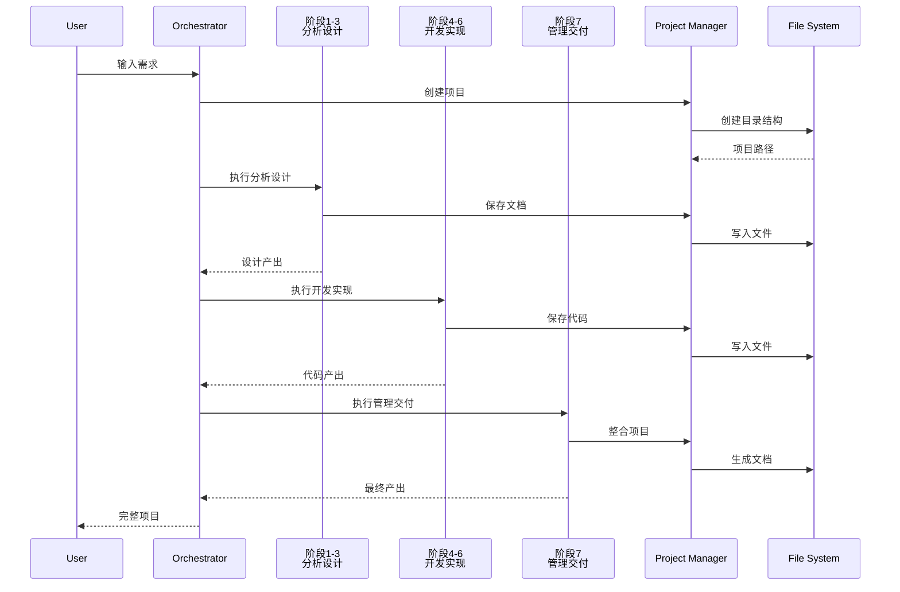

### 3.6 性能指标

| 指标 | 数值 | 说明 |
|------|------|------|
| 总执行时间 | 5-15分钟 | 取决于需求复杂度 |
| 阶段1-3 | 3-6分钟 | 分析设计阶段 |
| 阶段4-6 | 2-7分钟 | 开发实现阶段 |
| 阶段7 | 1-2分钟 | 管理交付阶段 |
| 生成文件数 | 10-20个 | 包含代码、文档、配置 |
| 代码行数 | 500-2000行 | 取决于功能复杂度 |


## 4. 完整流程对比

### 4.1 流程对比图

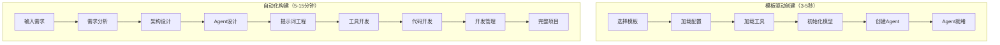

### 4.2 选择建议

**使用模板驱动创建的场景**:
- ✅ 需要快速原型验证
- ✅ 使用标准功能和模板
- ✅ 对Agent有基本了解
- ✅ 需要频繁创建相似Agent
- ✅ 有现成的YAML模板

**使用自动化构建的场景**:
- ✅ 需求复杂，需要定制开发
- ✅ 没有合适的现成模板
- ✅ 需要完整的项目文档
- ✅ 团队协作开发
- ✅ 需要标准化的开发流程
- ✅ 业务人员主导需求

### 4.3 混合使用策略

**推荐工作流**:
1. **快速验证**: 使用模板驱动创建原型
2. **需求确认**: 与用户确认功能和交互
3. **正式开发**: 使用自动化构建生成完整项目
4. **迭代优化**: 基于反馈修改YAML模板
5. **批量部署**: 使用优化后的模板快速创建

## 5. 数据流详解

### 5.1 模板驱动创建数据流

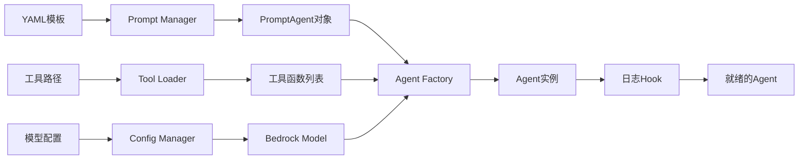

**数据转换过程**:
1. **YAML → Python对象**: Prompt Manager解析YAML为PromptAgent
2. **路径 → 函数**: Tool Loader动态导入工具函数
3. **配置 → 模型**: Config Manager初始化Bedrock模型
4. **组装 → Agent**: Agent Factory组装所有组件

### 5.2 自动化构建数据流

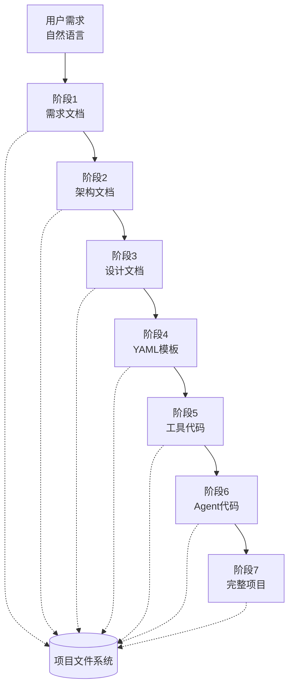

**数据演进**:
- **阶段1**: 非结构化文本 → 结构化需求
- **阶段2**: 需求 → 架构设计
- **阶段3**: 架构 → Agent规格
- **阶段4**: 规格 → 提示词模板
- **阶段5**: 模板 → 工具实现
- **阶段6**: 工具 → Agent代码
- **阶段7**: 代码 → 可部署项目


## 6. 最佳实践

### 6.1 模板设计最佳实践

#### 提示词设计
```yaml
# ✅ 好的提示词设计
system_prompt: |
  你是一个专业的AWS产品报价专家。
  
  核心职责：
  1. 理解用户的云计算需求
  2. 推荐合适的AWS产品配置
  3. 使用AWS Pricing API获取准确价格
  4. 生成清晰的中文报价方案
  
  工作原则：
  - 始终使用真实的AWS API数据
  - 考虑成本优化建议
  - 提供多个配置方案供选择
  - 解释价格构成和计费方式
  
  输出格式：
  使用Markdown格式，包含：
  - 需求摘要
  - 推荐配置
  - 价格明细
  - 成本优化建议

# ❌ 不好的提示词设计
system_prompt: "你是一个Agent，帮助用户查询AWS价格"
```

#### 工具依赖管理
```yaml
# ✅ 清晰的工具依赖
metadata:
  tools_dependencies:
    - "strands_tools/calculator"              # 内置计算工具
    - "system_tools/project_manager/project_init"  # 项目初始化
    - "generated_tools/aws_pricing_agent/get_ec2_pricing"  # EC2价格查询
  
  mcp_dependencies:
    - "awslabs.aws-pricing-mcp-server"        # AWS定价MCP服务器

# ❌ 不清晰的工具依赖
metadata:
  tools_dependencies:
    - "some_tool"  # 不明确的工具路径
```

#### 版本管理
```yaml
# ✅ 良好的版本管理
versions:
  - version: "v2.0"
    status: "stable"
    created_date: "2026-02-01"
    author: "Nexus-AI Team"
    changelog: "添加RDS和Lambda支持"
    system_prompt: |
      ...
  
  - version: "v1.0"
    status: "deprecated"
    created_date: "2026-01-01"
    system_prompt: |
      ...

# ❌ 不好的版本管理
versions:
  - version: "latest"
    system_prompt: |
      ...
```

### 6.2 工具开发最佳实践

#### 错误处理
```python
# ✅ 完善的错误处理
@tool
def get_ec2_pricing(instance_type: str, region: str = "us-west-2") -> Dict:
    """获取EC2实例价格"""
    try:
        # 参数验证
        if not instance_type:
            return {"error": "实例类型不能为空"}
        
        # API调用
        pricing_client = boto3.client('pricing', region_name='us-east-1')
        response = pricing_client.get_products(...)
        
        # 结果验证
        if not response['PriceList']:
            return {"error": f"未找到 {instance_type} 的价格信息"}
        
        # 返回结果
        return parse_pricing_data(response)
        
    except ClientError as e:
        return {"error": f"AWS API错误: {e.response['Error']['Message']}"}
    except Exception as e:
        return {"error": f"未知错误: {str(e)}"}

# ❌ 缺少错误处理
@tool
def get_ec2_pricing(instance_type: str) -> Dict:
    pricing_client = boto3.client('pricing')
    response = pricing_client.get_products(...)
    return response['PriceList'][0]  # 可能抛出异常
```

#### 文档和类型注解
```python
# ✅ 完整的文档和类型注解
@tool
def get_ec2_pricing(
    instance_type: str,
    region: str = "us-west-2",
    operating_system: str = "Linux"
) -> Dict[str, Any]:
    """
    获取EC2实例的价格信息
    
    参数:
        instance_type: EC2实例类型，如 "t3.medium"
        region: AWS区域，默认 "us-west-2"
        operating_system: 操作系统，默认 "Linux"
    
    返回:
        包含以下字段的字典:
        - instance_type: 实例类型
        - hourly_price: 小时价格（USD）
        - monthly_price: 月度价格（USD）
        - currency: 货币单位
        - error: 错误信息（如果有）
    
    示例:
        >>> get_ec2_pricing("t3.medium", "us-west-2")
        {
            "instance_type": "t3.medium",
            "hourly_price": 0.0416,
            "monthly_price": 30.368,
            "currency": "USD"
        }
    """
    ...

# ❌ 缺少文档
@tool
def get_ec2_pricing(instance_type, region="us-west-2"):
    ...
```

### 6.3 需求描述最佳实践

#### 清晰的需求描述
```
✅ 好的需求描述：

我需要创建一个AWS产品报价Agent，具体要求如下：

功能需求：
1. 支持EC2、S3、RDS、Lambda四个核心产品的价格查询
2. 根据用户描述的需求（如"日访问量10万的Web应用"），自动推荐合理的配置
3. 调用AWS官方Pricing API获取实时价格数据
4. 生成包含配置说明、价格明细、成本优化建议的中文报价方案

技术要求：
- 必须使用AWS官方API，不能使用估算值
- 支持指定AWS区域（默认us-west-2）
- 响应时间控制在5秒以内
- 输出格式为Markdown

目标用户：
- 云架构师
- 成本优化团队
- 技术销售人员

❌ 不好的需求描述：

帮我做一个查AWS价格的Agent
```


## 7. 常见问题

### 7.1 模板驱动创建问题

**Q1: Agent创建失败，提示"模板不存在"**

A: 检查以下几点：
```python
# 1. 确认模板名称正确
from nexus_utils.agent_factory import list_available_agents
agents = list_available_agents()
print(agents)  # 查看所有可用Agent

# 2. 使用正确的路径格式
agent = create_agent_from_prompt_template(
    agent_name="system_agents_prompts/agent_build_workflow/orchestrator"  # 完整路径
)

# 3. 检查YAML文件是否存在
import os
template_path = "prompts/system_agents_prompts/orchestrator.yaml"
print(os.path.exists(template_path))
```

**Q2: 工具加载失败**

A: 常见原因和解决方法：
```python
# 原因1: 工具路径错误
# ❌ 错误
tools_dependencies:
  - "system_tools/project_manager"  # 缺少具体函数名

# ✅ 正确
tools_dependencies:
  - "system_tools/project_manager/project_init"

# 原因2: MCP服务器未启动
# 检查MCP服务器状态
uvx awslabs.aws-pricing-mcp-server@latest

# 原因3: 工具模块不存在
# 确认工具文件存在
ls tools/system_tools/project_manager/
```

**Q3: 模型初始化失败**

A: 检查AWS配置：
```bash
# 1. 检查AWS凭证
aws configure list

# 2. 检查Bedrock访问权限
aws bedrock list-foundation-models --region us-west-2

# 3. 检查配置文件
cat config/default_config.yaml | grep bedrock
```

### 7.2 自动化构建问题

**Q4: 工作流执行中断**

A: 查看日志定位问题：
```bash
# 查看阶段日志
ls logs/agent_build_workflow/

# 查看最新日志
tail -f logs/agent_build_workflow/stage_*.log

# 重新执行失败的阶段
# 工作流支持断点续传
```

**Q5: 生成的代码质量不佳**

A: 优化需求描述：
```
# 提供更详细的需求
- 明确功能边界
- 说明技术约束
- 提供使用场景
- 给出示例输入输出

# 使用更高级的模型
agent = create_agent_from_prompt_template(
    agent_name="orchestrator",
    model_id="us.anthropic.claude-opus-4-20250514-v1:0"  # 使用Opus模型
)
```

**Q6: 工作流执行时间过长**

A: 优化策略：
```python
# 1. 使用更快的模型
model_id = "us.anthropic.claude-3-5-haiku-20241022-v1:0"  # Haiku模型

# 2. 简化需求描述
# 避免过于复杂的需求，分阶段实现

# 3. 使用批处理模式
# 减少交互等待时间
python agent_build_workflow.py -i "需求描述"
```

### 7.3 性能优化问题

**Q7: Agent响应速度慢**

A: 性能优化方法：
```python
# 1. 使用流式输出
agent = create_agent_from_prompt_template(
    agent_name="my_agent",
    streaming=True  # 启用流式输出
)

# 2. 减少Token使用
# 在YAML模板中设置
environments:
  production:
    max_tokens: 4000  # 减少最大Token数

# 3. 优化提示词
# 使用更简洁的提示词，减少不必要的说明

# 4. 缓存Agent实例
# 避免重复创建
_agent_cache = {}

def get_cached_agent(agent_name):
    if agent_name not in _agent_cache:
        _agent_cache[agent_name] = create_agent_from_prompt_template(agent_name)
    return _agent_cache[agent_name]
```

**Q8: 内存占用过高**

A: 内存优化：
```python
# 1. 及时释放不用的Agent
del agent
import gc
gc.collect()

# 2. 限制并发Agent数量
from concurrent.futures import ThreadPoolExecutor
executor = ThreadPoolExecutor(max_workers=5)  # 限制并发数

# 3. 使用轻量级模型
model_id = "claude-3-5-haiku"  # 内存占用更小
```

## 8. 相关文档

### 8.1 核心模块文档
- [Agent Factory System](../modules/01-agent-factory.md) - Agent工厂系统详解
- [Prompt Management](../modules/02-prompt-management.md) - 提示词管理系统
- [Agent Build Workflow](../modules/05-agent-build-workflow.md) - 7阶段工作流详解
- [Tool System](../modules/09-tool-system.md) - 工具系统说明

### 8.2 架构文档
- [系统架构设计](../architecture/system-architecture.md) - 整体架构
- [数据流设计](../architecture/data-flow.md) - 数据流转详解
- [模块依赖关系](../architecture/module-dependencies.md) - 模块间依赖

### 8.3 其他业务流程
- [工作流执行流程](./workflow-execution.md) - 工作流编排详解
- [内容处理流程](./content-processing.md) - 多模态内容处理
- [部署流程](./deployment-process.md) - Agent部署指南

## 9. 总结

### 9.1 核心要点

1. **两种创建方式**：
   - 模板驱动：快速、简单、适合标准场景
   - 自动化构建：完整、定制、适合复杂需求

2. **关键组件**：
   - Agent Factory：核心创建引擎
   - Prompt Manager：模板管理
   - Agent Build Workflow：7阶段自动化

3. **最佳实践**：
   - 清晰的需求描述
   - 完善的错误处理
   - 详细的文档注释
   - 合理的版本管理

### 9.2 下一步

- 学习[工作流执行流程](./workflow-execution.md)了解多Agent协作
- 阅读[Agent Factory文档](../modules/01-agent-factory.md)深入理解创建机制
- 查看[示例项目](../../projects/)学习实际应用
- 参考[API文档](../api-reference/rest-api-v2.md)了解编程接口

---

**文档版本**: 1.0  
**最后更新**: 2026-02-06  
**维护者**: Nexus-AI Team  
**文档状态**: 已完成

