# 多模态内容处理流程文档

**创建日期**: 2026-02-06  
**最后更新**: 2026-02-06  
**文档版本**: 1.0  
**状态**: 已完成

## 1. 概述

本文档详细描述Nexus-AI系统中多模态内容处理的完整流程。多模态内容处理系统（Multimodal Processing System）是Nexus-AI平台的核心能力之一，提供对图片、文档（Excel、Word）、文本文件等多种格式的统一处理能力，并通过AI模型生成结构化的Markdown输出，供Agent消费和使用。

### 1.1 核心概念

**内容解析引擎 (ContentParsingEngine)**:
- 位于 `nexus_utils/multimodal_processing/content_parsing_engine.py`
- 系统的核心协调器，负责文件类型检测、处理器选择、批量处理和结果聚合
- 支持并行处理和超时控制

**文件上传管理器 (FileUploadManager)**:
- 位于 `nexus_utils/multimodal_processing/file_upload_manager.py`
- 负责文件验证、元数据生成和上传状态跟踪
- 支持格式验证、大小限制和MIME类型检测

**S3存储服务 (S3StorageService)**:
- 位于 `nexus_utils/multimodal_processing/s3_storage_service.py`
- 提供基于AWS S3的安全文件存储，支持上传、下载、删除和预签名URL生成
- 内置重试机制和服务端加密

**多模态模型服务 (MultimodalModelService)**:
- 位于 `nexus_utils/multimodal_processing/multimodal_model_service.py`
- 集成AWS Bedrock Claude模型，提供图片分析和文本处理能力
- 支持主模型/备用模型自动切换和指数退避重试

**文件处理器 (FileProcessor)**:
- 抽象接口，定义于 `nexus_utils/multimodal_processing/models/interfaces.py`
- 三个具体实现：`ImageProcessor`、`DocumentProcessor`、`TextProcessor`
- 每个处理器负责特定类型文件的处理逻辑

**Markdown生成器 (MarkdownGenerator)**:
- 位于 `nexus_utils/multimodal_processing/markdown_generator.py`
- 将处理结果转换为统一的结构化Markdown文档

**系统工具接口 (MultimodalContentParserTool)**:
- 位于 `tools/system_tools/multimodal_content_parser.py`
- 通过Strands `@tool` 装饰器将多模态处理能力暴露给Agent使用

### 1.2 支持的文件类型

系统通过三个专业处理器支持广泛的文件格式：

| 处理器 | 支持格式 | 处理方式 | 说明 |
|--------|---------|---------|------|
| **ImageProcessor** | jpg, jpeg, png, gif, bmp, webp, tiff, tif | Base64编码 + AI视觉分析 | 使用Claude多模态能力分析图片内容 |
| **DocumentProcessor** | xlsx, xls, docx, csv | 结构化内容提取 + AI格式化 | 使用pandas/openpyxl/python-docx提取内容 |
| **TextProcessor** | txt, md, json, yaml, yml, py, js, java, log, xml, html, css, sql, sh等 | 文本读取 + AI结构化 | 支持30+种文本格式，自动编码检测 |

### 1.3 系统限制

| 限制项 | 默认值 | 配置路径 |
|--------|--------|---------|
| 单文件最大大小 | 50MB | `config.multimodal_parser.file_limits.max_file_size` |
| 单次最大文件数 | 10个 | `config.multimodal_parser.file_limits.max_files_per_request` |
| 处理超时时间 | 300秒 | `config.multimodal_parser.processing.timeout_seconds` |
| 最大并行线程数 | 3 | `config.multimodal_parser.processing.max_workers` |
| AI模型最大Token | 4000 | `config.multimodal_parser.model.max_tokens` |
| 模型重试次数 | 3次 | `config.multimodal_parser.processing.retry_attempts` |

## 2. 系统架构

### 2.1 整体架构

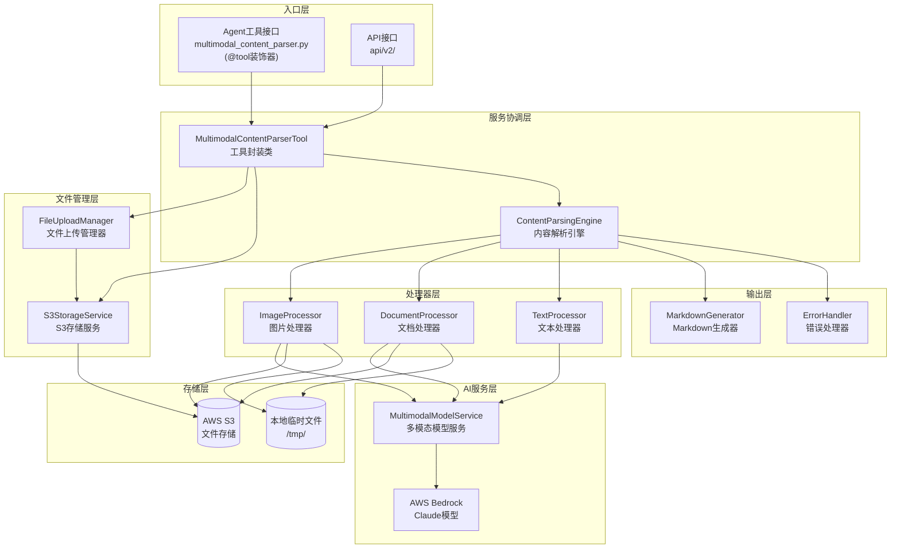

### 2.2 核心组件关系

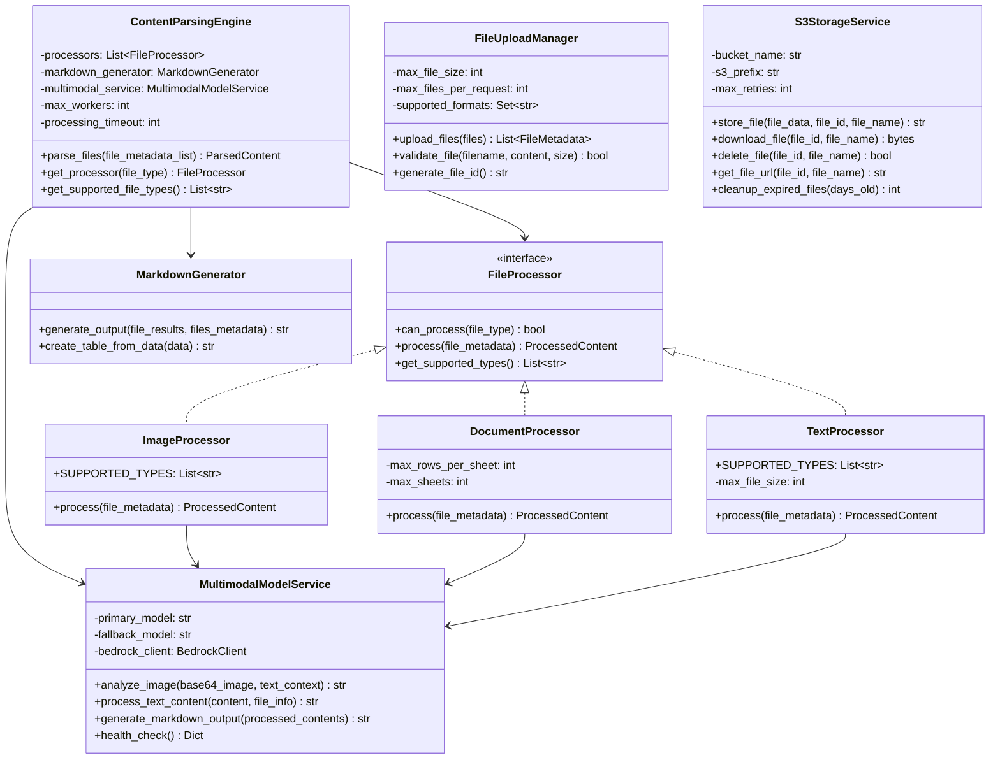

### 2.3 数据模型

系统使用三个核心数据模型贯穿整个处理流程：

**FileMetadata** — 文件元数据:
```python
@dataclass
class FileMetadata:
    file_id: str          # UUID唯一标识符
    original_name: str    # 原始文件名
    file_type: str        # 文件扩展名（如 'jpg', 'xlsx'）
    file_size: int        # 文件大小（字节）
    upload_time: datetime  # 上传时间戳
    s3_url: str           # S3存储URL
    mime_type: str        # MIME类型
```

**ProcessedContent** — 单文件处理结果:
```python
@dataclass
class ProcessedContent:
    file_id: str              # 文件唯一标识符
    file_name: str            # 原始文件名
    content_type: str         # 内容类型（'image'/'document'/'text'）
    processed_text: str       # 处理后的文本/Markdown内容
    metadata: Dict[str, Any]  # 提取的元数据
    processing_time: float    # 处理耗时（秒）
    success: bool             # 是否处理成功
    error_message: str        # 错误信息（失败时）
```

**ParsedContent** — 批量处理最终结果:
```python
@dataclass
class ParsedContent:
    total_files: int                    # 提交处理的文件总数
    successful_files: int               # 成功处理的文件数
    failed_files: int                   # 处理失败的文件数
    markdown_output: str                # 合并后的Markdown输出
    file_results: List[ProcessedContent] # 各文件处理结果列表
    processing_summary: Dict[str, Any]  # 处理统计摘要
```

## 3. 完整处理流程

### 3.1 端到端处理流程总览

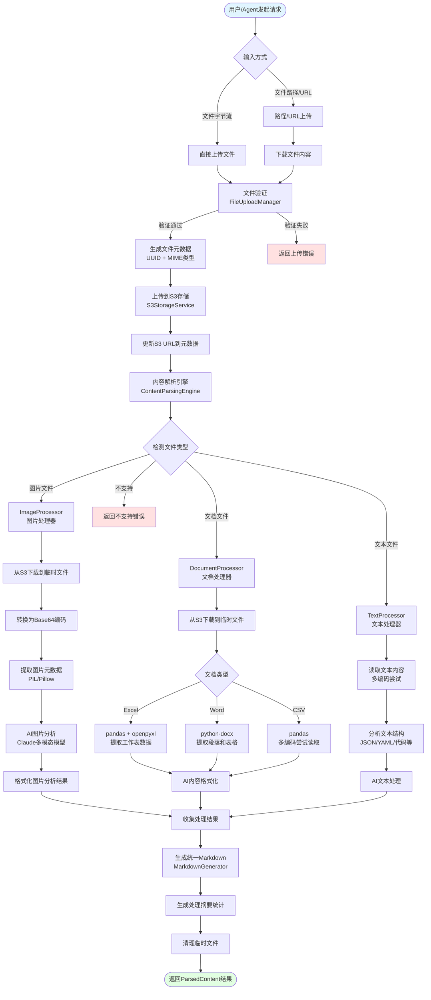

### 3.2 文件上传与验证流程

文件上传是整个处理流程的第一步，由`FileUploadManager`负责执行严格的验证逻辑：

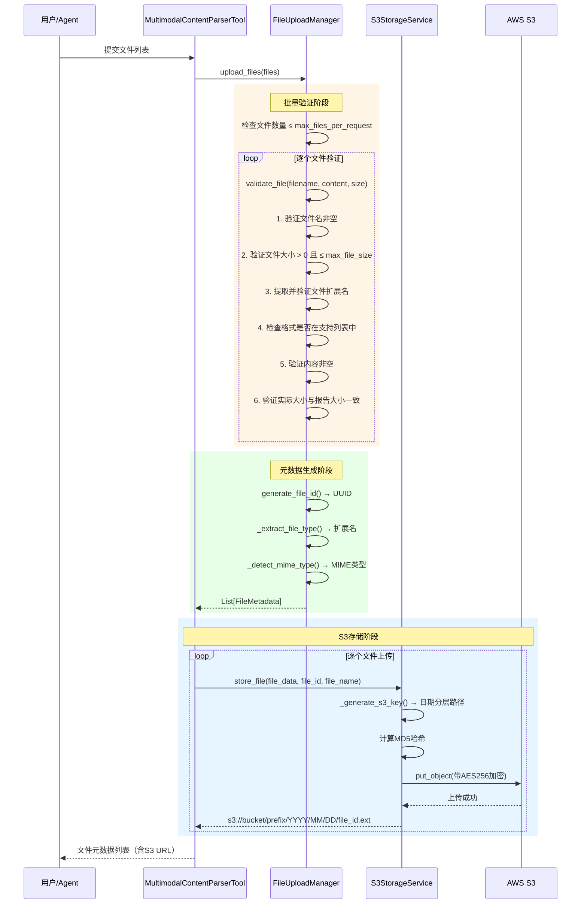

**验证规则详解**:

| 验证项 | 规则 | 错误码 |
|--------|------|--------|
| 文件数量 | ≤ 10个/次 | `TOO_MANY_FILES` |
| 文件名 | 非空且有效 | `EMPTY_FILENAME` |
| 文件大小 | > 0 且 ≤ 50MB | `INVALID_FILE_SIZE` / `FILE_TOO_LARGE` |
| 文件格式 | 在支持列表中 | `UNSUPPORTED_FORMAT` |
| 文件内容 | 非空字节流 | `EMPTY_CONTENT` |
| 大小一致性 | 实际大小 = 报告大小 | `SIZE_MISMATCH` |

**MIME类型检测策略**:
1. 优先通过文件名扩展名推断（`mimetypes.guess_type`）
2. 若推断失败，通过文件内容魔术字节（Magic Bytes）检测
3. 最终兜底返回 `application/octet-stream`

### 3.3 内容解析引擎处理流程

`ContentParsingEngine`是系统的核心协调器，负责将文件分发到合适的处理器并聚合结果：

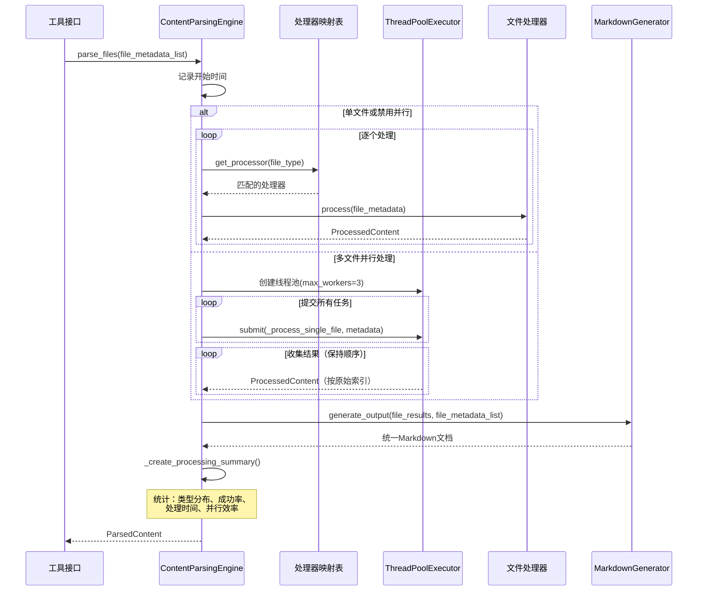

**处理器映射机制**:

引擎在初始化时构建文件类型到处理器的映射表（`_processor_map`），实现O(1)的处理器查找：

```python
# 处理器映射构建过程
processor_map = {}
for processor in [TextProcessor, ImageProcessor, DocumentProcessor]:
    for file_type in processor.get_supported_types():
        processor_map[file_type.lower()] = processor
# 结果示例: {'jpg': ImageProcessor, 'xlsx': DocumentProcessor, 'txt': TextProcessor, ...}
```

**并行处理策略**:
- 单文件或`max_workers=1`时：顺序处理
- 多文件时：使用`ThreadPoolExecutor`并行处理
- 超时控制：`processing_timeout * 文件数量`
- 结果保序：通过索引映射确保结果顺序与输入一致

### 3.4 图片处理流程

`ImageProcessor`使用AWS Bedrock Claude多模态模型对图片进行智能分析：

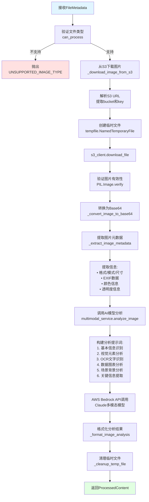

**图片分析AI提示词结构**:

AI模型会按照以下结构化格式分析图片：
1. **基本信息**: 图片类型、主要主题、视觉风格
2. **视觉元素**: 主要对象、颜色分析、构图布局、光线效果
3. **文字识别(OCR)**: 识别图片中的所有可见文字
4. **数据分析**: 提取图表和表格中的数据信息
5. **场景分析**: 环境设置、时间地点推断
6. **关键信息**: 重要发现、数据摘要、行动建议
7. **技术细节**: 图片质量评估、用途分析、相关性评分

**图片元数据提取内容**:

| 元数据项 | 来源 | 说明 |
|---------|------|------|
| `image_format` | PIL | 图片格式（PNG/JPEG等） |
| `image_mode` | PIL | 颜色模式（RGB/RGBA/L等） |
| `image_width/height` | PIL | 图片尺寸（像素） |
| `has_exif` | PIL EXIF | 是否包含EXIF数据 |
| `camera_make/model` | EXIF | 拍摄设备信息 |
| `has_transparency` | PIL | 是否包含透明通道 |
| `file_size_bytes` | OS | 文件大小 |

### 3.5 文档处理流程

`DocumentProcessor`处理Excel、Word和CSV等结构化文档：

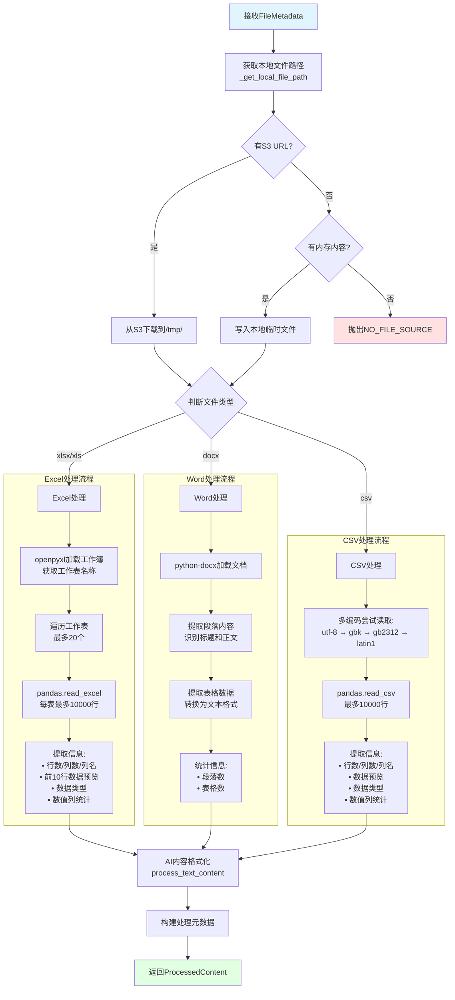

**文档处理限制**:

| 限制项 | 值 | 说明 |
|--------|---|------|
| Excel最大工作表数 | 20 | 超出部分将被跳过 |
| 每工作表最大行数 | 10,000 | 防止内存溢出 |
| CSV编码尝试 | 4种 | utf-8, gbk, gb2312, latin1 |
| Word文档依赖 | python-docx | 未安装时抛出MISSING_DEPENDENCY |

### 3.6 文本处理流程

`TextProcessor`处理各种纯文本格式文件，支持30+种文件扩展名：

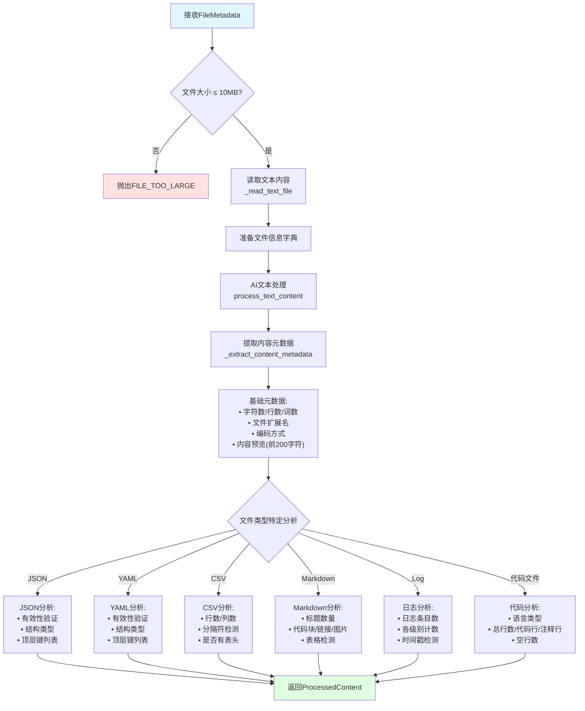

### 3.7 Markdown输出生成流程

`MarkdownGenerator`将所有处理结果合并为统一的结构化Markdown文档：

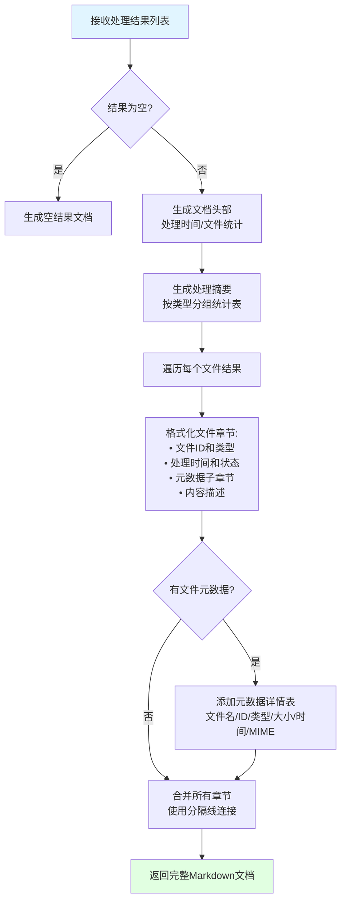

**输出文档结构**:

```markdown
# 多模态内容解析结果

**处理时间**: 2026-02-06 10:30:00
**文件总数**: 3
**成功处理**: 2
**处理失败**: 1

## 处理摘要

| 文件类型 | 总数 | 成功 | 失败 |
|---------|------|------|------|
| image   | 1    | 1    | 0    |
| document| 1    | 1    | 0    |
| text    | 1    | 0    | 1    |

**总处理时间**: 5.23 秒

---

## 文件 1: screenshot.png
**文件ID**: `550e8400-...`
**内容类型**: image
**处理时间**: 2.15 秒
**处理状态**: ✅ 成功

### 内容描述
[AI生成的图片分析结果]

---

## 文件 2: report.xlsx
...

---

## 文件元数据详情

| 文件名 | 文件ID | 类型 | 大小 | 上传时间 | MIME类型 |
|--------|--------|------|------|----------|----------|
| screenshot.png | `550e8400...` | png | 1.5 MB | 2026-02-06 10:30 | image/png |
```

## 4. S3存储服务详解

### 4.1 存储架构

S3存储服务采用日期分层的目录结构组织文件：

```
s3://awesome-nexus-ai-file-storage/
└── multimodal-content/
    └── 2026/
        └── 02/
            └── 06/
                ├── 550e8400-e29b-41d4-a716-446655440000.png
                ├── 6ba7b810-9dad-11d1-80b4-00c04fd430c8.xlsx
                └── f47ac10b-58cc-4372-a567-0e02b2c3d479.txt
```

**S3 Key生成规则**:
```
{s3_prefix}{YYYY}/{MM}/{DD}/{file_id}{file_extension}
```

### 4.2 存储操作流程

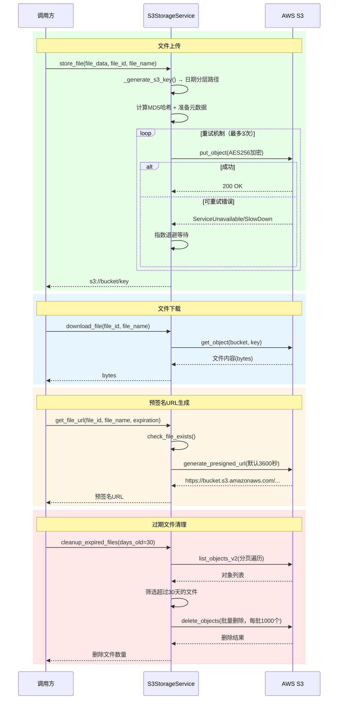

### 4.3 安全特性

| 特性 | 实现方式 | 说明 |
|------|---------|------|
| 服务端加密 | AES256 | 所有上传文件自动加密 |
| 凭证管理 | 多层级查找 | 环境变量 → 配置文件 → AWS凭证链 |
| 访问控制 | 预签名URL | 临时访问链接，默认1小时过期 |
| 内容校验 | MD5哈希 | 上传时计算并存储内容哈希 |
| 自动清理 | 定期清理 | 支持按天数清理过期文件 |
| 重试机制 | 指数退避 | 自适应重试，最多3次 |

## 5. AI模型服务详解

### 5.1 模型配置

```yaml
# config/default_config.yaml 中的多模态模型配置
multimodal_parser:
  model:
    primary_model: "us.anthropic.claude-sonnet-4-5-20250929-v1:0"   # 主模型
    fallback_model: "us.anthropic.claude-3-5-haiku-20241022-v1:0"   # 备用模型
    max_tokens: 4000                                                  # 最大输出Token
  processing:
    timeout_seconds: 300    # 处理超时时间
    retry_attempts: 3       # 重试次数
```

### 5.2 模型调用与容错机制

```mermaid
graph TB
    Start[发起模型调用] --> Attempt1{尝试1: 主模型}

    Attempt1 -->|成功| ParseResponse[解析响应内容]
    Attempt1 -->|失败| SwitchModel[切换到备用模型]

    SwitchModel --> Attempt2{尝试2: 备用模型}
    Attempt2 -->|成功| ParseResponse
    Attempt2 -->|失败| Wait1[等待2秒<br/>指数退避]

    Wait1 --> Attempt3{尝试3: 备用模型}
    Attempt3 -->|成功| ParseResponse
    Attempt3 -->|失败| AllFailed[所有尝试失败<br/>抛出ModelServiceError]

    ParseResponse --> CheckFormat{响应格式有效?}
    CheckFormat -->|是| ExtractText[提取content[0].text]
    CheckFormat -->|否| InvalidResp[抛出INVALID_RESPONSE]

    ExtractText --> Return[返回分析结果]

    style Start fill:#e1f5ff
    style Return fill:#e1ffe1
    style AllFailed fill:#ffe1e1
    style InvalidResp fill:#ffe1e1
```

**重试策略**:
- **尝试1**: 使用主模型（Claude Sonnet）
- **尝试2**: 主模型失败后自动切换到备用模型（Claude Haiku）
- **尝试3**: 继续使用备用模型，等待时间指数增长（1s → 2s → 4s）
- **最终失败**: 抛出`ModelServiceError`，包含所有尝试的错误信息

**模型调用参数**:
```python
body = {
    "anthropic_version": "bedrock-2023-05-31",
    "max_tokens": 4000,
    "messages": messages,       # 包含文本和/或图片内容
    "temperature": 0.1,         # 低温度确保分析一致性
}
```

## 6. 错误处理体系

### 6.1 异常层次结构

```mermaid
graph TB
    Base["MultimodalParserError<br/>(基础异常)"]
    Base --> Upload["FileUploadError<br/>文件上传错误"]
    Base --> Processing["FileProcessingError<br/>文件处理错误"]
    Base --> Storage["StorageError<br/>存储操作错误"]
    Base --> Model["ModelServiceError<br/>模型服务错误"]

    Upload --> U1["NO_FILES: 未提供文件"]
    Upload --> U2["TOO_MANY_FILES: 文件数超限"]
    Upload --> U3["UNSUPPORTED_FORMAT: 不支持的格式"]
    Upload --> U4["FILE_TOO_LARGE: 文件过大"]
    Upload --> U5["SIZE_MISMATCH: 大小不一致"]

    Processing --> P1["UNSUPPORTED_FILE_TYPE: 不支持的类型"]
    Processing --> P2["INVALID_IMAGE_FILE: 无效图片"]
    Processing --> P3["EXCEL_PROCESSING_ERROR: Excel处理失败"]
    Processing --> P4["WORD_PROCESSING_ERROR: Word处理失败"]
    Processing --> P5["CONTENT_EXTRACTION_ERROR: 内容提取失败"]

    Storage --> S1["CREDENTIALS_ERROR: 凭证错误"]
    Storage --> S2["FILE_NOT_FOUND: 文件未找到"]
    Storage --> S3["S3_AccessDenied: 访问被拒"]
    Storage --> S4["CLEANUP_ERROR: 清理失败"]

    Model --> M1["BEDROCK_INIT_ERROR: 初始化失败"]
    Model --> M2["IMAGE_ANALYSIS_ERROR: 图片分析失败"]
    Model --> M3["MAX_RETRIES_EXCEEDED: 重试耗尽"]
    Model --> M4["INVALID_RESPONSE: 无效响应"]
```

### 6.2 错误处理器 (ErrorHandler)

系统提供集中式错误处理器，支持错误分类、严重性评估和恢复策略：

| 错误类别 | 严重性级别 | 可恢复 | 处理策略 |
|---------|-----------|--------|---------|
| 不支持的格式 | Low | ❌ | 返回用户友好提示 |
| 文件过大 | Medium | ❌ | 建议压缩或分割文件 |
| 网络超时 | Medium | ✅ | 自动重试（最多3次） |
| 文件损坏 | High | ❌ | 提示用户检查文件 |
| AI服务限流 | High | ✅ | 指数退避重试（最多5次） |
| 凭证失效 | Critical | ❌ | 提示检查配置 |
| 存储空间不足 | High | ❌ | 提示联系管理员 |

**错误统计与监控**:
```python
# 错误处理器提供实时统计
error_stats = {
    "total_errors": 15,
    "errors_by_category": {
        "file_upload": 3,
        "file_processing": 5,
        "model_service": 4,
        "storage": 3
    },
    "errors_by_severity": {
        "low": 3,
        "medium": 7,
        "high": 4,
        "critical": 1
    },
    "active_errors": 2
}
```

## 7. Agent工具接口

### 7.1 工具函数概览

多模态处理系统通过Strands `@tool` 装饰器暴露四个工具函数供Agent使用：

| 工具函数 | 功能 | 输入 | 输出 |
|---------|------|------|------|
| `parse_multimodal_content` | 解析多种文件并生成Markdown | 文件列表 + 上下文描述 | JSON结果（含Markdown） |
| `parse_multimodal_content_from_path` | 从路径/URL解析文件 | 文件路径列表 | JSON结果（含Markdown） |
| `get_supported_formats` | 获取支持的文件格式列表 | 无 | JSON格式列表 |
| `validate_files` | 预验证文件（不处理） | 文件列表 | JSON验证结果 |
| `get_processing_status` | 获取处理系统状态 | 无 | JSON状态信息 |

### 7.2 Agent调用示例

#### 示例1: 通过文件字节流解析内容

```python
from tools.system_tools.multimodal_content_parser import parse_multimodal_content

# 准备文件数据
files = [
    {
        "filename": "report.xlsx",
        "content": open("report.xlsx", "rb").read(),
        "size": os.path.getsize("report.xlsx")
    },
    {
        "filename": "screenshot.png",
        "content": open("screenshot.png", "rb").read(),
        "size": os.path.getsize("screenshot.png")
    }
]

# 调用解析工具
result = parse_multimodal_content(
    files=files,
    context_description="分析季度销售报告和相关截图",
    include_metadata=True
)

# 解析结果
import json
result_data = json.loads(result)
print(f"状态: {result_data['status']}")
print(f"Markdown输出:\n{result_data['results']['markdown_output']}")
```

#### 示例2: 通过文件路径解析内容

```python
from tools.system_tools.multimodal_content_parser import parse_multimodal_content_from_path

# 支持本地路径、HTTP URL和S3路径
result = parse_multimodal_content_from_path(
    file_paths=[
        "/tmp/data/report.xlsx",                    # 本地文件
        "https://example.com/image.png",            # HTTP URL
        "s3://my-bucket/documents/contract.docx"    # S3路径
    ],
    context_description="分析项目相关文档"
)
```

#### 示例3: 预验证文件

```python
from tools.system_tools.multimodal_content_parser import validate_files

# 验证文件是否可以被处理
validation_result = validate_files(
    files=[
        {
            "filename": "data.xlsx",
            "content": file_content,
            "size": len(file_content)
        }
    ]
)

# 检查验证结果
result_data = json.loads(validation_result)
for file_info in result_data["results"]["files"]:
    if file_info["is_valid"]:
        print(f"✅ {file_info['filename']} - 验证通过")
    else:
        print(f"❌ {file_info['filename']} - {file_info['validation_errors']}")
```

#### 示例4: 在Agent提示词中集成

```yaml
# 在Agent的YAML提示词模板中引用多模态工具
agent:
  name: "document_analysis_agent"
  description: "文档分析Agent"
  versions:
    - version: "latest"
      system_prompt: |
        你是一个专业的文档分析助手。
        当用户提供文件时，使用 parse_multimodal_content 工具进行分析。
        根据分析结果提供专业的见解和建议。
      metadata:
        tools_dependencies:
          - "system_tools/multimodal_content_parser/parse_multimodal_content"
          - "system_tools/multimodal_content_parser/get_supported_formats"
```

### 7.3 工具返回值结构

所有工具函数返回统一的JSON格式：

```json
{
    "status": "success",
    "message": "Successfully processed 3 files (2 successful, 1 failed)",
    "results": {
        "total_files": 3,
        "successful_files": 2,
        "failed_files": 1,
        "markdown_output": "# 多模态内容解析结果\n...",
        "processing_summary": {
            "processing_start_time": "2026-02-06T10:30:00",
            "total_processing_time": 5.23,
            "individual_processing_time": 8.15,
            "parallel_efficiency": 1.56,
            "content_type_statistics": {
                "image": {"total": 1, "successful": 1, "failed": 0},
                "document": {"total": 1, "successful": 1, "failed": 0},
                "text": {"total": 1, "successful": 0, "failed": 1}
            }
        },
        "file_results": [
            {
                "file_id": "550e8400-...",
                "file_name": "screenshot.png",
                "content_type": "image",
                "success": true,
                "processing_time": 2.15
            }
        ]
    },
    "timestamp": "2026-02-06T10:30:05.230Z"
}
```

## 8. 配置说明

### 8.1 完整配置结构

```yaml
# config/default_config.yaml
default-config:
  multimodal_parser:
    # AWS S3存储配置
    aws:
      s3_bucket: "awesome-nexus-ai-file-storage"   # S3存储桶名称
      s3_prefix: "multimodal-content/"              # 文件存储前缀
      bedrock_region: "us-west-2"                   # Bedrock服务区域

    # 文件限制配置
    file_limits:
      max_file_size: "50MB"                         # 单文件最大大小
      max_files_per_request: 10                     # 单次最大文件数
      supported_formats:                            # 支持的文件格式
        - "jpg"
        - "jpeg"
        - "png"
        - "gif"
        - "txt"
        - "xlsx"
        - "docx"
        - "csv"
        - "md"
        - "json"

    # AI模型配置
    model:
      primary_model: "us.anthropic.claude-sonnet-4-5-20250929-v1:0"
      fallback_model: "us.anthropic.claude-3-5-haiku-20241022-v1:0"
      max_tokens: 4000

    # 处理配置
    processing:
      max_workers: 3                                # 最大并行线程数
      timeout_seconds: 300                          # 处理超时时间（秒）
      retry_attempts: 3                             # 模型调用重试次数
```

### 8.2 环境变量

| 环境变量 | 说明 | 默认值 |
|---------|------|--------|
| `AWS_ACCESS_KEY_ID` | AWS访问密钥ID | 无（必须配置） |
| `AWS_SECRET_ACCESS_KEY` | AWS秘密访问密钥 | 无（必须配置） |
| `AWS_DEFAULT_REGION` | AWS默认区域 | `us-west-2` |
| `BEDROCK_REGION` | Bedrock服务区域 | `us-west-2` |

### 8.3 凭证查找优先级

系统按以下优先级查找AWS凭证：

1. **环境变量**: `AWS_ACCESS_KEY_ID` + `AWS_SECRET_ACCESS_KEY`
2. **配置文件**: `config/default_config.yaml` 中的AWS配置
3. **AWS凭证链**: `~/.aws/credentials` 或IAM角色

## 9. 性能特征

### 9.1 处理时间参考

| 文件类型 | 典型大小 | 处理时间 | 说明 |
|---------|---------|---------|------|
| 图片(PNG/JPG) | 1-5MB | 2-5秒 | 包含S3下载 + Base64转换 + AI分析 |
| Excel文件 | 100KB-5MB | 1-3秒 | 取决于工作表数量和行数 |
| Word文档 | 50KB-2MB | 1-2秒 | 取决于段落和表格数量 |
| CSV文件 | 10KB-10MB | 0.5-2秒 | 取决于行数和编码 |
| 文本文件 | 1KB-1MB | 0.3-1秒 | 最快的处理类型 |
| 批量处理(10文件) | 混合 | 5-15秒 | 并行处理提升效率 |

### 9.2 并行处理效率

```
并行效率 = 各文件处理时间之和 / 实际总处理时间

示例:
- 3个文件，各需3秒 → 顺序处理9秒，并行处理约3.5秒
- 并行效率 ≈ 9/3.5 ≈ 2.57
```

### 9.3 资源消耗

| 指标 | 典型值 | 说明 |
|------|--------|------|
| 内存占用 | 100-500MB | 取决于文件大小和并行数 |
| 临时磁盘 | 文件大小×2 | 下载+处理的临时文件 |
| 网络带宽 | 文件大小×3 | S3上传+下载+API调用 |
| API调用 | 1-2次/文件 | 主模型+可能的备用模型 |

## 10. 最佳实践

### 10.1 文件准备建议

```python
# ✅ 推荐：提供完整的文件信息
files = [{
    "filename": "quarterly_report_2026Q1.xlsx",  # 描述性文件名
    "content": file_bytes,                        # 完整文件内容
    "size": len(file_bytes)                       # 准确的文件大小
}]

# ❌ 避免：模糊的文件名
files = [{
    "filename": "file1.dat",  # 无法识别文件类型
    "content": file_bytes,
    "size": 0                 # 错误的文件大小
}]
```

### 10.2 批量处理优化

```python
# ✅ 推荐：按类型分批处理大量文件
# 第一批：图片文件（AI分析较慢）
image_files = [f for f in all_files if f['filename'].endswith(('.png', '.jpg'))]
image_result = parse_multimodal_content(files=image_files[:10])

# 第二批：文档文件
doc_files = [f for f in all_files if f['filename'].endswith(('.xlsx', '.docx'))]
doc_result = parse_multimodal_content(files=doc_files[:10])

# ❌ 避免：一次提交超过限制的文件数
all_files_result = parse_multimodal_content(files=all_50_files)  # 超过10个限制
```

### 10.3 错误处理建议

```python
import json

# 调用多模态解析
result_json = parse_multimodal_content(files=files)
result = json.loads(result_json)

# 检查处理状态
if result["status"] == "success":
    # 所有文件处理成功
    markdown = result["results"]["markdown_output"]
    print(markdown)

elif result["status"] == "partial_success":
    # 部分文件处理成功
    markdown = result["results"]["markdown_output"]
    failed = result["results"]["failed_files"]
    print(f"警告: {failed}个文件处理失败")
    print(markdown)

    # 检查失败原因
    for file_result in result["results"]["file_results"]:
        if not file_result.get("success"):
            print(f"失败文件: {file_result['file_name']}")
            print(f"错误原因: {file_result.get('error_message')}")

elif result["status"] == "error":
    # 全部失败
    print(f"处理失败: {result['message']}")
```

### 10.4 上下文描述优化

```python
# ✅ 推荐：提供详细的上下文描述
result = parse_multimodal_content(
    files=files,
    context_description="""
    这些文件是2026年Q1的销售报告：
    - Excel文件包含各区域的销售数据
    - 图片是销售趋势图的截图
    请重点分析销售增长趋势和区域差异
    """
)

# ❌ 避免：空的或模糊的上下文
result = parse_multimodal_content(
    files=files,
    context_description=""  # 缺少上下文会降低AI分析质量
)
```

## 11. 常见问题

### 11.1 文件上传问题

**Q1: 上传文件时提示"Unsupported file format"**

A: 检查文件扩展名是否在支持列表中：
```python
# 查看支持的格式
from tools.system_tools.multimodal_content_parser import get_supported_formats
print(get_supported_formats())

# 确保文件扩展名正确
# ❌ "report.dat" → 不支持
# ✅ "report.xlsx" → 支持
```

**Q2: 上传大文件时超时**

A: 检查文件大小限制和网络状况：
```python
# 检查文件大小（默认限制50MB）
import os
file_size = os.path.getsize("large_file.xlsx")
print(f"文件大小: {file_size / 1024 / 1024:.1f} MB")

# 如果文件过大，考虑：
# 1. 压缩文件
# 2. 分割为多个小文件
# 3. 调整配置中的max_file_size
```

### 11.2 处理问题

**Q3: Excel文件处理结果不完整**

A: 系统对Excel处理有以下限制：
- 最多处理20个工作表
- 每个工作表最多读取10,000行
- 如需处理更大的文件，建议分割工作表

**Q4: 图片分析结果不准确**

A: 优化图片分析的建议：
- 确保图片清晰度足够（建议分辨率 ≥ 800×600）
- 提供详细的`context_description`帮助AI理解分析目标
- 对于复杂图表，建议同时提供原始数据文件

### 11.3 服务问题

**Q5: AI模型调用失败**

A: 检查以下配置：
```bash
# 1. 验证AWS凭证
aws sts get-caller-identity

# 2. 验证Bedrock访问权限
aws bedrock list-foundation-models --region us-west-2

# 3. 检查环境变量
echo $AWS_ACCESS_KEY_ID
echo $AWS_DEFAULT_REGION
```

**Q6: S3存储服务初始化失败**

A: 确认S3配置正确：
```bash
# 1. 检查存储桶是否存在
aws s3 ls s3://awesome-nexus-ai-file-storage/

# 2. 检查存储桶权限
aws s3api get-bucket-acl --bucket awesome-nexus-ai-file-storage

# 3. 确认区域配置一致
# config中的aws_region_name应与S3桶所在区域一致
```

## 12. 相关文档

### 12.1 核心模块文档
- [多模态处理模块](../modules/04-multimodal-processing.md) - 模块详细技术文档
- [配置管理系统](../modules/08-configuration-management.md) - 配置加载和管理
- [工具系统](../modules/09-tool-system.md) - 工具注册和集成机制

### 12.2 架构文档
- [系统架构设计](../architecture/system-architecture.md) - 整体架构
- [数据流设计](../architecture/data-flow.md) - 数据流转详解
- [模块依赖关系](../architecture/module-dependencies.md) - 模块间依赖

### 12.3 其他业务流程
- [Agent创建流程](./agent-creation-process.md) - Agent创建详解
- [工作流执行流程](./workflow-execution.md) - 工作流编排详解
- [部署流程](./deployment-process.md) - Agent部署指南

## 13. 总结

### 13.1 核心要点

1. **统一处理架构**: 通过`ContentParsingEngine`协调三种专业处理器，实现对图片、文档、文本的统一处理
2. **AI驱动分析**: 集成AWS Bedrock Claude多模态模型，提供智能图片分析和内容结构化能力
3. **安全存储**: 基于AWS S3的文件存储，支持服务端加密、预签名URL和自动清理
4. **容错设计**: 完善的错误处理体系，支持自动重试、模型降级和部分成功返回
5. **Agent集成**: 通过Strands `@tool` 装饰器无缝集成到Agent工具链中

### 13.2 数据流转总结


### 13.3 下一步

- 阅读[多模态处理模块文档](../modules/04-multimodal-processing.md)了解更多技术细节
- 查看[工具系统文档](../modules/09-tool-system.md)了解如何开发自定义处理器
- 参考[配置管理文档](../modules/08-configuration-management.md)了解配置调优方法

---

**文档版本**: 1.0  
**最后更新**: 2026-02-06  
**维护者**: Nexus-AI Team  
**文档状态**: 已完成
