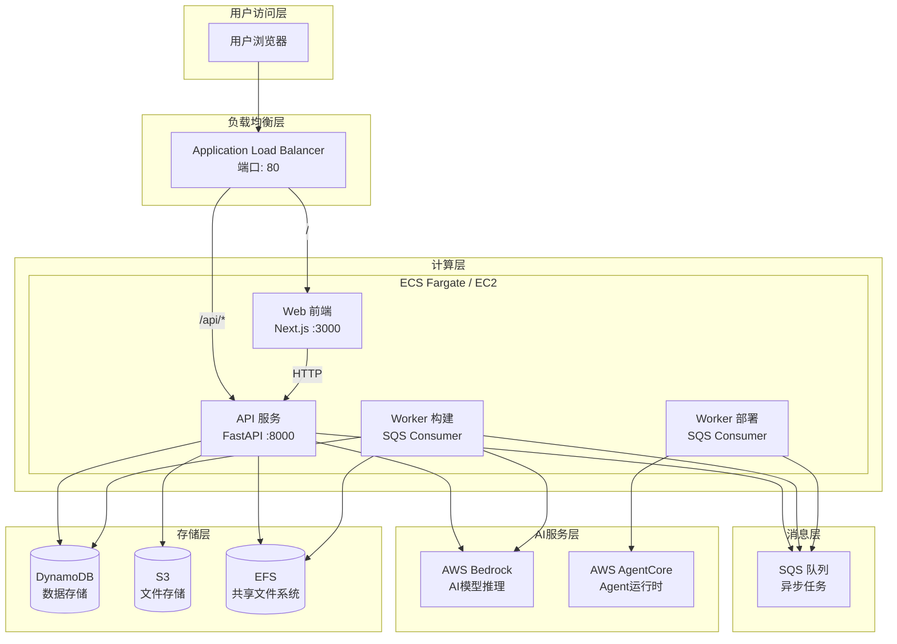
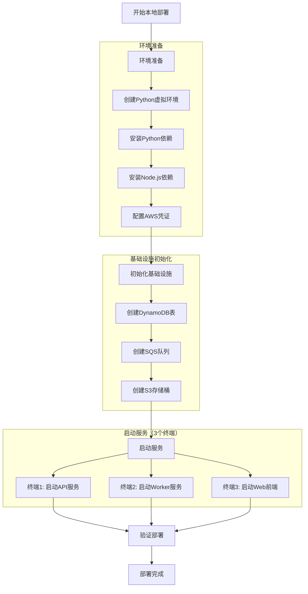
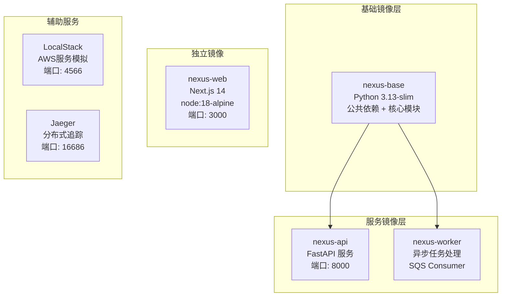
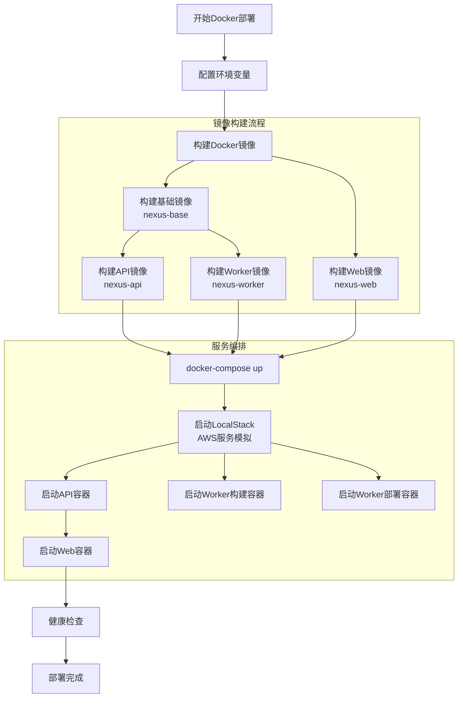
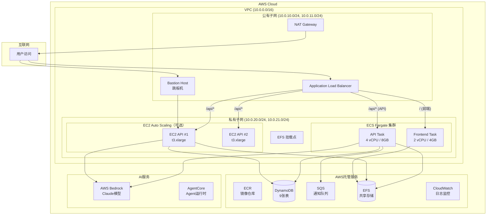
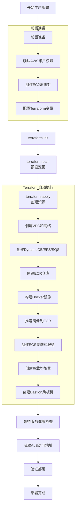
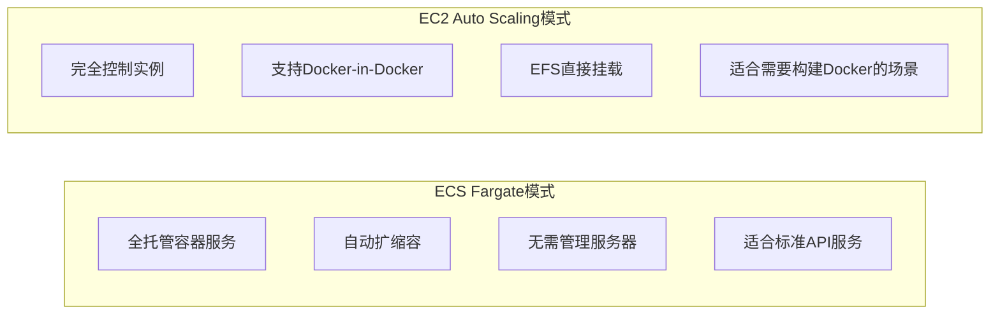
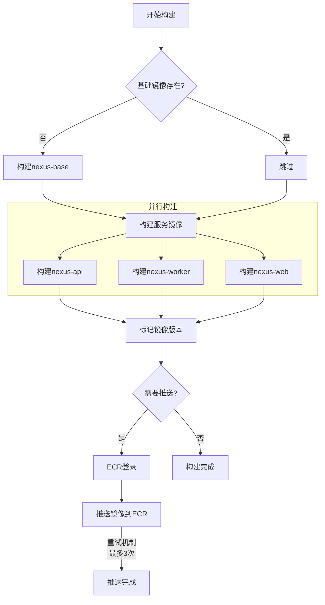
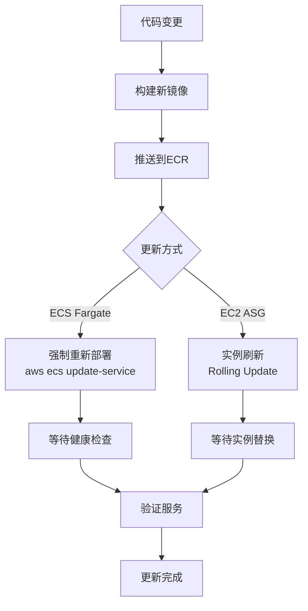
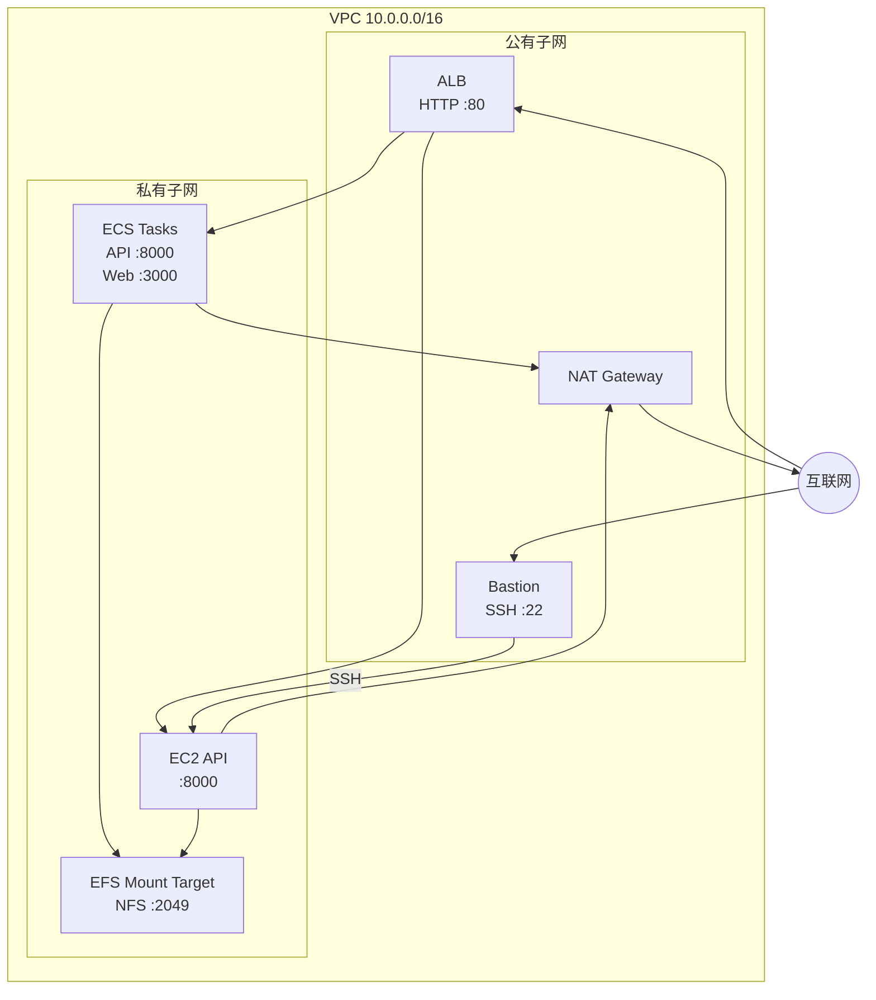

# 部署流程文档

**创建日期**: 2026-02-06  
**最后更新**: 2026-02-06  
**文档版本**: 1.0  
**状态**: 已完成

## 1. 流程概述

本文档详细描述Nexus-AI系统的完整部署流程，涵盖本地开发环境、Docker容器化部署和AWS云端生产部署三种模式。Nexus-AI采用前后端分离 + 异步任务处理的三端服务架构，支持灵活的部署策略。

### 1.1 部署模式对比

| 特性 | 本地开发部署 | Docker本地部署 | AWS生产部署 |
|------|-------------|---------------|-------------|
| 适用场景 | 日常开发调试 | 集成测试、演示 | 生产环境运行 |
| 基础设施 | 本地Python/Node.js | Docker + LocalStack | AWS全托管服务 |
| AWS服务 | 可选（本地模拟） | LocalStack模拟 | 真实AWS服务 |
| 部署时间 | ~2分钟 | ~5分钟 | ~15-30分钟 |
| 扩展性 | 单实例 | 单机多容器 | 自动伸缩 |
| 成本 | 免费 | 免费 | ~$200/月起 |

### 1.2 核心服务架构

| 服务 | 技术栈 | 端口 | 职责 |
|------|--------|------|------|
| **Web 前端** | Next.js 14 | 3000 | 用户界面、状态管理、API调用 |
| **API 后端** | FastAPI | 8000 | RESTful API、认证授权、数据CRUD |
| **Worker 构建** | Python | - | SQS消息消费、Agent构建任务 |
| **Worker 部署** | Python | - | Agent部署到AgentCore |

### 1.3 部署架构总览



## 2. 本地开发部署

### 2.1 前置要求

- **Python 3.13+**: 主要开发语言
- **Node.js 18+**: 前端开发
- **AWS CLI**: AWS服务访问
- **AWS账户**: Bedrock模型访问权限
- **Docker**（可选）: Jaeger追踪服务

### 2.2 部署流程图



### 2.3 详细步骤

#### 步骤1: 环境准备

```bash
# 克隆项目
git clone https://github.com/hy714335634/Nexus-AI.git
cd Nexus-AI

# 创建并激活Python虚拟环境
python3 -m venv venv
source venv/bin/activate

# 安装Python依赖（推荐使用uv加速）
pip install uv
uv pip install -r requirements.txt

# 安装前端依赖
cd web && npm install && cd ..

# 配置AWS凭证
aws configure
# 输入: AWS_ACCESS_KEY_ID, AWS_SECRET_ACCESS_KEY, Region (us-west-2)
```

#### 步骤2: 初始化基础设施

```bash
# 使用 nexus-cli 初始化 DynamoDB 表、SQS 队列和 S3 存储桶
source venv/bin/activate
./nexus-cli init

# 可选: 仅初始化特定资源
./nexus-cli init --tables-only   # 仅 DynamoDB 表
./nexus-cli init --queues-only   # 仅 SQS 队列
./nexus-cli init --buckets-only  # 仅 S3 存储桶
```

**初始化创建的资源**:

| 资源类型 | 名称 | 用途 |
|----------|------|------|
| DynamoDB表 | `nexus_projects` | 项目基本信息 |
| DynamoDB表 | `nexus_stages` | 工作流阶段状态 |
| DynamoDB表 | `nexus_agents` | Agent配置和版本 |
| DynamoDB表 | `nexus_invocations` | Agent调用记录 |
| DynamoDB表 | `nexus_sessions` | 会话信息 |
| DynamoDB表 | `nexus_messages` | 会话消息记录 |
| DynamoDB表 | `nexus_tasks` | 异步任务状态 |
| DynamoDB表 | `nexus_tools` | 工具注册信息 |
| DynamoDB表 | `nexus_artifacts` | Agent版本和S3同步 |
| SQS队列 | `nexus-build-queue` | 构建任务队列 |
| SQS队列 | `nexus-deploy-queue` | 部署任务队列 |
| SQS队列 | `nexus-notification-queue` | 通知队列 |
| SQS队列 | `nexus-build-dlq` | 构建死信队列 |
| SQS队列 | `nexus-deploy-dlq` | 部署死信队列 |
| S3存储桶 | `nexus-ai-artifacts-*` | 制品和文件存储 |
| S3存储桶 | `nexus-ai-session-*` | 会话存储 |

#### 步骤3: 启动服务

```bash
# 终端1: 启动API服务 (:8000)
./scripts/start_api_v2.sh
# 或手动启动:
# source venv/bin/activate && uvicorn api.v2.main:app --host 0.0.0.0 --port 8000 --reload

# 终端2: 启动Worker服务（构建队列）
./scripts/start_worker.sh build
# 或手动启动:
# source venv/bin/activate && python -m worker.main --queue build

# 终端3: 启动Web前端 (:3000)
cd web && npm run dev
```

#### 步骤4: 可选服务

```bash
# 启动Jaeger分布式追踪（可观测性）
docker run -d --name jaeger \
  -p 16686:16686 -p 4317:4317 -p 4318:4318 \
  jaegertracing/all-in-one:latest

# 设置遥测环境变量
export OTEL_EXPORTER_OTLP_ENDPOINT=http://localhost:4318
```

### 2.4 验证部署

```bash
# 检查API健康状态
curl http://localhost:8000/health

# 访问API文档
# 浏览器打开: http://localhost:8000/docs

# 访问前端界面
# 浏览器打开: http://localhost:3000
```

### 2.5 环境变量配置

| 变量名 | 描述 | 默认值 |
|--------|------|--------|
| `AWS_REGION` | AWS区域 | `us-west-2` |
| `AWS_ACCESS_KEY_ID` | AWS访问密钥 | - |
| `AWS_SECRET_ACCESS_KEY` | AWS密钥 | - |
| `LOG_LEVEL` | 日志级别 | `INFO` |
| `BYPASS_TOOL_CONSENT` | 跳过工具确认 | `true` |
| `OTEL_EXPORTER_OTLP_ENDPOINT` | 遥测端点 | - |
| `BEDROCK_REGION` | Bedrock区域 | `us-west-2` |

## 3. Docker容器化部署

### 3.1 镜像架构

Nexus-AI采用分层镜像策略，通过共享基础镜像减少构建时间和镜像体积。



### 3.2 镜像详情

| 镜像 | 基础镜像 | 端口 | 入口点 | 用途 |
|------|----------|------|--------|------|
| `nexus-base` | `python:3.13-slim` | - | - | 共享Python依赖和核心模块 |
| `nexus-api` | `nexus-base` | 8000 | `uvicorn` | FastAPI后端服务 |
| `nexus-worker` | `nexus-base` | - | `python -m worker.main` | 异步任务处理 |
| `nexus-web` | `node:18-alpine` | 3000 | `node server.js` | Next.js前端服务 |

### 3.3 本地Docker部署流程



### 3.4 部署命令

#### 一键构建所有镜像

```bash
cd infrastructure/docker

# 构建所有镜像
./build.sh

# 构建特定镜像
./build.sh base      # 仅基础镜像
./build.sh api       # 仅API镜像
./build.sh worker    # 仅Worker镜像
./build.sh web       # 仅Web镜像

# 不使用缓存构建
./build.sh --no-cache
```

#### 启动本地开发环境

```bash
cd infrastructure/docker

# 配置环境变量
cp .env.example .env
# 编辑 .env 文件，填写AWS凭证

# 启动所有服务（包含LocalStack模拟AWS）
docker-compose up -d

# 查看服务状态
docker-compose ps

# 查看日志
docker-compose logs -f api          # API日志
docker-compose logs -f worker-build # Worker日志
docker-compose logs -f web          # Web日志
```

### 3.5 Docker Compose服务编排

**本地开发环境** (`docker-compose.yml`) 包含以下服务:

| 服务 | 容器名 | 端口映射 | 依赖 |
|------|--------|----------|------|
| `api` | `nexus-api` | 8000:8000 | LocalStack |
| `worker-build` | `nexus-worker-build` | - | LocalStack |
| `worker-deploy` | `nexus-worker-deploy` | - | LocalStack |
| `web` | `nexus-web` | 3000:3000 | API |
| `localstack` | `nexus-localstack` | 4566:4566 | - |
| `jaeger` | `nexus-jaeger` | 16686:16686 | - |

**关键特性**:
- 开发时挂载代码目录，支持热重载
- LocalStack模拟DynamoDB、SQS、S3服务
- Jaeger提供分布式追踪能力
- 所有服务通过`nexus-network`桥接网络通信

## 4. AWS生产部署

### 4.1 AWS基础设施架构

Nexus-AI使用Terraform进行基础设施即代码(IaC)管理，一键部署完整的AWS基础设施。



### 4.2 Terraform资源清单

Nexus-AI的Terraform配置按功能模块组织:

| 配置文件 | 资源类型 | 说明 |
|----------|----------|------|
| `01-networking.tf` | VPC、子网、安全组、NAT | 网络基础设施 |
| `02-storage-dynamodb.tf` | DynamoDB表 | 数据存储（9张表） |
| `02-storage-efs.tf` | EFS文件系统 | 共享存储 |
| `03-messaging-sqs.tf` | SQS队列 | 异步消息队列 |
| `04-compute-ecr.tf` | ECR仓库 | Docker镜像仓库 |
| `04-compute-docker-build.tf` | Docker构建 | 自动构建推送镜像 |
| `04-compute-iam.tf` | IAM角色和策略 | 权限管理 |
| `05-compute-ecs.tf` | ECS集群、任务定义 | 容器编排 |
| `05-compute-ec2.tf` | EC2 Auto Scaling | EC2部署模式 |
| `06-loadbalancer.tf` | ALB、目标组、监听器 | 负载均衡 |
| `07-services.tf` | ECS服务、服务发现 | 服务编排 |
| `08-cleanup.tf` | 清理资源 | 资源回收 |
| `09-bastion-host.tf` | Bastion EC2 | 跳板机 |

### 4.3 生产部署流程



### 4.4 部署步骤

#### 步骤1: 配置Terraform变量

```bash
cd infrastructure/basic

# 复制变量模板
cp terraform.tfvars.example terraform.tfvars

# 编辑变量文件
vim terraform.tfvars
```

**关键配置项**:

```hcl
# AWS配置
aws_region     = "us-east-1"
aws_access_key = ""  # 留空使用默认AWS Profile
aws_secret_key = ""

# 项目配置
project_name = "nexus-ai"
environment  = "prod"

# 功能开关
enable_sqs      = true
enable_dynamodb = true
enable_bastion  = true
enable_jaeger   = false  # 可选: 分布式追踪

# API部署模式
api_deploy_on_ec2 = true  # true=EC2部署, false=ECS Fargate部署

# EC2配置（当api_deploy_on_ec2=true时）
ec2_api_instance_type    = "t3.xlarge"
ec2_api_desired_capacity = 2
ec2_api_min_size         = 1
ec2_api_max_size         = 4

# ALB访问控制
alb_internal            = false  # false=公网访问
alb_allowed_cidr_blocks = ["0.0.0.0/0"]  # 公网访问

# GitHub仓库（EC2部署时自动克隆）
github_repo_url = "https://github.com/hy714335634/Nexus-AI.git"
github_branch   = "main"
```

#### 步骤2: 初始化并部署

```bash
# 初始化Terraform
terraform init

# 预览变更
terraform plan

# 执行部署（自动构建镜像、创建所有资源）
terraform apply -auto-approve

# 获取访问地址
terraform output alb_dns_name
```

#### 步骤3: 验证部署

```bash
# 获取ALB地址
ALB_DNS=$(terraform output -raw alb_dns_name)

# 测试API
curl http://$ALB_DNS/api/v1/statistics/overview

# 测试前端
curl http://$ALB_DNS/

# 检查ECS服务状态
./scripts/check-status.sh

# SSH到Bastion跳板机
ssh -i ~/.ssh/your-key.pem ec2-user@$(terraform output -raw bastion_public_ip)
```

### 4.5 API部署模式选择

Nexus-AI支持两种API部署模式:



| 特性 | ECS Fargate | EC2 Auto Scaling |
|------|-------------|------------------|
| 管理复杂度 | 低（全托管） | 中（需管理实例） |
| Docker-in-Docker | 不支持 | 支持 |
| EFS挂载 | 通过Access Point | 直接挂载 |
| 成本 | 按任务计费 | 按实例计费 |
| 扩缩容 | 自动 | Auto Scaling Group |
| SSH访问 | 不支持 | 通过Bastion |
| 推荐场景 | 标准部署 | 需要Docker构建能力 |

**配置切换**:
```hcl
# terraform.tfvars
api_deploy_on_ec2 = false  # ECS Fargate模式
api_deploy_on_ec2 = true   # EC2 Auto Scaling模式
```

## 5. Docker镜像构建与推送

### 5.1 镜像构建流程



### 5.2 构建脚本使用

```bash
cd infrastructure/docker

# 构建所有镜像
./build.sh

# 构建并推送到ECR
export ECR_REGISTRY=123456789012.dkr.ecr.us-west-2.amazonaws.com
./build.sh --push

# 指定镜像标签
export IMAGE_TAG=v2.0.0
./build.sh --push

# 指定目标平台
export PLATFORM=linux/amd64
./build.sh api
```

### 5.3 基础镜像内容

`nexus-base` 基础镜像包含:

```
nexus-base:latest
├── Python 3.13 运行时
├── 系统依赖 (git, curl, gcc, g++)
├── PDF处理依赖 (poppler)
├── 图像处理依赖 (libjpeg, libpng)
├── uv 包管理器
├── requirements.txt 中的所有Python包
└── 核心模块
    ├── nexus_utils/    # 核心工具库
    ├── agents/         # Agent实现
    ├── tools/          # 工具集合
    ├── prompts/        # 提示词模板
    ├── config/         # 配置文件
    └── mcp/            # MCP服务器配置
```

### 5.4 安全最佳实践

- **非root用户运行**: 所有服务使用`nexus`用户（UID 1000）
- **最小化镜像**: 使用`python:3.13-slim`基础镜像
- **多阶段构建**: 分离构建和运行环境，减小镜像体积
- **敏感信息**: 通过环境变量或AWS Secrets Manager注入
- **镜像扫描**: ECR推送时自动扫描漏洞（`scan_on_push = true`）
- **生命周期策略**: ECR保留最近10个镜像版本

## 6. 生产环境运维

### 6.1 服务更新与重部署



#### ECS Fargate服务更新

```bash
# 重新构建并推送镜像
cd infrastructure/basic
terraform apply -replace=null_resource.docker_build_and_push[0] -auto-approve

# 强制ECS服务重新部署
CLUSTER_NAME=$(terraform output -raw ecs_cluster_name)
REGION=$(terraform output -raw region)

aws ecs update-service \
  --cluster "$CLUSTER_NAME" \
  --service "nexus-ai-api-prod" \
  --force-new-deployment \
  --region "$REGION"

# 或使用一键重部署脚本
./scripts/redeploy.sh
```

#### EC2 Auto Scaling实例刷新

```bash
# 零停机更新EC2实例
./scripts/refresh-api-instances.sh

# 该脚本执行:
# 1. 查找Auto Scaling Group
# 2. 启动实例刷新（保持50%最小健康实例）
# 3. 等待刷新完成（约5-10分钟）
# 4. 验证API端点
```

### 6.2 服务状态检查

```bash
# 检查ECS服务状态
./scripts/check-status.sh

# 输出示例:
# 📊 ECS 服务状态
# ==========================================
# | Name                    | Status | Running | Desired |
# | nexus-ai-api-prod       | ACTIVE | 2       | 2       |
# | nexus-ai-frontend-prod  | ACTIVE | 1       | 1       |

# 获取ALB访问地址
terraform output alb_dns_name

# 查看Terraform输出
terraform output

# 查看资源状态
terraform show
```

### 6.3 日志与监控

**CloudWatch日志组**:

| 日志组 | 服务 | 保留天数 |
|--------|------|----------|
| `/ecs/nexus-ai-api-prod` | API服务 | 7天 |
| `/ecs/nexus-ai-frontend-prod` | 前端服务 | 7天 |
| `/ecs/nexus-ai-jaeger-prod` | Jaeger追踪 | 7天 |

**生产环境Docker日志驱动**:
```yaml
logging:
  driver: awslogs
  options:
    awslogs-group: /nexus-ai/api
    awslogs-region: us-west-2
    awslogs-stream-prefix: api
```

### 6.4 资源伸缩

**生产环境资源配置**:

| 服务 | CPU | 内存 | 副本数 | 说明 |
|------|-----|------|--------|------|
| API (Fargate) | 4 vCPU | 8 GB | 2 | 支持并发工作流 |
| API (EC2) | t3.xlarge | 16 GB | 2 (ASG 1-4) | 支持Docker构建 |
| Frontend | 2 vCPU | 4 GB | 1 | Next.js SSR |
| Worker Build | 2 vCPU | 4 GB | 2 | Agent构建任务 |
| Worker Deploy | 1 vCPU | 2 GB | 1 | Agent部署任务 |
| Jaeger | 1 vCPU | 2 GB | 1 | 可选追踪服务 |

### 6.5 成本估算

默认配置预估月成本（轻度使用）:

| 资源 | 预估月成本 |
|------|-----------|
| EC2 (t3.xlarge × 2) | ~$120 |
| ECS Fargate | ~$30 |
| DynamoDB | ~$12 |
| EFS | ~$5 |
| ALB | ~$20 |
| NAT Gateway | ~$30 |
| 其他（ECR、CloudWatch等） | ~$10 |
| **总计** | **~$227/月** |

## 7. 安全与网络

### 7.1 网络架构



### 7.2 安全组规则

| 安全组 | 入站规则 | 来源 | 说明 |
|--------|----------|------|------|
| ALB SG | TCP 80 | 配置的CIDR | HTTP访问 |
| ECS SG | TCP 8000 | ALB SG | API流量 |
| ECS SG | TCP 3000 | ALB SG | 前端流量 |
| ECS SG | TCP 16686 | ALB SG | Jaeger UI |
| EFS SG | TCP 2049 | ECS SG | NFS挂载 |
| EFS SG | TCP 2049 | EC2 API SG | NFS挂载 |
| EFS SG | TCP 2049 | Bastion SG | NFS挂载 |
| EC2 API SG | TCP 8000 | ALB SG | API流量 |
| EC2 API SG | TCP 22 | Bastion SG | SSH管理 |
| Bastion SG | TCP 22 | 管理员IP | SSH访问 |

### 7.3 安全最佳实践

- **VPC隔离**: 所有计算资源部署在私有子网
- **最小权限IAM**: ECS Task Role仅授予必要权限
- **IMDSv2强制**: EC2实例强制使用IMDSv2
- **DynamoDB加密**: 默认启用静态加密
- **EFS加密传输**: 启用TLS传输加密
- **ECR镜像扫描**: 推送时自动扫描漏洞
- **安全组严格限制**: 仅允许必要的网络流量

## 8. 故障排查

### 8.1 常见问题与解决方案

#### 问题1: API服务无法启动

```bash
# 检查API日志
docker-compose logs api

# 检查健康端点
curl http://localhost:8000/health

# 常见原因:
# 1. AWS凭证未配置 → aws configure
# 2. DynamoDB表不存在 → ./nexus-cli init --tables-only
# 3. 端口被占用 → lsof -i :8000
```

#### 问题2: Worker无法消费消息

```bash
# 检查SQS队列
aws sqs get-queue-attributes \
  --queue-url <queue-url> \
  --attribute-names All

# 检查Worker日志
docker-compose logs worker-build

# 常见原因:
# 1. SQS队列不存在 → ./nexus-cli init --queues-only
# 2. AWS权限不足 → 检查IAM策略
# 3. 队列URL配置错误 → 检查环境变量
```

#### 问题3: ECS服务部署失败

```bash
# 检查ECS服务事件
aws ecs describe-services \
  --cluster nexus-ai-cluster-prod \
  --services nexus-ai-api-prod \
  --query 'services[0].events[:5]'

# 检查任务停止原因
aws ecs describe-tasks \
  --cluster nexus-ai-cluster-prod \
  --tasks <task-arn> \
  --query 'tasks[0].stoppedReason'

# 常见原因:
# 1. 镜像拉取失败 → 检查ECR权限和镜像标签
# 2. 健康检查失败 → 检查/health端点
# 3. EFS挂载失败 → 检查安全组和挂载点
# 4. 内存不足 → 增加任务内存配置
```

#### 问题4: EFS挂载问题

```bash
# 在Bastion上测试EFS挂载
ssh -i key.pem ec2-user@<bastion-ip>
sudo mount -t efs <efs-id>:/ /mnt/efs

# 检查EFS挂载点状态
aws efs describe-mount-targets --file-system-id <efs-id>

# 常见原因:
# 1. 安全组未允许NFS流量(2049) → 检查EFS安全组
# 2. 子网无挂载点 → 检查Terraform配置
# 3. DNS解析失败 → 检查VPC DNS设置
```

#### 问题5: Terraform部署失败

```bash
# 验证配置
terraform validate

# 查看详细错误
terraform apply 2>&1 | tee deploy.log

# 重试部署
./scripts/retry-terraform-apply.sh

# 完全重建
terraform destroy -auto-approve
terraform apply -auto-approve
```

### 8.2 诊断脚本

项目提供了多个诊断脚本:

| 脚本 | 用途 |
|------|------|
| `scripts/check-status.sh` | 检查ECS服务状态 |
| `scripts/diagnose-services.sh` | 诊断所有服务 |
| `scripts/diagnose-dynamodb-connection.sh` | 诊断DynamoDB连接 |
| `scripts/diagnose-frontend.sh` | 诊断前端服务 |
| `scripts/debug-agent-designer.sh` | 调试Agent设计器 |
| `scripts/check_agent_db.py` | 检查Agent数据库 |
| `scripts/check_project_db.py` | 检查项目数据库 |
| `scripts/check_stage_status.py` | 检查阶段状态 |

## 9. 部署检查清单

### 9.1 本地开发部署检查

- [ ] Python 3.13+ 已安装
- [ ] Node.js 18+ 已安装
- [ ] 虚拟环境已创建并激活
- [ ] Python依赖已安装
- [ ] Node.js依赖已安装
- [ ] AWS凭证已配置
- [ ] DynamoDB表已创建
- [ ] SQS队列已创建
- [ ] API服务正常启动 (`:8000`)
- [ ] Worker服务正常启动
- [ ] Web前端正常启动 (`:3000`)
- [ ] `/health` 端点返回200

### 9.2 生产部署检查

- [ ] AWS账户权限确认
- [ ] EC2密钥对已创建
- [ ] `terraform.tfvars` 已配置
- [ ] `terraform init` 成功
- [ ] `terraform plan` 无错误
- [ ] `terraform apply` 成功
- [ ] ECR镜像已推送
- [ ] ECS服务Running状态
- [ ] ALB健康检查通过
- [ ] API端点可访问
- [ ] 前端页面可访问
- [ ] DynamoDB表已创建
- [ ] SQS队列已创建
- [ ] EFS已挂载
- [ ] CloudWatch日志正常
- [ ] 安全组规则正确

## 10. 相关文档

- [系统架构文档](../architecture/system-architecture.md) - 系统整体架构设计
- [部署架构文档](../architecture/deployment-architecture.md) - 详细部署架构
- [基础设施模块文档](../modules/10-infrastructure.md) - Terraform配置详解
- [Worker系统文档](../modules/07-worker-system.md) - 异步任务处理
- [API系统文档](../modules/06-api-system.md) - API服务详解
- [配置管理文档](../modules/08-configuration-management.md) - 配置管理

---

**文档版本**: 1.0  
**最后更新**: 2026-02-06  
**审核状态**: 已完成