# 工作流执行文档

**创建日期**: 2026-02-06  
**最后更新**: 2026-02-06  
**文档版本**: 1.0  
**状态**: 已完成

## 1. 概述

本文档详细描述Nexus-AI系统中工作流的编排与执行机制。Nexus-AI提供了一套完整的工作流引擎，支持多阶段顺序执行、断点续传、暂停/恢复控制以及多Agent迭代等高级特性。

### 1.1 核心概念

**工作流引擎 (WorkflowEngine)**:
- 位于 `nexus_utils/workflow/engine.py`
- 负责管理和执行Agent构建工作流的核心类
- 支持从任意阶段开始执行、暂停/恢复、状态持久化

**阶段执行器 (StageExecutor)**:
- 位于 `nexus_utils/workflow/executor.py`
- 负责单个阶段的Agent创建、上下文组装和执行

**工作流上下文 (WorkflowContext)**:
- 位于 `nexus_utils/workflow/models.py`
- 维护工作流的完整状态，包括已完成阶段的输出、当前进度和控制状态

**阶段跟踪器 (StageTracker)**:
- 位于 `tools/system_tools/agent_build_workflow/stage_tracker.py`
- 通过API v2的`stage_service`将阶段状态写入DynamoDB

**工作流配置 (WorkflowConfig)**:
- 位于 `config/workflows.yaml`
- 定义所有工作流的阶段序列、前置依赖和执行参数

### 1.2 支持的工作流类型

Nexus-AI支持四种工作流类型，均通过统一的`config/workflows.yaml`配置文件定义：

| 工作流类型 | 名称 | 阶段数 | 说明 |
|-----------|------|--------|------|
| `agent_build` | Agent构建工作流 | 9个阶段 | 从需求到部署的完整Agent开发流程 |
| `agent_update` | Agent更新工作流 | 5个阶段 | 更新已有Agent的功能和配置 |
| `tool_build` | 工具构建工作流 | 6个阶段 | 自动构建工具函数 |
| `magician` | Magician智能路由 | 1个阶段 | 智能识别用户意图并路由到合适的工作流 |

### 1.3 两代执行架构

系统同时存在两代工作流执行架构：

| 特性 | V1（顺序编排） | V2（引擎驱动） |
|------|---------------|---------------|
| 入口文件 | `agent_build_workflow.py` | `run_workflow_v2.py` |
| 执行方式 | 硬编码顺序调用各Agent | `WorkflowEngine`类驱动 |
| 断点续传 | 通过环境变量`NEXUS_RESUME_FROM_STAGE` | 内置`execute_from_stage()`方法 |
| 暂停/恢复 | 不支持 | 支持（通过DynamoDB控制状态） |
| 状态持久化 | 通过`stage_tracker`写入DynamoDB | `WorkflowContextManager`自动管理 |
| 多Agent迭代 | 不支持 | 支持（`MultiAgentIterator`） |
| 适用场景 | 命令行直接执行 | API驱动、Web界面集成 |

## 2. 工作流架构设计

### 2.1 整体架构

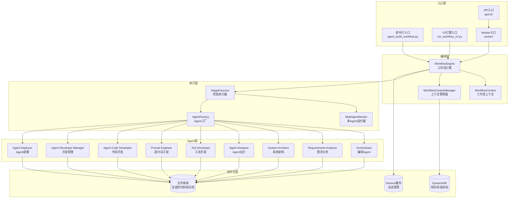

### 2.2 Agent构建工作流阶段定义

Agent构建工作流（`agent_build`）包含9个阶段，按依赖关系顺序执行：

```mermaid
graph LR
    S1[1. orchestrator<br/>工作流编排] --> S2[2. requirements_analysis<br/>需求分析]
    S2 --> S3[3. system_architecture<br/>系统架构设计]
    S3 --> S4[4. agent_design<br/>Agent设计]
    S4 --> S5[5. tools_developer<br/>工具开发]
    S5 --> S6[6. prompt_engineer<br/>提示词工程]
    S5 --> S7[7. agent_code_developer<br/>代码开发]
    S6 --> S7
    S7 --> S8[8. agent_developer_manager<br/>开发管理]
    S8 --> S9[9. agent_deployer<br/>Agent部署]

    style S1 fill:#e1f5ff
    style S2 fill:#e1f5ff
    style S3 fill:#e1f5ff
    style S4 fill:#fff4e1
    style S5 fill:#fff4e1
    style S6 fill:#fff4e1
    style S7 fill:#ffe1f5
    style S8 fill:#e1ffe1
    style S9 fill:#f0f0f0,stroke-dasharray: 5 5
```

**阶段详细配置**:

| 序号 | 阶段名称 | 显示名称 | 前置依赖 | 支持迭代 | 可选 |
|------|---------|---------|---------|---------|------|
| 1 | `orchestrator` | 工作流编排 | 无 | ❌ | ❌ |
| 2 | `requirements_analysis` | 需求分析 | orchestrator | ❌ | ❌ |
| 3 | `system_architecture` | 系统架构设计 | requirements_analysis | ❌ | ❌ |
| 4 | `agent_design` | Agent设计 | system_architecture | ✅ | ❌ |
| 5 | `tools_developer` | 工具开发 | agent_design | ✅ | ❌ |
| 6 | `prompt_engineer` | 提示词工程 | tools_developer | ✅ | ❌ |
| 7 | `agent_code_developer` | 代码开发 | tools_developer, prompt_engineer | ✅ | ❌ |
| 8 | `agent_developer_manager` | 开发管理 | agent_code_developer | ❌ | ❌ |
| 9 | `agent_deployer` | Agent部署 | agent_developer_manager | ❌ | ✅ |

> **注意**: `agent_code_developer`阶段有两个前置依赖（`tools_developer`和`prompt_engineer`），这意味着工具开发和提示词工程都完成后才能开始代码开发。`agent_deployer`阶段标记为可选（`optional: true`），可根据需要跳过。

### 2.3 阶段命名兼容映射

由于历史原因，部分阶段存在旧命名，系统通过`legacy_name_mapping`实现兼容：

```yaml
# config/workflows.yaml 中的兼容映射
legacy_name_mapping:
  requirements_analyzer: "requirements_analysis"
  system_architect: "system_architecture"
  agent_designer: "agent_design"
  tool_developer: "tools_developer"
```

`normalize_stage_name()`函数会自动将旧名称转换为标准名称，确保向后兼容。

## 3. V1顺序编排执行流程

### 3.1 执行流程总览

V1版本通过`agent_build_workflow.py`中的`run_workflow()`函数实现，采用硬编码的顺序调用方式：

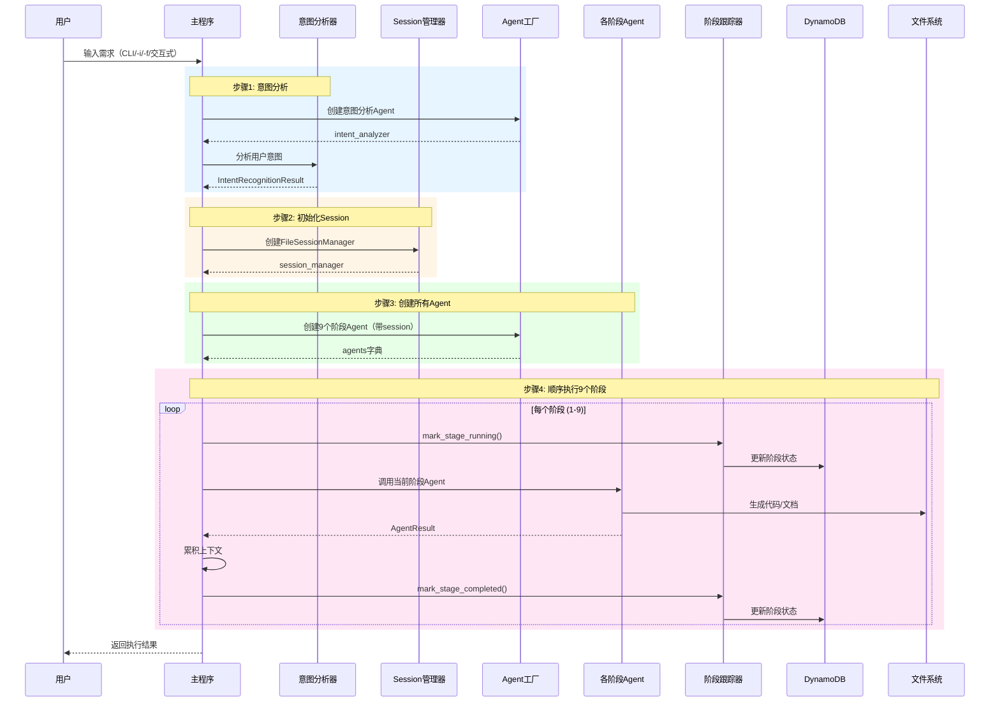

### 3.2 关键执行步骤详解

#### 步骤1: 意图分析

工作流首先通过专用的意图分析Agent解析用户输入，判断是新建项目还是继续已有项目：

```python
# 创建意图分析Agent（不使用session manager）
intent_analyzer = create_agent_from_prompt_template(
    agent_name="system_agents_prompts/agent_build_workflow/agent_intent_analyzer",
    nocallback=True,
    **agent_params
)

# 分析用户意图
intent_structured_result = analyze_user_intent(user_input)
# 返回 IntentRecognitionResult 对象，包含:
# - intent_type: "new_project" / "existing_project" / "unclear"
# - mentioned_project_name: 项目名称（如果有）
# - project_exists: 项目是否已存在
# - orchestrator_guidance: 给编排器的处理建议
```

#### 步骤2: Session管理初始化

使用Strands框架的`FileSessionManager`实现会话持久化，所有阶段Agent共享同一个Session：

```python
# 创建Session管理器
session_manager = FileSessionManager(
    session_id=session_id,  # UUID格式
    storage_dir="./.cache/session_cache"
)
```

#### 步骤3: 批量创建Agent

通过`_create_agents_with_session()`函数一次性创建所有9个阶段Agent：

```python
def _create_agents_with_session(session_manager):
    """创建带session管理的agents"""
    agent_kwargs = {
        "env": "production",
        "version": "latest",
        "model_id": "default",
        "enable_logging": True,
        "session_manager": session_manager
    }
    
    # 创建各个agent
    agents = {
        "orchestrator": create_agent_from_prompt_template(
            agent_name="system_agents_prompts/agent_build_workflow/orchestrator",
            **agent_kwargs
        ),
        "requirements_analyzer": create_agent_from_prompt_template(
            agent_name="system_agents_prompts/agent_build_workflow/requirements_analyzer",
            **agent_kwargs
        ),
        # ... 其余7个Agent类似创建
    }
    return agents
```

#### 步骤4: 顺序执行与上下文累积

每个阶段执行后，其输出会被累积到上下文中，传递给下一个阶段：

```python
# 上下文累积模式
base_context = workflow_input  # 包含规则 + 意图分析 + 用户输入

# 阶段1: Orchestrator
orchestrator_result = agents["orchestrator"](current_context)
current_context = base_context + "\n===\nOrchestrator Agent: " + orchestrator_content + "\n===\n"

# 阶段2: Requirements Analyzer（接收Orchestrator的输出作为上下文）
requirements_result = agents["requirements_analyzer"](current_context)
current_context = base_context + "\n===\nRequirements Analyzer Agent: " + requirements_content + "\n===\n"

# 后续阶段类似...
# 注意: 阶段5-7的上下文是累积的（current_context += ...）
# 而阶段1-4和阶段8是重置的（current_context = base_context + ...）
```

### 3.3 断点续传机制

V1版本通过环境变量实现简单的断点续传：

```python
# 设置恢复起始阶段
os.environ["NEXUS_RESUME_FROM_STAGE"] = "tools_developer"

# 阶段跳过逻辑
def _should_skip_stage(stage_name, resume_from_stage, stage_order):
    """判断是否应该跳过指定阶段"""
    if not resume_from_stage:
        return False
    current_index = stage_order.index(stage_name)
    resume_index = stage_order.index(resume_from_stage)
    return current_index < resume_index  # 跳过恢复点之前的阶段
```

### 3.4 输入模式

V1支持四种输入模式：

```bash
# 1. 交互式需求收集（默认）
source venv/bin/activate && python agents/system_agents/agent_build_workflow/agent_build_workflow.py

# 2. 直接输入需求
source venv/bin/activate && python agents/system_agents/agent_build_workflow/agent_build_workflow.py \
  -i "创建一个AWS定价Agent"

# 3. 从文件读取需求
source venv/bin/activate && python agents/system_agents/agent_build_workflow/agent_build_workflow.py \
  -f requirements.txt

# 4. 交互式模式（显式指定）
source venv/bin/activate && python agents/system_agents/agent_build_workflow/agent_build_workflow.py \
  -it
```

## 4. V2引擎驱动执行流程

### 4.1 WorkflowEngine核心架构

V2版本通过`WorkflowEngine`类实现更灵活的工作流控制：

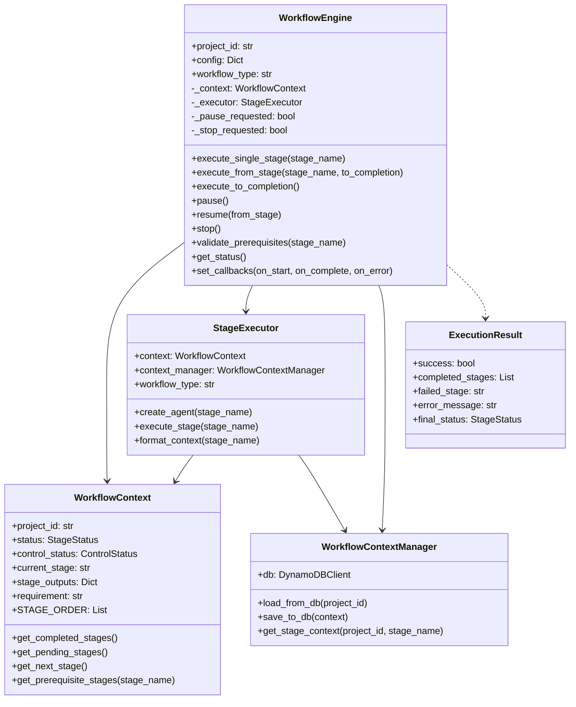

### 4.2 V2执行流程

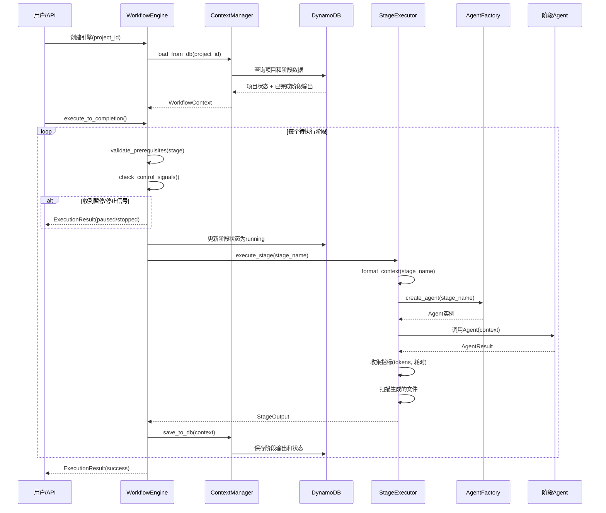

### 4.3 前置依赖验证

V2引擎在执行每个阶段前会严格验证前置依赖：

```python
def validate_prerequisites(self, stage_name: str) -> bool:
    """
    验证指定阶段的前置阶段是否已完成
    
    例如: agent_code_developer 需要 tools_developer 和 prompt_engineer 都完成
    """
    # 从WorkflowContext获取前置阶段列表
    prerequisites = self.context.get_prerequisite_stages(stage_name)
    completed = set(self.context.get_completed_stages())
    
    # 检查是否有未完成的前置阶段
    missing = [p for p in prerequisites if p not in completed]
    
    if missing:
        raise PrerequisiteError(stage_name, missing)
    
    return True
```

### 4.4 控制信号机制

V2引擎支持通过DynamoDB实现远程控制（暂停/恢复/停止）：

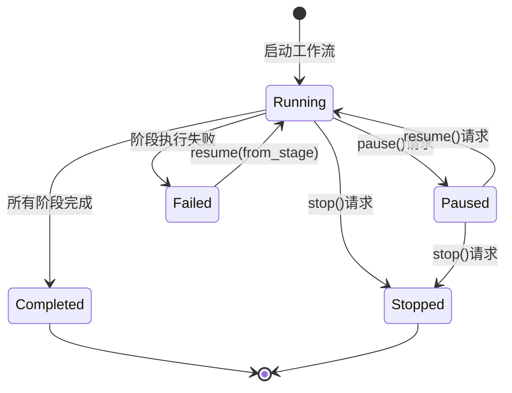

**控制信号检查时机**:
1. 每个阶段开始执行前
2. 阶段状态更新后
3. 阶段执行完成后

```python
def _check_control_signals(self) -> None:
    """检查控制信号（从数据库刷新最新状态）"""
    # 从DynamoDB重新加载控制状态
    self._refresh_control_status()
    
    if self.context.control_status == ControlStatus.STOPPED:
        raise WorkflowControlSignal(WorkflowControlSignal.STOP)
    
    if self.context.control_status == ControlStatus.PAUSED:
        raise WorkflowControlSignal(WorkflowControlSignal.PAUSE)
```

### 4.5 多Agent迭代执行

对于标记为`supports_iteration: true`的阶段（如`agent_design`、`tools_developer`等），V2引擎支持多Agent迭代执行：

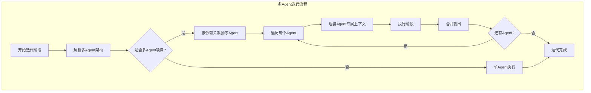

**核心组件**:

- **MultiAgentIterator** (`nexus_utils/workflow/multi_agent.py`): 从`agent_design`阶段的输出中解析多Agent架构定义，按依赖关系排序Agent，为每个Agent组装专属上下文
- **MultiAgentStageExecutor**: 对支持迭代的阶段，为每个Agent分别执行该阶段，并合并输出结果

```python
# 判断是否需要迭代执行
def should_iterate(self, stage_name: str) -> bool:
    """检查阶段是否支持迭代且项目包含多个Agent"""
    return (
        is_iterative_stage(stage_name, self.workflow_type)
        and self.multi_agent_iterator.is_multi_agent
    )
```

## 5. 上下文管理机制

### 5.1 上下文数据流

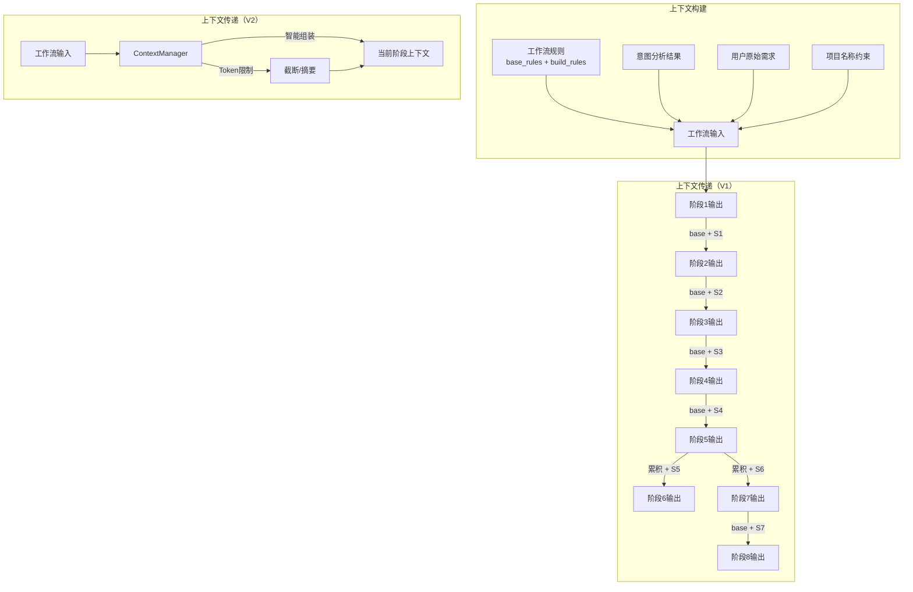

### 5.2 V2上下文智能管理

V2的`WorkflowContextManager`提供了更智能的上下文管理：

**Token限制控制**:
```yaml
# config/workflows.yaml 默认配置
context:
  max_tokens: 100000          # 最大上下文token数
  summary_threshold_tokens: 5000  # 触发摘要的阈值
  include_rules: true          # 是否包含工作流规则
  include_local_docs: true     # 是否包含本地文档
```

**上下文组装策略**:
```python
def get_stage_context(self, project_id, stage_name):
    """
    为指定阶段组装上下文
    
    策略:
    1. 加载工作流规则（如果配置启用）
    2. 加载用户需求
    3. 加载前置阶段的输出（按依赖关系）
    4. 如果总token超过限制，对早期阶段输出进行摘要
    5. 加载本地文档（如果配置启用）
    """
```

**输出摘要机制**:
```python
def summarize_stage_output(content: str, max_tokens: int = 2000) -> str:
    """
    当阶段输出过长时，生成摘要版本
    
    策略:
    1. 估算内容的token数
    2. 如果超过阈值，截取关键部分
    3. 保留结构化数据（JSON）的完整性
    4. 添加摘要标记
    """
```

## 6. 阶段状态跟踪

### 6.1 状态模型

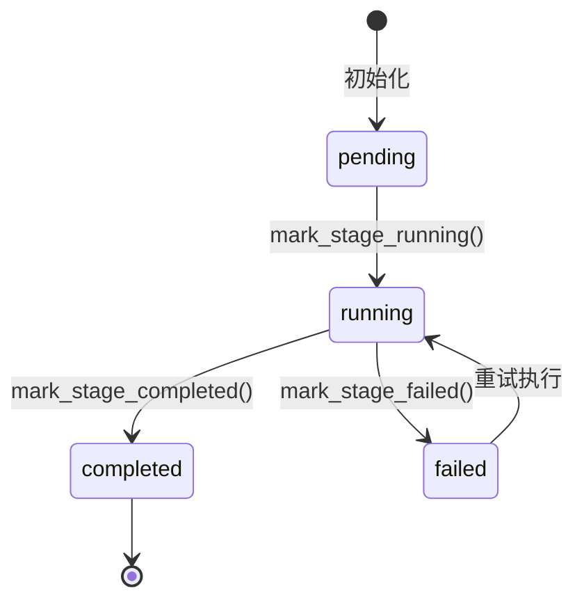

**状态枚举定义**:

| 状态 | 值 | 说明 |
|------|---|------|
| `PENDING` | `"pending"` | 等待执行 |
| `RUNNING` | `"running"` | 正在执行 |
| `COMPLETED` | `"completed"` | 执行完成 |
| `FAILED` | `"failed"` | 执行失败 |
| `PAUSED` | `"paused"` | 已暂停 |

### 6.2 StageTracker工作机制

`StageTracker`模块已重构为使用API v2的`stage_service`，所有状态更新写入DynamoDB的`nexus_stages`表：

```python
# 标记阶段为运行中
mark_stage_running(project_id, stage_name)
# 内部调用: stage_service_v2.mark_stage_running(project_id, stage_name)

# 标记阶段为完成（附带输出数据）
mark_stage_completed(project_id, stage_name, output_data, doc_path)
# 内部调用: stage_service_v2.mark_stage_completed(...)

# 标记阶段为失败（附带错误信息）
mark_stage_failed(project_id, stage_name, error_message)
# 内部调用: stage_service_v2.mark_stage_failed(...)
```

### 6.3 执行指标收集

每个阶段执行完成后，`StageExecutor`会收集详细的执行指标：

```python
class StageMetrics:
    """阶段执行指标"""
    duration_seconds: float      # 执行耗时（秒）
    input_tokens: int            # 输入Token数
    output_tokens: int           # 输出Token数
    total_tokens: int            # 总Token数（计算属性）
    tool_calls: int              # 工具调用次数
    model_invocations: int       # 模型调用次数
    files_generated: int         # 生成文件数
    errors: int                  # 错误数
```

**聚合指标**（`AggregatedMetrics`）在工作流级别汇总所有阶段的指标数据。

## 7. 工作流配置详解

### 7.1 配置文件结构

所有工作流配置集中在`config/workflows.yaml`中，由`WorkflowConfigManager`单例加载和管理：

```yaml
# config/workflows.yaml 结构概览

# 工作流版本
version: "1.0.0"

# 默认配置（所有工作流共享）
defaults:
  execution:
    max_retries: 3                    # 阶段失败最大重试次数
    retry_delay_seconds: 5            # 重试间隔（秒）
    stage_timeout_seconds: 3600       # 单阶段超时时间（1小时）
    total_timeout_seconds: 21600      # 总工作流超时时间（6小时）
    checkpoint_interval_seconds: 60   # 检查点保存间隔
  context:
    max_tokens: 100000                # 最大上下文token数
    summary_threshold_tokens: 5000    # 触发摘要的阈值
    include_rules: true               # 是否包含工作流规则
    include_local_docs: true          # 是否包含本地文档

# 工作流定义
agent_build:
  name: "Agent Build Workflow"
  display_name: "Agent 构建工作流"
  enabled: true
  prompt_base_path: "system_agents_prompts/agent_build_workflow"
  stages:
    - name: "orchestrator"
      display_name: "工作流编排"
      prompt_file: "orchestrator"
      order: 1
      prerequisites: []
      supports_iteration: false
      optional: false
    # ... 其余阶段
```

### 7.2 配置加载机制

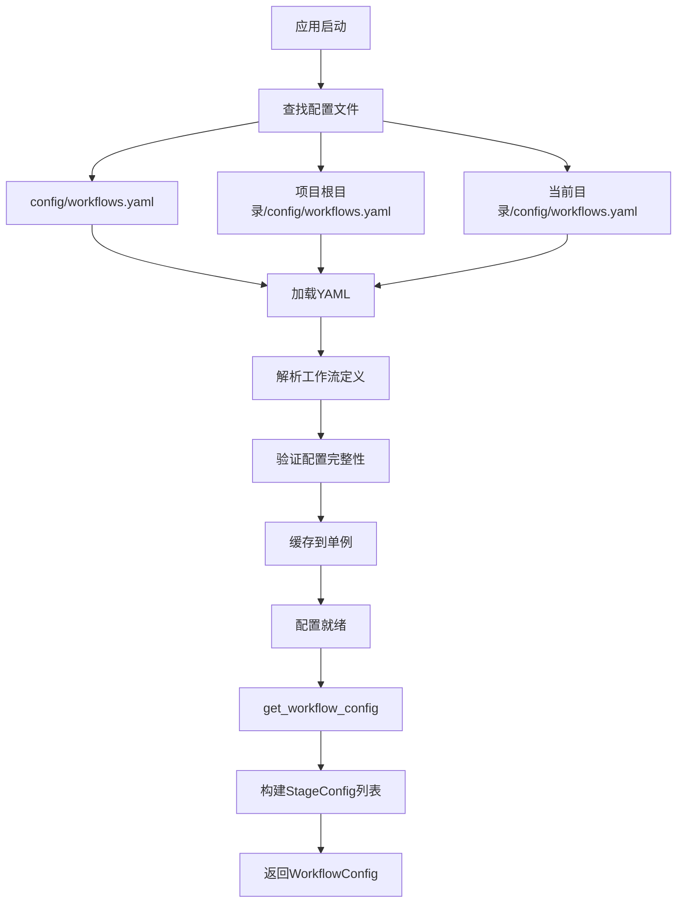

**WorkflowConfigManager**是单例模式，配置只加载一次：

```python
from nexus_utils.workflow_config import get_workflow_config

# 获取Agent构建工作流配置
config = get_workflow_config("agent_build")

# 获取阶段序列
stages = config.get_stage_sequence()
# ['orchestrator', 'requirements_analysis', 'system_architecture', ...]

# 获取支持迭代的阶段
iterative = config.get_iterative_stages()
# ['agent_design', 'tools_developer', 'prompt_engineer', 'agent_code_developer']

# 获取可选阶段
optional = config.get_optional_stages()
# ['agent_deployer']
```

### 7.3 环境变量配置

工作流执行相关的环境变量：

| 环境变量 | 默认值 | 说明 |
|---------|--------|------|
| `BYPASS_TOOL_CONSENT` | `"true"` | 跳过工具使用确认 |
| `OTEL_EXPORTER_OTLP_ENDPOINT` | `"http://localhost:4318"` | OpenTelemetry导出端点 |
| `NEXUS_RESUME_FROM_STAGE` | 无 | V1断点续传起始阶段 |
| `NEXUS_STAGE_TRACKER_PROJECT_ID` | 无 | 指定项目ID |
| `NEXUS_AUTO_SYNC_TO_S3` | `"false"` | 构建完成后自动同步到S3 |

## 8. 工作流执行示例

### 8.1 V1命令行执行

```bash
# 基本执行（交互式收集需求）
source venv/bin/activate && python \
  agents/system_agents/agent_build_workflow/agent_build_workflow.py

# 批处理模式（直接提供需求）
source venv/bin/activate && python \
  agents/system_agents/agent_build_workflow/agent_build_workflow.py \
  -i "创建一个AWS产品报价Agent，支持EC2、S3、RDS等核心产品"

# 从文件读取需求
source venv/bin/activate && python \
  agents/system_agents/agent_build_workflow/agent_build_workflow.py \
  -f requirements.txt

# 指定Session ID（恢复会话）
source venv/bin/activate && python \
  agents/system_agents/agent_build_workflow/agent_build_workflow.py \
  -i "创建一个数据分析Agent" \
  -s "550e8400-e29b-41d4-a716-446655440000"

# 构建完成后自动同步到S3
source venv/bin/activate && python \
  agents/system_agents/agent_build_workflow/agent_build_workflow.py \
  -i "创建一个客服Agent" \
  --sync-to-s3
```

**执行输出示例**:
```
================================================================================
🎯 [WORKFLOW] 开始工作流执行
================================================================================
🔍 [STEP 1] 分析用户意图...
📊 意图类型:    new_project
📊 提到的项目:  aws_pricing_agent
📊 项目存在:    False

🔑 [STEP 2] 生成新的session_id: 550e8400-...
🏗️ [STEP 3] 创建构建工作流agents（带session管理）...

⚡ [STEP 4] 执行工作流
📋 预计执行阶段:
  1️⃣ orchestrator - 工作流编排
  2️⃣ requirements_analyzer - 需求分析
  ...
  9️⃣ agent_deployer - Agent部署

============================================================
🔄 [1/9] 执行 orchestrator...
✅ 阶段完成

🔄 [2/9] 执行 requirements_analyzer...
✅ 阶段完成
...

⏱️ 实际执行时间: 485.32秒
✅ 工作流执行完成
📄 报告路径: projects/aws_pricing_agent/workflow_report.md
```

### 8.2 V2引擎执行

```bash
# 新建项目
source venv/bin/activate && python \
  agents/system_agents/agent_build_workflow/run_workflow_v2.py \
  -i "创建一个AWS定价Agent"

# 继续已有项目
source venv/bin/activate && python \
  agents/system_agents/agent_build_workflow/run_workflow_v2.py \
  --project-id 550e8400-e29b-41d4-a716-446655440000

# 从指定阶段开始
source venv/bin/activate && python \
  agents/system_agents/agent_build_workflow/run_workflow_v2.py \
  --project-id 550e8400-... \
  --from-stage agent_designer

# 查看项目状态
source venv/bin/activate && python \
  agents/system_agents/agent_build_workflow/run_workflow_v2.py \
  --project-id 550e8400-... \
  --status
```

### 8.3 编程接口调用

```python
# V1接口
from agents.system_agents.agent_build_workflow.agent_build_workflow import run_workflow

result = run_workflow(
    user_input="创建一个AWS定价Agent",
    session_id="my-session-id",
    project_name="aws_pricing_agent"
)
print(f"状态: {result['status']}")
print(f"执行时间: {result['execution_time']:.2f}秒")
print(f"执行顺序: {result['execution_order']}")

# V2接口
from nexus_utils.workflow.engine import WorkflowEngine

# 创建引擎
engine = WorkflowEngine(project_id="my-project-id")

# 设置回调
engine.set_callbacks(
    on_stage_start=lambda name: print(f"开始: {name}"),
    on_stage_complete=lambda name, output: print(f"完成: {name}"),
    on_stage_error=lambda name, err: print(f"失败: {name} - {err}"),
)

# 执行到完成
result = engine.execute_to_completion()

# 或从指定阶段执行
result = engine.execute_from_stage("tools_developer", to_completion=True)

# 获取状态
status = engine.get_status()
print(f"已完成: {status['completed_stages']}")
print(f"待执行: {status['pending_stages']}")
```

## 9. 其他工作流类型

### 9.1 Agent更新工作流

用于更新已有Agent的功能和配置，包含5个阶段：

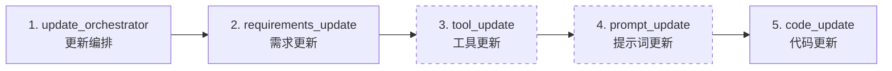

> 虚线边框表示可选阶段（`tool_update`和`prompt_update`）

### 9.2 工具构建工作流

专门用于构建工具函数，包含6个阶段：

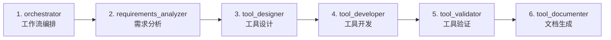

### 9.3 Magician智能路由

Magician工作流只有一个阶段，负责智能识别用户意图并路由到合适的工作流：

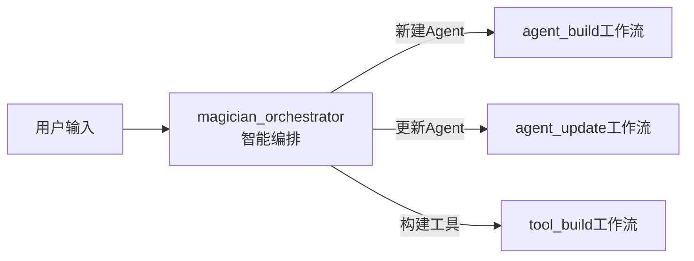

## 10. 工作流产出物

### 10.1 Agent构建工作流产出

工作流执行完成后，会在`projects/`目录下生成完整的项目结构：

```
projects/<project_name>/
├── docs/                        # 文档目录
│   ├── requirements.md          # 需求文档（阶段2产出）
│   ├── architecture.md          # 架构文档（阶段3产出）
│   ├── design.md               # 设计文档（阶段4产出）
│   └── deployment.md           # 部署指南（阶段8产出）
├── agents/generated_agents/     # Agent代码（阶段7产出）
│   └── <agent_name>/
│       └── <agent_name>.py
├── tools/generated_tools/       # 工具代码（阶段5产出）
│   └── <agent_name>/
│       └── <tool_name>.py
├── prompts/generated_agents_prompts/  # 提示词模板（阶段6产出）
│   └── <agent_name>.yaml
├── tests/                       # 测试文件（阶段8产出）
│   └── test_<agent_name>.py
└── workflow_report.md           # 工作流执行报告
```

### 10.2 执行报告

工作流完成后会自动生成执行报告，包含：
- 各阶段执行时间和Token消耗
- 意图分析结果
- 生成的文件清单
- 执行顺序和状态

```python
# 报告生成
from nexus_utils.workflow_report_generator import generate_sequential_workflow_report

report_path = generate_sequential_workflow_report(
    execution_results=execution_results,
    execution_order=execution_order,
    execution_time=execution_duration,
    intent_analysis=intent_structured_result,
    default_project_root_path='./projects'
)
```

### 10.3 S3同步（可选）

构建完成后可自动将Agent文件同步到S3：

```python
from nexus_utils.artifact_sync import sync_agent_to_s3

sync_result = sync_agent_to_s3(
    agent_name="aws_pricing_agent",
    version_tag=f"build-{datetime.now().strftime('%Y%m%d%H%M%S')}",
    notes="Auto-sync after agent build workflow completion",
    base_path="."
)
# 返回: version_uuid, files_synced, total_size, duration_seconds
```

## 11. 错误处理与容错

### 11.1 阶段级错误处理

每个阶段的执行都包裹在try/except中，失败时会：
1. 调用`mark_stage_failed()`记录失败状态和错误信息
2. 保存当前上下文到DynamoDB
3. 向上抛出异常，终止工作流

```python
# V1错误处理模式
try:
    mark_stage_running(project_id, 'requirements_analysis')
    requirements_result = agents["requirements_analyzer"](current_context)
    mark_stage_completed(project_id, 'requirements_analysis', output_data)
except Exception as e:
    mark_stage_failed(project_id, 'requirements_analysis', str(e))
    raise  # 终止工作流
```

### 11.2 V2引擎错误恢复

V2引擎提供了更完善的错误恢复机制：

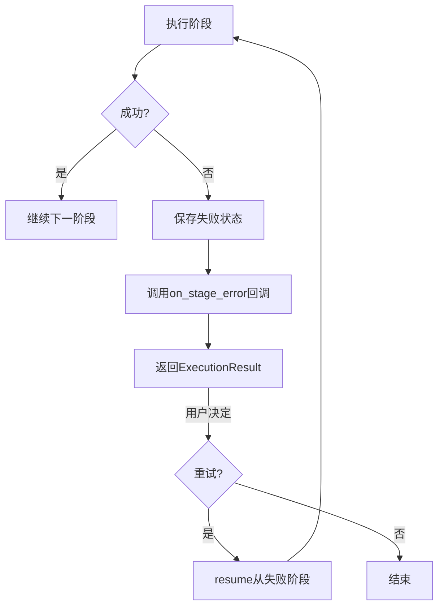

```python
# 从失败阶段恢复
engine = WorkflowEngine(project_id="failed-project-id")

# 查看状态
status = engine.get_status()
print(f"失败阶段: {status['current_stage']}")
print(f"已完成: {status['completed_stages']}")

# 从失败阶段重新执行
engine.resume(from_stage=status['current_stage'])
result = engine.execute_to_completion()
```

### 11.3 输出解析容错

`_parse_stage_output()`函数实现了多层容错的JSON解析：

```python
def _parse_stage_output(content: str) -> Optional[Dict]:
    """
    解析阶段输出，多层容错策略:
    1. 直接JSON解析
    2. 从Markdown代码块中提取JSON
    3. 查找最大的有效JSON对象
    4. 返回原始内容的截断版本（兜底）
    """
```

## 12. 性能特征

### 12.1 执行时间参考

| 工作流类型 | 典型执行时间 | 阶段数 | 说明 |
|-----------|-------------|--------|------|
| Agent构建 | 5-15分钟 | 9 | 取决于需求复杂度 |
| Agent更新 | 2-8分钟 | 5 | 取决于更新范围 |
| 工具构建 | 3-10分钟 | 6 | 取决于工具复杂度 |
| Magician路由 | 10-30秒 | 1 | 仅意图识别 |

### 12.2 资源消耗

| 指标 | 典型值 | 说明 |
|------|--------|------|
| 总Token消耗 | 50,000-200,000 | 所有阶段累计 |
| 内存占用 | 200-500MB | 包含所有Agent实例 |
| 生成文件数 | 10-20个 | 代码+文档+配置 |
| 生成代码行数 | 500-2,000行 | 取决于功能复杂度 |

### 12.3 超时配置

```yaml
# config/workflows.yaml
defaults:
  execution:
    stage_timeout_seconds: 3600       # 单阶段超时: 1小时
    total_timeout_seconds: 21600      # 总工作流超时: 6小时
    max_retries: 3                    # 最大重试次数
    retry_delay_seconds: 5            # 重试间隔
```

## 13. 相关文档

### 13.1 核心模块文档
- [Agent Factory System](../modules/01-agent-factory.md) - Agent工厂系统详解
- [Agent Build Workflow](../modules/05-agent-build-workflow.md) - 工作流模块详解
- [Configuration Management](../modules/08-configuration-management.md) - 配置管理系统
- [Worker System](../modules/07-worker-system.md) - Worker系统（API驱动的工作流执行）

### 13.2 架构文档
- [系统架构设计](../architecture/system-architecture.md) - 整体架构
- [数据流设计](../architecture/data-flow.md) - 数据流转详解
- [模块依赖关系](../architecture/module-dependencies.md) - 模块间依赖

### 13.3 其他业务流程
- [Agent创建流程](./agent-creation-process.md) - Agent创建详解
- [内容处理流程](./content-processing.md) - 多模态内容处理
- [部署流程](./deployment-process.md) - Agent部署指南

## 14. 总结

### 14.1 核心要点

1. **双版本架构**: V1顺序编排适合命令行直接执行，V2引擎驱动适合API和Web集成
2. **配置驱动**: 所有工作流定义集中在`config/workflows.yaml`，支持热加载
3. **状态持久化**: 通过DynamoDB实现阶段状态跟踪和断点续传
4. **控制信号**: V2支持远程暂停/恢复/停止，适合长时间运行的工作流
5. **多Agent迭代**: 支持在单个阶段内为多个Agent分别执行，适合复杂项目
6. **容错设计**: 多层错误处理、输出解析容错、失败恢复机制

### 14.2 关键文件索引

| 文件 | 说明 |
|------|------|
| `agents/system_agents/agent_build_workflow/agent_build_workflow.py` | V1工作流编排主程序 |
| `agents/system_agents/agent_build_workflow/run_workflow_v2.py` | V2工作流执行脚本 |
| `nexus_utils/workflow/engine.py` | WorkflowEngine核心引擎 |
| `nexus_utils/workflow/executor.py` | StageExecutor阶段执行器 |
| `nexus_utils/workflow/context.py` | WorkflowContextManager上下文管理 |
| `nexus_utils/workflow/models.py` | 数据模型定义 |
| `nexus_utils/workflow/multi_agent.py` | 多Agent迭代支持 |
| `nexus_utils/workflow_config.py` | 工作流配置加载器 |
| `config/workflows.yaml` | 工作流配置文件 |
| `tools/system_tools/agent_build_workflow/stage_tracker.py` | 阶段状态跟踪器 |

---

**文档版本**: 1.0  
**最后更新**: 2026-02-06  
**维护者**: Nexus-AI Team  
**文档状态**: 已完成
