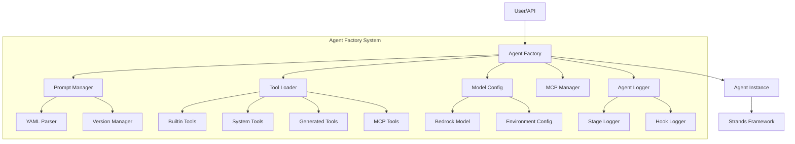
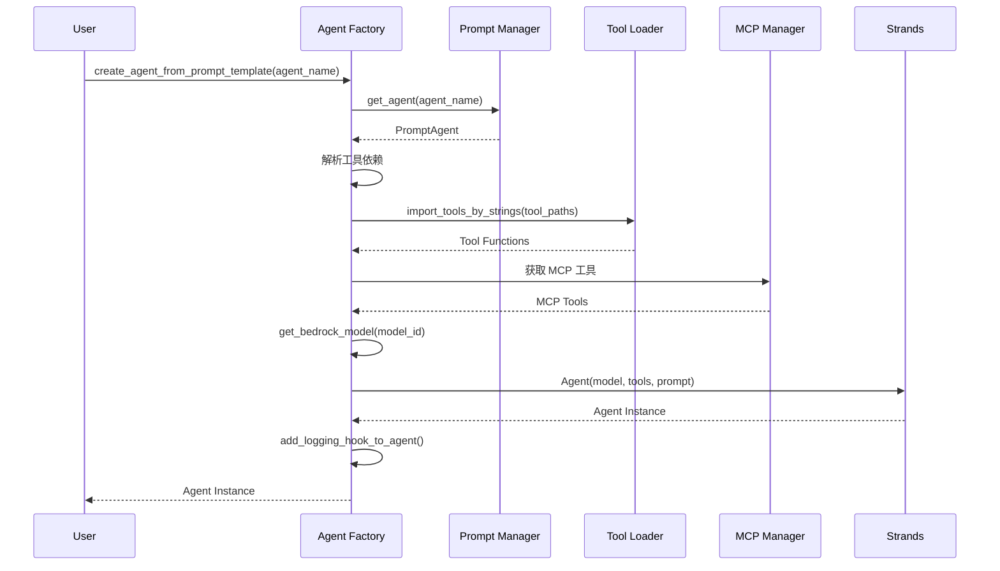

# Agent Factory System

**创建日期**: 2026-02-05  
**最后更新**: 2026-02-05  
**模块路径**: `nexus_utils/agent_factory.py`  
**维护状态**: 活跃  
**模块说明**: Agent工厂系统，负责动态创建和管理AI代理

## 1. 模块概述

### 1.1 功能描述

Agent Factory System 是 Nexus-AI 的核心模块之一，负责动态创建和管理 AI Agent。该模块实现了工厂模式，通过读取 YAML 提示词模板自动创建 Agent 实例，并处理工具依赖、模型配置和日志跟踪等功能。

**核心职责**:
- 从 YAML 提示词模板动态创建 Agent 实例
- 解析和加载 Agent 所需的工具依赖
- 管理 Agent 的模型配置和环境设置
- 提供 Agent 实例的生命周期管理
- 集成 MCP (Model Context Protocol) 工具
- 实现 Agent 调用的日志跟踪和调试

**在系统中的角色**:
Agent Factory 是连接提示词模板、工具系统和 Agent 运行时的桥梁，为整个系统提供统一的 Agent 创建接口。

### 1.2 关键特性

- **模板驱动创建**: 通过 YAML 模板定义 Agent 行为和能力
- **动态工具加载**: 自动解析和导入 Agent 所需的工具函数
- **多级路径支持**: 支持层级化的 Agent 组织结构
- **模型自动选择**: 根据 Agent 需求自动选择合适的 Bedrock 模型
- **MCP 集成**: 无缝集成 MCP 协议的外部工具
- **日志跟踪**: 完整记录 Agent 调用过程用于调试和分析
- **会话管理**: 支持多轮对话的会话状态管理

## 2. 架构设计

### 2.1 模块架构图



### 2.2 核心组件

**Agent Factory 核心**:
- `create_agent_from_prompt_template()`: 主要创建函数，从模板生成 Agent
- `get_bedrock_model()`: 获取配置的 Bedrock 模型实例
- `add_logging_hook_to_agent()`: 为 Agent 添加日志跟踪功能

**工具加载器**:
- `get_tool_by_path()`: 通过路径导入单个工具
- `get_tool_by_name()`: 通过名称动态查找工具
- `import_tools_by_strings()`: 批量导入工具列表
- `get_builtin_tools_mapping()`: 获取内置工具映射
- `get_system_tools_mapping()`: 获取系统工具映射

**Agent 管理**:
- `list_available_agents()`: 列出所有可用的 Agent 模板
- `list_available_agent_paths()`: 列出所有 Agent 的相对路径
- `get_agent_class_by_type()`: 根据类型获取 Agent 类

**日志系统**:
- `_wrap_agent_call_for_stage_logging()`: 包装 Agent 调用以记录输入
- `_wrap_model_stream_for_stage_logging()`: 包装模型流式输出以记录 Prompt
- `_append_stage_log()`: 追加日志到阶段日志文件

### 2.3 依赖关系

**依赖的模块**:
- `nexus_utils.prompts_manager`: 提示词模板管理
- `nexus_utils.config_loader`: 配置加载
- `nexus_utils.mcp.manager`: MCP 服务器管理
- `strands.models.BedrockModel`: Bedrock 模型封装
- `strands.Agent`: Strands Agent 基类
- `tools.system_tools.agent_build_workflow.tool_template_provider`: 工具模板提供器

**被依赖的模块**:
- API System: 通过 Agent Factory 创建 Agent 实例
- Worker System: 在后台任务中创建 Agent
- Agent Build Workflow: 使用 Agent Factory 创建工作流 Agent
- 所有需要创建 Agent 的模块

## 3. 核心实现

### 3.1 主要类/函数

| 名称 | 类型 | 功能描述 | 文件位置 |
|------|------|---------|---------|
| `create_agent_from_prompt_template` | 函数 | 从提示词模板创建 Agent 实例 | nexus_utils/agent_factory.py:496 |
| `get_tool_by_path` | 函数 | 通过路径导入工具函数 | nexus_utils/agent_factory.py:227 |
| `get_tool_by_name` | 函数 | 通过名称动态查找工具 | nexus_utils/agent_factory.py:355 |
| `import_tools_by_strings` | 函数 | 批量导入工具列表 | nexus_utils/agent_factory.py:444 |
| `get_bedrock_model` | 函数 | 获取 Bedrock 模型实例 | nexus_utils/agent_factory.py:117 |
| `list_available_agents` | 函数 | 列出所有可用 Agent 模板 | nexus_utils/agent_factory.py:685 |
| `add_logging_hook_to_agent` | 函数 | 添加日志跟踪 Hook | nexus_utils/agent_factory.py:728 |
| `get_builtin_tools_mapping` | 函数 | 获取内置工具映射 | nexus_utils/agent_factory.py:162 |
| `get_system_tools_mapping` | 函数 | 获取系统工具映射 | nexus_utils/agent_factory.py:183 |

### 3.2 关键流程

**Agent 创建流程**:



**工具加载流程**:

1. 解析工具路径字符串
2. 判断工具类型（builtin/system/generated/MCP）
3. 根据类型选择加载策略
4. 动态导入工具模块
5. 验证工具函数签名
6. 返回工具函数列表

### 3.3 数据结构

**Agent 配置结构** (从 YAML 模板解析):
```python
{
    "agent_name": str,
    "description": str,
    "category": str,
    "environments": {
        "production": {
            "max_tokens": int,
            "temperature": float
        }
    },
    "versions": [
        {
            "version": str,
            "system_prompt": str,
            "metadata": {
                "tools_dependencies": List[str],
                "mcp_dependencies": List[str],
                "supported_models": List[str]
            }
        }
    ]
}
```

**工具路径格式**:
- Builtin Tools: `strands_tools/calculator`
- System Tools: `system_tools/project_manager/project_init`
- Generated Tools: `generated_tools/aws_pricing_agent/aws_pricing_tool/get_aws_pricing`
- Template Tools: `template_tools/common/demo/weather_forecast`

## 4. API接口

### 4.1 公共接口

**创建 Agent**:
```python
def create_agent_from_prompt_template(
    agent_name: str,
    env: str = "production",
    version: str = "latest",
    model_id: Optional[str] = None,
    enable_logging: bool = True,
    state: Optional[Dict] = None,
    session_manager: Optional[Any] = None,
    nocallback: bool = False
) -> Optional[Agent]:
    """
    从提示词模板创建 Agent
    
    Args:
        agent_name: Agent 名称或相对路径
        env: 环境名称（production/development）
        version: 版本号（默认 latest）
        model_id: 模型 ID（可选，默认使用配置）
        enable_logging: 是否启用日志（默认 True）
        state: Agent 状态（可选）
        session_manager: 会话管理器（可选）
        nocallback: 是否禁用回调（默认 False）
    
    Returns:
        Agent 实例或 None
    """
```

**列出可用 Agent**:
```python
def list_available_agents() -> Dict[str, list]:
    """
    列出所有可用的 Agent 模板
    
    Returns:
        按类型分组的 Agent 列表
        {
            "system_agents": [...],
            "template_agents": [...],
            "generated_agents": [...]
        }
    """
```

**导入工具**:
```python
def import_tools_by_strings(tool_paths: List[str]) -> list:
    """
    批量导入工具函数
    
    Args:
        tool_paths: 工具路径列表
    
    Returns:
        工具函数列表
    """
```

### 4.2 内部接口

**工具加载**:
```python
def get_tool_by_path(tool_path: str):
    """通过路径导入工具"""

def get_tool_by_name(tool_name: str):
    """通过名称动态查找工具"""

def get_builtin_tools_mapping():
    """获取内置工具映射"""

def get_system_tools_mapping():
    """获取系统工具映射"""
```

**日志管理**:
```python
def _wrap_agent_call_for_stage_logging(agent, agent_label):
    """包装 Agent 调用以记录输入"""

def _wrap_model_stream_for_stage_logging(model, agent_label):
    """包装模型流式输出以记录 Prompt"""

def _append_stage_log(agent_label, payload):
    """追加日志到阶段日志文件"""
```

## 5. 配置说明

### 5.1 配置项

**模型配置** (config/default_config.yaml):
```yaml
bedrock:
  model_id: "us.anthropic.claude-sonnet-4-5-20250929-v1:0"
  lite_model_id: "us.anthropic.claude-3-5-haiku-20241022-v1:0"
  pro_model_id: "us.anthropic.claude-opus-4-20250514-v1:0"
```

**AWS 配置**:
```yaml
aws:
  bedrock_region_name: "us-west-2"
  aws_region_name: "us-west-2"
  aws_profile_name: "default"
```

**Strands 配置**:
```yaml
strands:
  template:
    agent_template_path: "agents/template_agents"
    prompt_template_path: "prompts/template_prompts"
  generated:
    agent_generated_path: "agents/generated_agents"
    prompt_generated_path: "prompts/generated_agents_prompts"
```

### 5.2 环境变量

| 变量名 | 说明 | 默认值 |
|--------|------|--------|
| `BYPASS_TOOL_CONSENT` | 跳过工具使用确认 | false |
| `AWS_PROFILE` | AWS 配置文件名称 | default |
| `AWS_REGION` | AWS 区域 | us-west-2 |
| `BEDROCK_REGION` | Bedrock 服务区域 | us-west-2 |

## 6. 使用示例

### 6.1 基本使用

**创建简单 Agent**:
```python
from nexus_utils.agent_factory import create_agent_from_prompt_template

# 创建 Agent
agent = create_agent_from_prompt_template(
    agent_name="requirements_analyzer",
    env="production"
)

# 调用 Agent
result = agent("请分析这个需求：创建一个AWS定价查询工具")
print(result)
```

**使用相对路径创建 Agent**:
```python
# 支持多级路径
agent = create_agent_from_prompt_template(
    agent_name="system_agents_prompts/agent_build_workflow/orchestrator"
)
```

**指定模型和版本**:
```python
agent = create_agent_from_prompt_template(
    agent_name="prompt_engineer",
    env="production",
    version="v1.0",
    model_id="us.anthropic.claude-opus-4-20250514-v1:0"
)
```

### 6.2 高级用法

**带会话管理的 Agent**:
```python
from strands.session import S3SessionManager

# 创建会话管理器
session_manager = S3SessionManager(
    session_id="user-123",
    bucket_name="my-sessions"
)

# 创建带会话的 Agent
agent = create_agent_from_prompt_template(
    agent_name="chat_assistant",
    session_manager=session_manager
)

# 多轮对话
response1 = agent("你好")
response2 = agent("我刚才说了什么？")  # Agent 能记住上下文
```

**自定义工具加载**:
```python
from nexus_utils.agent_factory import import_tools_by_strings

# 批量导入工具
tools = import_tools_by_strings([
    "strands_tools/calculator",
    "system_tools/project_manager/project_init",
    "generated_tools/aws_pricing_agent/aws_pricing_tool/get_aws_pricing"
])

# 手动创建 Agent（不推荐，仅用于特殊场景）
from strands import Agent
from nexus_utils.agent_factory import get_bedrock_model

model = get_bedrock_model("claude-sonnet", "my_agent")
agent = Agent(
    model=model,
    tools=tools,
    system_prompt="你是一个专业的助手"
)
```

**列出可用 Agent**:
```python
from nexus_utils.agent_factory import list_available_agents

# 获取所有可用 Agent
agents = list_available_agents()

print("系统 Agent:", agents["system_agents"])
print("模板 Agent:", agents["template_agents"])
print("生成的 Agent:", agents["generated_agents"])
```

## 7. 测试覆盖

### 7.1 单元测试

**测试文件位置**: 暂无专门的单元测试文件

**建议测试场景**:
- Agent 创建成功场景
- 工具加载和验证
- 模型配置正确性
- 错误处理（模板不存在、工具加载失败等）
- 日志记录功能

### 7.2 集成测试

**测试场景**:
- 完整的 Agent 创建和调用流程
- 多种工具类型的集成
- MCP 工具集成
- 会话管理功能
- 日志跟踪完整性

## 8. 性能特征

### 8.1 性能指标

**Agent 创建时间**:
- 简单 Agent（无工具）: ~100-200ms
- 带工具 Agent: ~300-500ms
- 带 MCP 工具 Agent: ~500-1000ms

**内存占用**:
- 单个 Agent 实例: ~50-100MB
- 工具加载: 每个工具 ~1-5MB
- 模型加载: ~100-200MB

**并发能力**:
- 支持多个 Agent 实例并发创建
- 工具加载使用缓存机制
- 模型实例可复用

### 8.2 性能优化建议

1. **工具缓存**: 已加载的工具模块会被 Python 缓存，避免重复导入
2. **模型复用**: 相同模型配置的 Agent 可以共享模型实例
3. **延迟加载**: MCP 工具在首次使用时才建立连接
4. **批量创建**: 使用工厂模式批量创建相似 Agent
5. **日志异步**: 日志写入使用异步方式，不阻塞主流程

## 9. 已知限制

### 9.1 功能限制

1. **工具路径格式**: 必须严格遵循预定义的路径格式
2. **模型支持**: 仅支持 AWS Bedrock Claude 系列模型
3. **会话持久化**: 依赖 S3SessionManager，需要 S3 配置
4. **MCP 连接**: MCP 工具需要外部服务器运行
5. **日志存储**: 阶段日志存储在本地文件系统

### 9.2 技术债务

1. **复杂度过高**: 
   - `create_agent_from_prompt_template` 函数过长（187行）
   - `get_tool_by_path` 函数复杂度高（圈复杂度18）
   - `get_tool_by_name` 函数复杂度高（圈复杂度25）

2. **错误处理**: 部分错误场景处理不够完善

3. **文档缺失**: `get_bedrock_model` 函数缺少文档字符串

4. **测试覆盖**: 缺少系统的单元测试和集成测试

5. **代码重复**: 工具加载逻辑存在一定重复

## 10. 相关文档

- [Prompt Management 模块文档](./02-prompt-management.md)
- [MCP Integration 模块文档](./03-mcp-integration.md)
- [Tool System 模块文档](./09-tool-system.md)
- [Configuration Management 模块文档](./08-configuration-management.md)
- [Agent Build Workflow 模块文档](./05-agent-build-workflow.md)
- [架构总览文档](../ARCHITECTURE_OVERVIEW.md)
- [系统架构文档](../architecture/system-architecture.md)

---

**文档版本**: 1.0  
**最后更新**: 2026-02-05  
**维护者**: Nexus-AI Team
