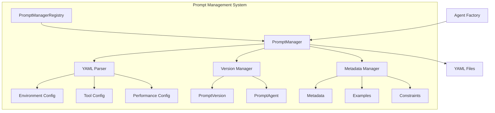
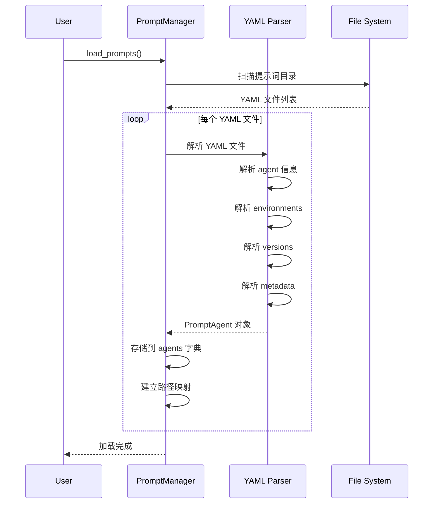

# Prompt Management System

**创建日期**: 2026-02-05  
**最后更新**: 2026-02-05  
**模块路径**: `nexus_utils/prompts_manager.py`  
**维护状态**: 活跃  
**模块说明**: 提示词管理系统，负责YAML提示词模板的加载、解析、版本管理和元数据处理

## 1. 模块概述

### 1.1 功能描述

Prompt Management System 是 Nexus-AI 的核心模块之一，负责管理所有 Agent 的提示词模板。该模块实现了单例模式和工厂模式，通过 YAML 文件定义 Agent 的行为、能力和配置，支持多版本管理和环境配置。

**核心职责**:
- 加载和解析 YAML 提示词模板文件
- 管理 Agent 提示词的多版本
- 提供环境特定的配置（development/production）
- 解析和管理元数据（工具依赖、MCP依赖、性能指标等）
- 支持提示词模板的动态重载
- 提供提示词查询和检索接口

**在系统中的角色**:
Prompt Management 是 Agent Factory 的核心依赖，为 Agent 创建提供提示词模板和配置信息。

### 1.2 关键特性

- **YAML 模板驱动**: 使用结构化 YAML 定义 Agent 提示词
- **版本管理**: 支持多版本提示词，自动选择最新版本
- **环境配置**: 支持不同环境的配置（温度、Token限制等）
- **元数据管理**: 管理工具依赖、MCP依赖、性能指标等
- **单例模式**: 确保全局唯一的管理器实例
- **动态重载**: 支持运行时重新加载提示词文件
- **路径映射**: 支持多级目录结构和相对路径访问

## 2. 架构设计

### 2.1 模块架构图



### 2.2 核心组件

**数据类**:
- `EnvironmentConfig`: 环境配置（温度、Token限制、流式输出等）
- `ToolConfig`: 工具配置信息
- `PerformanceMetrics`: 性能指标（准确率、响应时间、用户满意度）
- `Compatibility`: 兼容性配置（最小版本、支持的模型）
- `Metadata`: 元数据（标签、依赖、性能指标等）
- `Example`: 示例对话
- `PromptVersion`: 单个版本的提示词内容和元数据
- `PromptAgent`: Agent 提示词管理类，包含多个版本

**管理类**:
- `PromptManager`: 提示词管理器（单例模式）
- `PromptManagerRegistry`: 管理器注册表（工厂模式）

### 2.3 依赖关系

**依赖的模块**:
- `yaml`: YAML 文件解析
- `pathlib`: 文件路径处理
- `dataclasses`: 数据类定义
- `typing`: 类型注解

**被依赖的模块**:
- Agent Factory: 从 Prompt Manager 获取提示词模板
- API System: 查询可用的 Agent 和提示词
- Agent Build Workflow: 生成新的提示词模板

## 3. 核心实现

### 3.1 主要类/函数

| 名称 | 类型 | 功能描述 | 文件位置 |
|------|------|---------|---------|
| `PromptManager` | 类 | 提示词管理器，单例模式 | nexus_utils/prompts_manager.py |
| `PromptAgent` | 数据类 | Agent 提示词管理类 | nexus_utils/prompts_manager.py |
| `PromptVersion` | 数据类 | 提示词版本管理类 | nexus_utils/prompts_manager.py |
| `Metadata` | 数据类 | 元数据类 | nexus_utils/prompts_manager.py |
| `PromptManagerRegistry` | 类 | 管理器注册表 | nexus_utils/prompts_manager.py |
| `load_prompts` | 方法 | 加载所有提示词文件 | nexus_utils/prompts_manager.py |
| `get_agent` | 方法 | 获取指定 Agent 的提示词 | nexus_utils/prompts_manager.py |
| `reload` | 方法 | 重新加载提示词文件 | nexus_utils/prompts_manager.py |
| `load_single_prompt` | 方法 | 加载单个提示词文件 | nexus_utils/prompts_manager.py |

### 3.2 关键流程

**提示词加载流程**:



**版本选择流程**:

1. 用户请求指定版本或 "latest"
2. 如果是 "latest"，从所有版本中选择最新版本
3. 使用语义版本排序（v1.0 < v1.1 < v2.0）
4. 返回对应的 PromptVersion 对象

### 3.3 数据结构

**YAML 模板结构**:
```yaml
agent:
  name: "agent_name"
  description: "Agent描述"
  category: "category"
  environments:
    production:
      max_tokens: 60000
      temperature: 0.3
      streaming: true
      debug_mode: false
  versions:
    - version: "latest"
      status: "stable"
      created_date: "2026-01-01"
      author: "Nexus-AI Team"
      system_prompt: |
        系统提示词内容
      user_prompt_template: |
        用户提示词模板
      context_window: 200000
      tools:
        - name: "tool_name"
          enabled: true
          description: "工具描述"
      constraints:
        - "约束条件1"
        - "约束条件2"
      examples:
        - user: "用户输入示例"
          assistant: "助手回复示例"
      metadata:
        tags: ["tag1", "tag2"]
        supported_models: ["claude-sonnet", "claude-opus"]
        lib_dependencies: ["pandas", "numpy"]
        tools_dependencies:
          - "strands_tools/calculator"
          - "system_tools/project_manager/project_init"
        mcp_dependencies:
          - "awslabs.aws-pricing-mcp-server"
        performance_metrics:
          accuracy: 0.95
          response_time: 2.5
          user_satisfaction: 4.5
        compatibility:
          min_strands_version: "1.0.0"
          supported_models: ["claude-3-5-sonnet", "claude-opus-4"]
```

## 4. API接口

### 4.1 公共接口

**获取 Agent 提示词**:
```python
def get_agent(self, agent_name: str) -> Optional[PromptAgent]:
    """
    获取指定 Agent 的提示词管理器
    
    支持 Agent 名称或相对路径
    
    Args:
        agent_name: Agent 名称或相对路径
                   如 "requirements_analyzer" 或
                   "system_agents_prompts/agent_build_workflow/orchestrator"
    
    Returns:
        PromptAgent 对象或 None
    """
```

**获取指定版本**:
```python
def get_agent_version(
    self,
    agent_name: str,
    version: str = "latest"
) -> Optional[PromptVersion]:
    """
    获取指定 Agent 的指定版本提示词
    
    Args:
        agent_name: Agent 名称或相对路径
        version: 版本号，默认 "latest"
    
    Returns:
        PromptVersion 对象或 None
    """
```

**重新加载提示词**:
```python
def reload(self) -> None:
    """
    重新加载所有提示词文件
    
    用于在运行时动态加载新增的提示词文件，无需重启服务
    """
```

**加载单个提示词**:
```python
def load_single_prompt(self, prompt_file_path: str) -> bool:
    """
    加载单个提示词文件
    
    用于在部署新 Agent 后动态加载其提示词，无需重新加载全部文件
    
    Args:
        prompt_file_path: 提示词文件的完整路径或相对于项目根目录的路径
    
    Returns:
        bool: 是否加载成功
    """
```

### 4.2 内部接口

**解析方法**:
```python
def _parse_environment_config(self, env_data: Dict) -> EnvironmentConfig:
    """解析环境配置"""

def _parse_tool_config(self, tool_data: Dict) -> ToolConfig:
    """解析工具配置"""

def _parse_metadata(self, metadata_data: Dict) -> Metadata:
    """解析元数据，支持 MCP 依赖"""

def _parse_examples(self, examples_data: List) -> List[Example]:
    """解析示例对话"""
```

**查询方法**:
```python
def get_agents_by_category(self, category: str) -> List[str]:
    """根据类别获取 Agent 列表"""

def get_agents_by_tag(self, tag: str) -> List[str]:
    """根据标签获取 Agent 列表"""

def get_agent_supported_models(
    self,
    agent_name: str,
    version: str = "latest"
) -> Optional[List[str]]:
    """获取 Agent 支持的模型列表"""
```

## 5. 配置说明

### 5.1 配置项

**提示词目录配置** (config/default_config.yaml):
```yaml
strands:
  template:
    prompt_template_path: "prompts/template_prompts"
  generated:
    prompt_generated_path: "prompts/generated_agents_prompts"
```

**系统 Agent 提示词目录**:
- `prompts/system_agents_prompts/`: 系统 Agent 提示词
- `prompts/template_prompts/`: 模板 Agent 提示词
- `prompts/generated_agents_prompts/`: 生成的 Agent 提示词

### 5.2 环境变量

无特定环境变量，使用配置文件管理。

## 6. 使用示例

### 6.1 基本使用

**获取 Agent 提示词**:
```python
from nexus_utils.prompts_manager import PromptManagerRegistry

# 获取默认管理器实例
manager = PromptManagerRegistry.get_default_instance()

# 获取 Agent 提示词
agent = manager.get_agent("requirements_analyzer")
print(f"Agent: {agent.agent_name}")
print(f"Description: {agent.description}")
print(f"Category: {agent.category}")

# 获取最新版本
latest_version = agent.get_version("latest")
print(f"System Prompt: {latest_version.system_prompt}")
```

**使用相对路径**:
```python
# 支持多级路径
agent = manager.get_agent(
    "system_agents_prompts/agent_build_workflow/orchestrator"
)
```

**获取环境配置**:
```python
# 获取生产环境配置
prod_config = agent.get_environment_config("production")
print(f"Max Tokens: {prod_config.max_tokens}")
print(f"Temperature: {prod_config.temperature}")
```

### 6.2 高级用法

**查询 Agent**:
```python
# 获取所有 Agent
all_agents = manager.get_all_agents()
print(f"Total Agents: {len(all_agents)}")

# 按类别查询
analysis_agents = manager.get_agents_by_category("analysis")
print(f"Analysis Agents: {analysis_agents}")

# 按标签查询
workflow_agents = manager.get_agents_by_tag("workflow")
print(f"Workflow Agents: {workflow_agents}")
```

**获取依赖信息**:
```python
# 获取工具依赖
tools = manager.get_agent_tools_dependencies("requirements_analyzer")
print(f"Tool Dependencies: {tools}")

# 获取 MCP 依赖
mcp_deps = manager.get_agent_mcp_dependencies("aws_pricing_agent")
print(f"MCP Dependencies: {mcp_deps}")

# 获取库依赖
libs = manager.get_agent_lib_dependencies("data_analyst")
print(f"Library Dependencies: {libs}")
```

**动态重载**:
```python
# 重新加载所有提示词
manager.reload()

# 加载单个新提示词
success = manager.load_single_prompt(
    "prompts/generated_agents_prompts/new_agent.yaml"
)
print(f"Load Success: {success}")
```

**版本管理**:
```python
# 获取所有版本
versions = agent.get_all_versions()
for version in versions:
    print(f"Version: {version.version}, Status: {version.status}")

# 获取特定版本
v1 = manager.get_agent_version("requirements_analyzer", "v1.0")
print(f"V1.0 Prompt: {v1.system_prompt}")
```

## 7. 测试覆盖

### 7.1 单元测试

**测试文件位置**: 暂无专门的单元测试文件

**建议测试场景**:
- YAML 文件解析正确性
- 版本选择逻辑
- 路径映射功能
- 元数据解析
- 环境配置解析
- 错误处理（文件不存在、格式错误等）

### 7.2 集成测试

**测试场景**:
- 与 Agent Factory 的集成
- 多级目录结构支持
- 动态重载功能
- 大量提示词文件的加载性能

## 8. 性能特征

### 8.1 性能指标

**加载时间**:
- 单个 YAML 文件: ~10-20ms
- 全部提示词文件（59个）: ~500-1000ms
- 动态重载: ~500-1000ms

**内存占用**:
- 单个 PromptAgent: ~10-50KB
- 全部提示词: ~2-5MB
- 管理器实例: ~5-10MB

**查询性能**:
- 按名称查询: O(1)
- 按路径查询: O(1)
- 按类别查询: O(n)
- 按标签查询: O(n)

### 8.2 性能优化建议

1. **延迟加载**: 仅在首次访问时加载提示词文件
2. **缓存机制**: 缓存解析后的 YAML 对象
3. **索引优化**: 为类别和标签建立索引
4. **增量重载**: 仅重载修改过的文件
5. **并行加载**: 使用多线程并行加载多个文件

## 9. 已知限制

### 9.1 功能限制

1. **文件格式**: 仅支持 YAML 格式，不支持 JSON 或其他格式
2. **版本排序**: 版本号必须遵循语义版本规范
3. **路径深度**: 支持多级路径，但过深可能影响性能
4. **文件大小**: 单个 YAML 文件不应超过 1MB
5. **并发访问**: 单例模式在多线程环境下需要注意线程安全

### 9.2 技术债务

1. **缺少验证**: 
   - YAML 文件格式验证不够完善
   - 缺少 Schema 验证

2. **错误处理**: 
   - 部分错误场景处理不够完善
   - 错误信息不够详细

3. **测试覆盖**: 
   - 缺少系统的单元测试
   - 缺少集成测试

4. **文档缺失**: 
   - 部分方法缺少文档字符串
   - 缺少使用示例

5. **性能优化**: 
   - 大量文件加载时性能有待优化
   - 缺少缓存机制

## 10. 相关文档

- [Agent Factory 模块文档](./01-agent-factory.md)
- [MCP Integration 模块文档](./03-mcp-integration.md)
- [Configuration Management 模块文档](./08-configuration-management.md)
- [Agent Build Workflow 模块文档](./05-agent-build-workflow.md)
- [架构总览文档](../ARCHITECTURE_OVERVIEW.md)
- [系统架构文档](../architecture/system-architecture.md)

---

**文档版本**: 1.0  
**最后更新**: 2026-02-05  
**维护者**: Nexus-AI Team
