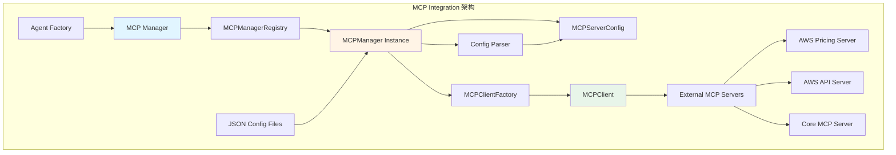
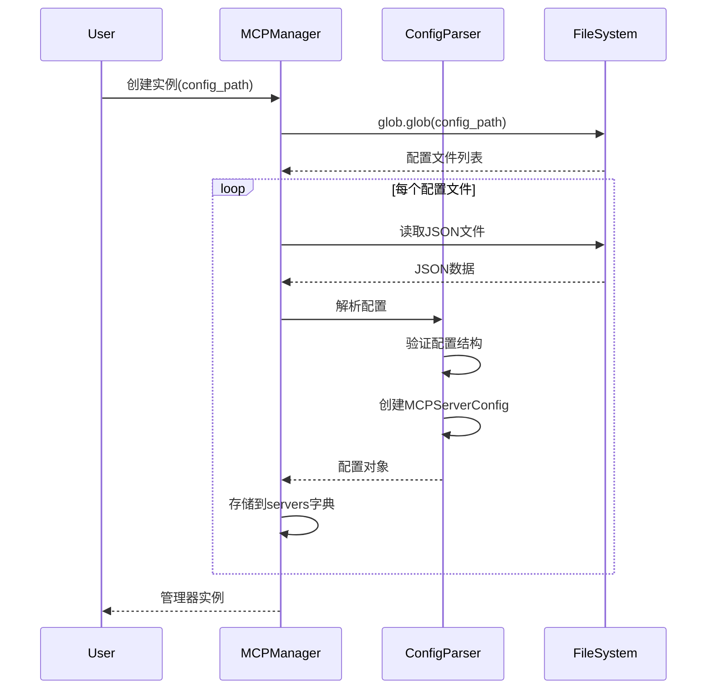
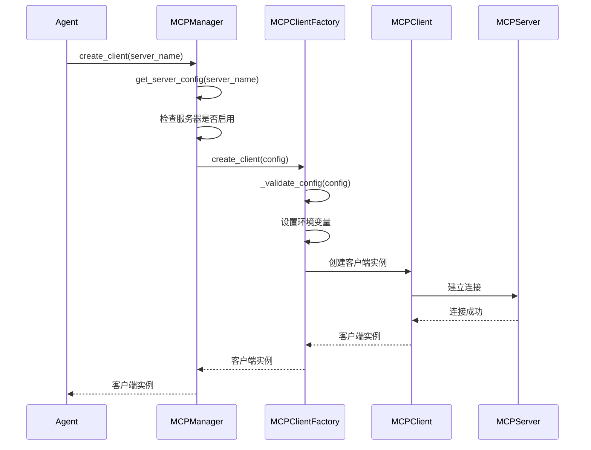

# MCP Integration 模块文档

**创建日期**: 2026-02-05  
**最后更新**: 2026-02-05  
**模块路径**: `nexus_utils/mcp_manager.py`, `nexus_utils/mcp/`  
**维护状态**: 活跃  
**模块说明**: MCP (Model Context Protocol) 集成系统，负责MCP服务器配置、客户端管理和工具集成

## 1. 模块概述

### 1.1 功能描述

MCP Integration模块是Nexus-AI平台与外部工具和服务集成的核心组件。它实现了Model Context Protocol (MCP)标准，提供了一套完整的MCP服务器配置管理和客户端创建系统。

**核心职责**:
- 从JSON配置文件加载和管理MCP服务器配置
- 验证和解析服务器配置信息
- 创建和管理MCP客户端实例
- 提供单例模式的配置管理
- 支持配置热重载和动态更新
- 管理工具自动审批和权限控制

**在系统中的角色**:
- 作为Agent与外部工具的桥梁
- 为Agent Factory提供MCP工具集成能力
- 与Strands框架工具系统无缝集成
- 支持多MCP服务器并发管理

### 1.2 关键特性

- **配置驱动**: 通过JSON文件声明式配置MCP服务器
- **单例管理**: 使用注册表模式确保配置实例唯一性
- **异步支持**: 提供同步和异步两种客户端创建方式
- **错误处理**: 完善的配置验证和异常处理机制
- **热重载**: 支持运行时重新加载配置文件
- **多服务器**: 同时管理多个MCP服务器实例
- **自动审批**: 支持工具级别的自动审批配置
- **环境隔离**: 每个服务器独立的环境变量配置

## 2. 架构设计

### 2.1 模块架构图



### 2.2 核心组件

**MCPServerConfig (数据类)**:
- 表示单个MCP服务器的完整配置信息
- 包含服务器名称、命令、参数、环境变量等
- 提供配置验证和状态检查方法

**MCPClientFactory (工厂类)**:
- 负责创建和验证MCP客户端实例
- 使用工厂模式封装客户端创建复杂性
- 提供同步和异步两种创建方式
- 处理客户端创建过程中的错误

**MCPManager (管理类)**:
- 核心管理类，负责配置加载和访问
- 从JSON文件加载MCP服务器配置
- 提供配置查询和客户端创建接口
- 支持配置热重载

**MCPManagerRegistry (注册表类)**:
- 管理多个MCPManager实例
- 为不同配置路径提供单例模式支持
- 确保相同路径的管理器实例唯一

### 2.3 依赖关系

**依赖的模块**:
- `strands.tools.mcp.mcp_client`: Strands框架的MCP客户端
- `mcp`: MCP协议标准库
- Python标准库: `json`, `glob`, `os`, `pathlib`, `asyncio`

**被依赖的模块**:
- Agent Factory: 使用MCP Manager为Agent提供工具集成
- Prompt Manager: 从提示词模板获取MCP工具依赖
- System Agents: 各类系统Agent使用MCP工具

## 3. 核心实现

### 3.1 主要类/函数

| 名称 | 类型 | 功能描述 | 文件位置 |
|------|------|---------|---------|
| MCPServerConfig | 数据类 | MCP服务器配置数据结构 | nexus_utils/mcp_manager.py:91 |
| MCPClientFactory | 工厂类 | MCP客户端创建工厂 | nexus_utils/mcp_manager.py:132 |
| MCPManager | 管理类 | MCP配置管理器 | nexus_utils/mcp_manager.py:277 |
| MCPManagerRegistry | 注册表类 | 管理器实例注册表 | nexus_utils/mcp_manager.py:511 |
| get_default_mcp_manager | 函数 | 获取默认管理器实例 | nexus_utils/mcp_manager.py:585 |
| get_mcp_manager | 函数 | 获取指定路径管理器实例 | nexus_utils/mcp_manager.py:563 |

### 3.2 关键流程

#### 配置加载流程



#### 客户端创建流程



### 3.3 数据结构

#### MCPServerConfig 数据结构

```python
@dataclass
class MCPServerConfig:
    name: str                    # 服务器名称（唯一标识符）
    command: str                 # 启动命令（如 "uvx"）
    args: List[str]             # 命令参数列表
    env: Dict[str, str]         # 环境变量字典
    auto_approve: List[str]     # 自动批准的工具列表
    disabled: bool              # 是否禁用
```

#### 配置文件结构

```json
{
  "mcpServers": {
    "server-name": {
      "command": "uvx",
      "args": ["package@latest"],
      "env": {
        "VAR_NAME": "value"
      },
      "autoApprove": ["tool1", "tool2"],
      "disabled": false
    }
  }
}
```

## 4. API接口

### 4.1 公共接口

#### get_default_mcp_manager()

获取默认MCP管理器实例（推荐使用）。

```python
def get_default_mcp_manager() -> MCPManager:
    """
    获取默认 MCPManager 实例
    
    Returns:
        MCPManager: 使用默认配置的管理器实例
    """
```

#### get_mcp_manager(config_path)

获取指定路径的MCP管理器实例。

```python
def get_mcp_manager(config_path: str = './mcp/*.json') -> MCPManager:
    """
    获取 MCPManager 实例
    
    Args:
        config_path: 配置文件路径模式
        
    Returns:
        MCPManager: 管理器实例
    """
```

### 4.2 MCPManager 接口

#### get_server_config(server_name)

根据服务器名称获取配置。

```python
def get_server_config(self, server_name: str) -> Optional[MCPServerConfig]:
    """
    获取服务器配置
    
    Args:
        server_name: 服务器名称
        
    Returns:
        Optional[MCPServerConfig]: 服务器配置对象
    """
```

#### get_all_servers()

返回所有服务器配置。

```python
def get_all_servers(self) -> Dict[str, MCPServerConfig]:
    """
    返回所有服务器配置
    
    Returns:
        Dict[str, MCPServerConfig]: 所有服务器配置字典
    """
```

#### get_enabled_servers()

返回启用的服务器配置。

```python
def get_enabled_servers(self) -> Dict[str, MCPServerConfig]:
    """
    返回启用的服务器配置
    
    Returns:
        Dict[str, MCPServerConfig]: 启用的服务器配置字典
    """
```

#### create_client(server_name)

异步创建MCP客户端实例。

```python
async def create_client(self, server_name: str) -> Optional[MCPClient]:
    """
    异步创建MCP客户端
    
    Args:
        server_name: 服务器名称
        
    Returns:
        Optional[MCPClient]: 客户端实例
        
    Raises:
        ConfigurationError: 配置错误
        ConnectionError: 连接失败
    """
```

#### create_client_sync(server_name)

同步创建MCP客户端实例。

```python
def create_client_sync(self, server_name: str) -> Optional[MCPClient]:
    """
    同步创建MCP客户端
    
    Args:
        server_name: 服务器名称
        
    Returns:
        Optional[MCPClient]: 客户端实例
    """
```

#### reload_configs()

重新加载配置文件。

```python
def reload_configs(self) -> None:
    """
    重新加载配置文件
    
    清除当前配置并重新从文件加载
    """
```

## 5. 配置说明

### 5.1 配置项

#### 配置文件位置

- **系统MCP服务器**: `mcp/system_mcp_server.json`
- **公共MCP服务器**: `mcp/public_mcp_server.json`
- **默认路径模式**: `./mcp/*.json`

#### 服务器配置项

| 配置项 | 类型 | 必需 | 说明 |
|--------|------|------|------|
| command | string | 是 | 启动服务器的命令 |
| args | array | 否 | 命令参数列表 |
| env | object | 否 | 环境变量字典 |
| autoApprove | array | 否 | 自动批准的工具列表 |
| disabled | boolean | 否 | 是否禁用服务器 |

### 5.2 环境变量

#### 通用环境变量

- `FASTMCP_LOG_LEVEL`: MCP日志级别（ERROR, WARNING, INFO, DEBUG）

#### AWS相关环境变量

- `AWS_PROFILE`: AWS配置文件名称
- `AWS_REGION`: AWS区域
- `AWS_ACCESS_KEY_ID`: AWS访问密钥ID
- `AWS_SECRET_ACCESS_KEY`: AWS秘密访问密钥

## 6. 使用示例

### 6.1 基本使用

```python
# 导入模块
from nexus_utils.mcp_manager import get_default_mcp_manager

# 获取管理器实例
manager = get_default_mcp_manager()

# 查看所有服务器
all_servers = manager.get_all_servers()
print(f"总服务器数: {len(all_servers)}")

# 查看启用的服务器
enabled_servers = manager.get_enabled_servers()
print(f"启用服务器: {list(enabled_servers.keys())}")

# 获取特定服务器配置
config = manager.get_server_config("awslabs.aws-pricing-mcp-server")
if config:
    print(f"服务器: {config.name}")
    print(f"命令: {config.command} {' '.join(config.args)}")
    print(f"状态: {'启用' if config.is_enabled() else '禁用'}")
```

### 6.2 创建MCP客户端

#### 同步方式

```python
from nexus_utils.mcp_manager import get_default_mcp_manager

# 获取管理器
manager = get_default_mcp_manager()

# 同步创建客户端
try:
    client = manager.create_client_sync("awslabs.aws-pricing-mcp-server")
    if client:
        print("客户端创建成功")
        # 使用客户端...
    else:
        print("客户端创建失败")
except Exception as e:
    print(f"错误: {e}")
```

#### 异步方式

```python
import asyncio
from nexus_utils.mcp_manager import get_default_mcp_manager

async def create_mcp_client():
    # 获取管理器
    manager = get_default_mcp_manager()
    
    # 异步创建客户端
    try:
        client = await manager.create_client("awslabs.aws-api-mcp-server")
        if client:
            print("客户端创建成功")
            # 使用客户端...
        else:
            print("客户端创建失败")
    except Exception as e:
        print(f"错误: {e}")

# 运行异步函数
asyncio.run(create_mcp_client())
```

### 6.3 配置热重载

```python
from nexus_utils.mcp_manager import get_default_mcp_manager

# 获取管理器
manager = get_default_mcp_manager()

# 查看当前服务器数量
print(f"重载前: {len(manager.get_all_servers())} 个服务器")

# 重新加载配置
manager.reload_configs()

# 查看重载后的服务器数量
print(f"重载后: {len(manager.get_all_servers())} 个服务器")
```

### 6.4 在Agent中使用

```python
from nexus_utils.agent_factory import create_agent_from_prompt_template
from nexus_utils.mcp_manager import get_default_mcp_manager

# 创建Agent（自动集成MCP工具）
agent = create_agent_from_prompt_template(
    "system_agents_prompts/agent_build_workflow/orchestrator"
)

# 手动获取MCP客户端（如需要）
manager = get_default_mcp_manager()
pricing_client = manager.create_client_sync("awslabs.aws-pricing-mcp-server")

# Agent会自动使用配置的MCP工具
result = agent.run("查询AWS EC2 t3.medium实例的价格")
```

## 7. 测试覆盖

### 7.1 单元测试

**测试文件位置**: `tests/test_mcp_manager.py`

**测试覆盖**:
- 配置加载和解析
- 服务器配置验证
- 客户端创建（同步/异步）
- 错误处理和异常
- 单例模式验证
- 配置热重载

### 7.2 集成测试

**测试场景**:
- 与真实MCP服务器连接
- 工具调用和响应
- 多服务器并发管理
- Agent集成测试

## 8. 性能特征

### 8.1 性能指标

- **配置加载时间**: < 100ms（10个服务器）
- **客户端创建时间**: 200-500ms（取决于服务器响应）
- **内存占用**: ~5MB（基础配置）
- **并发支持**: 支持多客户端并发创建

### 8.2 性能优化建议

1. **使用单例模式**: 通过`get_default_mcp_manager()`获取实例，避免重复加载配置
2. **异步创建客户端**: 在异步环境中使用`create_client()`而非`create_client_sync()`
3. **配置缓存**: 避免频繁调用`reload_configs()`
4. **连接池**: 对于频繁使用的服务器，考虑维护客户端连接池
5. **延迟加载**: 仅在需要时创建客户端，而非预先创建所有客户端

## 9. 已知限制

### 9.1 功能限制

- **传输协议**: 当前仅支持stdio传输方式
- **配置格式**: 仅支持JSON格式配置文件
- **服务器类型**: 主要支持uvx启动的MCP服务器
- **连接管理**: 不提供自动重连机制
- **工具发现**: 需要手动配置autoApprove列表

### 9.2 技术债务

- **配置验证**: 配置验证规则可以更完善
- **错误信息**: 部分错误信息可以更详细
- **日志记录**: 缺少结构化日志记录
- **监控指标**: 缺少性能监控和指标收集
- **文档完整性**: 部分高级功能缺少文档说明

## 10. 相关文档

- [Agent Factory模块文档](01-agent-factory.md)
- [Prompt Management模块文档](02-prompt-management.md)
- [MCP协议官方文档](https://modelcontextprotocol.io/)
- [Strands MCP集成文档](https://github.com/awslabs/strands)
- [AWS MCP服务器文档](https://github.com/awslabs/aws-mcp-servers)

---

**文档版本**: 1.0  
**最后更新**: 2026-02-05  
**维护者**: Nexus-AI Team
