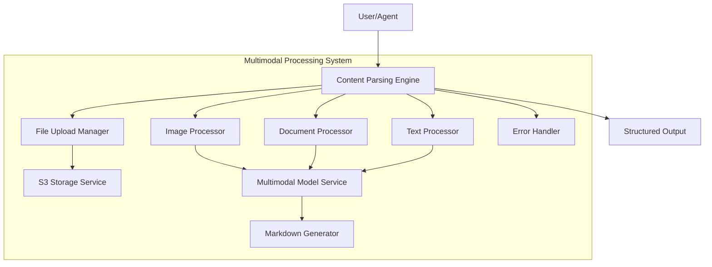
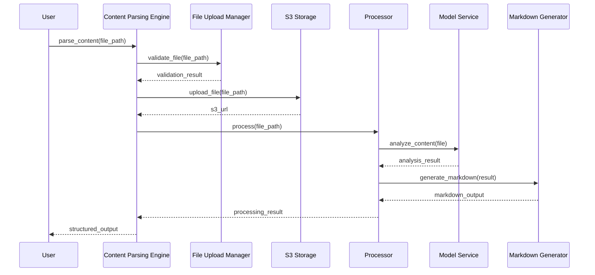

# Multimodal Processing System

**创建日期**: 2026-02-05  
**最后更新**: 2026-02-06  
**模块路径**: `nexus_utils/multimodal_processing/`  
**维护状态**: 活跃  
**模块说明**: 多模态内容处理系统，支持图像、文档、Excel、Word等多种格式的统一处理

## 1. 模块概述

### 1.1 功能描述

Multimodal Processing System 是 Nexus-AI 的多模态内容处理核心模块，提供统一的接口处理图像、文档、Excel、Word等多种格式的文件。该模块集成了AWS S3存储、AI模型分析和结构化输出生成功能。

**核心职责**:
- 统一的多模态内容解析接口
- 文件上传和格式验证
- AWS S3存储集成
- AI模型驱动的内容分析
- 结构化Markdown输出生成
- 图像、文档、表格的智能处理

**在系统中的角色**:
作为内容处理的中心枢纽，为Agent提供多模态内容理解能力，支持业务文档自动化处理。

### 1.2 关键特性

- **统一处理接口**: 单一入口处理所有类型的文件
- **多格式支持**: 支持JPG、PNG、Excel、Word、CSV等格式
- **AI驱动分析**: 使用Bedrock模型进行智能内容分析
- **S3集成**: 自动文件存储和管理
- **结构化输出**: 生成标准化的Markdown格式输出
- **错误处理**: 完善的异常处理和错误恢复机制

## 2. 架构设计

### 2.1 模块架构图



### 2.2 核心组件

**内容解析引擎** (`content_parsing_engine.py`):
- 统一的内容处理入口
- 文件类型识别和路由
- 处理流程编排

**文件上传管理器** (`file_upload_manager.py`):
- 文件验证和大小检查
- 格式支持检测
- 上传流程管理

**处理器组件**:
- `image_processor.py`: 图像内容分析
- `document_processor.py`: Excel、Word文档处理
- `text_processor.py`: 文本文件处理

**存储服务** (`s3_storage_service.py`):
- S3文件上传和下载
- 预签名URL生成
- 文件生命周期管理

**模型服务** (`multimodal_model_service.py`):
- Bedrock模型调用
- 多模态内容分析
- AI驱动的内容理解

**输出生成器** (`markdown_generator.py`):
- 结构化Markdown生成
- 格式标准化
- 内容组织优化

### 2.3 依赖关系

**依赖的模块**:
- `nexus_utils.config_loader`: 配置管理
- `boto3`: AWS SDK
- `openpyxl`: Excel处理
- `python-docx`: Word文档处理
- `PIL`: 图像处理

**被依赖的模块**:
- Agent Build Workflow: 使用多模态处理分析需求文档
- API System: 提供文件上传和处理接口
- 各类Agent: 集成多模态内容理解能力

## 3. 核心实现

### 3.1 主要类/函数

| 名称 | 类型 | 功能描述 | 文件位置 |
|------|------|---------|---------|
| `ContentParsingEngine` | 类 | 内容解析引擎主类 | content_parsing_engine.py |
| `FileUploadManager` | 类 | 文件上传管理器 | file_upload_manager.py |
| `S3StorageService` | 类 | S3存储服务 | s3_storage_service.py |
| `MultimodalModelService` | 类 | 多模态模型服务 | multimodal_model_service.py |
| `ImageProcessor` | 类 | 图像处理器 | image_processor.py |
| `DocumentProcessor` | 类 | 文档处理器 | document_processor.py |
| `MarkdownGenerator` | 类 | Markdown生成器 | markdown_generator.py |

### 3.2 关键流程

**文件处理流程**:



### 3.3 数据结构

**文件元数据**:
```python
{
    "file_name": str,
    "file_size": int,
    "file_type": str,
    "s3_url": str,
    "upload_time": datetime,
    "processing_status": str
}
```

**处理结果**:
```python
{
    "content": str,
    "metadata": dict,
    "analysis": dict,
    "markdown_output": str
}
```

## 4. API接口

### 4.1 公共接口

**解析内容**:
```python
def parse_content(file_path: str) -> dict:
    """
    解析多模态内容
    
    Args:
        file_path: 文件路径
    
    Returns:
        处理结果字典
    """
```

**上传文件**:
```python
def upload_file(file_path: str, bucket: str) -> str:
    """
    上传文件到S3
    
    Args:
        file_path: 本地文件路径
        bucket: S3存储桶名称
    
    Returns:
        S3 URL
    """
```

### 4.2 内部接口

各处理器提供统一的处理接口，支持扩展新的文件类型。

## 5. 配置说明

### 5.1 配置项

**多模态处理配置** (config/default_config.yaml):
```yaml
multimodal_parser:
  aws:
    s3_bucket: "awesome-nexus-ai-file-storage"
    s3_prefix: "multimodal-content/"
  file_limits:
    max_file_size: "50MB"
    max_files_per_request: 10
    supported_formats: ["jpg", "jpeg", "png", "gif", "txt", "xlsx", "docx", "csv"]
```

### 5.2 环境变量

| 变量名 | 说明 | 默认值 |
|--------|------|--------|
| `AWS_S3_BUCKET` | S3存储桶名称 | - |
| `MAX_FILE_SIZE` | 最大文件大小 | 50MB |

## 6. 使用示例

### 6.1 基本使用

```python
from nexus_utils.multimodal_processing import ContentParsingEngine

# 创建解析引擎
engine = ContentParsingEngine()

# 处理图像
result = engine.parse_content("image.jpg")
print(result["markdown_output"])

# 处理Excel文档
result = engine.parse_content("data.xlsx")
print(result["analysis"])
```

### 6.2 高级用法

```python
# 批量处理文件
files = ["doc1.docx", "image1.png", "data.xlsx"]
results = [engine.parse_content(f) for f in files]

# 自定义S3配置
engine = ContentParsingEngine(
    s3_bucket="custom-bucket",
    s3_prefix="custom-prefix/"
)
```

## 7. 测试覆盖

### 7.1 单元测试

测试各个处理器的独立功能。

### 7.2 集成测试

测试完整的文件处理流程。

## 8. 性能特征

### 8.1 性能指标

- 图像处理: ~2-5秒
- Excel处理: ~3-10秒
- Word文档: ~2-8秒

### 8.2 性能优化建议

1. 使用异步处理提高吞吐量
2. 实现文件缓存机制
3. 优化S3上传策略

## 9. 已知限制

### 9.1 功能限制

1. 文件大小限制50MB
2. 支持的格式有限
3. 依赖AWS Bedrock服务

### 9.2 技术债务

1. 需要增加更多文件格式支持
2. 错误处理需要进一步完善
3. 性能优化空间较大

## 10. 相关文档

- [架构总览文档](../ARCHITECTURE_OVERVIEW.md)
- [系统架构文档](../architecture/system-architecture.md)
- [多模态处理流程图](../architecture/diagrams/07-multimodal-processing.md)

---

**文档版本**: 1.0  
**最后更新**: 2026-02-06  
**维护者**: Nexus-AI Team

**文档状态**: 待完善  
**下次更新**: 待定
