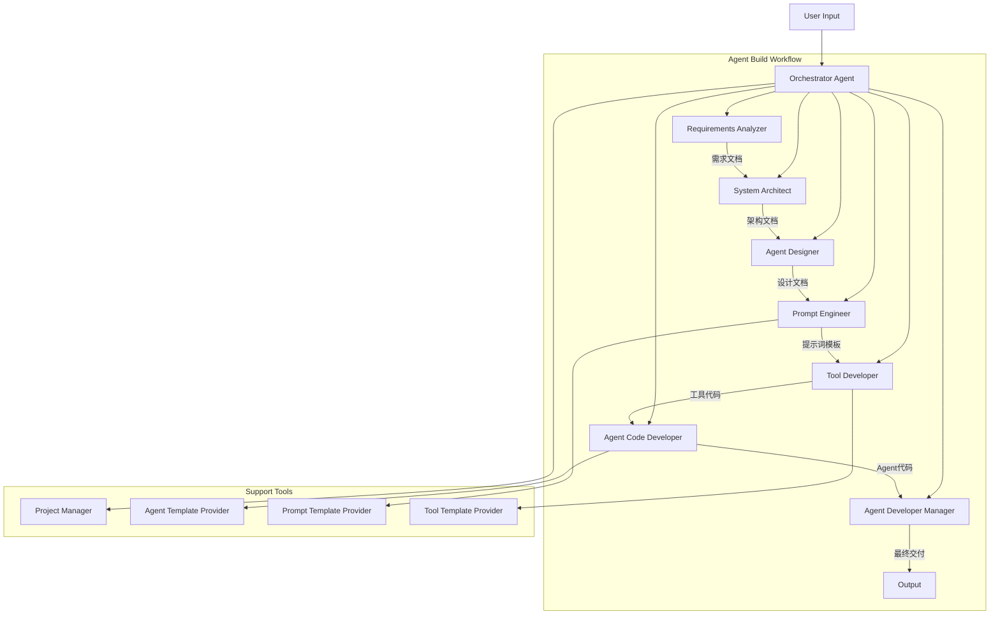
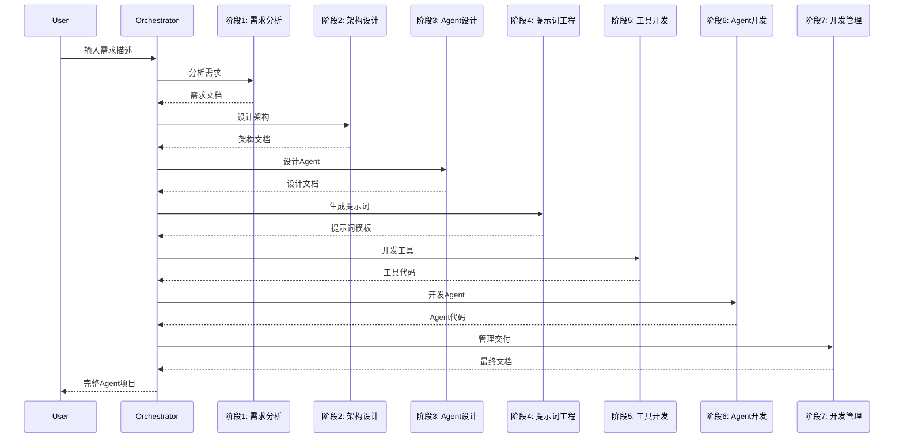

# Agent Build Workflow System

**创建日期**: 2026-02-05  
**最后更新**: 2026-02-06  
**模块路径**: `agents/system_agents/agent_build_workflow/`  
**维护状态**: 活跃  
**模块说明**: 7阶段Agent构建工作流系统，实现"Agent Build Agent"的核心功能

## 1. 模块概述

### 1.1 功能描述

Agent Build Workflow System 是 Nexus-AI 的核心创新功能，实现了"Agent Build Agent"的理念。通过7个专业化的Agent协同工作，自动完成从需求分析到Agent代码生成的完整开发流程。

**核心职责**:
- 自动化Agent开发全流程
- 7阶段工作流编排和管理
- 需求分析和架构设计
- 提示词工程和工具开发
- Agent代码生成和集成
- 项目文件管理和文档生成

**在系统中的角色**:
作为Nexus-AI的核心能力，使业务人员能够通过自然语言描述快速创建专业的Agent系统。

### 1.2 关键特性

- **7阶段流程**: 完整的Agent开发生命周期
- **专业化Agent**: 每个阶段由专门的Agent负责
- **自动化生成**: 从需求到代码的全自动生成
- **模板驱动**: 基于最佳实践的模板系统
- **项目管理**: 完整的项目文件组织和管理
- **文档生成**: 自动生成完整的项目文档

## 2. 架构设计

### 2.1 模块架构图



### 2.2 核心组件

**编排器** (`agent_build_workflow.py`):
- 工作流主控制器
- 阶段间协调和数据传递
- 错误处理和状态管理

**7个专业化Agent**:
1. **Requirements Analyzer** (`requirements_analyzer_agent.py`): 需求分析
2. **System Architect** (`system_architect_agent.py`): 系统架构设计
3. **Agent Designer** (`agent_designer_agent.py`): Agent设计
4. **Prompt Engineer** (`prompt_engineer_agent.py`): 提示词工程
5. **Tool Developer** (`tool_developer_agent.py`): 工具开发
6. **Agent Code Developer** (`agent_code_developer_agent.py`): Agent代码开发
7. **Agent Developer Manager** (`agent_developer_manager_agent.py`): 开发管理

**支持工具**:
- `project_manager.py`: 项目文件管理
- `agent_template_provider.py`: Agent模板提供
- `prompt_template_provider.py`: 提示词模板提供
- `tool_template_provider.py`: 工具模板提供

### 2.3 依赖关系

**依赖的模块**:
- Agent Factory: 创建各阶段Agent
- Prompt Management: 加载Agent提示词
- Tool System: 提供工具模板
- Configuration Management: 配置管理

**被依赖的模块**:
- API System: 提供HTTP接口调用工作流
- CLI: 命令行接口调用工作流

## 3. 核心实现

### 3.1 主要类/函数

| 名称 | 类型 | 功能描述 | 文件位置 |
|------|------|---------|---------|
| `AgentBuildWorkflow` | 类 | 工作流编排器 | agent_build_workflow.py |
| `RequirementsAnalyzerAgent` | Agent | 需求分析Agent | requirements_analyzer_agent.py |
| `SystemArchitectAgent` | Agent | 系统架构Agent | system_architect_agent.py |
| `AgentDesignerAgent` | Agent | Agent设计Agent | agent_designer_agent.py |
| `PromptEngineerAgent` | Agent | 提示词工程Agent | prompt_engineer_agent.py |
| `ToolDeveloperAgent` | Agent | 工具开发Agent | tool_developer_agent.py |
| `AgentCodeDeveloperAgent` | Agent | Agent代码开发Agent | agent_code_developer_agent.py |
| `AgentDeveloperManagerAgent` | Agent | 开发管理Agent | agent_developer_manager_agent.py |

### 3.2 关键流程

**7阶段工作流**:



### 3.3 数据结构

**工作流状态**:
```python
{
    "project_name": str,
    "current_stage": int,
    "stage_outputs": {
        "stage_1": dict,  # 需求文档
        "stage_2": dict,  # 架构文档
        "stage_3": dict,  # 设计文档
        "stage_4": dict,  # 提示词模板
        "stage_5": dict,  # 工具代码
        "stage_6": dict,  # Agent代码
        "stage_7": dict   # 最终文档
    },
    "status": str
}
```

## 4. API接口

### 4.1 公共接口

**启动工作流**:
```python
def run_workflow(user_requirement: str) -> dict:
    """
    运行Agent构建工作流
    
    Args:
        user_requirement: 用户需求描述
    
    Returns:
        工作流执行结果
    """
```

**交互式模式**:
```bash
python agents/system_agents/agent_build_workflow/agent_build_workflow.py
```

**批处理模式**:
```bash
python agents/system_agents/agent_build_workflow/agent_build_workflow.py -i "需求描述"
```

### 4.2 内部接口

各阶段Agent提供统一的处理接口，支持工作流编排。

## 5. 配置说明

### 5.1 配置项

**工作流配置**:
```yaml
agent_build_workflow:
  project_base_path: "projects/"
  enable_logging: true
  auto_save: true
```

### 5.2 环境变量

| 变量名 | 说明 | 默认值 |
|--------|------|--------|
| `PROJECT_BASE_PATH` | 项目基础路径 | projects/ |
| `ENABLE_WORKFLOW_LOGGING` | 启用工作流日志 | true |

## 6. 使用示例

### 6.1 基本使用

**交互式模式**:
```bash
source venv/bin/activate && python agents/system_agents/agent_build_workflow/agent_build_workflow.py
```

**批处理模式**:
```bash
source venv/bin/activate && python agents/system_agents/agent_build_workflow/agent_build_workflow.py \
  -i "请创建一个Agent帮我完成AWS产品报价工作"
```

### 6.2 高级用法

**编程方式调用**:
```python
from agents.system_agents.agent_build_workflow import AgentBuildWorkflow

# 创建工作流实例
workflow = AgentBuildWorkflow()

# 运行工作流
result = workflow.run("创建一个数据分析Agent")

# 获取生成的文件
print(result["project_path"])
print(result["generated_files"])
```

## 7. 测试覆盖

### 7.1 单元测试

测试各阶段Agent的独立功能。

### 7.2 集成测试

测试完整的7阶段工作流执行。

## 8. 性能特征

### 8.1 性能指标

- 完整工作流执行时间: ~5-15分钟
- 各阶段平均时间: ~1-3分钟
- 生成代码质量: 高

### 8.2 性能优化建议

1. 使用缓存减少重复计算
2. 并行执行独立阶段
3. 优化模型调用策略

## 9. 已知限制

### 9.1 功能限制

1. 依赖高质量的需求描述
2. 生成的代码可能需要人工调整
3. 复杂场景可能需要多次迭代

### 9.2 技术债务

1. 需要增加更多错误恢复机制
2. 阶段间数据传递需要优化
3. 需要增加更多模板支持

## 10. 相关文档

- [Agent Factory模块文档](./01-agent-factory.md)
- [Prompt Management模块文档](./02-prompt-management.md)
- [Tool System模块文档](./09-tool-system.md)
- [架构总览文档](../ARCHITECTURE_OVERVIEW.md)
- [Agent创建流程文档](../business-flows/agent-creation-process.md)

---

**文档版本**: 1.0  
**最后更新**: 2026-02-06  
**维护者**: Nexus-AI Team

**文档状态**: 待完善  
**下次更新**: 待定
