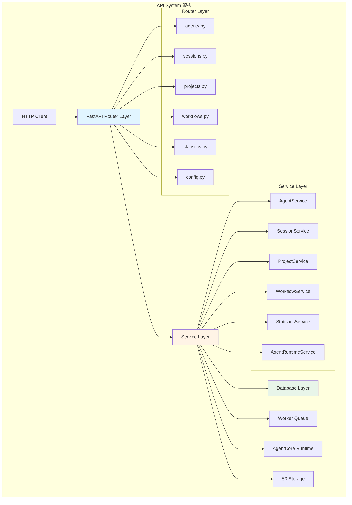
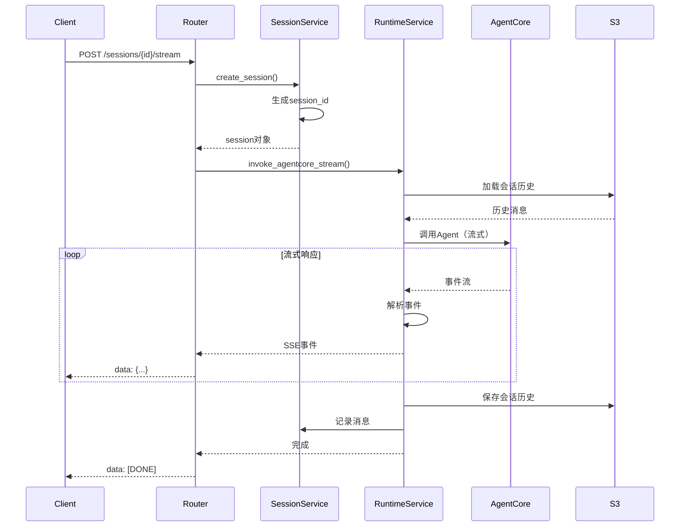
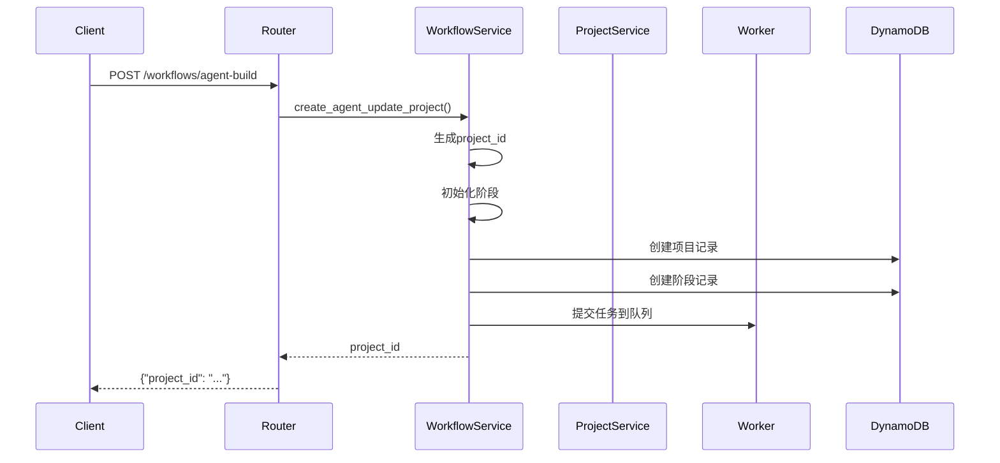

# API System 模块文档

**创建日期**: 2026-02-05  
**最后更新**: 2026-02-05  
**模块路径**: `api/v2/`  
**维护状态**: 活跃  
**模块说明**: RESTful API系统，提供HTTP接口用于Agent管理、任务执行和系统配置

## 1. 模块概述

### 1.1 功能描述

API System是Nexus-AI平台的HTTP接口层，基于FastAPI框架构建，提供完整的RESTful API服务。它是前端应用、CLI工具和外部系统与Nexus-AI核心功能交互的主要入口。

**核心职责**:
- 提供RESTful API接口供外部访问
- 管理Agent的生命周期（创建、查询、更新、删除）
- 处理Agent调用和会话管理
- 管理工作流项目和任务执行
- 提供系统配置和统计信息
- 处理文件上传和多模态内容
- 集成AgentCore运行时

**在系统中的角色**:
- 作为系统的HTTP入口点
- 连接前端应用和后端服务
- 协调Worker系统执行异步任务
- 管理数据库访问和数据持久化

### 1.2 关键特性

- **分层架构**: Router → Service → Database三层架构
- **异步处理**: 基于FastAPI的异步请求处理
- **流式响应**: 支持Server-Sent Events (SSE)流式输出
- **会话管理**: 多轮对话会话持久化
- **文件处理**: 支持文件上传和多模态内容
- **统计分析**: 提供详细的系统统计和监控
- **工作流控制**: 支持工作流暂停、恢复、重启
- **AgentCore集成**: 与AWS AgentCore运行时无缝集成

## 2. 架构设计

### 2.1 模块架构图



### 2.2 核心组件

**Router Layer (路由层)**:
- 定义HTTP端点和请求处理
- 请求参数验证和解析
- 响应格式化和错误处理
- 91个API端点覆盖所有功能

**Service Layer (服务层)**:
- 实现业务逻辑
- 协调多个数据源和外部服务
- 处理复杂的业务流程
- 11个服务类提供核心功能

**Database Layer (数据层)**:
- DynamoDB数据访问
- 数据模型定义
- 查询和更新操作

### 2.3 依赖关系

**依赖的模块**:
- FastAPI: Web框架
- Pydantic: 数据验证
- Boto3: AWS SDK
- Agent Factory: Agent创建
- Worker System: 异步任务执行
- DynamoDB: 数据存储

**被依赖的模块**:
- Web前端应用
- CLI工具
- 外部集成系统

## 3. 核心实现

### 3.1 主要服务类

| 服务类 | 功能描述 | 文件位置 |
|--------|---------|---------|
| AgentService | Agent管理（注册、查询、更新、删除） | services/agent_service.py |
| SessionService | 会话管理（创建、消息、历史） | services/session_service.py |
| ProjectService | 项目管理（创建、查询、控制） | services/project_service.py |
| WorkflowService | 工作流管理（创建、状态、控制） | services/workflow_service.py |
| StatisticsService | 统计分析（概览、趋势、健康） | services/statistics_service.py |
| AgentRuntimeService | Agent运行时（本地/AgentCore调用） | services/agent_runtime_service.py |
| AgentDeploymentService | Agent部署（打包、上传、注册） | services/agent_deployment_service.py |
| StageServiceV2 | 阶段管理（状态、输出、指标） | services/stage_service.py |
| InvocationService | 调用记录（统计、分析） | services/invocation_service.py |
| TaskService | 任务管理（状态、重试） | services/task_service.py |
| AgentCLIBuildService | CLI工作流执行 | services/agent_cli_workflow_service.py |

### 3.2 关键流程

#### Agent调用流程（流式）



#### 工作流创建流程



### 3.3 数据结构

#### Session数据结构

```python
{
    "session_id": "01JQXXX...",
    "agent_id": "agent_name",
    "user_id": "user123",
    "created_at": "2026-02-05T10:00:00Z",
    "updated_at": "2026-02-05T10:05:00Z",
    "status": "active",
    "metadata": {
        "runtime_arn": "arn:aws:...",
        "runtime_alias": "DRAFT"
    }
}
```

#### Project数据结构

```python
{
    "project_id": "proj_xxx",
    "project_name": "my_agent",
    "workflow_type": "agent_build",
    "status": "running",
    "created_at": "2026-02-05T10:00:00Z",
    "updated_at": "2026-02-05T10:05:00Z",
    "stages": [
        {
            "stage_name": "requirements_analyzer",
            "status": "completed",
            "started_at": "...",
            "completed_at": "..."
        }
    ],
    "metrics": {
        "total_tokens": 15000,
        "duration_ms": 45000
    }
}
```

## 4. API接口

### 4.1 Agent管理接口

#### GET /api/v2/agents

列出所有Agent。

**查询参数**:
- `category`: Agent类别过滤
- `status`: 状态过滤
- `limit`: 返回数量限制
- `offset`: 分页偏移

**响应**:
```json
{
    "agents": [
        {
            "agent_id": "agent_name",
            "category": "business_analysis",
            "status": "active",
            "created_at": "2026-02-05T10:00:00Z"
        }
    ],
    "total": 10
}
```

#### GET /api/v2/agents/{agent_id}

获取Agent详情。

**响应**:
```json
{
    "agent_id": "agent_name",
    "agent_name": "Agent Name",
    "category": "business_analysis",
    "description": "Agent description",
    "status": "active",
    "runtime_arn": "arn:aws:...",
    "created_at": "2026-02-05T10:00:00Z",
    "statistics": {
        "total_invocations": 100,
        "success_rate": 0.95
    }
}
```

#### POST /api/v2/agents/{agent_id}/invoke

调用Agent（非流式）。

**请求体**:
```json
{
    "message": "用户输入",
    "session_id": "session_xxx",
    "files": []
}
```

**响应**:
```json
{
    "response": "Agent响应",
    "session_id": "session_xxx",
    "metrics": {
        "input_tokens": 100,
        "output_tokens": 200
    }
}
```

### 4.2 会话管理接口

#### POST /api/v2/sessions

创建新会话。

**请求体**:
```json
{
    "agent_id": "agent_name",
    "user_id": "user123"
}
```

**响应**:
```json
{
    "session_id": "01JQXXX...",
    "agent_id": "agent_name",
    "created_at": "2026-02-05T10:00:00Z"
}
```

#### POST /api/v2/sessions/{session_id}/stream

流式调用Agent。

**请求体**:
```json
{
    "message": "用户输入",
    "files": []
}
```

**响应** (Server-Sent Events):
```
data: {"event": "message", "type": "text", "content": "响应内容"}
data: {"event": "message", "type": "tool_use", "tool_name": "calculator"}
data: {"event": "metrics", "input_tokens": 100, "output_tokens": 200}
data: [DONE]
```

### 4.3 工作流管理接口

#### POST /api/v2/workflows/agent-build

创建Agent构建工作流。

**请求体**:
```json
{
    "user_input": "创建一个AWS定价分析Agent",
    "workflow_config": {
        "enable_auto_deploy": true
    }
}
```

**响应**:
```json
{
    "project_id": "proj_xxx",
    "workflow_type": "agent_build",
    "status": "queued"
}
```

#### GET /api/v2/workflows/{project_id}/status

获取工作流状态。

**响应**:
```json
{
    "project_id": "proj_xxx",
    "status": "running",
    "current_stage": "agent_designer",
    "progress": 0.4,
    "stages": [
        {
            "stage_name": "requirements_analyzer",
            "status": "completed"
        }
    ]
}
```

### 4.4 统计分析接口

#### GET /api/v2/statistics/overview

获取系统概览统计。

**响应**:
```json
{
    "total_agents": 50,
    "total_projects": 100,
    "total_invocations": 1000,
    "active_sessions": 10,
    "system_health": "healthy"
}
```

#### GET /api/v2/statistics/build-statistics

获取构建统计。

**查询参数**:
- `days`: 统计天数（默认7天）

**响应**:
```json
{
    "total_builds": 100,
    "success_rate": 0.85,
    "avg_duration_ms": 120000,
    "daily_stats": [
        {
            "date": "2026-02-05",
            "builds": 15,
            "success": 13
        }
    ]
}
```

## 5. 配置说明

### 5.1 配置项

#### 环境变量

| 变量名 | 说明 | 默认值 |
|--------|------|--------|
| API_HOST | API服务器地址 | 0.0.0.0 |
| API_PORT | API服务器端口 | 8000 |
| AWS_REGION | AWS区域 | us-west-2 |
| DYNAMODB_TABLE_PREFIX | DynamoDB表前缀 | nexus-ai |
| S3_BUCKET | S3存储桶 | nexus-ai-storage |
| WORKER_QUEUE_URL | Worker队列URL | - |
| CORS_ORIGINS | CORS允许的源 | * |

#### 配置文件

**位置**: `api/v2/config.py`

```python
class Settings:
    # API配置
    api_host: str = "0.0.0.0"
    api_port: int = 8000
    
    # AWS配置
    aws_region: str = "us-west-2"
    dynamodb_table_prefix: str = "nexus-ai"
    s3_bucket: str = "nexus-ai-storage"
    
    # Worker配置
    worker_queue_url: str = ""
    
    # CORS配置
    cors_origins: List[str] = ["*"]
```

### 5.2 数据库表结构

#### Agents表

- **表名**: `nexus-ai-agents`
- **主键**: `agent_id` (String)
- **属性**: agent_name, category, status, runtime_arn, created_at, updated_at

#### Projects表

- **表名**: `nexus-ai-projects`
- **主键**: `project_id` (String)
- **属性**: project_name, workflow_type, status, stages, metrics, created_at

#### Sessions表

- **表名**: `nexus-ai-sessions`
- **主键**: `session_id` (String)
- **属性**: agent_id, user_id, status, metadata, created_at, updated_at

#### Invocations表

- **表名**: `nexus-ai-invocations`
- **主键**: `invocation_id` (String)
- **GSI**: agent_id-index, session_id-index
- **属性**: agent_id, session_id, input_tokens, output_tokens, duration_ms, status

## 6. 使用示例

### 6.1 创建并调用Agent

```python
import requests

# 1. 创建Agent构建工作流
response = requests.post(
    "http://localhost:8000/api/v2/workflows/agent-build",
    json={
        "user_input": "创建一个AWS定价分析Agent"
    }
)
project_id = response.json()["project_id"]

# 2. 等待构建完成
import time
while True:
    status = requests.get(
        f"http://localhost:8000/api/v2/workflows/{project_id}/status"
    ).json()
    if status["status"] == "completed":
        break
    time.sleep(5)

# 3. 获取Agent ID
agent_id = status["agent_id"]

# 4. 创建会话
session = requests.post(
    "http://localhost:8000/api/v2/sessions",
    json={"agent_id": agent_id}
).json()

# 5. 调用Agent
response = requests.post(
    f"http://localhost:8000/api/v2/sessions/{session['session_id']}/stream",
    json={"message": "查询EC2 t3.medium价格"},
    stream=True
)

# 6. 处理流式响应
for line in response.iter_lines():
    if line:
        print(line.decode('utf-8'))
```

### 6.2 管理工作流

```python
import requests

# 暂停工作流
requests.post(
    f"http://localhost:8000/api/v2/workflow-control/{project_id}/pause"
)

# 恢复工作流
requests.post(
    f"http://localhost:8000/api/v2/workflow-control/{project_id}/resume"
)

# 重启工作流
requests.post(
    f"http://localhost:8000/api/v2/workflow-control/{project_id}/restart",
    json={"from_stage": "agent_designer"}
)

# 停止工作流
requests.post(
    f"http://localhost:8000/api/v2/workflow-control/{project_id}/stop"
)
```

### 6.3 查询统计信息

```python
import requests

# 获取系统概览
overview = requests.get(
    "http://localhost:8000/api/v2/statistics/overview"
).json()

print(f"总Agent数: {overview['total_agents']}")
print(f"总调用数: {overview['total_invocations']}")

# 获取构建统计
build_stats = requests.get(
    "http://localhost:8000/api/v2/statistics/build-statistics?days=7"
).json()

print(f"成功率: {build_stats['success_rate']}")
print(f"平均耗时: {build_stats['avg_duration_ms']}ms")
```

## 7. 测试覆盖

### 7.1 单元测试

**测试文件位置**: `tests/api/`

**测试覆盖**:
- 路由参数验证
- 服务层业务逻辑
- 数据库操作
- 错误处理

### 7.2 集成测试

**测试场景**:
- 完整的Agent创建和调用流程
- 工作流生命周期管理
- 会话管理和多轮对话
- 文件上传和处理

## 8. 性能特征

### 8.1 性能指标

- **API响应时间**: < 100ms（简单查询）
- **Agent调用延迟**: 200-500ms（首次响应）
- **流式输出延迟**: < 50ms（每个事件）
- **并发处理能力**: 100+ 并发请求
- **数据库查询**: < 50ms（单表查询）

### 8.2 性能优化建议

1. **使用连接池**: 复用数据库和HTTP连接
2. **启用缓存**: 缓存频繁访问的数据
3. **异步处理**: 使用异步I/O提高并发
4. **批量操作**: 合并多个数据库操作
5. **CDN加速**: 静态资源使用CDN

## 9. 已知限制

### 9.1 功能限制

- **并发限制**: 单实例最大100并发
- **文件大小**: 上传文件最大50MB
- **会话超时**: 会话30分钟无活动自动关闭
- **流式超时**: 流式响应最长5分钟

### 9.2 技术债务

- **认证授权**: 当前认证机制较简单
- **API版本管理**: 缺少完善的版本控制
- **监控告警**: 缺少详细的监控指标
- **文档生成**: API文档需要自动生成
- **测试覆盖**: 集成测试覆盖率需提高

## 10. 相关文档

- [Worker System模块文档](07-worker-system.md)
- [Agent Factory模块文档](01-agent-factory.md)
- [FastAPI官方文档](https://fastapi.tiangolo.com/)
- [AWS SDK for Python文档](https://boto3.amazonaws.com/v1/documentation/api/latest/index.html)
- [DynamoDB开发指南](https://docs.aws.amazon.com/dynamodb/)

---

**文档版本**: 1.0  
**最后更新**: 2026-02-05  
**维护者**: Nexus-AI Team
