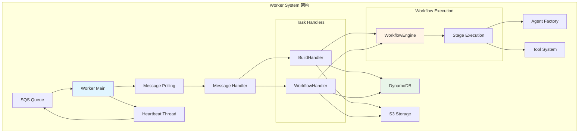
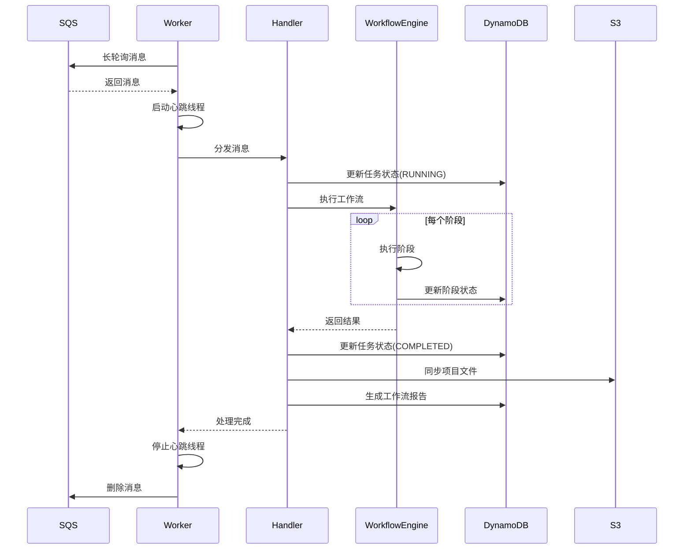
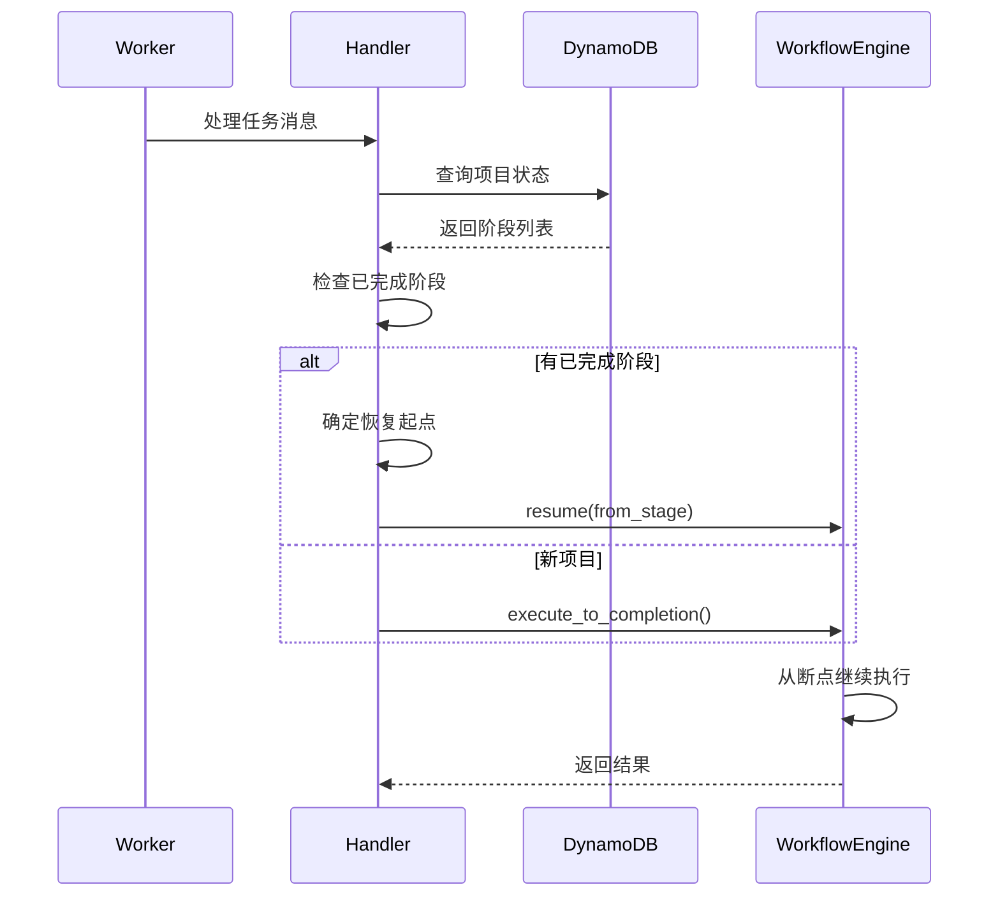

# Worker System 模块文档

**创建日期**: 2026-02-05  
**最后更新**: 2026-02-05  
**模块路径**: `worker/`  
**维护状态**: 活跃  
**模块说明**: 异步任务处理系统，负责后台任务执行、消息队列集成和任务调度

## 1. 模块概述

### 1.1 功能描述

Worker System是Nexus-AI平台的异步任务处理引擎，采用工作进程池模式，通过AWS SQS消息队列分发任务，支持长时间运行的Agent构建和部署任务。

**核心职责**:
- 从SQS队列接收和处理任务消息
- 执行Agent构建工作流
- 管理任务生命周期和状态跟踪
- 处理任务失败和重试逻辑
- 支持工作流断点恢复
- 维护任务心跳和可见性超时
- 生成工作流报告和同步结果

**在系统中的角色**:
- 作为API系统的异步执行后端
- 解耦前端请求和长时间任务执行
- 提供可扩展的任务处理能力
- 确保任务可靠执行和状态一致性

### 1.2 关键特性

- **消息队列驱动**: 基于AWS SQS的任务分发
- **长轮询机制**: 减少空轮询，提高效率
- **心跳维护**: 自动延长长时间任务的可见性超时
- **断点恢复**: 支持从失败阶段自动恢复执行
- **优雅关闭**: 响应SIGTERM/SIGINT信号，完成当前任务后退出
- **工作流集成**: 与WorkflowEngine深度集成
- **状态同步**: 实时更新任务和项目状态到DynamoDB
- **错误处理**: 完善的异常捕获和重试机制

## 2. 架构设计

### 2.1 模块架构图



### 2.2 核心组件

**Worker Main (主进程)**:
- 管理Worker生命周期
- 轮询SQS队列获取消息
- 分发消息到对应的Handler
- 处理信号和优雅关闭

**BuildHandler (构建处理器)**:
- 处理Agent构建任务
- 调用WorkflowEngine执行工作流
- 更新任务和项目状态
- 生成工作流报告

**WorkflowHandler (工作流处理器)**:
- 统一的工作流任务处理器
- 根据workflow_type分发到不同工作流
- 支持agent_build、agent_update、tool_build

**Heartbeat Thread (心跳线程)**:
- 定期延长消息可见性超时
- 防止长时间任务超时被重新分发
- 自动停止和清理

### 2.3 依赖关系

**依赖的模块**:
- AWS SQS: 消息队列服务
- DynamoDB: 任务和项目状态存储
- WorkflowEngine: 工作流执行引擎
- Agent Factory: Agent创建
- S3: 文件存储和同步

**被依赖的模块**:
- API System: 提交任务到Worker队列

## 3. 核心实现

### 3.1 主要类/函数

| 名称 | 类型 | 功能描述 | 文件位置 |
|------|------|---------|---------|
| Worker | 类 | Worker主进程管理 | worker/main.py:32 |
| BuildHandler | 类 | 构建任务处理器 | worker/handlers/build_handler.py:30 |
| WorkflowHandler | 类 | 工作流任务处理器 | worker/handlers/workflow_handler.py:25 |
| WorkerSettings | 类 | Worker配置管理 | worker/config.py:9 |
| HeartbeatThread | 类 | 心跳线程管理 | worker/main.py:195 |

### 3.2 关键流程

#### 任务处理流程



#### 断点恢复流程



### 3.3 数据结构

#### SQS消息格式

```json
{
    "task_id": "task_xxx",
    "project_id": "proj_xxx",
    "workflow_type": "agent_build",
    "requirement": "创建一个AWS定价Agent",
    "target_stage": "agent_designer",
    "execute_to_completion": true,
    "action": "execute",
    "metadata": {
        "user_id": "user123",
        "priority": "normal"
    }
}
```

#### 任务状态

```python
class TaskStatus(Enum):
    PENDING = "pending"      # 待处理
    RUNNING = "running"      # 运行中
    COMPLETED = "completed"  # 已完成
    FAILED = "failed"        # 失败
    CANCELLED = "cancelled"  # 已取消
```

## 4. API接口

### 4.1 Worker启动接口

#### 命令行启动

```bash
# 启动构建队列Worker
python -m worker.main --queue build

# 启动部署队列Worker
python -m worker.main --queue deploy

# 测试模式（处理一条消息后退出）
python -m worker.main --queue build --once
```

### 4.2 Handler接口

#### BuildHandler.handle(message)

处理构建任务消息。

```python
def handle(self, message: Dict[str, Any]) -> bool:
    """
    处理构建任务消息
    
    Args:
        message: SQS消息内容
        
    Returns:
        是否处理成功
    """
```

#### WorkflowHandler.handle(message)

处理工作流任务消息。

```python
def handle(self, message: Dict[str, Any]) -> bool:
    """
    处理工作流任务消息
    
    Args:
        message: SQS消息内容
        
    Returns:
        是否处理成功
    """
```

## 5. 配置说明

### 5.1 配置项

#### 环境变量

| 变量名 | 说明 | 默认值 |
|--------|------|--------|
| WORKER_ID | Worker标识符 | worker-{pid} |
| AWS_REGION | AWS区域 | us-west-2 |
| SQS_BUILD_QUEUE_NAME | 构建队列名称 | nexus-build-queue |
| SQS_DEPLOY_QUEUE_NAME | 部署队列名称 | nexus-deploy-queue |
| POLL_INTERVAL_SECONDS | 轮询间隔（秒） | 5 |
| MAX_MESSAGES_PER_POLL | 每次轮询最大消息数 | 1 |
| VISIBILITY_TIMEOUT | 可见性超时（秒） | 3600 |
| HEARTBEAT_INTERVAL | 心跳间隔（秒） | 300 |
| MAX_RETRY_COUNT | 最大重试次数 | 3 |
| BUILD_TIMEOUT_SECONDS | 构建超时（秒） | 7200 |
| LOG_LEVEL | 日志级别 | INFO |

### 5.2 配置文件

**位置**: `worker/config.py`

```python
class WorkerSettings(BaseSettings):
    # Worker标识
    WORKER_ID: str = f"worker-{os.getpid()}"
    
    # AWS配置
    AWS_REGION: str = "us-west-2"
    
    # SQS配置
    SQS_BUILD_QUEUE_NAME: str = "nexus-build-queue"
    SQS_DEPLOY_QUEUE_NAME: str = "nexus-deploy-queue"
    
    # Worker配置
    POLL_INTERVAL_SECONDS: int = 5
    MAX_MESSAGES_PER_POLL: int = 1
    VISIBILITY_TIMEOUT: int = 3600
    HEARTBEAT_INTERVAL: int = 300
    MAX_RETRY_COUNT: int = 3
    
    # 构建配置
    BUILD_TIMEOUT_SECONDS: int = 7200
    
    # 日志配置
    LOG_LEVEL: str = "INFO"
```

## 6. 使用示例

### 6.1 启动Worker

```bash
# 开发环境
python -m worker.main --queue build

# 生产环境（使用systemd）
[Unit]
Description=Nexus AI Worker Service
After=network.target

[Service]
Type=simple
User=nexus
WorkingDirectory=/opt/nexus-ai
Environment="AWS_REGION=us-west-2"
Environment="LOG_LEVEL=INFO"
ExecStart=/usr/bin/python3 -m worker.main --queue build
Restart=always
RestartSec=10

[Install]
WantedBy=multi-user.target
```

### 6.2 提交任务到队列

```python
from api.v2.database import sqs_client

# 提交构建任务
message = {
    "task_id": "task_123",
    "project_id": "proj_456",
    "workflow_type": "agent_build",
    "requirement": "创建一个AWS定价Agent",
    "execute_to_completion": True,
    "action": "execute"
}

sqs_client.send_message(
    queue_name="nexus-build-queue",
    message_body=message
)
```

### 6.3 监控Worker状态

```python
import boto3

# 获取队列统计
sqs = boto3.client('sqs', region_name='us-west-2')
queue_url = sqs.get_queue_url(QueueName='nexus-build-queue')['QueueUrl']

attributes = sqs.get_queue_attributes(
    QueueUrl=queue_url,
    AttributeNames=['All']
)

print(f"可见消息数: {attributes['Attributes']['ApproximateNumberOfMessages']}")
print(f"不可见消息数: {attributes['Attributes']['ApproximateNumberOfMessagesNotVisible']}")
print(f"延迟消息数: {attributes['Attributes']['ApproximateNumberOfMessagesDelayed']}")
```

### 6.4 处理工作流控制

```python
# 暂停工作流
from api.v2.database import db_client

db_client.update_project(project_id, {
    'control_status': 'paused'
})

# 恢复工作流
db_client.update_project(project_id, {
    'control_status': 'running'
})

# 停止工作流
db_client.update_project(project_id, {
    'control_status': 'stopped'
})
```

## 7. 测试覆盖

### 7.1 单元测试

**测试文件位置**: `tests/worker/`

**测试覆盖**:
- Worker启动和停止
- 消息轮询和处理
- Handler任务执行
- 心跳线程管理
- 错误处理和重试

### 7.2 集成测试

**测试场景**:
- 完整的任务提交和执行流程
- 断点恢复功能
- 工作流控制（暂停、恢复、停止）
- 多Worker并发处理
- 长时间任务执行

## 8. 性能特征

### 8.1 性能指标

- **消息处理延迟**: < 1秒（从队列到Handler）
- **任务执行时间**: 5-30分钟（Agent构建）
- **心跳间隔**: 5分钟
- **可见性超时**: 1小时
- **并发能力**: 支持多Worker实例
- **内存占用**: ~200MB（基础）+ 工作流执行内存

### 8.2 性能优化建议

1. **增加Worker实例**: 水平扩展提高并发处理能力
2. **调整轮询参数**: 根据负载调整POLL_INTERVAL和MAX_MESSAGES
3. **优化心跳间隔**: 平衡可见性维护和网络开销
4. **使用批量操作**: 批量更新数据库减少网络往返
5. **启用S3同步**: 多Worker环境下确保文件可用性

## 9. 已知限制

### 9.1 功能限制

- **单消息处理**: 每次只处理一条消息（MAX_MESSAGES_PER_POLL=1）
- **队列类型**: 当前仅支持build和deploy两种队列
- **重试机制**: 依赖SQS的重试机制，无自定义重试策略
- **任务优先级**: 不支持任务优先级调度
- **资源限制**: 单Worker实例资源受限

### 9.2 技术债务

- **监控指标**: 缺少详细的性能监控和告警
- **日志聚合**: 多Worker日志需要集中管理
- **任务调度**: 缺少高级调度功能（定时、依赖）
- **资源管理**: 缺少内存和CPU使用限制
- **测试覆盖**: 集成测试覆盖率需提高

## 10. 相关文档

- [API System模块文档](06-api-system.md)
- [Agent Build Workflow模块文档](05-agent-build-workflow.md)
- [AWS SQS开发指南](https://docs.aws.amazon.com/sqs/)
- [DynamoDB开发指南](https://docs.aws.amazon.com/dynamodb/)
- [Python Threading文档](https://docs.python.org/3/library/threading.html)

---

**文档版本**: 1.0  
**最后更新**: 2026-02-05  
**维护者**: Nexus-AI Team
