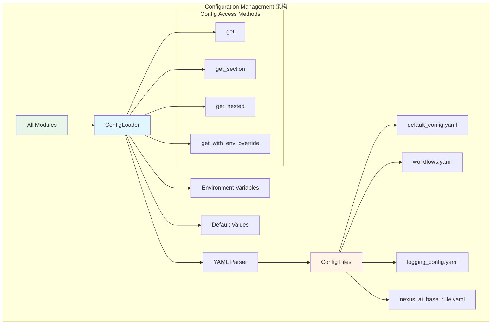
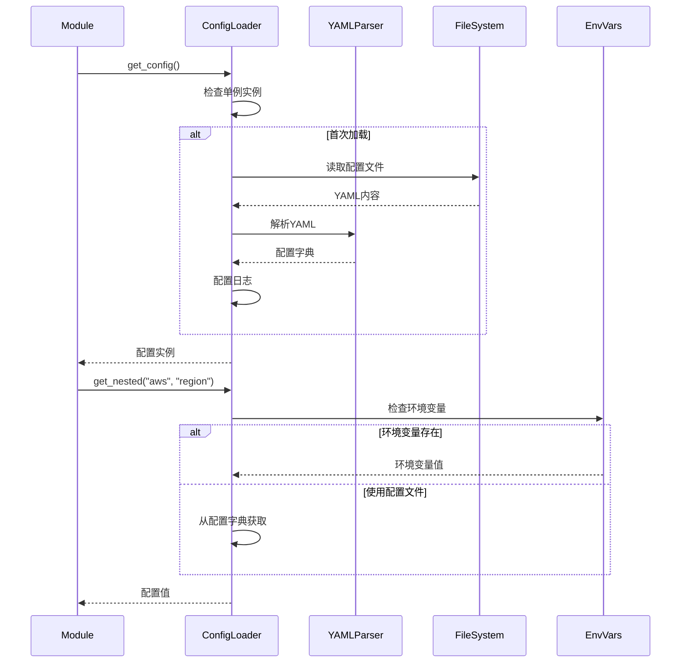
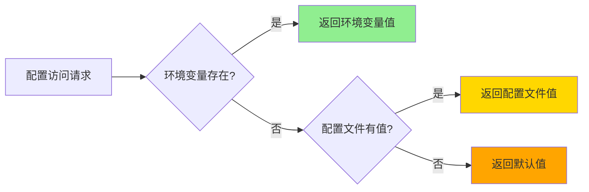

# Configuration Management 模块文档

**创建日期**: 2026-02-05  
**最后更新**: 2026-02-05  
**模块路径**: `nexus_utils/config_loader.py`, `config/`  
**维护状态**: 活跃  
**模块说明**: 配置管理系统，负责加载、解析和管理系统配置，支持多环境和动态配置

## 1. 模块概述

### 1.1 功能描述

Configuration Management模块是Nexus-AI平台的配置中心，提供统一的配置加载、访问和管理接口。它采用YAML格式存储配置，支持多环境配置、环境变量覆盖和嵌套配置访问。

**核心职责**:
- 加载和解析YAML配置文件
- 提供统一的配置访问接口
- 支持环境变量优先覆盖
- 管理多环境配置（开发、测试、生产）
- 提供配置热重载功能
- 集成日志配置管理

**在系统中的角色**:
- 作为全局配置中心被所有模块使用
- 为Agent Factory提供模型和路径配置
- 为MCP Manager提供服务器配置
- 为Multimodal Processing提供文件处理配置
- 为API和Worker系统提供服务配置

### 1.2 关键特性

- **YAML配置**: 使用YAML格式，易读易维护
- **单例模式**: 全局唯一配置实例
- **嵌套访问**: 支持多层级配置访问
- **环境覆盖**: 环境变量优先级最高
- **默认值**: 所有配置项都有合理默认值
- **类型安全**: 配置访问返回正确类型
- **热重载**: 支持运行时重新加载配置
- **日志集成**: 自动配置日志系统

## 2. 架构设计

### 2.1 模块架构图



### 2.2 核心组件

**ConfigLoader (配置加载器)**:
- 单例模式的配置管理类
- 加载和解析YAML配置文件
- 提供多种配置访问方法
- 支持配置热重载

**配置文件**:
- `default_config.yaml`: 主配置文件
- `workflows.yaml`: 工作流配置
- `logging_config.yaml`: 日志配置
- `nexus_ai_base_rule.yaml`: 基础规则配置

**访问方法**:
- `get()`: 获取顶层配置项
- `get_section()`: 获取配置段
- `get_nested()`: 获取嵌套配置
- `get_with_env_override()`: 环境变量优先访问

### 2.3 依赖关系

**依赖的模块**:
- PyYAML: YAML解析
- Python标准库: os, logging

**被依赖的模块**:
- Agent Factory: 获取模型和路径配置
- MCP Manager: 获取MCP服务器配置
- Multimodal Processing: 获取文件处理配置
- API System: 获取服务配置
- Worker System: 获取任务配置
- 所有其他模块: 作为全局配置中心

## 3. 核心实现

### 3.1 主要类/函数

| 名称 | 类型 | 功能描述 | 文件位置 |
|------|------|---------|---------|
| ConfigLoader | 类 | 配置加载和管理 | nexus_utils/config_loader.py:17 |
| get_config | 函数 | 获取全局配置实例 | nexus_utils/config_loader.py:424 |
| get | 方法 | 获取配置项 | ConfigLoader:87 |
| get_nested | 方法 | 获取嵌套配置 | ConfigLoader:115 |
| get_with_env_override | 方法 | 环境变量优先访问 | ConfigLoader:141 |
| get_aws_config | 方法 | 获取AWS配置 | ConfigLoader:179 |
| get_bedrock_config | 方法 | 获取Bedrock配置 | ConfigLoader:188 |
| get_strands_config | 方法 | 获取Strands配置 | ConfigLoader:197 |

### 3.2 关键流程

#### 配置加载流程



#### 配置访问优先级



### 3.3 数据结构

#### 配置文件结构

```yaml
default-config:
  # Nexus-AI核心配置
  nexus_ai:
    base_rule_path: 'config/nexus_ai_base_rule.yaml'
    OTEL_EXPORTER_OTLP_ENDPOINT: 'http://localhost:4318'
    artifacts_s3_bucket: 'nexus-ai-artifacts-2026'
    auto_sync_to_s3: true
  
  # AWS配置
  aws:
    bedrock_region_name: 'us-west-2'
    aws_region_name: 'us-west-2'
    aws_profile_name: 'default'
  
  # Bedrock模型配置
  bedrock:
    model_id: 'us.anthropic.claude-sonnet-4-5-20250929-v1:0'
    lite_model_id: 'us.anthropic.claude-haiku-4-5-20251001-v1:0'
    pro_model_id: 'us.anthropic.claude-opus-4-5-20251101-v1:0'
  
  # Strands框架配置
  strands:
    template:
      agent_template_path: 'agents/template_agents'
      prompt_template_path: 'prompts/template_prompts'
    generated:
      agent_generated_path: 'agents/generated_agents'
  
  # 多模态解析器配置
  multimodal_parser:
    aws:
      s3_bucket: "awesome-nexus-ai-file-storage"
      s3_prefix: "multimodal-content/"
    file_limits:
      max_file_size: "50MB"
      max_files_per_request: 10
```

## 4. API接口

### 4.1 公共接口

#### get_config()

获取全局配置实例（推荐使用）。

```python
def get_config() -> ConfigLoader:
    """
    获取全局配置实例
    
    Returns:
        ConfigLoader: 配置加载器实例
    """
```

### 4.2 ConfigLoader接口

#### get(key, default=None)

获取顶层配置项。

```python
def get(self, key: str, default: Any = None) -> Any:
    """
    获取配置项
    
    Args:
        key: 配置键
        default: 默认值
        
    Returns:
        配置值
    """
```

#### get_nested(*keys, default=None)

获取嵌套配置项。

```python
def get_nested(self, *keys: str, default: Any = None) -> Any:
    """
    获取嵌套配置项
    
    Args:
        *keys: 配置键路径
        default: 默认值
        
    Returns:
        配置值
    """
```

#### get_with_env_override(env_var_name, *config_keys, default=None)

获取配置项，支持环境变量优先覆盖。

```python
def get_with_env_override(
    self,
    env_var_name: str,
    *config_keys: str,
    default: Any = None
) -> Any:
    """
    获取配置项，支持环境变量优先覆盖
    
    优先级：环境变量 > 配置文件 > 默认值
    
    Args:
        env_var_name: 环境变量名称
        *config_keys: 配置键路径
        default: 默认值
        
    Returns:
        配置值
    """
```

#### 专用配置获取方法

```python
def get_aws_config(self) -> Dict[str, Any]:
    """获取AWS配置"""

def get_bedrock_config(self) -> Dict[str, Any]:
    """获取Bedrock配置"""

def get_strands_config(self) -> Dict[str, Any]:
    """获取Strands配置"""

def get_multimodal_parser_config(self) -> Dict[str, Any]:
    """获取多模态解析器配置"""

def get_dynamodb_config(self) -> Dict[str, Any]:
    """获取DynamoDB配置"""

def get_sqs_config(self) -> Dict[str, Any]:
    """获取SQS配置"""
```

## 5. 配置说明

### 5.1 配置文件

#### default_config.yaml

主配置文件，包含所有系统配置。

**位置**: `config/default_config.yaml`

**主要配置段**:
- `nexus_ai`: Nexus-AI核心配置
- `aws`: AWS服务配置
- `bedrock`: Bedrock模型配置
- `strands`: Strands框架配置
- `agentcore`: AgentCore部署配置
- `logging`: 日志配置
- `dynamodb`: DynamoDB表配置
- `sqs`: SQS队列配置
- `multimodal_parser`: 多模态解析器配置

#### workflows.yaml

工作流配置文件，定义各类工作流的阶段和规则。

**位置**: `config/workflows.yaml`

**内容**:
- 工作流版本信息
- 默认配置
- Agent构建工作流
- Agent更新工作流
- 工具构建工作流

### 5.2 环境变量

#### 通用环境变量

| 变量名 | 说明 | 配置路径 |
|--------|------|---------|
| AWS_REGION | AWS区域 | aws.aws_region_name |
| AWS_PROFILE | AWS配置文件 | aws.aws_profile_name |
| AWS_ACCESS_KEY_ID | AWS访问密钥 | aws.aws_access_key_id |
| AWS_SECRET_ACCESS_KEY | AWS秘密密钥 | aws.aws_secret_access_key |

#### Nexus-AI特定环境变量

| 变量名 | 说明 | 配置路径 |
|--------|------|---------|
| OTEL_EXPORTER_OTLP_ENDPOINT | OpenTelemetry端点 | nexus_ai.OTEL_EXPORTER_OTLP_ENDPOINT |
| NEXUS_AUTO_SYNC_TO_S3 | 自动同步到S3 | nexus_ai.auto_sync_to_s3 |
| NEXUS_DYNAMODB_TABLE_PREFIX | DynamoDB表前缀 | dynamodb.table_prefix |
| NEXUS_SQS_BUILD_QUEUE | 构建队列名称 | sqs.queues.build |

## 6. 使用示例

### 6.1 基本使用

```python
from nexus_utils.config_loader import get_config

# 获取配置实例
config = get_config()

# 获取顶层配置
aws_config = config.get("aws")
print(f"AWS Region: {aws_config['aws_region_name']}")

# 获取嵌套配置
s3_bucket = config.get_nested("multimodal_parser", "aws", "s3_bucket")
print(f"S3 Bucket: {s3_bucket}")

# 使用专用方法
bedrock_config = config.get_bedrock_config()
print(f"Model ID: {bedrock_config['model_id']}")
```

### 6.2 环境变量覆盖

```python
import os
from nexus_utils.config_loader import get_config

# 设置环境变量
os.environ["OTEL_EXPORTER_OTLP_ENDPOINT"] = "http://jaeger:4318"

# 获取配置（环境变量优先）
config = get_config()
endpoint = config.get_with_env_override(
    "OTEL_EXPORTER_OTLP_ENDPOINT",
    "nexus_ai", "OTEL_EXPORTER_OTLP_ENDPOINT",
    default="http://localhost:4318"
)

print(f"OTLP Endpoint: {endpoint}")  # 输出: http://jaeger:4318
```

### 6.3 在Agent中使用

```python
from nexus_utils.config_loader import get_config

# 获取配置
config = get_config()

# 获取模型配置
model_id = config.get_nested("bedrock", "model_id")
region = config.get_nested("aws", "bedrock_region_name")

# 获取路径配置
agent_path = config.get_nested("strands", "generated", "agent_generated_path")
prompt_path = config.get_nested("strands", "generated", "prompt_generated_path")

print(f"Model: {model_id}")
print(f"Region: {region}")
print(f"Agent Path: {agent_path}")
```

### 6.4 配置热重载

```python
from nexus_utils.config_loader import get_config

# 获取配置实例
config = get_config()

# 查看当前配置
print(f"Before: {config.get_nested('aws', 'aws_region_name')}")

# 修改配置文件...

# 重新加载配置
config.reload_config()

# 查看更新后的配置
print(f"After: {config.get_nested('aws', 'aws_region_name')}")
```

## 7. 测试覆盖

### 7.1 单元测试

**测试文件位置**: `tests/test_config_loader.py`

**测试覆盖**:
- 配置文件加载
- 配置项访问
- 嵌套配置访问
- 环境变量覆盖
- 默认值处理
- 配置热重载

### 7.2 集成测试

**测试场景**:
- 多模块配置访问
- 环境变量优先级
- 配置文件缺失处理
- 配置格式错误处理

## 8. 性能特征

### 8.1 性能指标

- **配置加载时间**: < 50ms
- **配置访问时间**: < 1ms（内存访问）
- **内存占用**: ~1MB（配置数据）
- **热重载时间**: < 100ms

### 8.2 性能优化建议

1. **使用单例**: 通过`get_config()`获取实例，避免重复加载
2. **缓存配置值**: 频繁访问的配置值可以缓存到局部变量
3. **避免频繁重载**: 仅在配置文件更新时调用`reload_config()`
4. **使用专用方法**: 使用`get_aws_config()`等专用方法提高可读性

## 9. 已知限制

### 9.1 功能限制

- **配置格式**: 仅支持YAML格式
- **单文件**: 主配置必须在单个文件中
- **类型验证**: 缺少配置项类型验证
- **配置加密**: 不支持敏感配置加密存储
- **配置版本**: 缺少配置版本管理

### 9.2 技术债务

- **配置验证**: 缺少配置项完整性验证
- **配置文档**: 部分配置项缺少详细说明
- **错误提示**: 配置错误提示可以更友好
- **配置迁移**: 缺少配置升级和迁移工具
- **配置监控**: 缺少配置变更监控和审计

## 10. 相关文档

- [Agent Factory模块文档](01-agent-factory.md)
- [MCP Integration模块文档](03-mcp-integration.md)
- [Multimodal Processing模块文档](04-multimodal-processing.md)
- [PyYAML文档](https://pyyaml.org/wiki/PyYAMLDocumentation)
- [Python Logging文档](https://docs.python.org/3/library/logging.html)

---

**文档版本**: 1.0  
**最后更新**: 2026-02-05  
**维护者**: Nexus-AI Team
