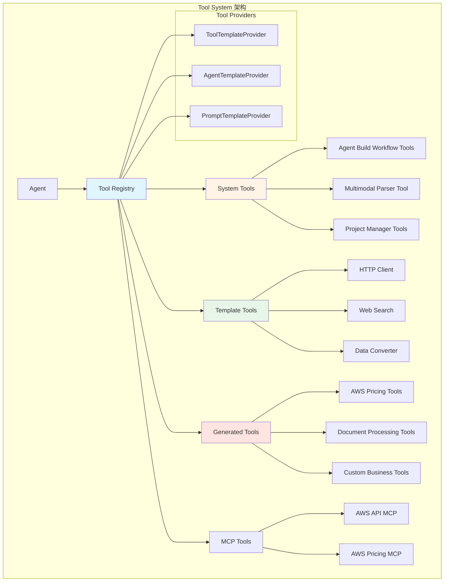

# Tool System 模块文档

**创建日期**: 2026-02-05  
**最后更新**: 2026-02-05  
**模块路径**: `tools/`, `nexus_utils/workflow/`  
**维护状态**: 活跃  
**模块说明**: 工具系统，提供Agent可调用的工具函数，支持工具注册、发现和执行

## 1. 模块概述

### 1.1 功能描述

Tool System是Nexus-AI平台的工具库，提供了539个工具函数供Agent调用。采用装饰器模式标记工具函数，通过注册表管理工具的发现和调用。

**核心职责**:
- 提供丰富的工具函数库
- 支持工具动态注册和发现
- 管理工具的生命周期
- 提供工具验证和测试
- 支持工具模板和自动生成
- 集成MCP外部工具

**在系统中的角色**:
- 为Agent提供可调用的功能
- 扩展Agent的能力边界
- 支持Agent Build Workflow的工具开发
- 与Strands框架工具系统集成

### 1.2 关键特性

- **丰富的工具库**: 539个工具函数，覆盖多个领域
- **装饰器模式**: 使用@tool装饰器标记工具函数
- **分类管理**: 系统工具、模板工具、生成工具三大类
- **动态发现**: 自动发现和注册工具
- **工具验证**: 提供工具格式和语法验证
- **模板支持**: 提供工具模板快速开发
- **MCP集成**: 支持外部MCP工具集成

## 2. 架构设计

### 2.1 模块架构图



### 2.2 核心组件

**System Tools (系统工具)**:
- Agent Build Workflow工具集
- 项目管理工具
- 多模态内容解析工具
- MCP配置管理工具
- 工具验证工具

**Template Tools (模板工具)**:
- HTTP客户端工具
- Web搜索工具
- 数据转换工具
- 文本处理工具

**Generated Tools (生成工具)**:
- AWS定价工具
- 文档处理工具
- 业务特定工具

**Tool Providers (工具提供器)**:
- ToolTemplateProvider: 工具模板管理
- AgentTemplateProvider: Agent模板管理
- PromptTemplateProvider: 提示词模板管理

### 2.3 依赖关系

**依赖的模块**:
- Strands Framework: 工具装饰器和注册
- Agent Factory: 工具导入和使用
- MCP Manager: 外部工具集成

**被依赖的模块**:
- Agent Build Workflow: 使用系统工具
- 所有Agent: 调用工具函数

## 3. 核心实现

### 3.1 工具统计

| 类别 | 文件数 | 工具函数数 | 说明 |
|------|--------|-----------|------|
| System Tools | 16 | 90 | 系统级基础工具 |
| Template Tools | 5 | 21 | 可复用工具模板 |
| Generated Tools | 73 | 428 | 自动生成的业务工具 |
| **总计** | **94** | **539** | - |

### 3.2 关键工具

#### 系统工具

| 工具名称 | 功能描述 | 文件位置 |
|---------|---------|---------|
| project_init | 初始化项目目录结构 | project_manager.py |
| update_project_status | 更新项目状态 | project_manager.py |
| parse_multimodal_content | 解析多模态内容 | multimodal_content_parser.py |
| list_prompt_templates | 列出提示词模板 | prompt_template_provider.py |
| list_all_tools | 列出所有工具 | tool_template_provider.py |
| get_all_mcp_servers | 获取MCP服务器配置 | mcp_config_manager.py |
| validate_tool_path | 验证工具路径 | tool_validator.py |
| deploy_agent_to_agentcore | 部署Agent到AgentCore | deployment_manager.py |

#### 模板工具

| 工具名称 | 功能描述 | 文件位置 |
|---------|---------|---------|
| api_client | API客户端 | http_client.py |
| web_search | Web搜索 | web_search_tool.py |
| data_converter | 数据转换 | data_converter.py |
| text_processor | 文本处理 | text_processor.py |

### 3.3 工具开发模式

#### 使用@tool装饰器

```python
from strands.tools import tool

@tool
def my_custom_tool(param1: str, param2: int) -> str:
    """
    工具描述
    
    Args:
        param1: 参数1描述
        param2: 参数2描述
        
    Returns:
        返回值描述
    """
    # 工具实现
    result = f"处理结果: {param1}, {param2}"
    return result
```

## 4. API接口

### 4.1 工具提供器接口

#### list_all_tools()

列出所有可用工具。

```python
@tool
def list_all_tools() -> str:
    """
    列出所有可用的工具
    
    Returns:
        JSON格式的所有工具信息
    """
```

#### get_tool_details(tool_name, tool_type)

获取工具详细信息。

```python
@tool
def get_tool_details(tool_name: str, tool_type: str = None) -> str:
    """
    获取特定工具的详细信息
    
    Args:
        tool_name: 工具名称
        tool_type: 工具类型（可选）
        
    Returns:
        JSON格式的工具详细信息
    """
```

### 4.2 项目管理工具接口

#### project_init(project_name)

初始化项目目录。

```python
@tool
def project_init(project_name: str) -> str:
    """
    初始化项目目录结构
    
    Args:
        project_name: 项目名称
        
    Returns:
        操作结果信息
    """
```

#### update_project_status(project_name, agent_name, stage, status)

更新项目状态。

```python
@tool
def update_project_status(
    project_name: str,
    agent_name: str,
    stage: str,
    status: str
) -> str:
    """
    更新项目状态
    
    Args:
        project_name: 项目名称
        agent_name: Agent名称
        stage: 阶段名称
        status: 状态
        
    Returns:
        操作结果信息
    """
```

## 5. 配置说明

### 5.1 工具目录结构

```
tools/
├── system_tools/              # 系统工具
│   ├── agent_build_workflow/  # Agent构建工作流工具
│   │   ├── project_manager.py
│   │   ├── prompt_template_provider.py
│   │   └── tool_template_provider.py
│   └── multimodal_content_parser.py
├── template_tools/            # 模板工具
│   └── network/
│       ├── http_client.py
│       └── web_search_tool.py
└── generated_tools/           # 生成工具
    └── aws_pricing_agent/
        └── aws_pricing_tool.py
```

### 5.2 工具注册

工具通过@tool装饰器自动注册到Strands框架。

## 6. 使用示例

### 6.1 在Agent中使用工具

```python
from nexus_utils.agent_factory import create_agent_from_prompt_template

# 创建Agent（自动加载工具）
agent = create_agent_from_prompt_template(
    "system_agents_prompts/agent_build_workflow/orchestrator"
)

# Agent会自动使用配置的工具
result = agent.run("初始化项目my_agent")
```

### 6.2 开发自定义工具

```python
from strands.tools import tool

@tool
def calculate_price(
    product_type: str,
    quantity: int,
    discount: float = 0.0
) -> str:
    """
    计算产品价格
    
    Args:
        product_type: 产品类型
        quantity: 数量
        discount: 折扣率（0-1）
        
    Returns:
        JSON格式的价格信息
    """
    import json
    
    # 价格计算逻辑
    unit_price = 100.0
    total = unit_price * quantity * (1 - discount)
    
    return json.dumps({
        "product_type": product_type,
        "quantity": quantity,
        "unit_price": unit_price,
        "discount": discount,
        "total_price": total
    })
```

### 6.3 使用工具提供器

```python
from tools.system_tools.agent_build_workflow.tool_template_provider import (
    list_all_tools,
    get_tool_details
)

# 列出所有工具
tools_json = list_all_tools()
print(tools_json)

# 获取特定工具详情
details = get_tool_details("project_init", "system_tools")
print(details)
```

## 7. 测试覆盖

### 7.1 单元测试

**测试文件位置**: `tests/tools/`

**测试覆盖**:
- 工具函数执行
- 工具参数验证
- 工具返回值格式
- 工具错误处理

### 7.2 集成测试

**测试场景**:
- Agent调用工具
- 工具链式调用
- 工具异常处理
- MCP工具集成

## 8. 性能特征

### 8.1 性能指标

- **工具发现时间**: < 100ms
- **工具执行时间**: 取决于具体工具
- **工具注册数量**: 539个
- **内存占用**: ~50MB（工具元数据）

### 8.2 性能优化建议

1. **延迟加载**: 仅在需要时加载工具
2. **缓存结果**: 缓存工具执行结果
3. **批量操作**: 合并多个工具调用
4. **异步执行**: 使用异步工具提高并发

## 9. 已知限制

### 9.1 功能限制

- **工具数量**: 大量工具可能影响发现性能
- **工具冲突**: 同名工具可能冲突
- **参数验证**: 部分工具缺少完善的参数验证
- **错误处理**: 部分工具错误处理不完善

### 9.2 技术债务

- **工具文档**: 部分工具缺少详细文档
- **工具测试**: 测试覆盖率需提高
- **工具分类**: 分类体系需要优化
- **工具版本**: 缺少工具版本管理

## 10. 相关文档

- [Agent Factory模块文档](01-agent-factory.md)
- [Agent Build Workflow模块文档](05-agent-build-workflow.md)
- [MCP Integration模块文档](03-mcp-integration.md)
- [Strands Tools文档](https://github.com/awslabs/strands)

---

**文档版本**: 1.0  
**最后更新**: 2026-02-05  
**维护者**: Nexus-AI Team
