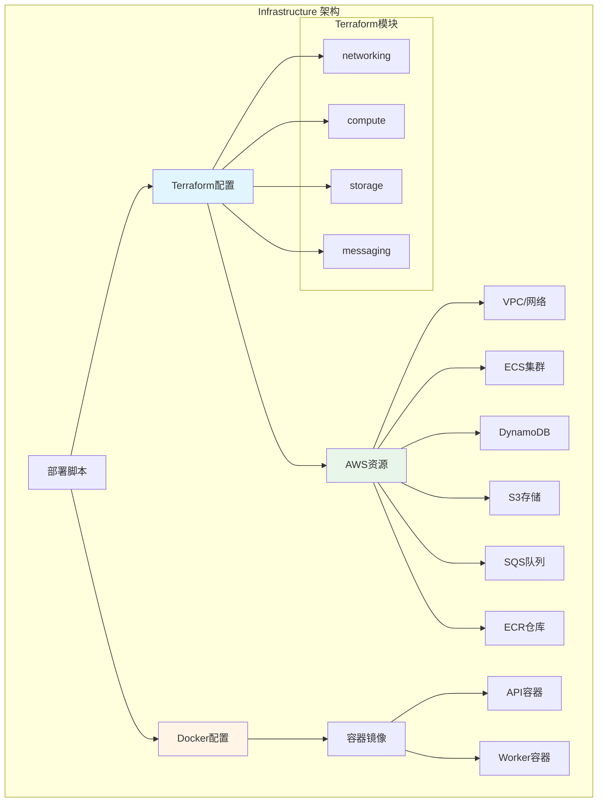
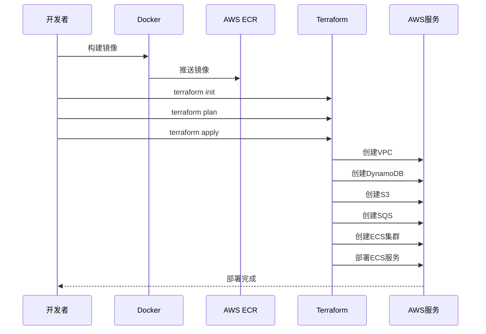

# Infrastructure 模块文档

**创建日期**: 2026-02-05  
**最后更新**: 2026-02-05  
**模块路径**: `infrastructure/`  
**维护状态**: 活跃  
**模块说明**: 基础设施即代码(IaC)，包含Terraform配置、Docker容器化和部署脚本

## 1. 模块概述

### 1.1 功能描述

Infrastructure模块提供了Nexus-AI平台的基础设施即代码(IaC)实现，使用Terraform管理AWS资源，使用Docker进行容器化部署。

**核心职责**:
- 定义和管理AWS基础设施资源
- 提供Docker容器化配置
- 管理多环境部署配置
- 自动化基础设施部署流程
- 版本控制基础设施配置
- 提供部署脚本和工具

**在系统中的角色**:
- 作为平台的基础设施层
- 支持API和Worker服务的部署
- 提供可重复的部署流程
- 确保环境一致性

### 1.2 关键特性

- **基础设施即代码**: 使用Terraform声明式配置
- **容器化部署**: Docker和Docker Compose支持
- **多环境支持**: 开发、测试、生产环境隔离
- **模块化设计**: Terraform模块化配置
- **自动化部署**: 一键部署脚本
- **版本控制**: 基础设施配置版本管理
- **AWS集成**: 深度集成AWS服务

## 2. 架构设计

### 2.1 模块架构图



### 2.2 核心组件

**Terraform配置**:
- 网络配置（VPC、子网、安全组）
- 计算资源（ECS、EC2、Lambda）
- 存储资源（DynamoDB、S3、EFS）
- 消息队列（SQS）
- 负载均衡（ALB）

**Docker配置**:
- API服务Dockerfile
- Worker服务Dockerfile
- Docker Compose编排
- 多阶段构建优化

**部署脚本**:
- 基础设施初始化
- 镜像构建和推送
- 服务部署和更新

### 2.3 依赖关系

**依赖的服务**:
- AWS: 云服务提供商
- Terraform: 基础设施管理工具
- Docker: 容器化平台

**被依赖的模块**:
- API System: 部署到ECS
- Worker System: 部署到ECS
- 所有服务: 使用基础设施资源

## 3. 核心实现

### 3.1 文件统计

| 类型 | 文件数 | 说明 |
|------|--------|------|
| Terraform文件 | 26 | 基础设施配置 |
| Docker文件 | 7 | 容器化配置 |
| 配置文件 | 3 | 环境配置 |
| 脚本文件 | 32 | 部署和管理脚本 |
| **总计** | **68** | - |

### 3.2 主要Terraform配置

| 文件名 | 功能描述 | 大小 |
|--------|---------|------|
| 01-networking.tf | VPC和网络配置 | 10KB |
| 02-storage-dynamodb.tf | DynamoDB表配置 | 4.5KB |
| 02-storage-efs.tf | EFS文件系统配置 | 1.4KB |
| 03-messaging-sqs.tf | SQS队列配置 | 0.9KB |
| 04-compute-iam.tf | IAM角色和策略 | 16KB |
| 04-compute-ecr.tf | ECR仓库配置 | 1.5KB |
| 05-compute-ecs.tf | ECS集群和服务 | 16KB |
| 06-loadbalancer.tf | ALB负载均衡 | 4.7KB |
| 07-services.tf | 服务定义 | 3.9KB |

### 3.3 AWS资源配置

#### 网络资源

- **VPC**: 虚拟私有云
- **子网**: 公有和私有子网
- **安全组**: 网络访问控制
- **NAT网关**: 私有子网出站访问
- **Internet网关**: 公网访问

#### 计算资源

- **ECS集群**: 容器编排
- **ECS服务**: API和Worker服务
- **ECS任务定义**: 容器配置
- **ECR仓库**: 容器镜像存储
- **EC2实例**: 可选的虚拟机

#### 存储资源

- **DynamoDB表**: 
  - nexus_projects
  - nexus_stages
  - nexus_agents
  - nexus_invocations
  - nexus_sessions
  - nexus_messages
  - nexus_tasks
  - nexus_tools
  - nexus_artifacts
- **S3桶**: 
  - nexus-ai-artifacts-2026
  - nexus-ai-session-2026
- **EFS**: 共享文件系统

#### 消息队列

- **SQS队列**:
  - nexus-build-queue
  - nexus-deploy-queue
  - nexus-notification-queue
  - nexus-build-dlq
  - nexus-deploy-dlq

## 4. 部署流程

### 4.1 本地开发部署

```bash
# 1. 启动本地服务
cd infrastructure/docker
docker-compose -f docker-compose.local.yml up -d

# 2. 查看服务状态
docker-compose ps

# 3. 查看日志
docker-compose logs -f api
docker-compose logs -f worker
```

### 4.2 AWS生产部署

```bash
# 1. 配置AWS凭证
export AWS_PROFILE=default
export AWS_REGION=us-west-2

# 2. 初始化Terraform
cd infrastructure/basic
terraform init

# 3. 规划变更
terraform plan -var-file=terraform.tfvars

# 4. 应用配置
terraform apply -var-file=terraform.tfvars

# 5. 构建和推送镜像
cd ../docker
./build.sh

# 6. 部署服务
terraform apply -target=aws_ecs_service.api
terraform apply -target=aws_ecs_service.worker
```

### 4.3 部署流程图



## 5. 配置说明

### 5.1 Terraform变量

**terraform.tfvars示例**:

```hcl
# 项目配置
project_name = "nexus-ai"
environment  = "production"

# 网络配置
vpc_cidr = "10.0.0.0/16"
availability_zones = ["us-west-2a", "us-west-2b"]

# ECS配置
ecs_task_cpu    = "1024"
ecs_task_memory = "2048"
api_desired_count = 2
worker_desired_count = 1

# 数据库配置
dynamodb_billing_mode = "PAY_PER_REQUEST"

# 标签
tags = {
  Project     = "Nexus-AI"
  Environment = "production"
  ManagedBy   = "Terraform"
}
```

### 5.2 Docker Compose配置

**docker-compose.yml示例**:

```yaml
version: '3.8'

services:
  api:
    build:
      context: ../..
      dockerfile: infrastructure/docker/Dockerfile.api
    ports:
      - "8000:8000"
    environment:
      - AWS_REGION=us-west-2
      - DYNAMODB_ENDPOINT=http://dynamodb-local:8000
    depends_on:
      - dynamodb-local
      - sqs-local

  worker:
    build:
      context: ../..
      dockerfile: infrastructure/docker/Dockerfile.worker
    environment:
      - AWS_REGION=us-west-2
      - SQS_ENDPOINT=http://sqs-local:9324
    depends_on:
      - sqs-local

  dynamodb-local:
    image: amazon/dynamodb-local
    ports:
      - "8001:8000"

  sqs-local:
    image: softwaremill/elasticmq
    ports:
      - "9324:9324"
```

## 6. 使用示例

### 6.1 创建新环境

```bash
# 1. 复制变量文件
cp terraform.tfvars.example terraform.tfvars

# 2. 编辑配置
vim terraform.tfvars

# 3. 初始化和部署
terraform init
terraform workspace new staging
terraform plan
terraform apply
```

### 6.2 更新服务

```bash
# 1. 构建新镜像
docker build -t nexus-ai-api:v2.0 -f Dockerfile.api .

# 2. 推送到ECR
aws ecr get-login-password --region us-west-2 | \
  docker login --username AWS --password-stdin <account>.dkr.ecr.us-west-2.amazonaws.com
docker tag nexus-ai-api:v2.0 <account>.dkr.ecr.us-west-2.amazonaws.com/nexus-ai-api:v2.0
docker push <account>.dkr.ecr.us-west-2.amazonaws.com/nexus-ai-api:v2.0

# 3. 更新ECS服务
aws ecs update-service --cluster nexus-ai --service api --force-new-deployment
```

### 6.3 销毁环境

```bash
# 销毁所有资源
terraform destroy -var-file=terraform.tfvars

# 确认销毁
# 输入 'yes' 确认
```

## 7. 监控和维护

### 7.1 监控指标

- **ECS服务**: CPU、内存使用率
- **DynamoDB**: 读写容量、延迟
- **SQS**: 队列深度、消息年龄
- **ALB**: 请求数、响应时间
- **CloudWatch**: 日志和告警

### 7.2 维护任务

- 定期更新Terraform版本
- 审查和优化资源配置
- 监控成本和使用情况
- 备份关键数据
- 更新安全组规则

## 8. 性能特征

### 8.1 性能指标

- **部署时间**: 15-30分钟（首次）
- **更新时间**: 5-10分钟（服务更新）
- **扩展能力**: 支持水平扩展
- **可用性**: 多可用区部署

### 8.2 成本优化

1. **使用按需计费**: DynamoDB按需模式
2. **自动扩缩容**: ECS服务自动扩展
3. **资源标签**: 成本分配和追踪
4. **定期审查**: 清理未使用资源

## 9. 已知限制

### 9.1 功能限制

- **单区域**: 当前仅支持单区域部署
- **手动扩展**: 部分资源需手动扩展
- **备份策略**: 需要手动配置备份
- **灾难恢复**: 缺少自动化DR方案

### 9.2 技术债务

- **模块化**: Terraform配置需要进一步模块化
- **测试**: 缺少基础设施测试
- **文档**: 部分配置缺少详细说明
- **自动化**: 部署流程可以更自动化

## 10. 相关文档

- [API System模块文档](06-api-system.md)
- [Worker System模块文档](07-worker-system.md)
- [Terraform官方文档](https://www.terraform.io/docs)
- [AWS ECS文档](https://docs.aws.amazon.com/ecs/)
- [Docker文档](https://docs.docker.com/)

---

**文档版本**: 1.0  
**最后更新**: 2026-02-05  
**维护者**: Nexus-AI Team
